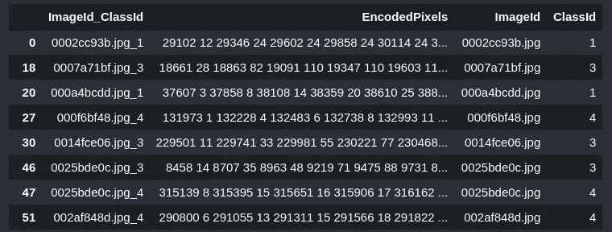
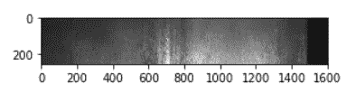
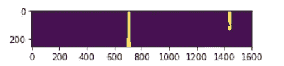

# 从编码像素生成遮罩—语义分割

> 原文：<https://medium.com/analytics-vidhya/generating-masks-from-encoded-pixels-semantic-segmentation-18635e834ad0?source=collection_archive---------2----------------------->

对于分割任务，有时我们会遇到 csv 文件中列出的遮罩编码像素，而不是遮罩图像。

在本教程中，让我们了解如何生成遮罩，如果编码像素而不是遮罩图像。

在 severstal-steel-defect-detection ka ggle 竞赛中，[https://www . ka ggle . com/c/severstal-steel-defect-detection/data](https://www.kaggle.com/c/severstal-steel-defect-detection/data)我们得到的不是掩模图像，而是具有 EncodedPixels 列的 train.csv 文件。



如果您仔细观察 EncoderPixels 列，它看起来有些不同。让我们深入了解如何使用这些信息来生成蒙版图像。

让我们举一个例子，

```
This is how each EncodedPixels column values are['29102 12 29346 24 29602 24 29858 24 30114 24 30370 24 30626 24 30882 24 31139 23 31395 23 31651 23 31907 23 32163 23 32419 23 32675 23 77918 27 78174 55 78429 60 78685 64 78941 68 79197 72 79452 77 79708 81 79964 85 80220 89 80475 94 80731 98 80987 102 81242 105 81498 105 81754 104 82010 104 82265 105 82521 31 82556 69 82779 27 82818 63 83038 22 83080 57 83297 17 83342 50 83555 13 83604 44 83814 8 83866 37 84073 3 84128 31 84390 25 84652 18 84918 8 85239 10 85476 29 85714 47 85960 57 86216 57 86471 58 86727 58 86983 58 87238 59 87494 59 87750 59 88005 60 88261 60 88517 60 88772 61 89028 53 89283 40 89539 32 89667 10 89795 30 89923 28 90050 29 90179 37 90306 27 90434 38 90562 14 90690 38 90817 9 90946 38 91073 3 91202 38 91458 38 91714 38 91969 39 92225 39 92481 39 92737 39 92993 39 93248 40 93504 40 93760 40 94026 30 94302 10 189792 7 190034 21 190283 28 190539 28 190795 28 191051 28 191307 28 191563 28 191819 28 192075 28 192331 28 192587 28 192843 23 193099 14 193355 5']
```

RGB 图像的形状为(256，1600，3)。意味着有 256*1600 = 409600 个位置。它对应的掩码(256，1600)没有给出，而是给了我们编码像素。

1235 2 1459 1 5489 10 表示从 1235 开始取 2 个像素，从 1459 开始取 1 个像素，从 5489 开始取 10 个像素。

现在变成 1235，1236，1459，5489，5490，5491，5492，5493，5494，5495，5496，5497，5498。

```
en_pix = [‘29102 12 29346 24 29602 24 29858 24 30114 24 30370 24 30626 24 30882 24 31139 23 31395 23 31651 23 31907 23 32163 23 32419 23 32675 23 77918 27 78174 55 78429 60 78685 64 78941 68 79197 72 79452 77 79708 81 79964 85 80220 89 80475 94 80731 98 80987 102 81242 105 81498 105 81754 104 82010 104 82265 105 82521 31 82556 69 82779 27 82818 63 83038 22 83080 57 83297 17 83342 50 83555 13 83604 44 83814 8 83866 37 84073 3 84128 31 84390 25 84652 18 84918 8 85239 10 85476 29 85714 47 85960 57 86216 57 86471 58 86727 58 86983 58 87238 59 87494 59 87750 59 88005 60 88261 60 88517 60 88772 61 89028 53 89283 40 89539 32 89667 10 89795 30 89923 28 90050 29 90179 37 90306 27 90434 38 90562 14 90690 38 90817 9 90946 38 91073 3 91202 38 91458 38 91714 38 91969 39 92225 39 92481 39 92737 39 92993 39 93248 40 93504 40 93760 40 94026 30 94302 10 189792 7 190034 21 190283 28 190539 28 190795 28 191051 28 191307 28 191563 28 191819 28 192075 28 192331 28 192587 28 192843 23 193099 14 193355 5’]
```

这是给定的编码像素，让我们用它来生成一个遮罩

首先，让我们使用分割函数在空间上分割这些数字:

```
print(len(en_pix[0].split(‘ ‘)))
en_pix[0].split(‘ ‘)216
['29102','12','29346','24','29602','24','29858','24','30114','24','30370','24','30626','24','30882','24','31139','23','31395','23','31651','23','31907','23','32163','23','32419','23','32675','23','77918','27','78174','55','78429','60','78685','64','78941','68','79197',
'72','79452','77','79708','81','79964','85','80220','89','80475',
'94','80731','98','80987','102','81242','105','81498','105',
'81754','104','82010','104','82265','105','82521','31','82556',
'69','82779','27','82818','63','83038','22','83080','57','83297',
'17','83342','50','83555','13','83604','44','83814','8',
'83866','37','84073','3','84128','31','84390','25','84652','18',
'84918','8','85239','10','85476','29','85714','47','85960','57',
'86216','57','86471','58','86727','58','86983','58','87238','59',
'87494','59','87750','59','88005','60','88261','60','88517','60',
'88772','61','89028','53','89283','40','89539','32','89667','10',
'89795','30','89923','28','90050','29','90179','37','90306','27',
'90434','38','90562','14','90690','38','90817','9','90946','38','91073','3','91202','38','91458','38','91714','38','91969','39','92225','39','92481','39','92737','39','92993','39','93248','40','93504','40','93760','40','94026','30','94302','10','189792','7','190034','21',
'190283','28','190539','28','190795','28','191051','28','191307',
'28','191563','28','191819','28','192075','28','192331','28','192587','28','192843','23','193099','14','193355','5']
```

让我们使用映射函数将这些字符串转换成整数

```
rle = list(map(int, en_pix[0].split(‘ ‘)))
rle[29102, 12, 29346, 24, 29602, 24, 29858, 24, 30114, 24, 30370, 24, 30626, 24, 30882, 24, 31139, 23, 31395, 23, 31651, 23, 31907, 23, 32163, 23, 32419, 23, 32675, 23, 77918, 27, 78174, 55, 78429, 60, 78685, 64, 78941, 68, 79197, 72, 79452, 77, 79708, 81, 79964, 85, 80220, 89, 80475, 94, 80731, 98, 80987, 102, 81242, 105, 81498, 105, 81754, 104, 82010, 104, 82265, 105, 82521, 31, 82556, 69, 82779, 27, 82818, 63, 83038, 22, 83080, 57, 83297, 17, 83342, 50, 83555, 13, 83604, 44, 83814, 8, 83866, 37, 84073, 3, 84128, 31, 84390, 25, 84652, 18, 84918, 8, 85239, 10, 85476, 29, 85714, 47, 85960, 57, 86216, 57, 86471, 58, 86727, 58, 86983, 58, 87238, 59, 87494, 59, 87750, 59, 88005, 60, 88261, 60, 88517, 60, 88772, 61, 89028, 53, 89283, 40, 89539, 32, 89667, 10, 89795, 30, 89923, 28, 90050, 29, 90179, 37, 90306, 27, 90434, 38, 90562, 14, 90690, 38, 90817, 9, 90946, 38, 91073, 3, 91202, 38, 91458, 38, 91714, 38, 91969, 39, 92225, 39, 92481, 39, 92737, 39, 92993, 39, 93248, 40, 93504, 40, 93760, 40, 94026, 30, 94302, 10, 189792, 7, 190034, 21, 190283, 28, 190539, 28, 190795, 28, 191051, 28, 191307, 28, 191563, 28, 191819, 28, 192075, 28, 192331, 28, 192587, 28, 192843, 23, 193099, 14, 193355, 5]
```

第一个数字是起始像素，下一个数字是从该起始像素开始计数。让我们把它们放在两个不同的列表中

```
pixel,pixel_count = [],[]
[pixel.append(rle[i]) if i%2==0 else pixel_count.append(rle[i]) for i in range(0, len(rle))]
print(‘pixel starting points:\n’,pixel)
print(‘pixel counting:\n’, pixel_count)
```

```
pixel starting points:
 [29102, 29346, 29602, 29858, 30114, 30370, 30626, 30882, 31139, 31395, 31651, 31907, 32163, 32419, 32675, 77918, 78174, 78429, 78685, 78941, 79197, 79452, 79708, 79964, 80220, 80475, 80731, 80987, 81242, 81498, 81754, 82010, 82265, 82521, 82556, 82779, 82818, 83038, 83080, 83297, 83342, 83555, 83604, 83814, 83866, 84073, 84128, 84390, 84652, 84918, 85239, 85476, 85714, 85960, 86216, 86471, 86727, 86983, 87238, 87494, 87750, 88005, 88261, 88517, 88772, 89028, 89283, 89539, 89667, 89795, 89923, 90050, 90179, 90306, 90434, 90562, 90690, 90817, 90946, 91073, 91202, 91458, 91714, 91969, 92225, 92481, 92737, 92993, 93248, 93504, 93760, 94026, 94302, 189792, 190034, 190283, 190539, 190795, 191051, 191307, 191563, 191819, 192075, 192331, 192587, 192843, 193099, 193355]
pixel counting:
 [12, 24, 24, 24, 24, 24, 24, 24, 23, 23, 23, 23, 23, 23, 23, 27, 55, 60, 64, 68, 72, 77, 81, 85, 89, 94, 98, 102, 105, 105, 104, 104, 105, 31, 69, 27, 63, 22, 57, 17, 50, 13, 44, 8, 37, 3, 31, 25, 18, 8, 10, 29, 47, 57, 57, 58, 58, 58, 59, 59, 59, 60, 60, 60, 61, 53, 40, 32, 10, 30, 28, 29, 37, 27, 38, 14, 38, 9, 38, 3, 38, 38, 38, 39, 39, 39, 39, 39, 40, 40, 40, 30, 10, 7, 21, 28, 28, 28, 28, 28, 28, 28, 28, 28, 28, 23, 14, 5]
```

让我们使用上面的 2 个列表来生成屏蔽的像素位置，

```
rle_pixels = [list(range(pixel[i],pixel[i]+pixel_count[i])) for i in range(0, len(pixel))]
print(‘rle_pixels\n:’, rle_pixels)rle_pixels
: [[29102, 29103, 29104, 29105, 29106, 29107, 29108, 29109, 29110, 29111, 29112, 29113], [29346, 29347, 29348, 29349, 29350, 29351, 29352, 29353, 29354, 29355, 29356, 29357, 29358, 29359, 29360, 29361, 29362, 29363, 29364, 29365, 29366, 29367, 29368, 29369], [29602, 29603, 29604, 29605, 29606, 29607, 29608, 29609, 29610, 29611, 29612, 29613, 29614, 29615, 29616, 29617, 29618, 29619, 29620, 29621, 29622, 29623, 29624, 29625], [29858, 29859, 29860, 29861, 29862, 29863, 29864, 29865, 29866, 29867, 29868, 29869, 29870, 29871, 29872, 29873, 29874, 29875, 29876, 29877, 29878, 29879, 29880, 29881], ........., [192843, 192844, 192845, 192846, 192847, 192848, 192849, 192850, 192851, 192852, 192853, 192854, 192855, 192856, 192857, 192858, 192859, 192860, 192861, 192862, 192863, 192864, 192865], [193099, 193100, 193101, 193102, 193103, 193104, 193105, 193106, 193107, 193108, 193109, 193110, 193111, 193112], [193355, 193356, 193357, 193358, 193359]]
```

现在让我们将列表的列表转换成单个列表，

```
rle_mask_pixels = sum(rle_pixels,[]) 
print(‘rle mask pixels:\n’, rle_mask_pixels)rle mask pixels:
 [29102, 29103, 29104, 29105, 29106, 29107, 29108, 29109, 29110, 29111, 29112, 29113, 29346, 29347, 29348, 29349, 29350, 29351, 29352, 29353, 29354, 29355, 29356, 29357, 29358, 29359, 29360, 29361, 29362, 29363, 29364, 29365, 29366, 29367, 29368, 29369, 29602, 29603, 29604, 29605, 29606, 29607, 29608, 29609, 29610, 29611, 29612, 29613, 29614, 29615, 29616, 29617, 29618, 29619, 29620, 29621, 29622, 29623, 29624, 29625, 29858, 29859, 29860, 29861, 29862, 29863, 29864, ...............,192597, 192598, 192599, 192600, 192601, 192602, 192603, 192604, 192605, 192606, 192607, 192608, 192609, 192610, 192611, 192612, 192613, 192614, 192843, 192844, 192845, 192846, 192847, 192848, 192849, 192850, 192851, 192852, 192853, 192854, 192855, 192856, 192857, 192858, 192859, 192860, 192861, 192862, 192863, 192864, 192865, 193099, 193100, 193101, 193102, 193103, 193104, 193105, 193106, 193107, 193108, 193109, 193110, 193111, 193112, 193355, 193356, 193357, 193358, 193359]
```

因此，在这些位置，输入图像应该被屏蔽。让我们采取一个黑色的面具，并使其在这些像素位置的白色。

加载并显示输入图像:

```
plt.imshow(cv2.imread(img_location))
```



输入图像

RGB 图像的形状是:(256，1600，3)

```
mask_img = np.zeros((256*1600,1), dtype=int)
```

让我们用白色像素(255)替换上面提到的位置(rle_mask_pixels)。

```
mask_img[rle_mask_pixels] = 255
```

将数组调整为输入图像大小(256，1000)

```
l,b=cv2.imread(img_location).shape[0], cv2.imread(img_location).shape[1]mask = np.reshape(mask_img, (b, l)).T
```

让我们显示最终的蒙版图像:

```
plt.imshow(mask)
```



根据给定的编码像素生成的遮罩图像