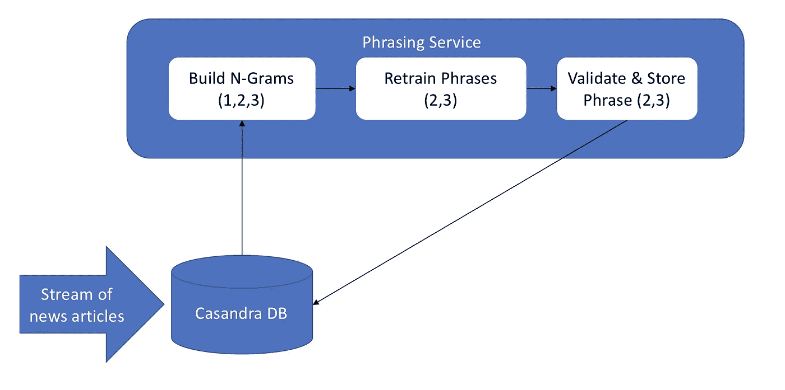
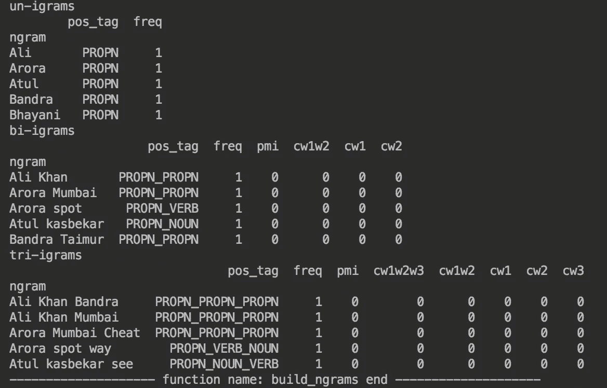
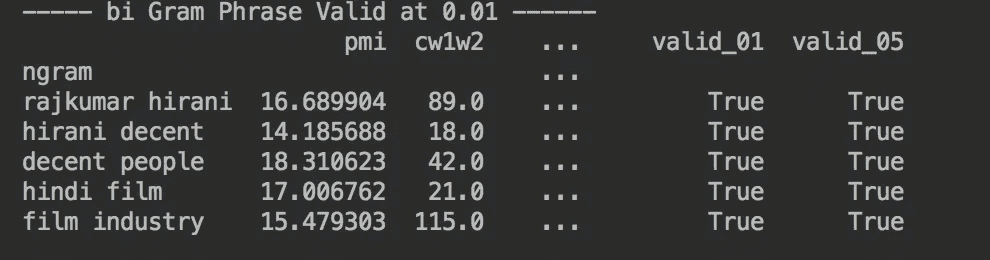
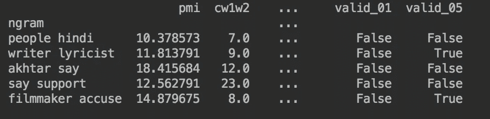
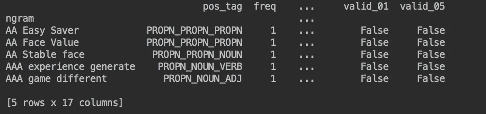
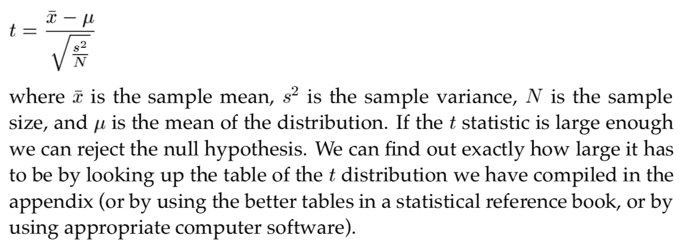
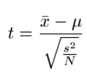

# 从非结构化新闻数据中生成有意义的短语

> 原文：<https://medium.com/analytics-vidhya/generating-meaningful-phrases-from-unstructured-news-data-d4e217a7da43?source=collection_archive---------1----------------------->

## 对语法算法的深入研究


有效短语？

短语是一个多单词表达式或单词 n 元语法，它表达有效的意思，在索引文档、总结、推荐等方面非常有用。

在这篇文章中，我将解释一个非常高精度的并行短语模块，它仅从 10000 篇非结构化新闻文章中获得超过 95%的精度。

> 将涵盖如何生成有效的二元和三元短语。
> 
> 你可能想知道有类似 gensim 等的[短语](https://radimrehurek.com/gensim/models/phrases.html)模块。

gensim 生成的短语不达标，可能需要庞大的语料库来生成基于搭配的短语。(我猜大约 100 万条新闻)

## 生成有意义短语的步骤

1.  预处理和文本规范化(有很多关于文本预处理的文章，所以这里就不赘述了。例子[链接](https://stackoverflow.com/questions/45605946/how-to-do-text-pre-processing-using-spacy)。)
2.  从新闻文章中构建 n 个 grams (1 (uni)，2(bi)，3(tri))(CPU 并行)(稍后将讨论 Spark 版本)
3.  训练模型
4.  提取有效短语

> 核心语法算法与设计



语法算法设计(非火花版本)

## 初始化空间和文本规范化

首先让我们规范化文本(原始文本字符串)

```
**#initlize spacy in your class init**self.nlp = spacy.load(lang)**#also need cpu count for parallelism** 
partitions = cpu_count()normalized_text = self.normalize_text(doc)
doc = self.nlp(normalized_text)
```

## 并行构建 n 克

```
uni_grams = self.parallel_build_n_grams(doc, 1)
bi_grams = self.parallel_build_n_grams(doc, 2)
tri_grams = self.parallel_build_n_grams(doc, 3)
```

> *生成 n 克并将* [*跨度*](https://spacy.io/api/span) *拆分成若干个分区(doc 是 nlp doc)*

```
def generate_ngrams(self, doc, n_gram):
    return [doc[i:i + n_gram] for i in range(len(doc) - n_gram + 1)]
```

> 使分离

```
splits = np.array_split(self.generate_ngrams(doc, n_gram), partitions)
```

> 对于每个拆分构建，n 个 grams 也有附加的 pos 标签用于以后的分析。看看 python [多处理](https://docs.python.org/2/library/multiprocessing.html)来了解一下[进程](https://docs.python.org/2/library/multiprocessing.html#the-process-class)。

```
for s in splits:
    q = Queue()
    p = Process(target=self.build_n_grams_from_span_list, args=(s, q))
```

> Ngram 从 span 开始构建，并附加了 pos 标签，我们将只获取文本的[引理](https://spacy.io/api/lemmatizer)

```
def build_n_grams_from_span_list(self, sp, q):
    ph_pos = []
    for s in sp:
        ngram = []
        pos_tag = []
        for p in s:
            ngram.append(p.lemma_)
            pos_tag.append(p.pos_)
        phrase = " ".join(ngram)
        pos = "_".join(pos_tag)

        ph_pos.append((phrase, pos))

    q.put(ph_pos)
```

> 这是并行构建 n 元语法的完整代码

```
def parallel_build_n_grams(self, doc, n_gram):
    print('function name: parallel_build_n_grams')
    ngrams = []

    splits = np.array_split(self.generate_ngrams(doc, n_gram), partitions)
    ps = []
    qs = []
    for s in splits:
        q = Queue()
        p = Process(target=self.build_n_grams_from_span_list, args=(s, q))
        p.start()
        ps.append(p)
        qs.append(q)

    rqs = [q.get() for q in qs]

    for q in rqs:
        for ph, po in q:
            ngrams.append((ph, po))

    for p in ps:
        p.join()

    return ngrams
```

> 下面是它在[数据帧](https://pandas.pydata.org/pandas-docs/stable/reference/api/pandas.DataFrame.html)中的样子。应该有三个主[数据帧](https://pandas.pydata.org/pandas-docs/stable/reference/api/pandas.DataFrame.html)需要与每个新闻文章生成的新数据帧合并。

```
#for bi grams we need c21, cw2, cw12 (will explain later what these means and why required)#3 master [dataframe](https://pandas.pydata.org/pandas-docs/stable/reference/api/pandas.DataFrame.html) merge the ngrams reqturned from above with unigram [dataframe](https://pandas.pydata.org/pandas-docs/stable/reference/api/pandas.DataFrame.html) bigram data trigram data frameself.uni_gram_df = pd.DataFrame(columns=['pos_tag', 'freq'])
self.bi_gram_df = pd.DataFrame(columns=['pos_tag', 'freq', 'pmi', 'cw1w2', 'cw1', 'cw2'])
self.tri_gram_df = pd.DataFrame(columns=['pos_tag', 'freq', 'pmi', 'cw1w2w3', 'cw1w2', 'cw1', 'cw2', 'cw3'])
```

> [n-gram](https://en.wikipedia.org/wiki/N-gram) [dataframe](https://pandas.pydata.org/pandas-docs/stable/reference/api/pandas.DataFrame.html) 输出应该是什么样子。请注意，随着越来越多的消息传来，这些[数据帧](https://pandas.pydata.org/pandas-docs/stable/reference/api/pandas.DataFrame.html)将继续增长。稍后我会分享一些统计数据，这就是为什么我们需要 [spark 来实现数据并行](https://www.coursera.org/lecture/scala-spark-big-data/data-parallel-to-distributed-data-parallel-SWOCr)。



构建 n 元语法函数输出

## 保留 n-gram

我们需要为二元模型和三元模型重新训练系统，在构建和合并二元模型时，二元模型的频率会更新。

> 让我们来看看再训练二元模型，人们可以很容易地概括为再训练三元模型。首先，我们需要将主数据帧分割成多个分区，对于每个分区，我们需要调用 retain，最后进行合并。([串联](https://pandas.pydata.org/pandas-docs/stable/reference/api/pandas.concat.html))

```
splits = np.array_split(self.dict_n_gram_df[2], partitions)
ps = []
qs = []
for s in splits:
    q = Queue()
    p = Process(target=self.retrain_2_grams, args=(self.dict_n_gram_df[1], s, q))
    p.start()
    ps.append(p)
    qs.append(q)

dfs = [q.get() for q in qs]
df = pd.concat(dfs)for p in ps:
    p.join()
```

## 如何生成高精度短语([二元模型](https://en.wikipedia.org/wiki/Bigram)，三元模型)

让我们了解如何生成高精度二元模型和三元模型，以及这个重训练代码做什么。

简而言之，我们真正需要知道的是一个二元模型 word1(w1) word2(w2)是否是一个有效的二元模型。

> 例如，下面是一些有效的二元模型。



有效二元模型

> 例如，下面是一些无效的二元模型。注意一些二元模型实际上在 P < 0.05 More about this in the Core Idea section below.



invalid bigrams

> For example following are some of the valid trigrams.
> 
> For example following are some of the invalid trigrams.



invalid trigrams

## **核心思想**的显著性水平上是有效的

所以我们真的很想知道，在 bi grams w1 和 w2 的情况下，是纯粹偶然发生的，还是有效的共存。

所以让我们有一个[零假设](https://en.wikipedia.org/wiki/Null_hypothesis) H0，w1 和 w2 之间没有联系，这纯粹是偶然发生的。

因此，在某种程度上，我们说 w1 和 w2 出现的概率纯粹是偶然的，这是我们的零假设，因此在计算二元模型 P(w1w2)或三元模型 P(w1w2w3)的概率后，我们可以在α= 0.005(95.95%置信区间)或α= 0.001(99.99%置信区间)的置信水平下拒绝零假设，否则我们保留零假设(即无效短语和同位纯粹是偶然的)。

在高[精度](https://en.wikipedia.org/wiki/Precision_and_recall)系统的情况下，您可能希望选择 0.01 的显著性水平。

> 我们不会使用简单的 P(w1w2w3) = P(w1)*P(w2)*P(w3)作为[协同定位](https://en.wikipedia.org/wiki/Collocation)的概率，因为这不是对[协同定位](https://en.wikipedia.org/wiki/Collocation)的准确估计，尽管我们将采用独立性作为零假设。

## **t 测试**

在下面链接中可以找到一些关于 t 统计的解释。

> [维基百科 t 统计](https://en.wikipedia.org/wiki/T-statistic)
> 
> [可汗学院](https://www.khanacademy.org/math/statistics-probability/significance-tests-one-sample/more-significance-testing-videos/v/z-statistics-vs-t-statistics?utm_account=Grant&utm_campaignname=Grant_Math_Dynamic&gclid=CjwKCAjw0ZfoBRB4EiwASUMdYQhfbtqo1HUZFW_INJpiOMcIfKz0NhinrCnYRsxnBMLcI6kyxvhMJxoC_1IQAvD_BwE)

t 统计广泛用于[同位](https://en.wikipedia.org/wiki/Collocation)检验。

> 这是一本统计书的摘录



t 统计

> 让我们来看一个例子，二元模型[拉库马·希拉尼](https://en.wikipedia.org/wiki/Rajkumar_Hirani):

使用[最大似然估计](https://en.wikipedia.org/wiki/Maximum_likelihood_estimation)我们可以如下计算 rajkumar 和 hirani 的概率。在我们的语料库 rajkumar(cw1)和 hirani (cw2)发生如下。
cw1 97
cw2 209

语料库的长度= 689768(这只是在 3000 篇新闻文章上)

> p(拉杰库马尔)= 97/689768
> 
> p(希拉尼)= 209/689768

其产生 P(w1)和 P(w2)如下

> P(w1)0.000140627
> P(w2)0.000303
> 
> **无效假设是拉杰库马和希拉尼的出现是独立的。**

H0: P(拉库马·希拉尼)= P(拉杰库马尔)*P(希拉尼)= 4.261e-08

如果零假设为真，则随机生成单词的二元组并将 1 分配给结果**并将 0 分配给任何其他结果的过程实际上是伯努利试验，对于 ***【拉库马·希拉尼】*** 出现的概率，p= 4.261e-08。该分布的均值为μ = 4.261e-08，方差为σ2 = p(1 p)，约为 p，σ2 = p(1 p)的近似值成立，因为对于大多数二元模型来说，p 很小。**

**拉库马·希拉尼在语料库中共出现 89 次。**

> **cw1w2 = 89**
> 
> **因此，我们的样本均值为 *x = 89/* 689768 = 0.000129029**

## **现在我们有了应用 t 检验所需的一切:**

****

**测试统计**

**t stat = 0.000129029–4.261 e-08/NP . sqrt(0.000129029/689768)**

**= 9.43086968147722**

**α= 0.005 或置信度为 99.95%的临界值为 2.576。所以我们可以拒绝零假设，因为 9.43 比那个大得多，我们可以得出结论，拉库马·希拉尼搭配不是纯粹随机的，是一个有效的二元模型。**

> **下面是重新训练二元模型的代码**

```
**def update_2_gram_t_stats(self, df):
    df2_len = len(df.index)
    df['pw1'] = df['cw1']/df2_len
    df['pw2'] = df['cw2']/df2_len
    df['p(w1)p(w2)'] = df['pw1'] * df['pw2']
    df['p(w1w2)'] = df['cw1w2']/df2_len
    df['s2/n'] = np.sqrt(df['p(w1w2)']/df2_len)

    df['stat'] = (df['p(w1w2)'] - df['p(w1)p(w2)'])/df['s2/n']

    df['valid_01'] = False
    df['valid_01'] = df['stat'] > 3

    df['valid_05'] = False
    df['valid_05'] = df['stat'] > 2.6
    return df**
```

> **希望你喜欢阅读关于如何使用搭配生成有效短语的文章，上面的实现有 95%的准确率，在下一部分我们将把这个实现带到 [Apache Spark](https://spark.apache.org/) 。**

**这种实现方式比基于 [PMI](https://en.wikipedia.org/wiki/Pointwise_mutual_information) 的措辞方式要好很多， [PMI](https://en.wikipedia.org/wiki/Pointwise_mutual_information) 没有给出有效短语的足够洞察力。您可以很容易地修改上面的代码，并实现一个 pmi 评分功能。**

> **三元组代码的 PMI 分数**

```
**pmi_score = np.log(cw1w2w3 * N / (cw1w2*cw3))**
```

****

**这是短语云的一部分**

**也可以看看我关于[构建个人助理和知识图谱](/@iitr.samrat/demystify-wiki-ontology-and-knowledge-graph-part-1-ba919b0d9ce4?source=friends_link&sk=c86df3f4bad504f9ef3f1f69697735e4)的其他系列。**

**谢谢..**

****参考文献:****

**[https://en.wikipedia.org/wiki/N-gram](https://en.wikipedia.org/wiki/N-gram)**

**[1][https://radimrehurek.com/gensim/models/phrases.html](https://radimrehurek.com/gensim/models/phrases.html)**

**[2][https://nlp.stanford.edu/fsnlp/promo/colloc.pdf](https://nlp.stanford.edu/fsnlp/promo/colloc.pdf)**

**[https://en.wikipedia.org/wiki/N-gram](https://en.wikipedia.org/wiki/N-gram)**

**[https://wiki.python.org/moin/ParallelProcessing](https://wiki.python.org/moin/ParallelProcessing)**