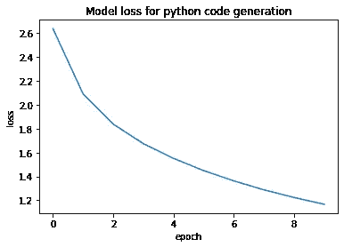
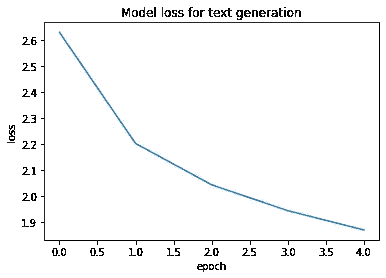

# 用递归神经网络生成奇怪的东西

> 原文：<https://medium.com/analytics-vidhya/generating-quirky-things-with-recurrent-neural-nets-4c0c8749cdf0?source=collection_archive---------25----------------------->

深度学习具有独特的能力，在应用研究领域有很多空间可以探索。一种用于理解时序数据中的说谎结构和语义的灵活类型的神经网络被称为递归神经网络。它所具有的显著特征包括一个反馈回路，该回路包含来自前一层的输出，用作下一层的输入，从而有助于传播顺序信息。递归神经网络(RNNs)在理解各种文本数据方面是通用的，并且已经被证明可以从时间序列中学习，这在以前的应用研究中是例外的。为了一个有趣的周末实验，我尝试从训练过的 RNN 中生成数据，在本文中，我将讨论 RNN 和我学到的东西。

# 为什么是递归神经网络？

递归神经网络是为了理解顺序或时间序列数据而专门构建的神经网络。为了理解给网络的输入数据，神经元之间有信息流。rnn 在理解文本数据、语音类信息、金融建模和工业物联网方面显示出无与伦比的成果。

RNNs 的一个主要缺点是不能考虑前一段时间的信息。这很重要，因为在序列数据中，模式和关系是长期的，而不是短期的。这个缺点被称为消失梯度问题。为了克服这个缺点，构建了 RNNs 的增强版本，称为**长短期记忆(LSTM)网络**。LSTMs 在神经元结构内部有额外的门，以合并最近的神经元输出，并在内存中携带旧的神经元输出。因此，我们将在本文中使用 LSTMs 来执行我们的实验。

# 实验

1.如前所述，rnn 在从文本数据中学习方面非常出色。对于我们的第一种实验，莎士比亚的作品[1]用于生成类似的文本。40 个字符的句子用于预测下一个字符，并依次考虑生成的输出。输入和输出如下所示。该模型很好地学习了十四行诗的结构。


使用 LSTM 的莎士比亚文本生成的输出

2.从文本生成中获得灵感，我们尝试使用 LSTM 模型产生不寻常的东西，并分析计算机程序如何学习。我们首先尝试让神经网络学习如何用 Python 编码。为此，使用了来自 python 语言官方 Github 的 Python 文件。大约有 5000 行 Python 代码，一个简单浅显的 LSTM 模型被训练学习。
下面展示的是一张 GIF 图，展示了代码打字速度比人快得多，但却没有什么意义。LSTM 模型还很好地学习了 python 语言的语义，以及一些常见的东西，如 def、class 和 self。


实验中生成的 Python 代码一瞥

生成的代码片段如下所示。

```
import os
import sys
import time
def ese_type_rith(self, pasametern): # a d e gefar()
        parg ivtraneedersoad
    xovarimstifon_types_vernore:
        def ___names___one'def tet__bseted__paktanse_= belaces:
        areis = notels
            # th  suiplebate as nvters anc angedueprod:
        alst
    def __are_ty_eser(self) -> noter
    n'tedefattrod orgeederestrer(strfla[tt]):
        tinestainl(_type:
        id = 1wistrrpine[[st, ].gt, "typit .asrusectraes senfor()
    def __ont': 'tiot_replt', 'self._typenasem_, flocamnt', foowdifins). 'conte  ithod in gonericgs.ancamstuplereattclass int(self):
        def __ent__(self, als())):
            "                'tert inttrawastdy
    def __ =b[th, mamb, %ry)
        self.assertisinnttacha(), typing.typing.mathing, typing.ppoytecthon)
    # freprpowt nverection a " n generic[tape.duperfreprar typencoresu):
    def uler(pamp'tacters': [typing.lmaldb', [antiant])
        self.asserttisisstance(unio)
        esvera: proo'for):
        {fargg_valo('or, 'gonerac'), 'lowalset, l[str]], vullecit]])
    def costen(self) -with self.assertraises(tyteerror):
            idstruples(ppy'nynetupingalenefrodt': 'gonora.terd', ' cont]
    def __sent_typevar(on_type_nore, mpse):
    ")
    __sult_fool_gen_taclo= teupleyes(alkareiand), pashon ', ()
        if iss.abyergetror("
    walss
        rabe_ganametrest_ches _isnclash(self):
        self.asserttsinsiclast(dobj, typing.dumppr(typy,
if nt_ainamater s(be)
        # o#vars calssartiand, variont": ...__quar(meterval_n', *args))r, pvarisns
   ("__nated__farsungee_varg__'and setpr = inmot ay inerant = ontolne
                        retued user["" "
    __splt__tytin_typenvar([eptsedta, trableckpronaniong):
        = {pramed(', 'nyping)def test seribonan, self):
        witiss abclassiame(patypenytype,"rfloamed)
        if nomedtepeise = ypewr[t0, nt.__note_ty__hargs__,
   ' __nite___= u]pdev__args_tepl(gstrabc[tepliames)
    def te_ne(no__, flob =insecastnang( a'serg, iflobals)],
                 colencorato # abale struplo 
    xdef nmpichast fono  undithabecimptypargs tre a sub. or :

    typing cramptrethed conce tho kefarlable domedwault als ak: clistable:
    def umaterarsy_verle:
            gefrorg = ' f (prggenest_coulle_cove(supletore[usror, sulf,):def cest_col__astr__(self):
        n = seluniot dve, in =sumplamederintcanthorunor = 'x counerdof pa thefcl.a_gechings# bage frewth in%promec, mpasysenctept notatxs, aytr.
   momed = typing.motynibisestr,
                             def.__dect_als__(suefrope_dent:
    passdef _made_pancher(sulf):
    if tyse appor = f qunerim_roremston)
        thep(self.dempam_hoxnmew_trupe__siplt(self),
```


兰博基尼 Aventador(感谢我的相机)

3.作为一名兰博基尼车迷，我想出了这个主意，训练 LSTM 模特学习和产生兰博基尼 Aventador 的加速声。在我看来，44k 频率(每秒的数据值)左右的音频信号是神经网络时间序列数据的一个很好的来源。这激发了足够的信心来使用 22 秒的加速声音来训练 LSTM 模型。从 LSTM 顺序产生的输出学习与兰博基尼汽车排气有关的独特特征(爆裂声和爆裂声)。输出的 wav 文件由背景噪声(白噪声)组成，为了得到清晰的输出，消除了背景噪声。下面附上输出的一个小片段。

# 讨论

从上述实验中，我们可以得出结论，LSTM 模型在从序列数据中学习方面非常出色，并且可以生成多种数据风格。在训练过程中，损失值呈指数下降，实验的相应图表如下所示。这灌输了一个动机，以实验更多的 LSTM 变化和对自然语言处理应用研究。



代码生成和文本生成实验的训练损失值图。

本实验使用的代码、输入文件和输出文件可以在[这里](https://github.com/sakshambassi/nlp)找到。

# 参考

1 莎士比亚作品，麻省理工开放式课程；[https://OCW . MIT . edu/ans 7870/6/6.006/s08/lecture notes/files/t8 . Shakespeare . txt](https://ocw.mit.edu/ans7870/6/6.006/s08/lecturenotes/files/t8.shakespeare.txt)

2 Franç ois Chollet，深度学习与 Python 代码示例，[https://github . com/fchollet/Deep-Learning-with-Python-notebooks](https://github.com/fchollet/deep-learning-with-python-notebooks)

# 承认

我要感谢我的朋友阿塔瓦·戈米卡尔(Atharva Gomekar)帮助我培训 LSTM 进行音频生成，并感谢沙维·托马尔(Sharvi Tomar)分享她的 RNNs 知识。