# 用 python 生成单词云

> 原文：<https://medium.com/analytics-vidhya/generating-wordclouds-in-python-5b9b0eb28d9?source=collection_archive---------11----------------------->

了解如何使用 python 中的 WordCloud 为自然语言处理执行探索性数据分析。

# **什么是 WordCloud？**

这个工具对于探索文本数据和使你的报告更加生动非常方便。很多时候，我们会看到一朵云，里面有很多大小不同的单词，它们代表了每个单词的频率或重要性。这叫做**标签云**或者**文字云**。

1.  如何从一个到几个文本文档创建一个基本的单词云
2.  调整 wordcloud 中文本的颜色、大小和数量
3.  将你的文字云遮罩成你选择的任何形状
4.  将你的文字云遮罩成你选择的任何颜色图案

# 先决条件

需要安装一些软件包:

1.  numpy
2.  熊猫
3.  matplotlib
4.  枕头
5.  wordcloud

numpy 库是最流行和最有用的库之一，用于处理多维数组和矩阵。它还与 pandas 库结合使用，以执行数据分析。

matplotlib 是一个基本库，它支持许多其他库在其基础上运行和绘图，包括 seaborn 或 wordcloud。

pillow 库是一个支持图像读取的包，Pillow 是 PIL- python 图像库的包装器，你需要这个库来读取图像作为文字云的遮罩。

如果你只需要它来绘制一个基本的 wordcloud，那么 **pip 安装 word cloud**或**conda install-c conda-forge word cloud**

现在让我们开始吧！

加载所有必需的库:

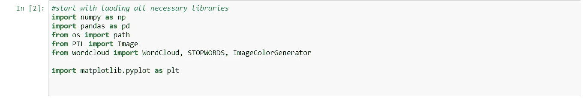

现在，使用 pandas read_csv 加载数据帧。注意，使用 index_col=0 意味着我们不将行名(index)作为单独的列读入。

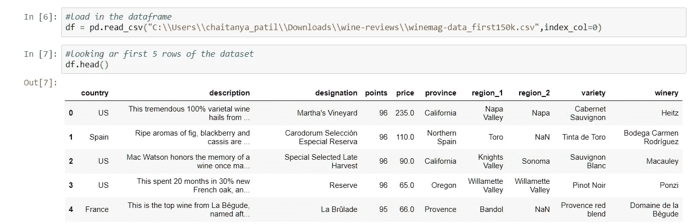

我们可以使用 print()结合。format()以获得良好的打印输出。

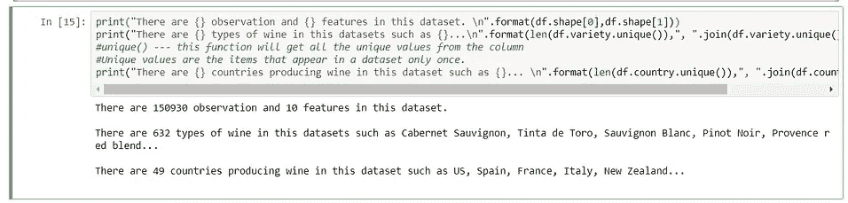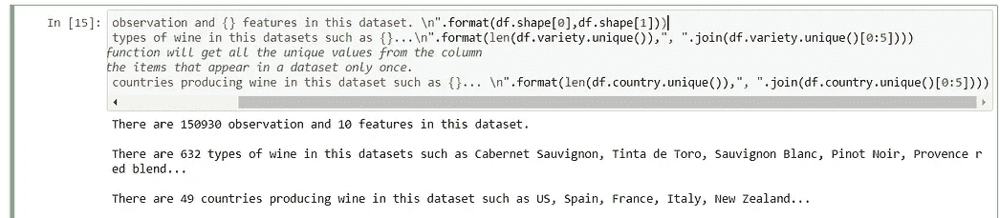

要在特性组之间进行比较，可以使用 groupby()并计算统计数据。

使用该数据集，您可以按国家分组，查看所有国家点数和价格的汇总统计数据，或者选择最受欢迎和最昂贵的点数和价格。

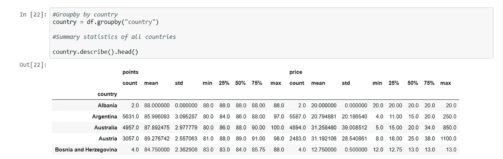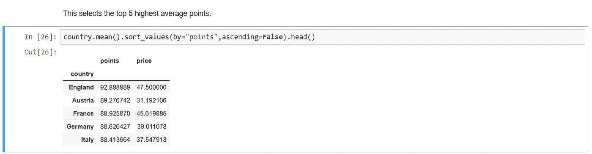

我们可以使用 pandas Dataframe 和 matplotlib 的绘图方法来绘制各个国家的葡萄酒数量。

# DataFrame — size()函数

size()函数用于获取表示该对象中元素数量的整数。

如果是系列，则返回行数。否则，如果是 DataFrame，则返回行数乘以列数。

**语法:**

```
DataFrame.size
```

**例如:**

**例句**

在[1]中:

```
**import** **numpy** **as** **np**
**import** **pandas** **as** **pd**
```

在[2]中:

```
s = pd.Series({'p': 2, 'q': 3, 'r': 4})
s.size
```

Out[2]:

```
3
```

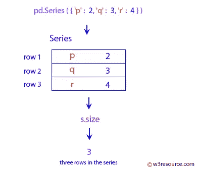

在[3]中:

```
df = pd.DataFrame({'c1': [2, 3], 'c2': [4, 5]})
df.size
```

Out[3]:

```
4
```

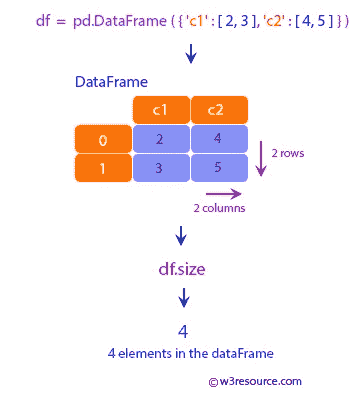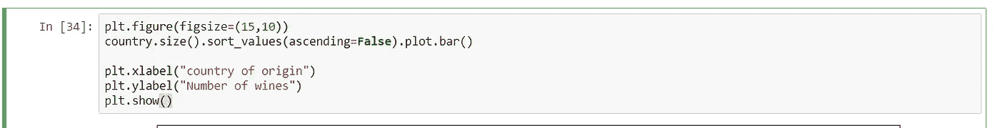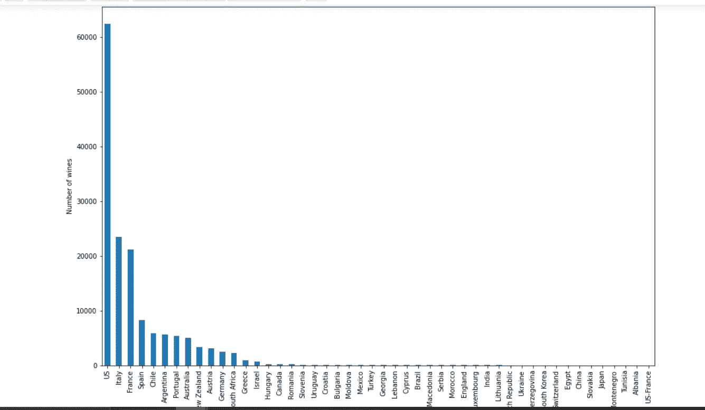

在 44 个生产葡萄酒的国家中，美国拥有超过 50000 种葡萄酒。意大利也出产大量优质葡萄酒，有近 20000 种葡萄酒可供评审。

数量重于质量吗？

现在让我们来看看所有 44 个国家的最高评级葡萄酒的情节。

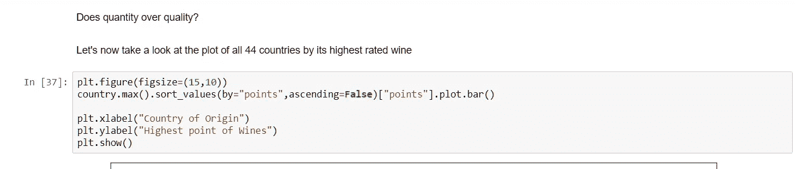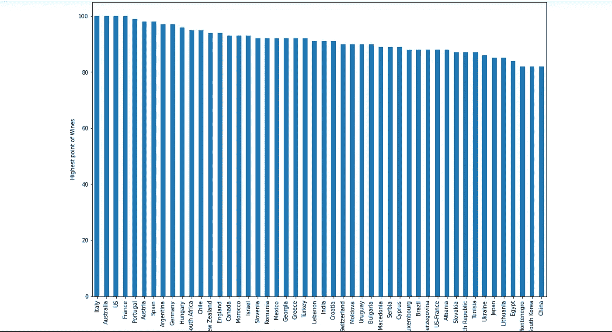

澳大利亚、美国、葡萄牙、意大利和法国都有 100 分的葡萄酒。如果你注意到，葡萄牙和澳大利亚的葡萄酒产量在数据集中分别排名第 5 和第 9，这两个国家的葡萄酒种类都不到 8000 种。

# 建立一个基本的单词云

WordCloud 是一种显示给定文本中哪些单词出现频率最高的技术。

让我们从一个简单的例子开始:使用第一个观察描述作为单词云的输入。这三个步骤是:

1.  提取评论(文本文档)
2.  创建并生成单词云图像
3.  使用 matplotlib 显示云

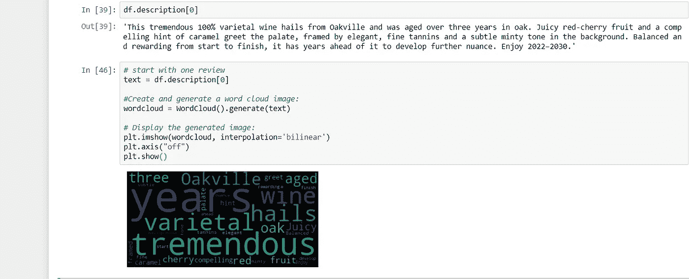

太好了！我们可以看到第一篇评论提到了很多关于品种葡萄酒风味的内容。

现在，改变 WordCloud 的一些可选参数，如 **max_font_size** 、 **max_word** 、 **background_color** 。

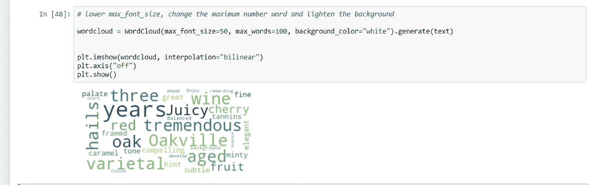

唉，看起来 max_font_size 在这里可能不是一个好主意。更难看出词频的区别。然而，使背景变亮会使云更容易阅读。

如果你想保存图片，WordCloud 提供了一个函数**来 _file**

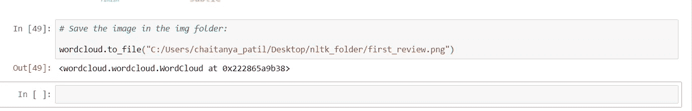

您可能已经注意到 plt.imshow()中的参数 interpolation= "双线性。这是为了使显示的图像看起来更平滑。

所以现在我们将所有的葡萄酒评论合并到一个大文本中，并创建一个大的胖云来查看这些葡萄酒中最常见的特征。

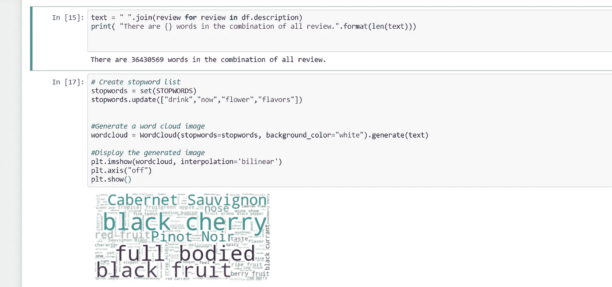

哦，似乎黑樱桃和浓郁是被提及最多的特点，而赤霞珠是其中最受欢迎的。这与赤霞珠“是世界上最广为人知的红酒葡萄品种之一”的事实是一致的。从加拿大的欧肯那根谷到黎巴嫩的贝卡谷地，几乎所有气候多样的主要葡萄酒生产国都有种植。

现在让我们把这些话倒进一杯酒里！
说真的，
如果你愿意，甚至一瓶酒！

为了给你的文字云创建一个形状，首先，你需要找到一个 PNG 文件作为蒙版。

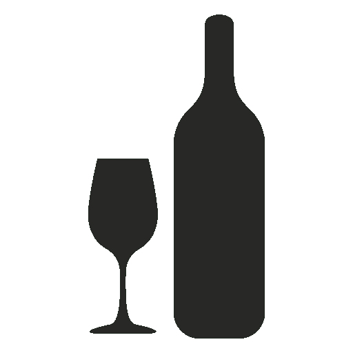

并非所有的蒙版图像都具有相同的格式，因此会导致不同的结果，从而使 WordCloud 功能无法正常工作。为了确保您的掩码有效，让我们来看看 numpy 数组中的掩码:

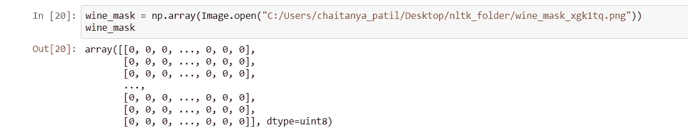

> 蒙版函数的工作方式是**它要求蒙版的所有白色部分应该是 255 而不是 0(整数类型)。**
> 
> 该值代表像素的“强度”。值 255 是纯白色，而值 1 是黑色。在这里，你可以使用下面提供的函数来转换你的面具，如果你的面具有相同的格式如上。
> 
> 请注意，如果您有一个背景不是 0，而是 1 或 2 的遮罩，请调整该函数以匹配您的遮罩。

首先，使用 transform_format()函数将数字 0 交换到 255。

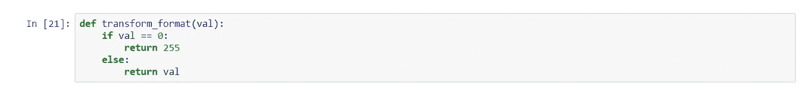

然后，创建一个新的蒙版，其形状与你手上的蒙版相同，并将函数`transform_format()`应用于前一个蒙版的每一行中的每一个值。

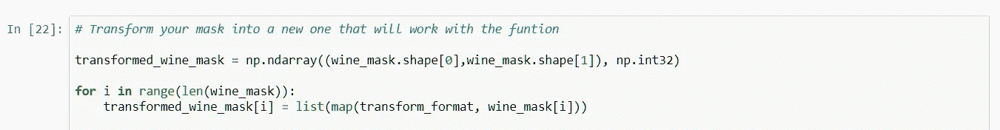

现在，你有了一个正确形式的新面具。打印输出转换后的遮罩是检查功能是否正常工作的最佳方式。

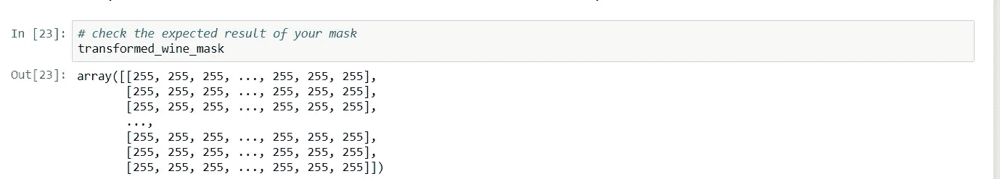

好吧！有了合适的蒙版，你就可以开始用你选择的形状制作文字云了。注意在`WordCloud`函数中，有一个`mask`参数，它接受你在上面创建的变换后的蒙版。`contour_width`和`contour_color`如其名，是调整云轮廓特征的自变量。你这里的酒瓶是红酒瓶，所以耐火砖看起来是轮廓色的不错选择。想要更多的颜色选择，你可以看看这个[色码表](https://matplotlib.org/2.0.0/examples/color/named_colors.html)

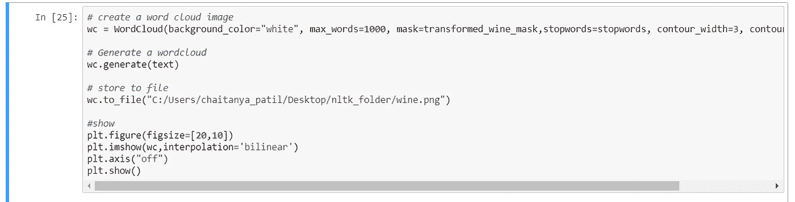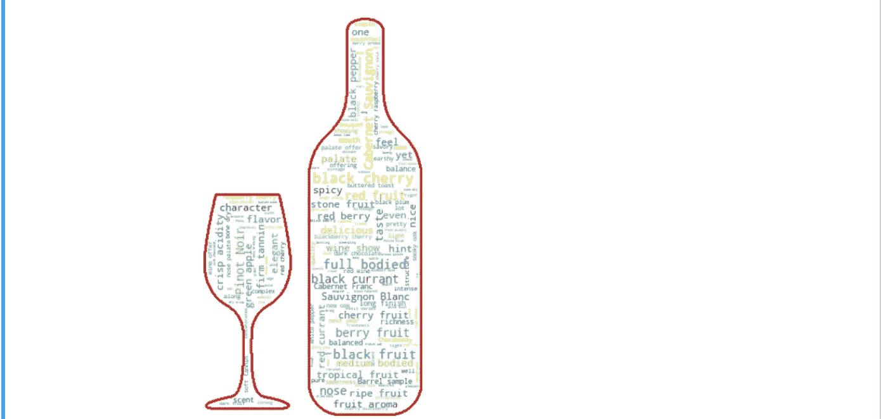

哇，我们创造了一个酒瓶形状的单词云！这似乎是葡萄酒描述中最常提到的关于黑樱桃、水果风味和酒体丰满的特点。

对于文本数据的各种探索性数据分析方法，也请浏览此内容:

[https://Neptune . ai/blog/explorative-data-analysis-natural-language-processing-tools](https://neptune.ai/blog/exploratory-data-analysis-natural-language-processing-tools)

谢谢大家！