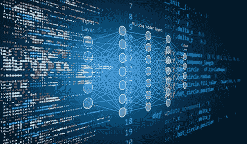

# 编程语言的产生

> 原文：<https://medium.com/analytics-vidhya/generation-of-programming-languages-6e74aff63109?source=collection_archive---------0----------------------->

这一切都是从 1 和 0 开始的！

编程语言有五代。

## 第一代语言

有时被称为机器代码或目标代码，机器语言是计算机读取和解释的二进制数字或位的集合。机器语言是计算机唯一能够理解的语言。

注意:程序或动作的确切机器语言可能因操作系统而异。特定的操作系统决定了编译器如何把程序或动作写成机器语言。

## 第二代语言

*有时被称为汇编或 ASM。*

汇编语言是针对特定计算机体系结构的计算机或其他可编程设备的低级编程语言，与大多数高级编程语言相反，高级编程语言通常可跨多个系统移植。汇编语言被称为汇编程序的实用程序转换成可执行的机器代码，如 NASM、MASM 等。

## 第三代语言

高级语言是一种旨在简化计算机编程的编程语言。它是“高级的”,因为它与在计算机处理器上运行的实际代码相差几个步骤。高级源代码包含易读的语法，这些语法后来被转换成低级语言，可以被特定的 CPU 识别和运行。

*例子:C、C++、Java、Visual Basic 和 JavaScript*

## 第四代语言

第四代编程语言(4GL)是属于被认为是第三代编程语言(3GL)的进步的一类语言的任何计算机编程语言。每一代编程语言都旨在为内部计算机硬件细节提供更高层次的抽象，使这种语言对程序员更友好、更强大、更通用。虽然 4GL 的定义随着时间的推移而发生了变化，但它的典型特征是同时处理大量信息，而不仅仅是关注位和字节。声称是 4GL 的语言可能包括对数据库管理、报告生成、数学优化、GUI 开发或 web 开发的支持。一些研究人员认为 4gl 是特定领域语言的一个子集。

*例子:Perl，Python，Ruby，SQL，MatLab(MatrixLaboratory)*

 [## 进口那个

### Python 的禅

medium.com](/@enosjeba/import-that-48bd30272594) 

## 第五代语言

**第五代编程语言** ( **5GL** )是任何基于使用给定程序的约束来解决问题的编程语言，而不是使用程序员编写的算法。大多数基于约束和逻辑编程语言以及其他一些声明性语言都是第五代语言。

第四代编程语言被设计用来构建特定的程序，而第五代语言被设计用来让计算机在没有程序员的情况下解决给定的问题。这样，用户只需要担心需要解决什么问题，需要满足什么条件，而不需要担心如何实现一个例程或算法来解决它们。第五代语言主要用于人工智能研究。

*例子:OPS5 和水星编程语言。*

所以这就是五代编程语言！还可以查看命令行技巧

 [## 命令行技巧，

### 你一生中至少应该尝试一次！

medium.com](/@enosjeba/command-line-tricks-34fcec03b2a0)