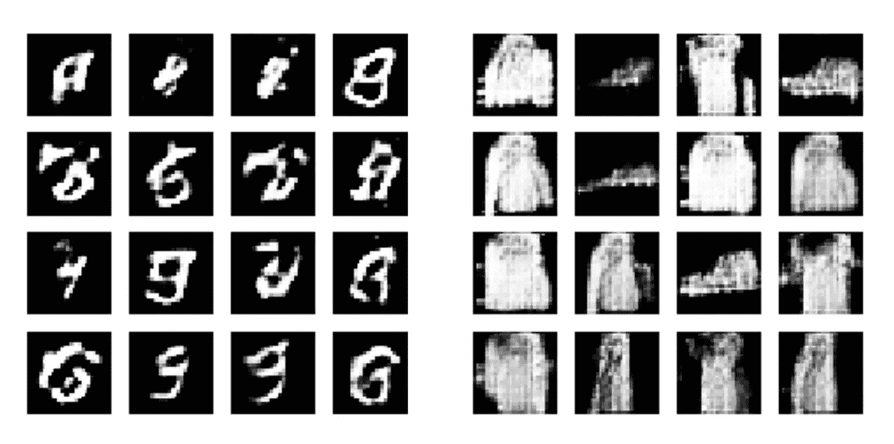
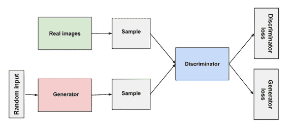
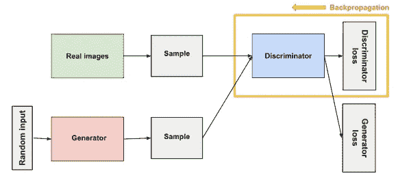
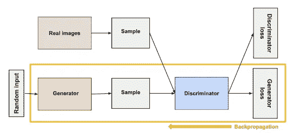
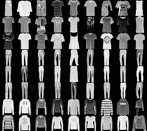
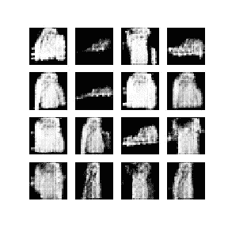
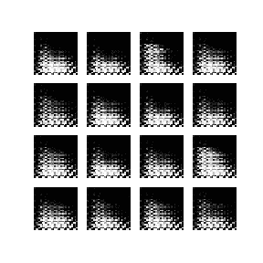

# 生成性对抗网络:竞争对手让你更强大

> 原文：<https://medium.com/analytics-vidhya/generative-adversarial-networks-a-rival-makes-you-stronger-d0b2aa87e06c?source=collection_archive---------28----------------------->

# **简介**

生成敌对网络或 gan 是生成模型，它创建反映原始数据的新数据实例。它由两个网络组成，一个是生成器，一个可以生成新数据实例的模型，另一个是鉴别器，一个可以鉴别不同类型数据实例的模型。这里有一个用 GANs 生成的图像的例子。

上面的图片是甘通过查看和的时装数据库重新制作的。

# **甘的结构**

图 1:甘的结构

在这里，我们可以看到生成器接受一个随机输入，并生成一个样本，即一个虚假的数据实例。然后将该假冒实例传递给鉴别器，以对其真假进行分类。根据该预测，我们计算用于训练网络的损耗。所以让我们一个一个的检查模型。

# 鉴别器

鉴别器只是一个二元分类器。我们可以使用任何适合数据分类的分类器网络。它试图从生成器创建的数据中区分真实数据。并且它可以通过鉴别器损失(二进制分类损失)的反向传播来训练。我们将真实图像和生成图像的标签分别视为 1 和 0。我们可以看到，在图 1 中，鉴别器连接到两个损失函数。在鉴频器训练期间，鉴频器忽略发电机损耗，仅使用鉴频器损耗。并且在训练发电机时使用发电机损耗。但是等等，甘本身不就是单品模特吗？为什么我们需要用不同的损耗分别训练它的零件？这是竞争开始的地方。我们以后再讨论。

图 2:鉴别器

# 发电机

GAN 的生成器部分试图从潜在空间(用于播种生成过程的固定长度的随机向量)生成假数据。根据鉴别器给出的反馈来训练发生器。它的工作是使鉴别器将其输出分类为真实的。因此，如果鉴别器将生成器生成的虚假数据归类为真实数据，则生成器会收到正反馈，如果发生相反的情况，则生成器会收到负反馈并尝试改进。

图 3:生成器

但是发电机的训练与普通网络有很大不同，为了训练它们，我们改变网络的权重以减少其输出的损失。然而，在 GANs 情况下，发电机并不直接与其试图影响的损耗(发电机损耗)相连。发生器将产生的数据馈送给鉴别器，鉴别器的预测决定发生器的损耗。

# 如何训练一个甘？

GAN 包含两个可单独训练的网络。有许多方法可以训练 GAN，但我们将使用的一种方法是，首先我们将训练鉴别器，以便它学习分类，然后我们训练生成器。在生成器训练期间，我们确保鉴别器不可训练。这是一个两步过程，我们停止发电机和训练鉴别器，然后我们停止鉴别器和训练发电机。

这就是奇迹发生的地方。GAN 的独特之处在于它根据另一个网络的反馈来训练自己。这意味着鉴别器越好，发生器就越好。生成器试图欺骗鉴别器，使其认为生成的图像是真实的，而鉴别器试图不被生成器欺骗。因此，如果鉴别器是强大的，那么它可以很容易地区分真假，这将使生成器很难试图欺骗鉴别器，并将改进这样做。这两个网络之间的竞争使得甘的训练如此独特。

但是我们什么时候才能说模型训练好了呢？就是当我们看到鉴别器把真实图像和生成的图像都归类为真实的时候。这个均衡被称为**纳什均衡**。

现在，我们将使用一个简单的深度卷积 GAN(DCGAN)通过 Tensorflow 从时尚 _MNIST 数据集生成数据样本。

时尚 MNIST 数据集

# 让我们建立我们的 GAN 模型

我们将使用 TensorFlow 框架来构建和训练模型。

1-首先导入所有必需的包

2-设置数据集

3-创建发电机模型

4-创建鉴别器模型

5-损失和优化

*   **鉴别器损失**:将鉴别器对真实图像的预测与 1 的数组进行比较，将鉴别器对伪造(生成)图像的预测与 0 的数组进行比较。
*   **发生器损耗:**发生器损耗量化了它欺骗鉴别器的能力。这意味着如果生成器运行良好，鉴别器会将假图像归类为真图像(=1)。这里，我们将把鉴别器对生成图像的判断与 1 的数组进行比较。

6-训练模型

7-生成输出

然后你会得到这样的输出，

这是由发电机产生的，够近了吧:-)

如果你愿意的话，你也可以生成一个 GIF，它可以通过你的生成器在每一个时期的输出来制作动画，就像这样，

我将很快发布如何使用 python 从任意一组图像生成 gif。