# 生成性对抗网络:一个包含的观点

> 原文：<https://medium.com/analytics-vidhya/generative-adversarial-networks-an-encompassed-view-304258f9f238?source=collection_archive---------15----------------------->

什么是生成性对抗网络？如果你还没有听说过生成敌对网络，不要担心，你会的。深度学习中最热门的话题，他们被称为 GANs，有潜力创造出在更少的人类帮助下学习更多的系统。

传统观点认为，生成对抗网络(GANs)是机器学习领域一项令人兴奋的最新创新。gan 是生成模型:它们创建新的数据实例，类似于你的训练数据。

在机器学习领域，一切都可以用它们的名字来解释。因此，每当我们听到*生殖*这个名字，我们会立即想象一个场景，一个物体有能力拥有产生、起源、生产或繁殖的能力或功能。而这正是我们在甘的尝试。在机器学习中，“生成性”描述了一类统计模型，与判别模型形成对比。

为了开始这个讨论，我们可以非正式地描述一下 GAN 的架构。非正式的**生成型**模型可以生成新的数据实例，而**鉴别型**模型可以区分不同种类的数据实例。生成模型可以生成看起来像真实动物的新动物照片，而辨别模型可以区分狗和猫。gan 只是一种生成模型。

通过引入一些概率概念，转向 GAN 的更正式的定义，其中给定一组数据实例 X 和一组标签 Y:

**生成型**模型捕捉联合概率 p(X，Y)，或者如果没有标签，只捕捉 p(X)。

**判别**模型捕捉条件概率 p(Y | X)。

要理解 GAN 的，我们需要理解生成新数据的概念并不新鲜。因此，了解生成数据的传统统计和概率方法非常重要。我们有马尔可夫链来解释一个有点类似的概念。

马尔可夫链是一个*离散时间随机过程:*一个发生在一系列时间步骤中的过程，在每个时间步骤中进行随机选择。

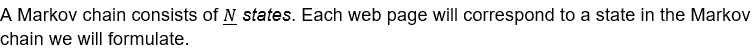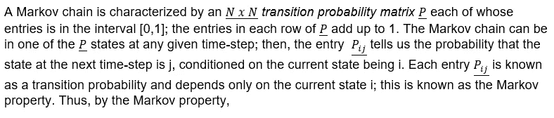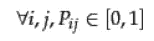

而且，

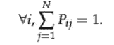

满足上述等式的具有非负条目的矩阵被称为*随机矩阵*。随机矩阵的一个关键性质是它有一个*主左特征向量*对应其最大特征值，即 1。

在马尔可夫链中，马尔可夫链的下一个状态的概率分布只取决于当前状态，而不取决于马尔可夫链如何到达当前状态。图 1 显示了一个具有三种状态的简单马尔可夫链。从中间状态 A 开始，我们以 0.5 的(相等)概率继续到 B 或 C。从 B 或 C 开始，我们以 1 的概率继续到 A。该马尔可夫链的转移概率矩阵为

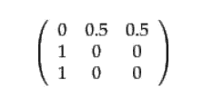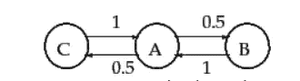

***图 1:*** *一个简单的三态马尔可夫链；链接上的数字表示转移概率。*

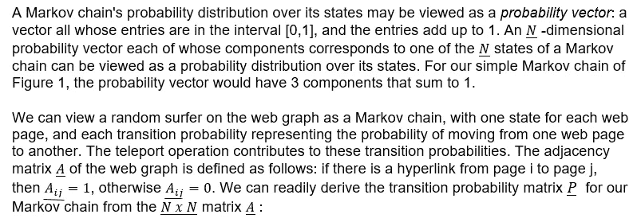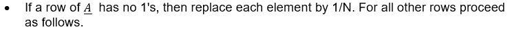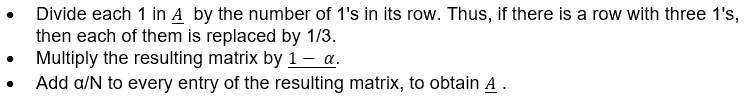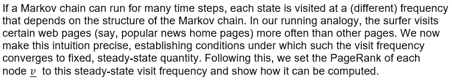

在仔细研究了马氏链之后，我们现在处于一个非常舒适的境地来研究更多关于甘的。*生成模型包括数据本身的分布，并告诉你给定示例的可能性有多大。例如，预测序列中下一个单词的模型通常是生成模型(通常比 GANs 简单得多)，因为它们可以为单词序列分配概率。*

*判别模型忽略了一个给定实例是否可能的问题，只是告诉你一个标签应用于该实例的可能性有多大。*

**注意:这是 GAN 非常一般化的定义，因为它们是生成性对抗网络的许多其他变体。*

这两种模型都不需要返回代表概率的数字。我们可以通过模拟数据的分布来模拟该分布。

令人惊讶的是，在决策树分类器和 GAN 的分类器之间也存在一般的直觉。像决策树这样的判别分类器可以标记一个实例，而不需要为该标记分配概率。这种分类器仍然是一个模型，因为所有预测标签的分布将模拟标签在数据中的真实分布。

类似地，生成模型可以通过产生令人信服的“假”数据来模拟分布，这些数据看起来像是从该分布中提取的。

**生成模型很难:**

生成模型比类似的判别模型处理更困难的任务。生成模型必须建模更多。图像的生成模型可以捕捉像“看起来像船的东西可能会出现在看起来像水的东西附近”和“眼睛不太可能出现在额头上”这样的相关性。这些是非常复杂的分布。相比之下，一个有辨别能力的模型可能通过寻找一些泄露秘密的模式来了解“帆船”或“非帆船”之间的区别。它可能会忽略生成模型必须正确处理的许多相关性。判别模型试图在数据空间中绘制边界，而生成模型试图对数据在整个空间中的放置方式进行建模。例如，下图显示了手写数字的判别和生成模型:

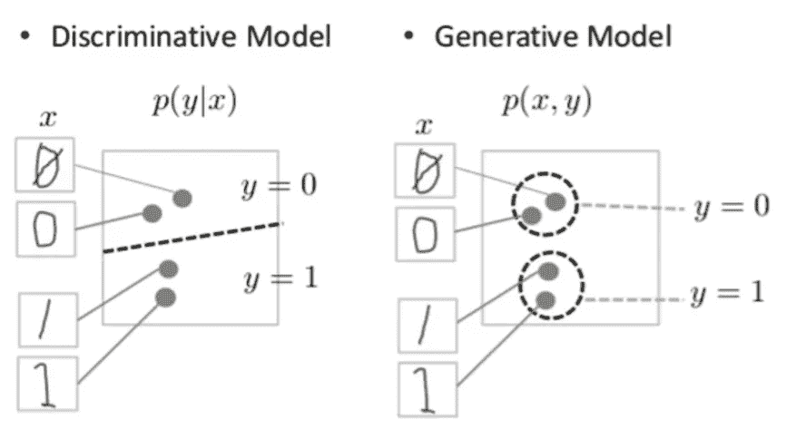

***图 2:手写数字的判别和生成模型。***

判别模型试图通过在数据空间中画一条线来区分手写的 0 和 1。如果它得到了正确的线，它可以区分 0 和 1，而不必精确地建模实例在线的任何一边的数据空间中的位置。相比之下，生成模型试图通过生成接近数据空间中真实对应数字的数字来产生令人信服的 1 和 0。它必须对整个数据空间的分布进行建模。GANs 提供了一种有效的方法来训练这种丰富的模型，以模拟真实的分布。为了理解它们是如何工作的，我们需要了解 GAN 的基本结构。

**甘概述:**

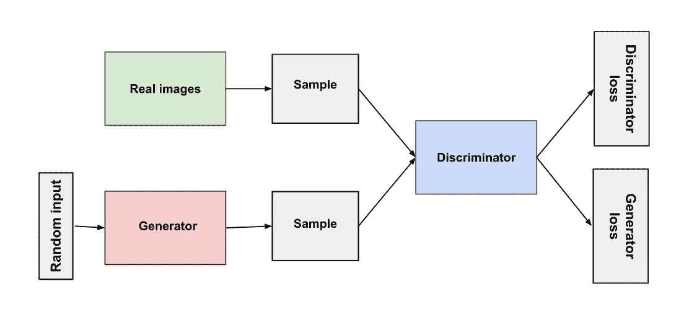

***图 3***

生成器和鉴别器都是神经网络。发生器输出直接连接到鉴频器输入。通过反向传播，鉴别器的分类提供了一个信号，生成器用它来更新其权重。

**鉴别器:**

GAN 中的鉴别器只是一个分类器。它试图区分真实数据和生成器创建的数据。它可以使用任何适合其分类数据类型的网络架构。

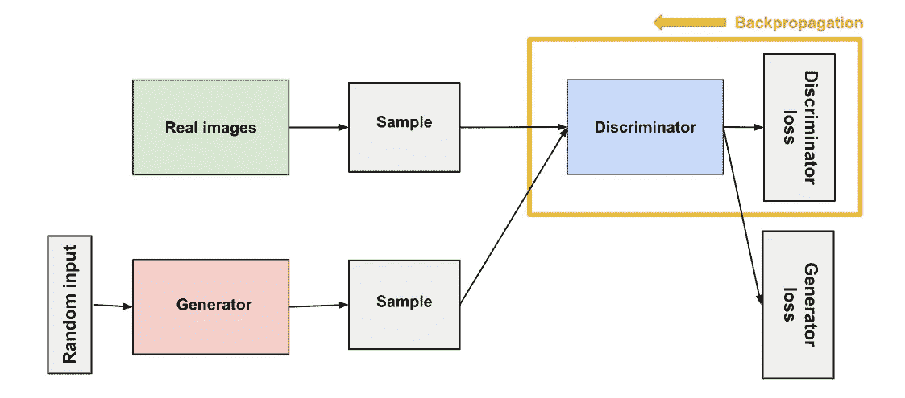

图 4

鉴别器的训练数据来自两个来源:

*   **真实数据**实例，如人的真实照片。鉴别器在训练中使用这些实例作为正面例子。
*   **假数据**由生成器创建的实例。鉴别器在训练中使用这些实例作为反面例子。

从图 4 中我们可以看到，两个“样本”框代表这两个输入鉴别器的数据源。在鉴别器训练期间，发电机不训练。它的权重保持不变，同时为鉴别器提供训练样本。

鉴别器连接到两个损失函数。在鉴频器训练期间，鉴频器忽略发电机损耗，仅使用鉴频器损耗。

在鉴频器训练期间:

1.  鉴别器对来自生成器的真实数据和虚假数据进行分类。
2.  鉴别器损失惩罚将真实实例误分类为假实例或将假实例误分类为真实实例的鉴别器。
3.  鉴别器通过鉴别器网络从鉴别器损耗反向传播来更新其权重。

**发电机:**

GAN 的发生器部分通过结合来自鉴别器的反馈来学习创建假数据。它学习使鉴别器将其输出分类为真实的。

发生器训练要求发生器和鉴别器之间的集成比鉴别器训练要求的更紧密。训练发电机的 GAN 部分包括:

*   随机输入
*   生成器网络，将随机输入转换为数据实例
*   鉴别器网络，对生成的数据进行分类
*   鉴频器输出
*   发电机损耗，惩罚发电机未能欺骗鉴别器

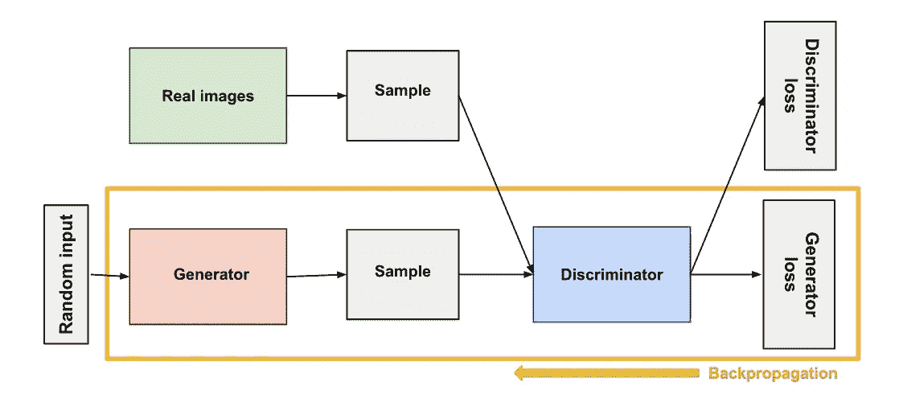

图 5

神经网络需要某种形式的输入。通常我们会输入我们想要处理的数据，比如我们想要分类或预测的实例。但是对于一个输出全新数据实例的网络，我们用什么作为输入呢？

在其最基本的形式中，GAN 将随机噪声作为其输入。然后，发生器将这种噪声转换成有意义的输出。通过引入噪声，我们可以让 GAN 产生各种各样的数据，从目标分布的不同地方采样。

实验表明，噪声的分布并不重要，所以我们可以选择一些容易采样的东西，比如均匀分布。为了方便起见，对噪声进行采样的空间的维数通常小于输出空间的维数。

为了训练神经网络，我们改变网络的权重，以减少其输出的误差或损失。然而，在我们的 GAN 中，发电机与我们试图影响的损耗没有直接联系。发电机馈入鉴别器网络，*鉴别器*产生我们试图影响的输出。发生器损耗惩罚发生器产生被鉴别器网络分类为假的样本。

这个额外的网络块必须包含在反向传播中。反向传播通过计算权重对输出的影响(如果改变权重，输出会如何变化)来调整每个权重的方向。但是发电机重量的影响取决于它所输入的鉴别器重量的影响。因此，反向传播从输出端开始，通过鉴频器流回发生器。

同时，我们不希望鉴别器在生成器训练期间改变。试图击中一个移动的目标会使一个困难的问题变得更加困难。

因此，我们按照以下步骤训练发电机:

1.  样本随机噪声。
2.  从采样的随机噪声产生发电机输出。
3.  获取生成器输出的鉴别器“真实”或“虚假”分类。
4.  计算鉴别器分类的损失。
5.  通过鉴别器和发生器反向传播以获得梯度。
6.  使用渐变仅更改发生器权重。

这是发电机训练的一个迭代。在下一节中，我们将看到如何同时训练生成器和鉴别器。

**收敛:**

随着生成器随着训练而提高，鉴别器的性能变得更差，因为鉴别器不容易区分真假。如果发生器完全成功，那么鉴别器具有 50%的准确度。实际上，鉴别者通过抛硬币来做出预测。

这种进展给 GAN 的整体收敛带来了问题:随着时间的推移，鉴别器反馈变得越来越没有意义。如果 GAN 继续训练超过鉴别器给出完全随机反馈的点，那么发生器开始在垃圾反馈上训练，并且它自己的质量可能崩溃。

对于 GAN 来说，收敛通常是短暂的，而不是稳定的状态。

**损失函数:**

甘斯试图复制一个概率分布。因此，他们应该使用反映由 GAN 产生的数据分布和真实数据分布之间的距离的损失函数。

因此，我们确实会遇到这样一种情况，问题是我们如何捕捉 GAN 损耗函数中两种分布之间的差异？这个问题是一个活跃的研究领域，已经提出了许多方法。

在本文中，我们将讨论 GAN 提出的两个主要损失函数。

GAN 可以有两个损失函数:一个用于发电机训练，一个用于鉴别器训练。但是现在我们有一个值得问的问题，“*两个损失函数如何共同作用来反映概率分布之间的一个距离度量？”*

在我们这里要讨论的损耗方案中，发生器和鉴频器损耗来自概率分布之间的单一距离度量。然而，在这两种方案中，生成器只能影响距离度量中的一项:反映虚假数据分布的项。因此，在生成器训练期间，我们去掉了另一项，它反映了真实数据的分布。

发生器和鉴频器损耗最终看起来不同，尽管它们来自同一个公式。

在介绍 GANs 的论文中，生成器试图最小化以下函数，而鉴别器试图最大化它:

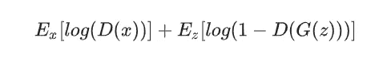

损失函数

在此功能中:

*   D(x)是鉴别器对真实数据实例 x 是真实的概率的估计。
*   Ex 是所有真实数据实例的期望值。
*   G(z)是给定噪声 z 时发电机的输出。
*   D(G(z))是鉴别者对假实例为真的概率的估计。
*   Ez 是对生成器的所有随机输入的期望值(实际上，是对所有生成的伪实例 G(z)的期望值)。
*   该公式源自真实分布和生成分布之间的交叉熵。

发生器不能直接影响函数中的 log(D(x))项，所以，对于发生器来说，最小化损耗等价于最小化 log(1 — D(G(z))。

但如果我们看看 TF-GAN 的，我们会发现它使用了 Wasserstein 损耗。

这个损失函数依赖于 GAN 方案的修改(称为“Wasserstein GAN”或“WGAN”)，其中鉴别器实际上不分类实例。对于每个实例，它输出一个数字。这个数字不一定要小于 1 或者大于 0，所以我们不能用 0.5 作为阈值来决定一个实例是真的还是假的。鉴别器训练只是试图使真实实例的输出大于虚假实例的输出。

由于不能真正辨别真假，WGAN 鉴别器实际上被称为“批评家”，而不是“鉴别器”。这种区别具有理论上的重要性，但出于实际目的，我们可以把它看作是承认损失函数的输入不一定是概率。

损失函数本身看似简单:

**临界损失:** *D(x) — D(G(z))*

鉴别器试图最大化这个函数。换句话说，它试图最大化真实实例上的输出和虚假实例上的输出之间的差异。

**发电机损耗:** *D(G(z))*

生成器试图最大化该功能。换句话说，它试图最大化伪实例的鉴别器输出。

Wasserstein GANs 比基于 minimax 的 gan 更不容易被卡住，并且避免了消失梯度的问题。推土机距离还有一个优点，那就是它是一个真实的度量:一个概率分布空间中的距离度量。交叉熵不是这个意义上的度量。

对于一个更实际的方法，我将链接附加到我的 github 库，在那里有我的 python 笔记本的 web 副本。ipynb 文件),它描述了 WGAN 的完整实现。

*链接:*[https://github.com/ayajnik/WGAN_bc](https://github.com/ayajnik/WGAN_bc)