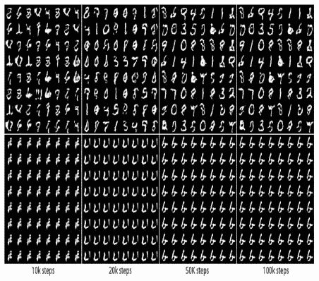

# 生成对抗网络

> 原文：<https://medium.com/analytics-vidhya/generative-adversarial-networks-df14100f17ed?source=collection_archive---------18----------------------->

在过去的 6 个月里，我一直在从事深度学习项目，我遇到了许多不同的用例，它们都非常棒，而 GAN 是真正让我着迷的东西，也是我写这篇文章的动机，来展示我对 GAN 的看法

什么是甘？

GAN 是一个神经网络，它由两个网络组成，生成器和鉴别器，两者相互训练并尝试相互学习，例如，教师不断给出反馈，直到学生创建了一个完美的图片，这样教师就无法区分原始图片和学生创建的图片

甘观的简单化

**什么是生成器和鉴别器？**

生成器是一种神经网络，它创建新数据，而不是像常规图像分类或其他任务那样尝试对图像进行分类，它使用现有数据来生成新数据，例如，它使用现有图像来创建新图像，主要目标是从称为潜在空间的随机生成的数字向量中生成数据(图像、视频、音频或文本)。

鉴别器更像常规的神经网络，其中我们输入两个图像，一个是真实的，另一个是由生成器创建的虚假的，并且网络使用二进制分类方法对它们进行分类，术语对抗性指向构成 GAN 框架的两个算法之间的类似游戏的竞争动态

GAN 的基本架构

正如我们从 GAN 的架构中可以看到的，两者轮流从反馈中学习，其中鉴别器寻求最小化损失函数，而生成器寻求最大化损失函数，这也可以称为最小最大博弈，当我们达到纳什均衡时可以实现收敛。当 GAN 框架被引入时，它是一个简单的版本，后来被应用到许多用例中，产生了 200 多种不同类型的 GAN，在本文中，我将通过代码的实际实现更深入地研究 DCGAN

**甘的应用**

可以实现 GAN 的用例数量是无限的，我列出了其中一些我感兴趣的用例，并实现了其中一个

1.  视频生成
2.  音乐一代
3.  3D 图像生成
4.  生成逼真的照片图像
5.  风险测量
6.  信用卡欺诈检测
7.  使用 DCGAN 生成动画

这里是不同 GAN 的列表[的链接](https://github.com/hindupuravinash/the-gan-zoo)

# DCGAN 概述

在 GAN 的原始版本中，网络是完全连接的密集层，而在 DCGAN 中，两个网络都使用卷积神经网络，CNN 在计算机视觉任务中表现突出，在发表的原始文章中，研究人员建议对生成器和鉴别器网络都使用卷积层。从随机向量 z 开始，DCGAN 首先使用完全连接的层将 z 投影到具有适当大小的新向量中，以便它可以被整形为空间卷积表示(h*w*c ),然后使用一系列卷积层(称为转置卷积)将特征映射上采样到所需的输出图像大小

转置卷积运算概述

通常，使用卷积，我们会缩小图像的大小以提取重要的特征图，而使用转置卷积，我们会通过在输入特征图的元素之间插入 0 来对特征图进行上采样，上图显示了转置卷积的示例，输入大小为 4 *4，步长为 2 *2，核大小为 2 *2。中间的大小为 9 * 9 的矩阵显示了将零插入到输入特征图中之后的结果，然后使用步长为 1 的 2 *2 核执行常规卷积，结果得到大小为 8 * 8 的输出。我们还可以通过对步长为 2 的输出执行常规卷积来验证后向方向，结果得到大小为 4 *4 的输出特征图，这与我们的原始输入 4 *4 相同

批量标准化是另一种技术，用于防止在训练期间分布发生变化，从而实现更快更好的收敛。批量定额基于计算出的统计数据对小批量要素进行变换。在批量定额的第一步，计算小批量的平均值和标准偏差。它们都在步骤 2 中使用，以通过 z 分数归一化来缩放每个小批量中的示例，从而产生标准化的输入。在步骤 3 中，可学习参数β和γ允许批处理规范控制归一化特征的移动和扩散，下图提供了批处理归一化的完整过程

CNN 批处理规范化的工作流程

# **DCGAN 的架构**

生成器网络包含 10 层，它执行步进卷积以增加张量的空间分辨率，在 Keras 中，上采样和卷积层的组合相当于一个步进卷积层，基本上生成器从正态分布中采样噪声向量，并不断对其进行变换，直到生成与原始数据集形状相同的最终图像，这是代码块和生成器网络架构

DCGAN 体系结构

鉴别器网络使用包含 10 层的 CNN，基本上它采用大小为 64 * 64 * 3 的图像，并使用 2D 卷积层对其进行下采样，然后将其传递给完全连接的层进行分类。其输出是关于给定图像是假图像还是真实图像的预测。这可以是 0 或 1，如果输出为 1，则传递给鉴别器的图像是真实的，如果输出为 0，则传递的图像是假图像

# **损失函数**

GAN 的最小-最大损失函数

从上面的 min max V(D，G)称为价值函数，它可以被解释为一个收益我们希望最大化关于鉴别器(D)的价值，同时最小化关于生成器(G)的价值。D(x)是指示输入示例 x 是真还是假(生成的)的概率，对于这样的值函数，它需要两个优化步骤，一个是最大化鉴别器的收益，另一个是最小化生成器的收益，训练 GAN 的实际方法是在这两个优化步骤之间交替进行。先冻结一个网络的参数优化另一个网络的权重，冻结第二个优化第一个。这个过程应该在每个训练迭代中重复，如果我们仔细观察上面的方程，它将是与具有不同参数的二元交叉熵损失相同的方程。我不会深入这个方程的推导，但是你可以参考参考文献中提到的原始论文

# **挑战 GANS**

GAN 的一些主要挑战包括消失梯度和不收敛，模型参数振荡、不稳定和从不收敛。GAN 训练中的一个常见问题是我们何时停止训练，类似的模式崩溃问题，其中生成器学习产生具有极低变化的样本，例如在 MNIST，从数字 0 到 9 有 10 个主要模式，下面的样本由两个不同的 GAN 生成。第一行产生所有 10 种模式，而第二行仅产生一种模式(“6”)，这称为模式折叠。

模式崩溃问题

如果不手动可视化输出，很难测量 GANs 性能，我们可以将合成生成的图像添加到原始数据集，并查看混淆矩阵的改进，我们还必须考虑一个常见的过度拟合问题，这可以通过需要耐心的超参数调整来避免

我们可以改进 GANs 训练的一些方法是通过归一化-1 和 1 之间的图像，使用高斯分布从生成器生成输入 x，应用 Drop out 并使用 Adam 作为优化器

这些都是我在训练 DCGAN 生成动漫角色的过程中实现的技术，只需 3 行代码就可以下载该数据集，同时附上完整笔记本的链接。

 [## avinashreddy 02/深度学习

### 在 GitHub 上创建一个帐户，为 avinashreddy02/DeepLearning 开发做贡献。

github.com](https://github.com/avinashreddy02/DeepLearning/blob/master/GAN/dcgan_anime_generation.py) 

在训练的初始阶段，GAN 通常产生非常低质量的图像，因为网络正在尝试学习参数，并且随着时间的推移，它将创建许多伟大的图像，因为下面的动画生成是在第 100 个和第 200 个历元之后生成的两个图像。

百年后的动漫

200 年后的动漫

您还可以在 GAN labs 中体验 GAN 如何从初始阶段接受培训，以及如何从随机分布中产生价值，链接如下:

 [## 甘实验室:在你的浏览器中玩生成性对抗网络！

### 生成器从噪声鉴别器获取样本分类样本计算鉴别器损耗计算…

poloclub.github.io](https://poloclub.github.io/ganlab/) 

# **参考文献**

 [## 生成性对抗网络项目

### 使用 Python 生态系统探索各种生成性对抗网络架构关键特性使用不同的…

www.google.com](https://www.google.com/books/edition/Generative_Adversarial_Networks_Projects/kmSGDwAAQBAJ?hl=en&gbpv=1&printsec=frontcover)  [## Python 机器学习

### 理论基础扎实的应用机器学习。针对 TensorFlow 2、GANs 和…进行了修订和扩展

www.google.c](https://www.google.com/books/edition/Python_Machine_Learning/sKXIDwAAQBAJ?hl=en&gbpv=1&printsec=frontcover)  [## 生成对抗网络

### 我们提出了一个新的框架，通过一个对抗的过程来估计生成模型，在这个过程中，我们同时…

arxiv.org](https://arxiv.org/abs/1406.2661) 

感谢您的阅读，我乐于接受建议