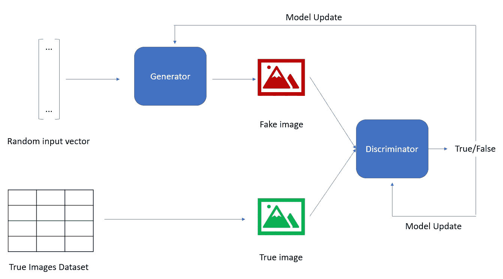

# 生成对抗网络

> 原文：<https://medium.com/analytics-vidhya/generative-adversarial-networks-ef957aee5f97?source=collection_archive---------14----------------------->

## 温和的介绍

生成对抗网络是一类用于深度学习的算法，属于生成模型的范畴。

“生成模型”是指那些主要目标是根据概率规则描述数据集如何生成的模型。通过这样做，每当我们从获得的样本中…