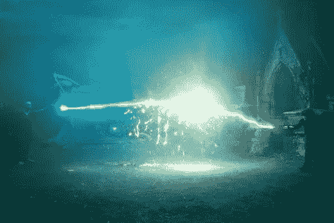
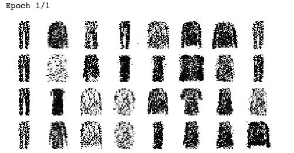
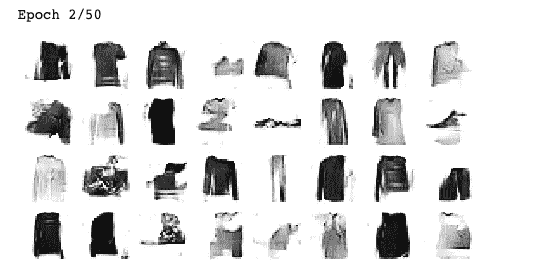
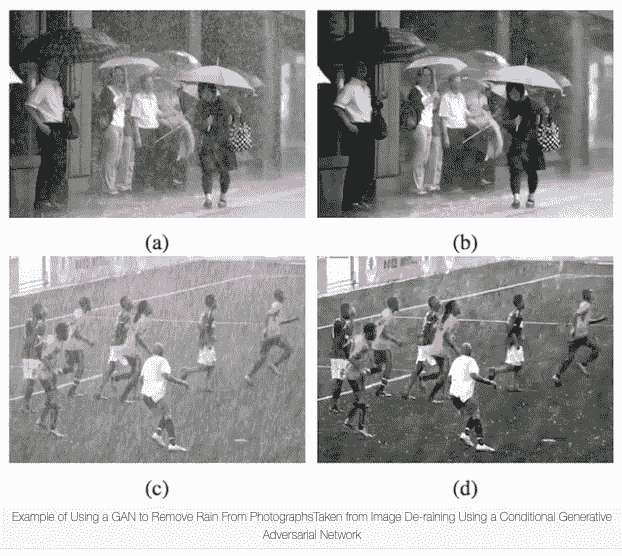
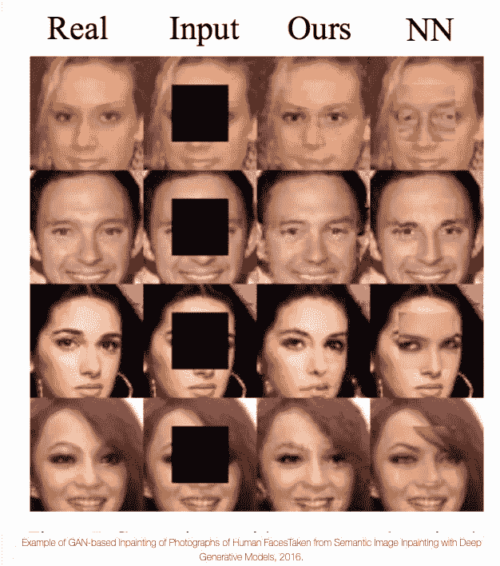
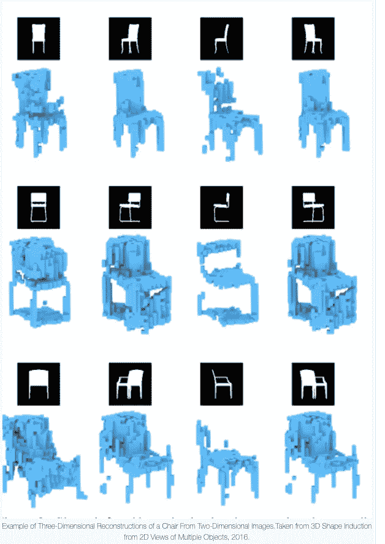

# 生成对抗网络

> 原文：<https://medium.com/analytics-vidhya/generative-adversarial-networks-ffed75143e9e?source=collection_archive---------13----------------------->



生成对抗网络(GAN's)最初是在 2014 年的一篇论文()中提出的。

这个想法主要围绕着一个简单的想法:神经网络相互竞争，希望这种竞争能推动它们超越他人。

最初这个想法让科学家很兴奋，但他花了几年时间来克服困难，我将在博客中讨论这些困难。

对于这个例子，我将使用时尚明斯克数据集，这是妥协的衣服图像。

## *发电机*

敌对网络的一半，接收随机分布(通常为高斯分布)并输出一些数据(通常为图像)。我们可以将输入视为要生成的图像的表示。通过这种方法，它提供了变型自动解码器中解码器的功能，并且可以以同样的方式用于生成新图像。只要给它输入噪音，它就会输出图像。

让我们导入我们的库并开始构建一个。

```
import keras
import tensorflow as tf
import matplotlib.pyplot as pltfrom keras import models
from keras import layersimport numpy as npcodings_size = 30generator =  tf.keras.models.Sequential([
    tf.keras.layers.Dense(100, activation='selu', input_shape = [codings_size]),
    tf.keras.layers.Dense(150, activation = 'selu'),
    tf.keras.layers.Dense(28 * 28, activation = 'sigmoid'),
    tf.keras.layers.Reshape([28, 28])
])
```

# **鉴别器**

鉴别器从生成器获取假图像，或者从训练集中获取真实图像，并尝试猜测输入是假还是真。这是一个简单的二元分类器。

```
discriminator = tf.keras.models.Sequential([
    tf.keras.layers.Flatten(input_shape=[28,28]),
    tf.keras.layers.Dense(150, activation = 'selu'),
    tf.keras.layers.Dense(100, activation = 'selu'),
    tf.keras.layers.Dense(1, activation = 'sigmoid')
])
```

将这些神经网络组合成一个 GAN:

```
gan = tf.keras.models.Sequential([generator, discriminator])
```

# 培养

在训练过程中，生成器和鉴别器的目标是相反的:鉴别器试图区分假图像和真图像，而生成器试图生成看起来足够真实的图像来欺骗鉴别器。

因为有两个网络，每个培训阶段分为两个部分:

在第一阶段，训练鉴别器。一批真实图像是来自训练集的样本，并且与来自生成器的相同数量的虚假图像一起被获取。假图像的标签为 0，真图像的标签为 1。

在第二阶段，发电机被训练。首先，它用于产生一批假图像，鉴别器用于辨别它们是假的还是真的(再次)。然而，这一次没有真实图像，所有标签都被设置为 1(真实)。这会导致发生器产生鉴别器认为真实的图像。

生成器实际上从未看到任何真实图像——它只是知道鉴别器认为什么是真实图像。鉴别器越能分辨真假图像，就有越多关于真实图像的信息反馈给生成器——这样就能取得重大进展。

由于这个训练循环是不寻常的，我们必须写一个函数来训练它。

```
def train_gan(gan, dataset, batch_size, codings_size, n_epochs=50):
    generator, discriminator = gan.layers
    for epoch in range(n_epochs):
        print("Epoch {}/{}".format(epoch + 1, n_epochs))              
        for X_batch in dataset:
            # phase 1 - training the discriminator
            noise = tf.random.normal(shape=[batch_size, codings_size])
            generated_images = generator(noise)
            X_fake_and_real = tf.concat([generated_images, X_batch], axis=0)
            y1 = tf.constant([[0.]] * batch_size + [[1.]] * batch_size)
            discriminator.trainable = True
            discriminator.train_on_batch(X_fake_and_real, y1)
            # phase 2 - training the generator
            noise = tf.random.normal(shape=[batch_size, codings_size])
            y2 = tf.constant([[1.]] * batch_size)
            discriminator.trainable = False
            gan.train_on_batch(noise, y2)
        plot_multiple_images(generated_images, 8)                     
        plt.show()
```

这里我们可以看到代码训练的两个阶段，在第二阶段，图像开始生成。当我们观想这些图像时，我们可以看到它们开始粗略地看起来像衣服！



其他有趣的例子包括作曲:[https://www.youtube.com/watch?v=UWxfnNXlVy8](https://www.youtube.com/watch?v=UWxfnNXlVy8)

# 问题

在训练期间，当网络试图智胜对方时，可以达到纳什均衡，其中生成器生成完美逼真的图像，而鉴别器的最佳策略是在真实图像和非真实图像上对半猜测。不幸的是，这不是保证。*模式崩溃*发生在生成器变得不那么多样化的时候——例如变得非常擅长生成令人信服的裤子图像。它可以用裤子欺骗鉴别器一段时间，所以只产生那些图像，直到鉴别器改进。一旦鉴别器足够好，它就继续产生鞋子的图像，而忘记了裤子。它在所有这些课程中循环，从来没有真正擅长过任何一门课程。

除此之外，由于网络不断地相互推挤，它们的参数可能会振荡并变得不稳定。这使得训练可以正常开始，但是也可能会莫名其妙地出现偏差。已经发表了许多纠正这种情况的尝试，包括新的成本函数或稳定方法来限制模式崩溃，例如*经验重放*和*小批量鉴别。这两种方法都试图降低过度拟合的可能性。*

# **发展**

该领域是一个移动的领域，最近的一个发展是深度卷积生成对抗网络。这些仅仅是几年前的技术水平，还没有被完全理解。

增加卷积层被证明会降低已经不稳定的网络的稳定性，但亚历克·拉德福德等人在 2015 年成功了 *(www.homl.info/dcgan)。*他们提出了以下指导方针:

—用鉴别器中的步进卷积和生成器中的转置卷积替换任何池层

—在生成器和鉴别器中使用批量归一化，但生成器输出层和鉴别器输入层除外

—移除完全连接的隐藏层以实现更深层次的体系结构

—在生成器中对所有图层使用 ReLU 激活，除了应使用 tanh 的输出图层

—在所有层的鉴别器中使用泄漏 ReLU 激活。

仅仅两个时期的训练，虽然在计算上更加密集，但产生了以下结果



这无疑是对我们最初模型的改进。一些很酷的例子包括去除照片上的雨水:



从损坏的照片中填充零件:



3D 对象生成，等等:



# 参考

Aurelien Geron (2019) *使用 Scikit-Learn、Keras 和 TensorFlow 进行动手机器学习:构建智能系统的概念、工具和技术*，2