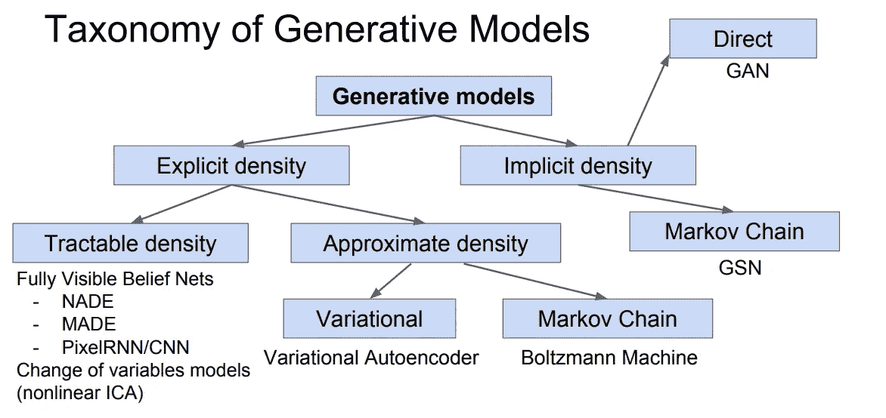
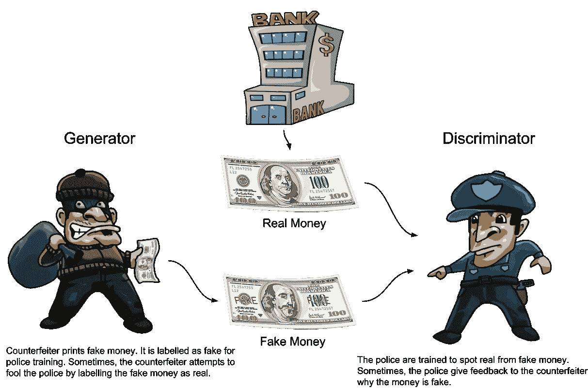
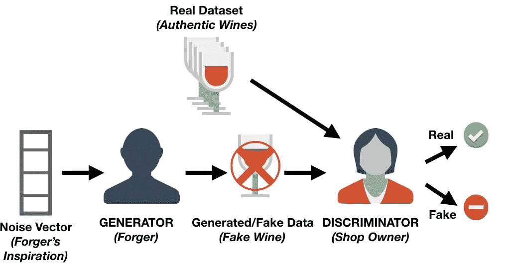
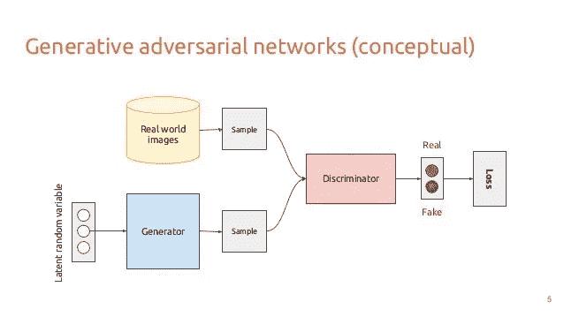
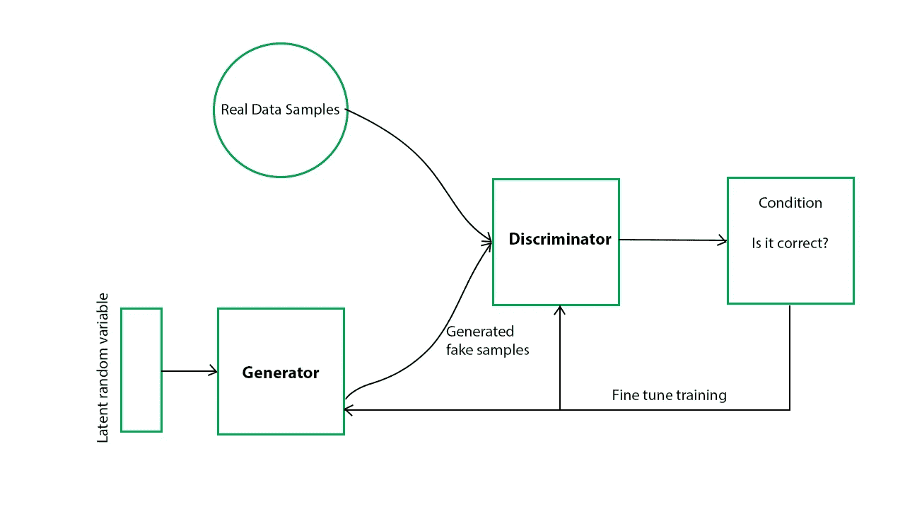
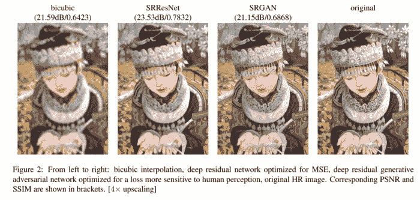

# 生成性对抗网络:哪种神经网络更胜一筹？

> 原文：<https://medium.com/analytics-vidhya/generative-adversarial-networks-the-fight-to-see-which-neural-network-comes-out-at-top-c771757f4a49?source=collection_archive---------8----------------------->

在一个充满技术和人工智能的世界里，区分什么是真的什么是假的变得越来越难。看下面这两张图。你能分辨出哪一张是真人照片，哪一张是人工智能创造的吗？

信用:[中等](/syncedreview/gan-2-0-nvidias-hyperrealistic-face-generator-e3439d33ebaf)

疯狂的是，**这两张图像实际上都是假的，**由 NVIDIA 新的超现实人脸生成器创建，该生成器使用了一种称为生成对抗网络(GANs)的算法架构。

深入研究 gan 及其在当今社会中的应用，我发现**它们可以在任何地方使用**，从文本到图像生成，甚至预测视频中的下一帧！这篇文章简要介绍了 GANs 的内部工作原理，以及它们在当今工作空间中的应用。我知道您可能和我一样很想了解更多这方面的知识，所以让我们开始吧！

# GANs 的基本架构

不同创成式模型的列表。信用:[subscription.packtpub.com](https://subscription.packtpub.com/book/big_data_and_business_intelligence/9781789538205/2/ch02lvl1sec14/discriminative-and-generative-models-compared)

g an 属于**生成模型**的更广泛类别，使用无监督学习方法从训练数据中识别新模式。这些模型**具有相应的输入变量，但缺少输出变量来执行经典预测模型。**这些生成模型的一些例子包括朴素贝叶斯网络、潜在狄利克雷算法和前述的 GANs。如果你想要一篇关于这些算法的文章，请告诉我(剧透:它们和 GANs 一样酷！).

与其他生成模型一样，GANs 能够生成新的示例，这些示例与提供的训练集相似，在某些情况下**无法区分。**那么这些 GANs 实际上是如何凭空形成这些新例子的呢？

正如你可能已经从标题中猜到的，GANs 使用两个神经网络，这两个神经网络相互竞争来创建或产生数据的变化。可以实现其他机器学习模型，但通常情况下，神经网络是最佳解决方案。这两个子模型通常被称为**发生器模型**和**鉴别器模型**。

# 生成器和鉴别器模型

类似于 GANs 的工作方式！信用: [DZone](https://dzone.com/articles/working-principles-of-generative-adversarial-netwo)

生成器和鉴别器模型有**个相反的目标**，它们的性能基于不同的度量集。

生成器模型只有一个目的:**从一组随机输入中产生虚假数据。**生成器模型旨在从随机噪声中生成最真实的假图像。其主要目的是最大化鉴别器模型的损失或分类误差。

另一方面，鉴别器模型通过二进制分类来决定提供给它的数据是来自真实样本还是来自生成器网络产生的虚假样本。**鉴别网络被训练以获取真实数据和生成的数据，并相应地对它们进行分类。**因此，在某种程度上，你可以断定鉴别器的主要目的是(你猜对了！)减少分类误差。

另一个类比来理解 GANs！信用:[数据营](https://www.datacamp.com/community/tutorials/generative-adversarial-networks)

概括地说，生成器模型旨在通过产生极其逼真的图像来最大化分类误差，使得鉴别器无法辨别哪个图像是假的，哪个图像是真的。另一方面，鉴别器模型旨在正确地分类图像是否是伪造的，试图最小化模型产生的分类误差。

现在，你可以看到生成器和鉴别器是如何相互竞争的。两者都在寻求超越对方:生成器生成鉴别器无法推断的最佳假图像，而鉴别器寻找生成器图像和鉴别器图像之间的差异。一个试图最小化分类误差，而另一个试图最大化分类误差。

# 该过程

GANs 的基本架构。信用:[中等](https://towardsdatascience.com/deepfakes-the-ugly-and-the-good-49115643d8dd)

现在你已经有了基本的东西，让我们来看看 GAN 为了产生这些超现实的图像所采取的工作流程。首先，产生随机噪声，并且输入用作伪图像的随机变量。GAN 工作流程的一次迭代中有两个主要的培训阶段**和**。

首先，在发电机模型冻结的情况下训练鉴别器。在这个阶段，用用户输入的真实数据和由上述发生器模型产生的随机噪声产生的虚假数据来训练鉴别器。鉴别器的主要目标是能够区分给它的这些图片是真是假。

接下来，在鉴别器冻结的情况下训练发生器。生成器接收来自鉴别器模型的结果，并使用它们来制作更真实的图像，以试图更好地欺骗鉴别器。生成器模型旨在从生成的随机噪声中采样新数据，以在结尾生成逼真的图像。

要知道的一件关键事情是，**图像仅仅是 N 维向量空间**上的概率分布；说某样东西看起来像图像，其实只是在传达某样东西有非常具体的概率分布。GAN 中的生成网络将来自随机分布的点作为输入，并将它们转换成点，以实现可以欺骗鉴别器模型的最终目标分布。

当鉴别器模型使用生成器的新的更新结果来对模型进行更好的分类时，循环继续。**这种来回的过程最终导致鉴别器无法从生成器中推断出无法区分的图像。**

解释这一过程的基本图表。鸣谢:[极客对极客](https://www.geeksforgeeks.org/generative-adversarial-network-gan/)

最后，记住鉴别器模型的准确性并不重要。我们的主要目标是在结尾最大化生成器模型的效率，因为我们想要生成与现实生活中难以区分的图像。

# 甘的挑战

GANs 当前的实施面临多重问题；然而，它们很快就被英伟达(NVIDIA)等大型科技公司新的更先进的 GANs 解决了。这些挑战经常使得除了 GANs 之外的其他生成模型被使用。以下是公司目前面临的两个主要挑战。

中心问题是发生器和鉴别器之间的稳定性。这很重要，因为这种稳定性会破坏 GAN 模型创建新图像的唯一目的。如果鉴别器模型过于强大，那么它会简单地将所有图像归类为假图像；然而，如果它太宽松，GAN 将永远不会改进，导致无用的网络。通常，找到这种水平的稳定性是困难的，因为很难预测发生器和鉴别器在训练和更新它们的梯度时会做什么，因为没有人为干预。

GANs 的另一个问题是**它们无法确定某些物体的位置，也无法理解图像的透视效果**。例如，它将生成一只有六只眼睛的狗，而不是两只眼睛，因为它不知道一个对象(如一只眼睛)需要在特定位置出现多少次。GANs 无法理解整体论或全球视角，这就是为什么其他生成模型更常用的原因。

# 氮化镓的应用

GANs 用于图像超分辨率的例子！信用:[中等](/analytics-vidhya/image-super-resolution-using-gans-a10254f58892)

尽管 gan 面临着大量的挑战，但它们在技术领域有着广泛的应用和未来的可能性。

GANs 可以在图像生成方面做任何事情，从自然语言描述到监控和安全，以确定在雨中可能失真的镜头。GANs 也有各种各样的利基用例，如能够将音频从一个扬声器转换到另一个扬声器，提高图像的分辨率，以及进行图像到图像的翻译。

在我看来，GANs 最重要的应用在于**它能够用有限的数据量创建数据来训练分类器。**数据生成通常是训练机器学习中任何类型模型的最困难的组成部分之一，GANs 可以通过凭空创建与训练数据密切相关的图像来解决这个问题。GANs 将有助于提高分类器的准确性，并为大型模型提供数据。在下面评论你认为最酷的 GANs 应用有哪些！

既然你知道 GANs 背后的主要架构，我建议你试着编码一个！一个很好的起点是通过 GANs 使用 MNIST 数据集生成图像。你可以找到完成它的步骤[这里](https://machinelearningmastery.com/how-to-develop-a-generative-adversarial-network-for-an-mnist-handwritten-digits-from-scratch-in-keras/)或者查看我的 Github 库，里面包含了下面的完整详细的实现。

 [## karthikm 15/半监督-用于黑色素瘤检测的 GANs

### Permalink GitHub 是 5000 多万开发人员的家园，他们一起工作来托管和审查代码、管理项目以及…

github.com](https://github.com/karthikm15/Semi-Supervised-GANs-For-Melanoma-Detection/blob/main/GANs_with_MNIST_%28No_Training_Output%29.ipynb) 

# TL；速度三角形定位法(dead reckoning)

*   GANs 采用无监督学习方法，将两个神经网络以相反的目的放置在一起(称为生成器和鉴别器模型)。
*   生成器模型的主要目的是通过制作非常逼真的“假”图像呈现给鉴别器来最大化由鉴别器模型产生的分类误差。
*   鉴别器模型的主要目的是最小化哪些图像是真实的和哪些图像是虚假的之间的分类误差。
*   生成器和鉴别器模型之间的梯度基于对立模型的性能不断更新。
*   GANs 经常面临两个挑战:平衡生成器和鉴别器模型之间的稳定性，以及确定某些对象的位置以开发图像的整体透视。
*   从创建图像到用有限的数据量训练图像分类器，到文本到图像检测，GANs 有大量的应用。

# 额外资源

*   论文:[对 GANs 及其工作流程的简要概述](https://drive.google.com/drive/folders/1lHtjHQ8K7aemRQAnYMylrrwZp6Bsqqrb)
*   视频:[GANS 是什么？|生成敌对网络解释](https://www.youtube.com/watch?v=5g1eXmQtl0E)
*   文章:[理解生成性敌对网络](https://towardsdatascience.com/understanding-generative-adversarial-networks-gans-cd6e4651a29)

*嗨！我今年 16 岁，目前对机器学习和生物技术领域感兴趣。如果你有兴趣看到更多我的内容和我发布的内容，可以考虑订阅我的* [*简讯*](https://forms.gle/gdCammxd628UTQ9j9) *！查看我的简讯* [*这里*](https://preview.mailerlite.com/z5l1d1) *！还有，看看我的*[*LinkedIn*](https://www.linkedin.com/in/karthikmittal/)*和*[*Github*](https://github.com/karthikm15)*页面。如果你有兴趣谈论自动驾驶汽车或只是一般的技术，请使用我的* [*日历*](https://calendly.com/karthikmittal306) *注册聊天。*