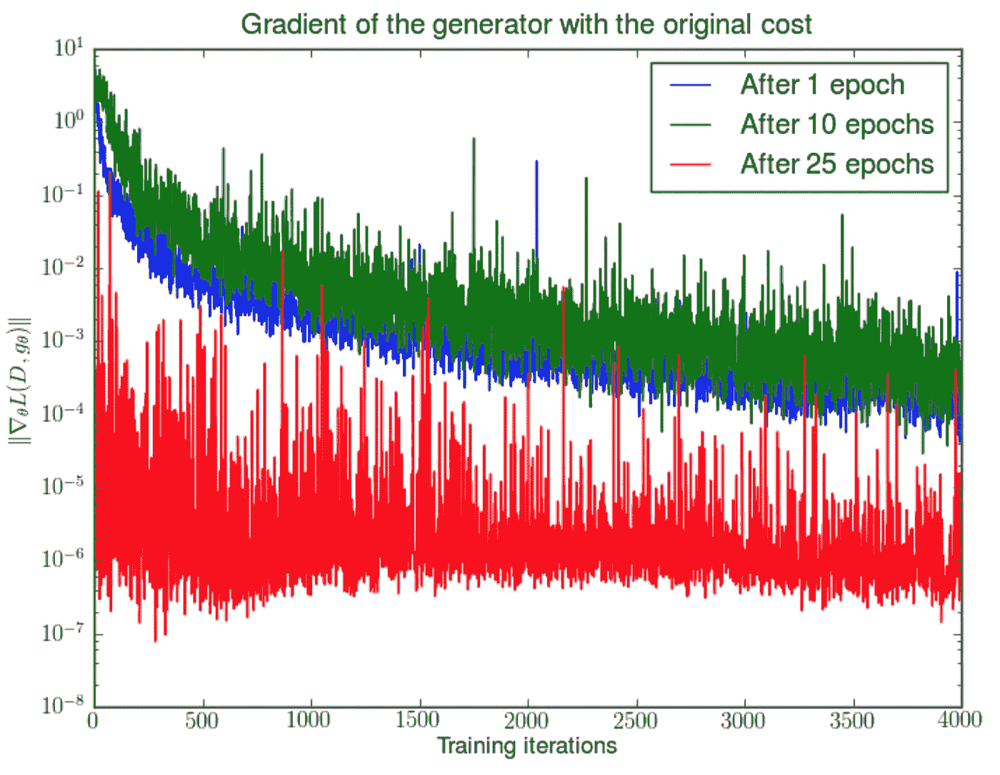
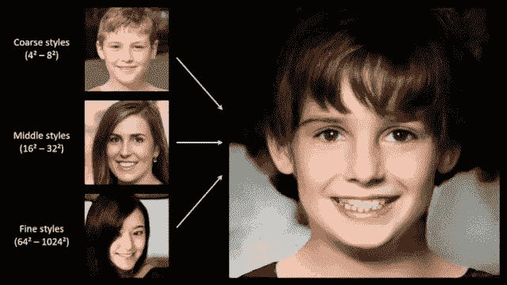

# 面向设计的生成建模

> 原文：<https://medium.com/analytics-vidhya/generative-modeling-for-design-112681f1e2c5?source=collection_archive---------12----------------------->

生成建模应用:生成建模确实令人难以置信，它是机器学习的子领域，对我来说最有趣，因为它有一定的神秘性。如果我们考虑机器学习可以做什么，有区别的模型非常酷。有很多有用的应用程序能够检测或分类的东西。但是，生成模型是一门黑暗的艺术。这些模型从整体上了解数据集的分布，然后我们的目标是使用它们来创建全新的数据点。这些数据点可以是图像、音乐、视频、文本，任何东西！这些生成模型通常也很难训练。众所周知，生成敌对网络具有如下所示的损失函数:

太疯狂了。很明显，很难“驯服”这些网络来学习我们需要它们做什么。对于 GAN 的具体情况，有大量的小技巧来确保成本函数以平滑的方式减少。我制作了很多关于 GANs 的视频，如果你对他们如何工作感兴趣，这里的[是一些有趣的博客帖子。但更重要的是，一旦我们决定了要生成什么，我们就必须找到相关的数据集。我们想要生成人脸吗？](/deep-math-machine-learning-ai/ch-14-general-adversarial-networks-gans-with-math-1318faf46b43)

也许是时尚风格？

也许甚至是整个大学？让我告诉你一个我还没有公开深入谈论过的想法。如果你考虑的话，有一天我可以自动完成我自己的工作！如果你可以输入一个你想学习的主题，然后让一个应用程序为你生成一个完整详细的课程来学习这个主题，会怎么样？首先，它将构建所有相关主题的知识图。然后，它将学习如何从知识图表中创建有序的顺序课程，根据每个主题的难度进行判断。关键字识别和语义搜索帮助在这里。一旦它学会了必要的表示，我们就可以用这些来播种一系列的生成模型。这些模型可以利用 it 知识生成文本、图像、测验，是的，甚至是教师视频。聊天机器人本身就是生成性文本模型，我们可以将它们作为额外的教学辅助工具，用于 24/7 和超个性化的学生。

那么，回到这门课的主题，我们如何用这项技术赚钱？生成模型在计算上是昂贵的，并且需要计算能力来执行它们必要的推理。因此，最好把它们放在网络服务器上。然后，无论您有移动应用程序还是 web 应用程序，您都将能够发送和检索模型中的数据。除非(！)我们使用的是针对移动优化的模型，比如在 iOS 上使用 CoreML，或者在 Android 上使用 Tensorflow Lite。你也可以直接使用来自 flutter 的。这个库有一些很好的例子，可以将流行的文本模型如 GPT-2 和 BERT 部署到 web 应用或移动应用中。简而言之，为应用程序构建生成模型的步骤如下

1.  决定您想要生成的内容
2.  查找相关数据集。看到这个 https://ai.google/tools/datasets/的[或者 https://toolbox.google.com/datasetsearch](https://ai.google/tools/datasets/)的
3.  在数据集上训练生成模型。通常甘就可以了，否则试试吧。OpenAI 有一个令人印象深刻的列表[这里](https://openai.com/blog/generative-models/)
4.  在像 Django 或 Flask 这样的 web 框架中使用训练好的权重文件来创建 API。
5.  构建一个完整的 web 应用程序，或者使用 Flutter 应用程序中的 API！我希望你开始拼凑如何思考这个问题！如果你只关注 gan 如何工作或者 VAEs 如何工作，你会在理论上迷失数周，而看不到更大的图景！最好先确定我们的高层次目标，开发一条道路，然后带着一个专注的、更大的目标投入到理论中去。