# 使用变分自动编码器(VAE)和贝塔-VAE 的生成模型

> 原文：<https://medium.com/analytics-vidhya/generative-modelling-using-variational-autoencoders-vae-and-beta-vaes-81a56ef0bc9f?source=collection_archive---------1----------------------->

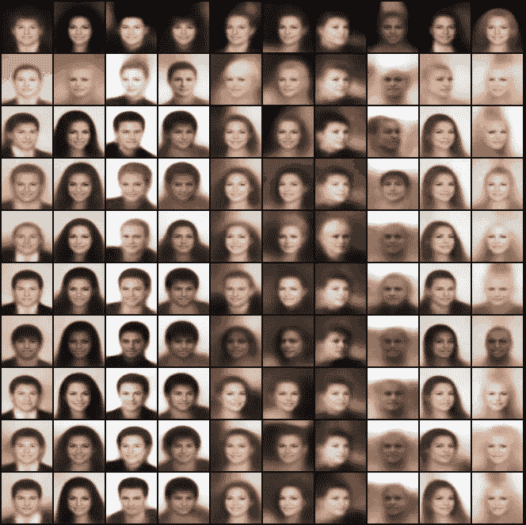

现代机器学习的一个主要部分是区分模型和生成模型。A **判别模型**指的是基于概率估计学习分类的模型类别，即 p(y/X ),其中 y 是类别标签，X 是数据点。其中作为一个**生成模型**通过学习输入和类别标签之间的联合概率 p(X，y)显式地对每个类别的分布建模，然后使用贝叶斯规则对 p(y/X)进行分类。有太多的理由可以解释为什么一个人会觉得一个生殖过程非常迷人。其中一个原因是，通过使用生成模型，我们可以理解数据变化和输出观察值之间的因果关系，并在此基础上形成一个可解释的假设。使用生成模型的另一个重要特征是能够在构成各种数据生成因素的数据中找到解开的因素。两个最常用的数据生成模型是(生成广告串行网络)甘模型和(变分自动编码器)VAE 模型。这篇文章主要集中在使用 VAE 的生成模型。我们将学习什么是自动编码器，并展示自动编码器模型如何用于重建输入数据。然后，我们将介绍 AE 和 VAE 的相似之处和不同之处，以及 VAE 是如何用于生成模型的。然后我们讨论β-VAE——VAE 的一种变体，它有助于学习解开的表象。

如果你想了解更多关于生成性模型和区别性模型的知识，请参考安德鲁·吴教授在[发表的论文](http://ai.stanford.edu/~ang/papers/nips01-discriminativegenerative.pdf)

如果你不熟悉联合概率和条件概率，请参考这个[博客](/@mlengineer/joint-probability-vs-conditional-probability-fa2d47d95c4a)

声明:为了便于解释和理解，我们假设所有模型的输入数据都是图像数据。然而，同样的理论也适用于其他类型的数据，如音频、文本等。

# 自动编码器:了解 VAE 的自动编码器是什么和如何工作的；

在这一节，我们将简要介绍自动编码器及其架构，非常熟悉自动编码器概念的人可以跳过这一节。

在我们开始理解 VAE 的之前，有必要理解什么是自动编码器。AutoEncoder 是一个无监督的基于编码器-解码器的神经网络框架。典型的自动编码器将数据(图像/文本)作为输入，并使用一系列卷积和上卷积将其再现为输出。自动编码器的典型架构如下图所示。

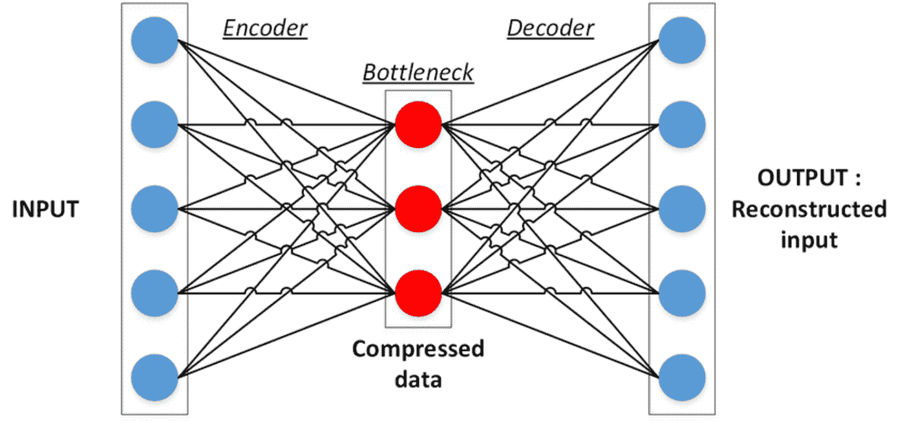

图一。传统的自动编码器由 3 层组成。编码器层、瓶颈层和解码器层。请注意，瓶颈层的大小小于原始输入的大小。

经典的自动编码器是简单的前馈神经网络，由三部分组成:编码器、瓶颈和解码器层。编码器是标准的人工神经网络，其将图像作为输入，并输出特征向量，在自动编码器的情况下，该特征向量被称为瓶颈层或潜在表示。这里，使用术语潜在的，因为这个向量现在包含了重建原始图像(X)所需的所有有意义的信息。解码器的工作是接收这个潜在向量并重建原始图像(x `)。然后基于 x′和 x 之间的重建损失训练网络

数学上，设 g(。)表示由ϕ和 f(参数化的编码器函数。)表示由θ参数化的解码器函数。然后，潜在向量 z 被表示为 g_ϕ(X).解码器获取输入 z 和输出的重构输入 x`。x’可以表示为 f_θ(g_ϕ(X)).然后给出网络损耗 *L* (θ，ϕ，x，x `)，在 MSE(均方误差)的情况下如下。

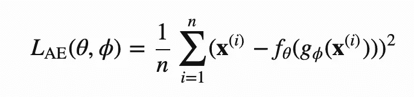

> 注意:如果瓶颈层的大小与原始输入相同，则编码器简单地将所有原始输入复制到潜在向量中，瓶颈层大小的约束迫使编码器学习原始数据的有用低维表示。

瓶颈层中的向量现在充当 x 的压缩表示。自动编码器是降维的强大工具，它通过利用神经网络的非线性表示学习能力来实现这一点。虽然 PCA 试图找到捕捉数据中最高变化的低维超平面，但 autoencoder 通过学习数据中的非线性流形来实现它。下图显示了与自动编码器相比，PCA 学习的低维流形的差异。

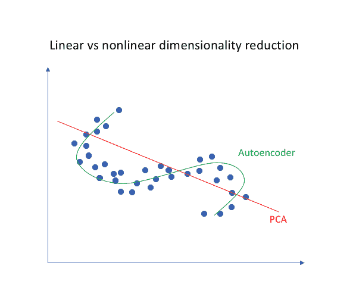

图二。PCA 与 Autoencoder 实现的降维。当 PCA 找到最佳线性超平面来投影数据时，自动编码器学习数据的低维非线性流形表示。来源:https://www.jeremyjordan.me/autoencoders/

自动编码器的一些有趣变化

1.  去噪自动编码器
2.  稀疏自动编码器

讨论这些网络超出了本文的范围。

尽管有有趣的框架，自动编码器的应用有限，因为潜在表示的范围仅限于已经可用的数据。如果训练数据不能代表您的测试数据，那么我们最终会模糊信息而不是澄清信息。AutoEncoder 只学习有效地表示训练数据所在的流形，而不能用于生成它没有见过的新数据。

# **变型自动编码器**

VAE 的变分自动编码器的简写是一类深度生成网络，它具有类似于经典自动编码器的编码器(推理)和解码器(生成)部分。不同于旨在学习固定函数 g(.)通过将输入数据 X 映射到潜在表示(z)，VAE 学习输入数据的概率分布函数 Q(z/X)。

变分自动编码器强烈假设原始输入 X 和潜在向量 z 都具有各向同性高斯分布。各向同性高斯分布是协方差矩阵σ=σ* I(其中 I 是单位矩阵)的分布，即每个维度都可以被视为独立的一维高斯分布(不存在协方差)。对于任何给定的输入 x，当自动编码器的标准编码器给出维数为‘n’的 z 的潜在向量时，VAE 输出维数为 n 的两个向量均值(𝝁)和方差(𝞂),它们形成维数为‘n’的𝝁和𝞂。新的潜在向量 z 是通过对来自分布 N(𝝁ᵢ，𝞂ᵢ的每个 zᵢ进行采样而形成的，其中 i=1 到 n。下面的图 3 示出了 VAE 架构的概况。

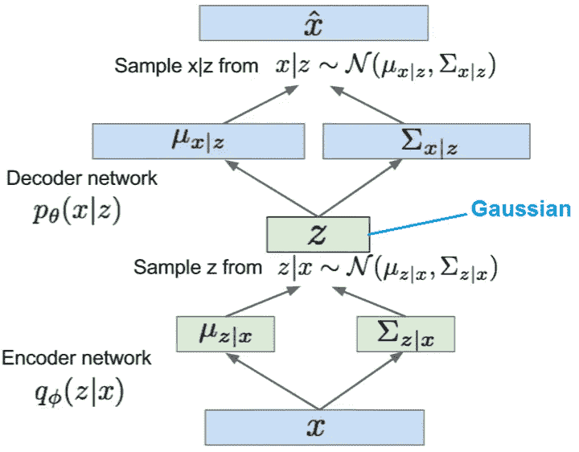

图 3 : VAE 建筑。编码器网络近似于 pdf q(z/X)。假设 z 遵循高斯分布，编码器的输出将是 2 个向量，均值向量由所有均值组成，方差向量由我们正在逼近的‘n’个高斯分布的所有标准偏差组成。每个 z 单位的取样在𝞂ᵢn(𝝁ᵢ进行)。解码器从 z 重构 x，因为我们假设输入 x 遵循各向同性高斯分布。解码器试图通过找出 x 的每个维度的平均值和标准偏差并对 Xᵢ进行采样来逼近概率分布 p(X/z)

**重新参数化技巧:**z 的这种类型的采样是随机的，使得 z 成为神经网络中的随机节点，因此我们不能通过该节点反向传播。为了克服这一点，VAE 使用了一个聪明的技巧，不是从𝞂ᵢn(𝝁ᵢ随机采样 zᵢ，而是通过引入误差项ϵ，其中我们从 z 的每个维度的 N(0，1)中随机采样，以将 zᵢ构造为𝝁ᵢ + 𝜖*𝞂ᵢ (*这里是指元素方面的点积)。现在，误差项ϵ是随机的，z 是确定的，因此我们可以通过 z 反向传播。采样过程和重新参数化技巧如图(3)所示。采样过程如图(3)所示。通过从 q(z|X)采样 z，意味着如果我们两次尝试相同的输入 x，我们应该得到 z 的两个不同的值。这是通过引入随机层𝜖.来实现的

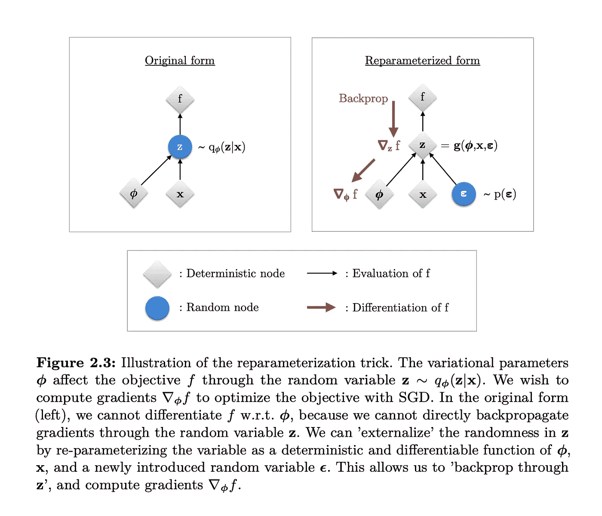

图 4:来源:【https://arxiv.org/pdf/1906.02691.pdf】

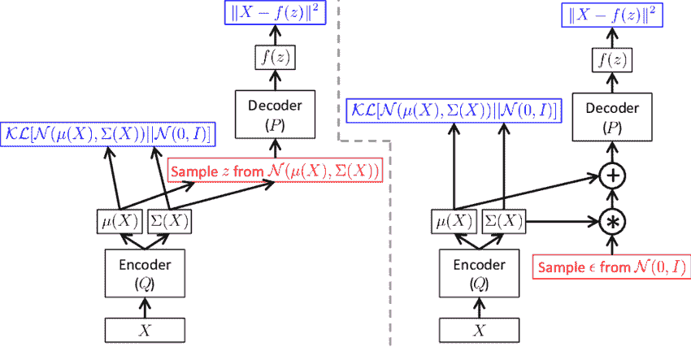

图 5: **没有/有重新参数化的 VAE 架构**:左侧显示了从生成的平均值和 sigma 中采样数据点，这是一个随机过程。图像的右侧显示了重新参数化的采样，其中我们从标准法线采样 e。

对于生成的每个潜在向量 z，我们自问这个潜在向量在重构原始数据 X 方面有多好，即使用解码器用 p(X/z)表示 X 的可能性。先验 p(z)被选择为标准的多元高斯 N(0，1)。后验概率是编码器对给定输入的近似值，用 q(z/X)表示。

*   条件概率 p_θ(X|z)定义了一个生成模型，类似于上面在自动编码器部分介绍的解码器 f_θ(X|z)。p_θ(X|z)也称为概率解码器。
*   近似函数 q_ϕ(z|X)是概率编码器，起着与 g_ϕ(z|x).相似的作用

> 为了便于表示，我们将省略像 q_ϕ(.这样的参数化函数表示的使用)和 p_θ(。)而只使用 q(。)和 p(。).

VAE 的目的是在这样一个生成过程中学习数据的边际可能性:

—等式(1)

# 损失函数

我们希望后验概率 q(z|X)尽可能接近我们的先验概率 p(z ),以便解码图像虽然不同，但仍接近实际图像。我们将使用 KL 散度来度量先验分布 p(z)和近似分布 q(z/X)之间的信息损失。2 分布 p(原始)和 q(近似)的 KL-散度被写成加权函数 p(z)上的“惩罚”函数 log(p(z)/q(z))的期望。

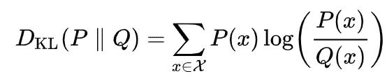

从 Q 到 P 的 kull back-lei bler 散度，其中 P 和 Q 是定义在同一概率空间中的概率分布函数

KL 散度不是对称距离函数，即 KL(P | | Q)≠KL(Q | | P)(Q≡P 时除外)前者称为“正向 KL”，后者称为“反向 KL”。

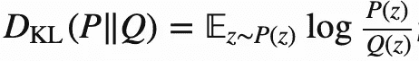

等式(2):2 个分布 P 和 Q 之间的前向 KL 散度

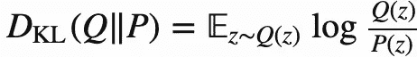

等式(3)2 个分布 P 和 Q 之间的反向 KL 散度

在前向 k1 的情况下，让我们考虑 p(z) > 0 和 q(z) -> 0，那么 lim(q(z)->0) log p(z)/q(z) =无穷大。每当估计的分布不覆盖原始分布时，前向 KL 就很大。图(3)示出了如何使用前向 KL 优化获得结果 Q(z)。当 Q(z)在 P(z)上被“拉伸”时，KL 很小，结果我们得到很多假阳性。

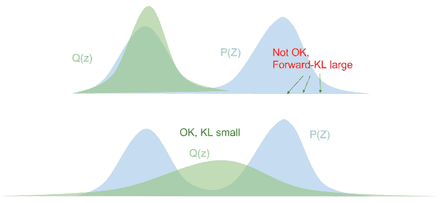

在逆向 KL 的情况下，如果 p(z)=0，我们必须保证在分母 p(z)=0 的地方加权函数 q(z)=0，否则 KL 吹爆。图(4)示出了如何使用前向 KL 优化获得结果 Q(z)。当 Q(z)在 P(z)上被“挤压”时，KL 很小。

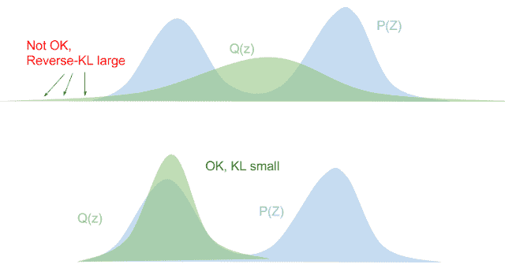

我强烈建议参考下面的博客([https://blog.evjang.com/2016/08/variational-bayes.html](https://blog.evjang.com/2016/08/variational-bayes.html))来更具体地了解正向和反向 KL。

有了上面的知识，我们现在将进一步使用反向 KL 散度来推导要最小化的目标函数

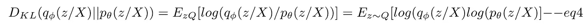

使用贝叶斯规则 p(z/X) = p(z，X)/p(X)其中 p(z，X)是 z 和 X 之间的连接概率，给出为 p(z，X) = p(X/z)*p(z)

将 p(z，X)代入我们得到的方程 4，

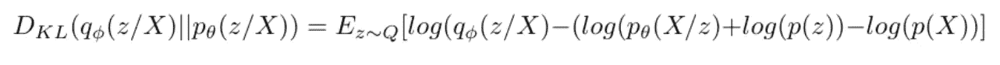

因为 p(X)与 z 无关，并且可以导出

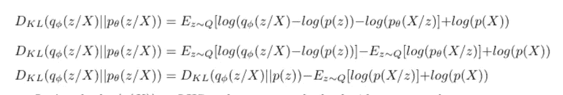

现在，让我们把 log(p(X))带到 LHS，对两边求反，我们现在有:

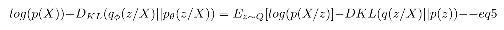

上述方程是变分自动编码器的核心。等式的左手边正是我们想要最大化的项 P(X)(参考等式 1)，生成新数据点的概率应该最大化，同时我们想要最小化潜在向量的先验 p(z)和后验 q(z/X)概率之间的差异。DKL 项作为正则项。

由于我们的目标是最大化 LHS，我们将使用梯度下降来最小化 LHS 的负值，即:

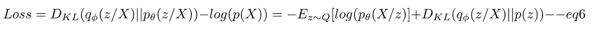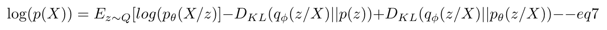

任何两个分布之间的 KL 散度总是正的，因此

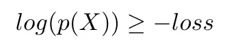

因此，-loss 或-ez∞q[log(pθ(x/z)]+dkl(qɸ(z/x)||p(z](来自等式 7)是产生数据的下限。这在变分贝叶斯方法中被称为 ***变分下界或证据下界(ELBO)。*** 因此，通过最小化损失，我们最大化了生成新样本的概率的下限。

关于 VAE 的要点:

1.  VAE 属于概率生成模型的范畴
2.  先验 p(z)和后验 qɸ(z/X)被假设为具有对角协方差矩阵的各向同性高斯分布。先验通常被设置为 N(0，1)
3.  类似于普通的自动编码器，VAE 也有一个编码器，它产生 2 个潜在向量 mean 和 sigma，每个 dim n 对应于 z 的 n 个各向同性高斯单元的平均值和方差
4.  从每个独立的高斯 n(𝝁(xσ(x))中进行采样。采样过程是随机的，因此反向传播是不可能的。重新参数化技巧用于促进反向传播。
5.  KL-散度用于测量近似的 qɸ(z/X 和先前的 p(z)之间的信息损失。
6.  在等式 5 中，我们已经表明 VAE 的目标是生成尽可能接近真实的样本，即最大化 **log(p(X))**
7.  在等式 7 中，网络的损耗被导出为**D _ KL(q(z/X)| | p(z/X))—log(p(X))**
8.  在等式 8 中，我们已经建立了负损失如何作为生成样本的下限，也称为 **ELBO** ，因此通过最小化损失，我们最大化了生成新样本的概率的下限。

# β-变分自动编码器；

𝛃-VAE 是一种深度无监督的生成方法，是用于解开因子学习的变分自动编码器的变体，可以发现无监督数据中独立的潜在变异因子。一个不纠缠的表示可以定义为 z 的单个潜在单元对 X 的单个生成因子的变化敏感，而对其他因子的变化相对不变。一个不纠缠的模型学习对单个独立的数据生成因素敏感的独立的潜在单元。因此，一个不纠缠的表示是因式分解的，并且通常是可解释的，由此不同的独立潜在单元学习编码数据中变化的不同独立基本事实生成因素。

β-VAE 和 VAE 的区别是在原始 VAE 公式中 KL 散度项上使用了拉格朗日乘数β。β-VAE 的目标函数是

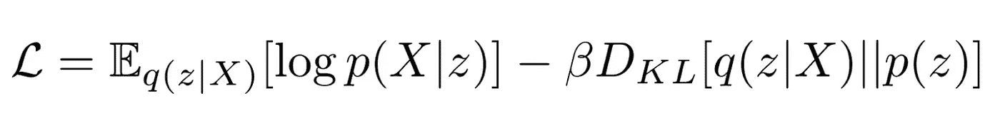

β-VAE 试图通过使用超参数β > 1 来优化先验分布和近似分布之间的严重惩罚 KL 散度，来学习条件独立数据生成因子的解纠缠表示。这种约束限制了 z 的能力，结合最大化训练数据 X 的对数似然性的压力，促使模型学习数据的最有效表示。我们假设数据 x 具有一些条件独立的生成基础真值因子，并且β-VAE 目标函数的 KL 散度项鼓励 qφ(z|x)中的条件独立。因此，较高的β值应该鼓励学习一种不纠缠的表示。然而，来自高β值的额外压力可能会在重建保真度和学习的潜在表征内的解缠结质量之间产生折衷。当在信息保存之间找到适当的平衡时，就出现了清晰的表示

# 参考资料:

 [## 从自动编码器到贝塔 VAE

### 自动编码器是一组神经网络模型，旨在学习高维数据的压缩潜变量…

lilianweng.github.io](https://lilianweng.github.io/lil-log/2018/08/12/from-autoencoder-to-beta-vae.html)  [## 了解变分自动编码器(VAEs)

### 逐步建立导致 VAEs 的推理。

towardsdatascience.com](https://towardsdatascience.com/understanding-variational-autoencoders-vaes-f70510919f73) 

[https://openreview.net/pdf?id=Sy2fzU9gl](https://openreview.net/pdf?id=Sy2fzU9gl)

[了解贝塔 VAE 中的纠缠](https://arxiv.org/pdf/1804.03599.pdf)

[变型自动编码器教程](https://arxiv.org/pdf/1606.05908.pdf)

[变型自动编码器简介](https://arxiv.org/pdf/1906.02691.pdf)