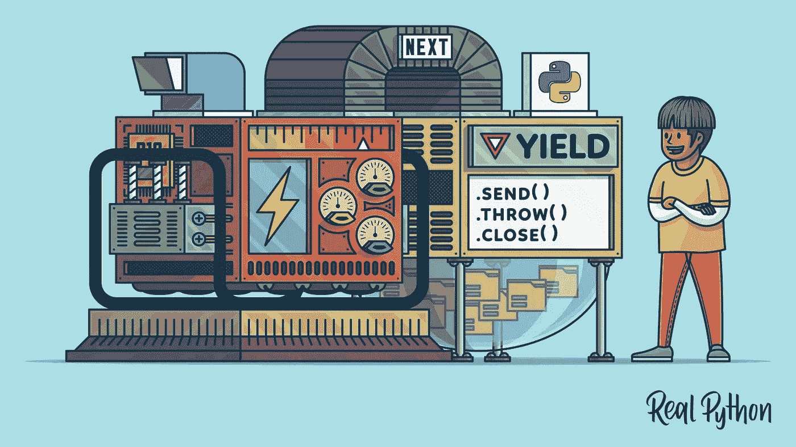
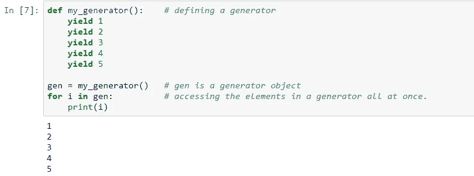
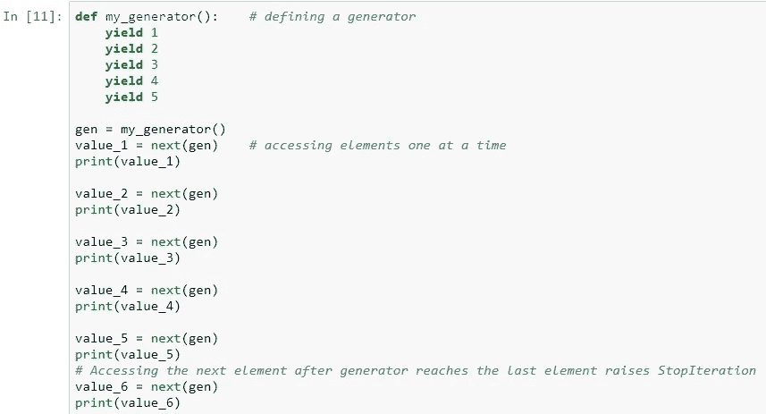
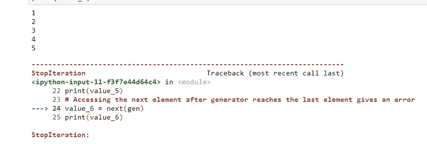
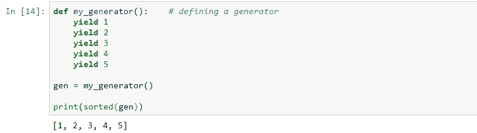
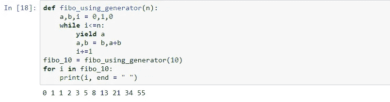
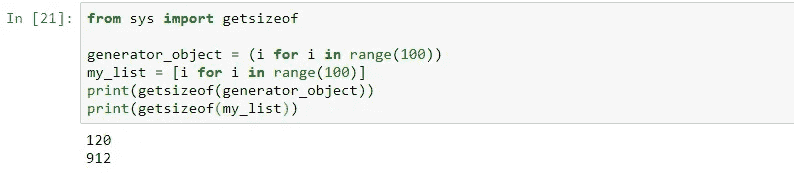
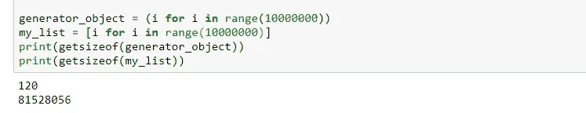
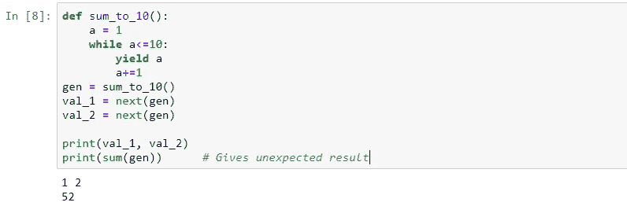

# Python 中的生成器

> 原文：<https://medium.com/analytics-vidhya/generators-in-python-5ed2d5803af?source=collection_archive---------19----------------------->

Python 通常被认为是“懒惰”的编程语言，因为它有大量程序员友好的、开箱即用的函数。几个*导入*命令，我们就准备好了，用我们能找到的最简单的语法武装起来。

这就是为什么开始使用 Python 编程的程序员很难切换到任何其他编译语言的原因，也是为什么人们普遍认为:

> 一次是 Python 程序员，永远是 Python 程序员

因此，遵循既定的传统，我们打算展示另一种“懒惰”但有用的高级 Python 技术。

# **迭代器 vs 生成器**

迭代器可以定义为一个具有有限数量的值的对象，可以使用循环对其进行迭代。Python 中内置的迭代器有 list、tuple、set 和 dict。

简单地说，生成器是一个返回可以迭代的对象的函数，但它并不完全是迭代器。它们以一种特殊的方式在对象中生成一个项，并且只在被请求时才这样做。**他们一次生成一个项目。**

生成器一次只处理一项，这使得它们的内存效率比迭代器高得多，迭代器将整组值存储在内存中，尤其是当涉及大量数据时。

我们甚至可以在所有元素生成之前就开始使用生成器。

它们很容易实现，但是有点棘手，很难掌握。

# **实现**

生成器的定义就像一个普通的函数，但有一点不同。它涉及到使用***yield****关键字代替 ***return。虽然它们的工作方式几乎完全相同，但如果互换使用，那就大错特错了。****

****yield*** 语句暂停函数的执行，并向调用者返回值，记住函数的最后状态，这与 ***return*** 不同，后者在被调用时会将函数从调用堆栈中移除，从而使其不再存在，直到再次被调用。*

*让我们让发电机和大脑发挥作用。*

**

*可以使用 for 循环一次访问所有元素，或者使用 next()方法一次访问一个元素。请注意，如果生成器对象在最后一个元素处遇到 next()调用，它将抛出一个 *StopIteration* 。*

****

*sum()和 sorted()等内置方法可以很好地处理生成器对象。*

**

*使用生成器创建斐波那契数列，*

**

*我们也有一个创建生成器对象的简写方法，它几乎类似于 list comprehension，唯一的区别是使用了圆括号而不是方括号。*

> *my_generator = (i for i in range(100))*
> 
> *my_list = [i for i in range(100)]*

*对什么是发电机以及如何使用发电机有了一个概念后，我们继续讨论它的优点。*

# ***为什么是发电机？***

*与简单的迭代器相比，比如说一个列表，生成器大大减少了内存占用，提高了可伸缩性，并使我们的程序对最终用户的响应更快。*

*此外，如上所述，我们不需要等待生成器生成所有项目，就可以开始使用它。*

*让我们看看生成器对象为我们节省内存的规模，*

**

*对于相对较小的生成器和列表对象，我们看到使用的内存量有很大的不同，生成器对象消耗的内存要少得多。当使用生成器而不是列表时，节省的内存量增加了许多倍，并且项目的数量非常大。*

**

# ***到目前为止我们学到了什么…***

*   *生成器是可以迭代的对象。它们一次生成一个元素。*
*   *我们只能对一个生成器对象迭代一次，它会记住它的位置并从那个位置开始。这有时会导致意想不到的错误，所以我们在使用它们时必须小心。*

**

*生成了两个元素，因此 sum()方法从生成器的当前位置(3)计算总和，给出了一个意外的结果。*

*   *生成器的内存效率很高，无论要生成多少项，都消耗相同的内存。*
*   *发电机是用与**关联的*语句产生*而不是 ***返回。*** 虽然功能相似，但一定不能互换使用。***
*   *尤其在处理大量项目时，应首选发电机。*