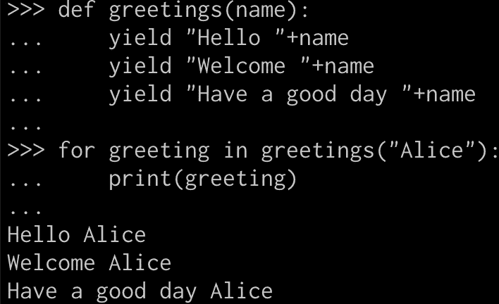

# Python 中的生成器—简化

> 原文：<https://medium.com/analytics-vidhya/generators-in-python-simplified-d75085de8ff5?source=collection_archive---------11----------------------->

由 [Unsplash](https://unsplash.com/s/photos/generator?utm_source=unsplash&utm_medium=referral&utm_content=creditCopyText) 上的[卡斯滕·沃思](https://unsplash.com/@karsten_wuerth?utm_source=unsplash&utm_medium=referral&utm_content=creditCopyText)拍摄的照片

当我开始学习 Python 时，我发现生成器的概念有点难以理解。因此，这里是我对以简单的方式解释生成器的看法，以便任何人开始使用。

在普通函数中，“return”语句不仅返回函数的输出，还完成函数的执行。

正常功能

## **发电机功能有何不同？**

生成器函数使用' **yield** 语句给出输出，而不是 return 语句。

与“return”语句不同，“yield”语句不需要在调用后完成函数的执行。相反，可以多次调用它来从函数中生成连续的输出。

## **如何创建生成器？**

调用生成器函数会返回一个“生成器”对象。生成器是一个迭代器，所以它支持“for”循环和“next”方法来获得其输出。

**使用“for”语句从生成器获取输出:**

在生成器中使用 for 循环

**使用“下一个”方法从生成器获取输出:**

在生成器中使用 next 方法

如果每次调用生成器时需要更改任何输入，可以使用' send '方法来传递它们。“yield”语句返回通过“send”方法传递的输入。

**使用“发送”方法将输入传递给生成器:**

使用 send 方法将输入传递给生成器

# 使用发电机的优点:

由于 generator 是一个迭代器，所以它执行惰性计算。由于值的生成仅在需要时发生，这导致了较低的内存利用率。性能也有所提高，因为不必等到所有的值都生成了。这可以用下面这个寻找‘n’个偶数的例子来解释。

## 使用正常功能时:

当调用 normal 函数时，会计算整个列表并将其加载到内存中，从而导致高内存利用率。此外，我们必须等到整个列表被评估后才能影响性能。

使用正常函数查找偶数

## 使用生成器功能时:

当调用生成器函数时，只返回生成器对象，不进行任何计算。仅当在迭代中选取一个值时，才生成该值(即，在第一次迭代中，仅生成第一个值)；在第二次迭代中，只会生成第二个值，依此类推。因此，这会提高性能并降低内存利用率。

使用生成器查找偶数

总而言之，我们已经了解了如何在 Python 中使用生成器及其优势。

感谢阅读！

***参考文献*** *:*

1.  [https://wiki.python.org/moin/Generators](https://wiki.python.org/moin/Generators)