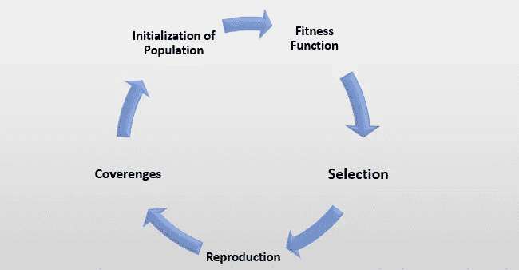
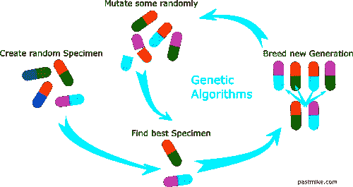

# 遗传算法

> 原文：<https://medium.com/analytics-vidhya/genetic-algorithm-494ac5be18bb?source=collection_archive---------21----------------------->

用一个有趣的例子来理解遗传算法的简单方法。

在理解遗传算法之前，让我们先理解“什么是优化技术？”

**优化技术**:

优化技术是用于在现有约束条件下从所有可能的解决方案中发现最佳解决方案的技术。

现在明白了**【遗传算法】**:

*遗传算法*就是这样一种优化算法，它是建立在自然界的自然进化过程的基础上的。

*   它们通常用于为优化问题和搜索问题生成高质量的解决方案。
*   遗传算法模拟自然选择的过程，这意味着那些能够适应环境变化的物种能够生存和繁殖，并延续到下一代。
*   遗传算法基于群体染色体的遗传结构和行为。

# 遗传算法的基础:

*   每条染色体代表一种可能的解决方案。因此，群体是染色体的集合。
*   群体中的每个个体由适应度函数来表征。更好的健身是解决办法。
*   在种群中可用的个体中，最好的个体被用来繁殖下一代子代。
*   产生的后代将具有双亲的特征，是突变的结果。突变是基因结构的微小变化。

# 遗传算法的生命周期；

**遗传算法的生命周期**

1.  **群体初始化:**

每个基因代表解中的一个参数(变量)。形成解的参数集合就是染色体。群体是染色体的集合。染色体上基因的顺序很重要。

2.**健身功能:**

在可用的染色体中，我们必须选择最好的染色体来繁殖后代，因此每个染色体都被赋予一个适应值。健康分数有助于选择将用于繁殖的个体。

3.**选择:**

此阶段的主要目标是找到获得最佳解决方案的机会更多的区域。

4.**复制:**

非弹簧的产生有两种方式:

*   交叉:在使一对亲本交配以产生后代时，随机选择一个点。
*   变异:它恰好照顾到群体中的多样性，并阻止过早收敛。

5.**收敛(何时停止):**

*   当解决方案没有改进时。
*   当达到一个严格的世代和时间范围时。
*   直到获得可接受的解决方案。

**所以，遗传算法的工作原理是这样的:**

1.  该算法从创建随机初始群体开始。

2.然后，该算法创建一个新群体序列。在每一步，该算法使用当前代中的个体来创建下一个群体。为了创建新群体，该算法执行以下步骤:

*   通过计算当前群体中每个成员的适应度值对其进行评分。这些值被称为原始健康分数。
*   缩放原始健身分数，将其转换为更有用的值范围。这些比例值被称为期望值。
*   根据成员的期望选择成员，称为家长。
*   当前群体中一些适应性较低的个体被选为精英。这些精英个体被传递给下一个群体。
*   从父母那里产生孩子。要么通过对单个父母进行随机改变——T2 突变——要么通过组合一对父母的向量条目——T4 交叉来产生孩子。
*   用子代替换当前人口以形成下一代。

3.当满足一个停止标准时，算法停止。

# 为了具体化我们的理解，让我们用更现实的方式来理解它:

打开下面的链接，花 30 秒钟观看:

[http://boxcar2d.com/](http://boxcar2d.com/)

在这个应用程序中，我们需要
来构建一个简单的汽车模型来穿越这个地形。

在某个地方装上一些轮子，加上一组三角形作为底盘，你开得越远，车就越好，目标是尽可能设计出最好的车。

首先，该算法将尝试一些随机的解决方案，并且，由于它对汽车或重力的概念没有任何概念，它将创建许多根本不起作用的糟糕解决方案。然而，在某一点之后，它将创造出一种至少与汽车有一点相似的东西
，这种东西将立即比群体中的其他解决方案表现得好得多。然后，遗传算法会创建一组新的解决方案，不过，现在不是随机的。

它尊重一个我们称之为适者生存的规则。这意味着最好的现有解决方案被采用并混合在一起，以产生新的解决方案，这些新的解决方案也有望做得很好。就像自然界的进化一样，突变
也可能发生，这意味着随机变化被应用于解决方案的 DNA 代码。我们从自然中知道进化非常有效，我们运行这个遗传优化程序越多，解决方案就越好。

# 遗传算法的应用:

1.  **旅行和装运路线选择**——旅行商问题是遗传算法的主要应用之一。例如，当旅行计划者被要求计划一次旅行时，他将借助遗传算法，该算法不仅有助于减少旅行的总成本，而且有助于减少时间。通用电气还用于以最有效的方式规划产品从一个地方到另一个地方的交付。

2.**神经网络**—GAs 也用于训练神经网络，尤其是循环神经网络。

3.**图像处理**—GAs 用于各种数字图像处理(DIP)任务以及密集像素匹配。

4.**机器人轨迹生成**—GAs 已被用于规划机器人手臂从一点移动到另一点的路径。

5.**车辆路线问题**——具有多个软时间窗、多个仓库和异构车队。

# 局限性:

1.  遗传算法不能很好地适应复杂性。

2.“更好”的解决方案只是与其他解决方案相比。因此，停止标准在每个问题中都不明确。

3.对动态数据集进行操作是困难的，因为基因组在早期就开始向可能对后来的数据不再有效的解决方案收敛。

4.遗传算法不能有效地解决只有一个正确/错误度量的问题(如决策问题)，因为没有办法收敛到解。

5.遗传算法倾向于收敛于问题的局部最优解，而不是全局最优解。这意味着它不“知道如何”牺牲短期健康来获得长期健康。

# 结论:

遗传算法

优化技术是用于在现有约束条件下从所有可能的解决方案中发现最佳解决方案的技术。因此，遗传算法就是这样一种优化算法，它是建立在自然界的自然进化过程的基础上的。这里用到了自然选择和基因遗传的思想。与其他算法不同，它使用引导随机搜索，即通过从随机初始成本函数开始，然后仅在具有最小成本的空间中搜索(在引导方向上)来找到最优解。适用于处理庞大而复杂的数据集。

# 参考资料:

维基百科（开放式百科全书）

谷歌搜索

谷歌图片

油管（国外视频网站）