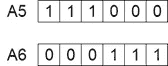

# 遗传算法

> 原文：<https://medium.com/analytics-vidhya/genetic-algorithm-5aba4aac48f7?source=collection_archive---------22----------------------->

*   遗传算法(GA)是一种产生/生成优化问题的足够好的解决方案的高级方法，其灵感来自属于进化算法(e a)的更大类别的自然选择过程。
*   遗传算法通常用于通过依赖诸如变异、交叉和选择之类的生物启发算子来生成优化和搜索问题的高质量解决方案。
*   霍兰德在 1960 年基于达尔文进化论的概念引入了遗传算法

**进化算法**:

> 在人工智能(AI)中，进化算法(EA)是进化计算的子集，进化计算是一种通用的基于种群的元启发式优化算法。EA 使用受生物进化启发的机制，如繁殖、突变、重组和选择。

进化算法有三个主要特征:

**基于群体的**:进化算法是优化一个过程，在这个过程中，当前的解决方案是不好的，以产生新的更好的解决方案。从中产生新解的当前解的集合称为群体。

**健身导向**:如果有几个方案，怎么说一个方案比另一个方案好？从适应度函数计算出的每个单独的解决方案都有一个相关的适应度值。这样的适应值反映了解决方案有多好。

**变异驱动**:如果根据每个个体计算出的适应度函数，在当前种群中没有可接受的解，我们就要做出一些东西来生成新的更好的解。因此，单个解决方案将经历许多变化以生成新的解决方案。

在遗传算法中，一个优化问题的候选解群体(称为个体、生物或表型)朝着更好的解进化。每个候选解都有一组可以变异和改变的特性(它的染色体或基因型);传统上，解决方案以二进制表示为 0 和 1 的字符串，但其他编码也是可能的。

自然选择的过程始于从群体中选择最适合的个体。他们产生的后代继承了父母的特征，并将被添加到下一代。如果父母有更好的健康状况，他们的后代会比父母更好，有更好的生存机会。这一过程不断迭代，最终会找到具有最适合个体的一代。

**在遗传算法中考虑六个阶段:**

> 原始群体
> 
> 适应度函数
> 
> 选择
> 
> 交叉
> 
> 变化
> 
> 结束

遗传算法中过程的流程图

**初始群体:**

这个过程从一组称为群体的个体开始。每个个体都是你想要解决的问题的解决方案。一个个体是由一组称为基因的参数(变量)来表征的。基因连成一串形成染色体(解)。染色体有不同的表示法，选择正确的表示法要视具体问题而定。好的表示使搜索空间更小，从而更容易搜索。

可用于染色体的表示包括:

> 二进制:每个染色体被表示为一串 0 和 1
> 
> 排列:对排序问题很有用，比如旅行推销员问题
> 
> 值:实际值按原样编码

Indivudal 会有一条染色体，染色体会有基因

**健身功能:**

适应度函数确定个体的适应度(个体与其他个体竞争的能力)。它给每个人一个健康分数。一个个体被选择繁殖的概率是基于它的适合度分数。

**选择:**

选择阶段的思想是选择最适合的个体，让他们把自己的基因传递给下一代。两对个体(父母)基于他们的适合度分数被选择。高适合度的个体有更多的机会被选择繁殖。

**交叉:**

交叉是遗传算法中最重要的阶段。对于每对要交配的父母，从基因中随机选择一个交叉点。交叉技术的类型有:

单点交叉

两点和 k 点交叉

均匀交叉

有序列表的交叉

**突变:**

在某些新形成的后代中，他们的一些基因可能以低随机概率发生突变。突变改变了染色体中一个或多个基因的值。在突变中，解可能完全不同于先前的解。因此，遗传算法可以通过变异得到更好的解。

不同的突变类型有:-

> 位串突变
> 
> 翻转钻头
> 
> 分界线
> 
> 不均匀的
> 
> 制服
> 
> 高斯的
> 
> 收缩

**终止:**

重复这个生成过程，直到达到终止条件。常见的终止条件有:

找到满足最低标准的解决方案

达到固定的世代数

已达到分配的预算(计算时间/金钱)

最高等级的解决方案的适应性正在达到或已经达到一个平台，使得连续的迭代不再产生更好的结果

人工检查

以上各项的组合