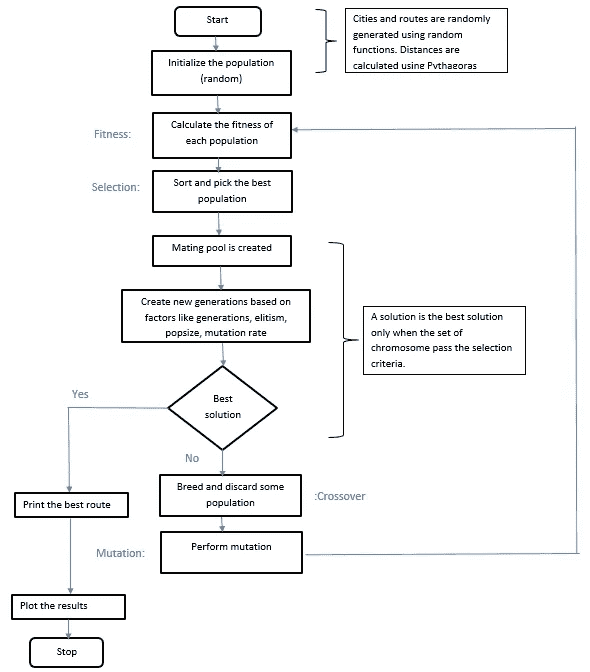
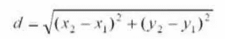
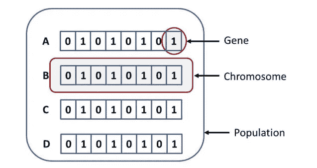
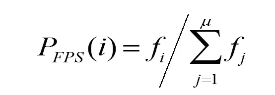
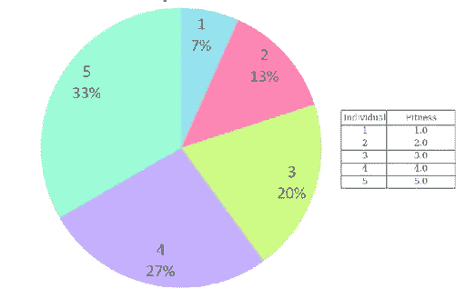
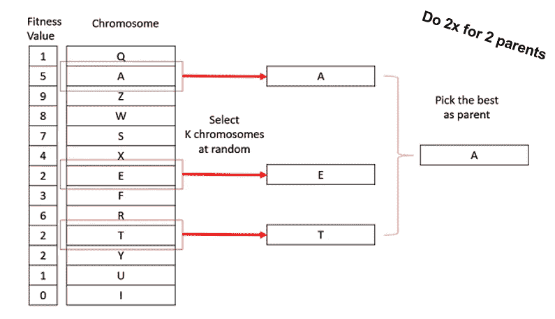

# 遗传算法

> 原文：<https://medium.com/analytics-vidhya/genetic-algorithm-7d7045127a75?source=collection_archive---------25----------------------->

遗传算法是一种启发式搜索技术，可以为任何给定的问题找到最相关的解决方案或最优解决方案。这是受查尔斯·达尔文的自然进化论的启发。通过使用这种自然选择过程，我们可以确定可用于解决任何给定问题的可能解决方案集。任何遗传算法的输出都将是该问题的最佳解决方案。我们得到的所有可能的解都叫做染色体。最优解分 5 个阶段获得，即:初始种群、适应度函数、选择、交叉/繁殖、变异。精英主义(将在本文后面部分解释)是 GA 中的另一种技术，它有助于将最佳解保存到最后。

**该解决方案的流程图**:

让我们考虑一个例子来更好地理解遗传算法:

**旅行推销员问题**:

这个问题是要找出一个销售人员在代表城市的搜索空间/图上可以行进的最小距离。推销员从一个点出发，通过访问所有其他城市，最终回到同一个点。

例如:A — B — D — C — A

主要目的是选择这样的组合，使得每个节点(A-B 或 B-D 等)之间的所有距离都应该被计算并且是最优的。每个城市之间的距离是使用毕达哥拉斯定理计算的(就像我们用 x & y 坐标在图上画城市一样)。

**相位:**

1.  初始群体:该过程从一组称为群体的个体开始。每个个体都是你想要解决的问题的解决方案。一个个体是由一组称为基因的参数(变量)来表征的。基因连成一串形成染色体(解)。在遗传算法中，一个个体的基因组用一串字母来表示。通常，使用二进制值(1 和 0 的字符串)。我们说我们在染色体中编码基因。

所有的路线被认为是一个群体，这个群体又被称为染色体。如果有 n 个城市，那么可能的人口数就是 n！。

2.**适应度函数**:这是一种指定给定解决方案相对于其他解决方案和正在解决的问题的“良好性”标准的方式。对于某些阶段(交叉和突变)，个体 *i* 被选择交配的概率取决于其相对于整个群体的绝对适合值的绝对适合值。

注意:概率之和必须为 1

就本例而言，已经计算了两个城市之间的距离，并将其添加到总路径距离中，然后对总路径距离进行往复计算并保存为总路径适合度。然后对这种适应度的输出进行排序，以便可以挑选出距离最短的路径。

3.**选择**:轮盘赌或锦标赛选择过程可用于选择染色体作为父代进行交叉，这是一种适应度比例选择(这是因为选择的概率很高，从繁殖适应度中挑选有用的结果)。

**轮盘**:重复旋转一个单臂轮盘，其中孔的大小反映了选择概率。最佳适配值在轮子上占据更多空间(因此，它们被选中的机会更多)。

来源:https://en.wikipedia.org/

**锦标赛选择**:个人被选中的概率取决于人口排名和锦标赛规模。

来源:[https://www.tutorialspoint.com/genetic_algorithms](https://www.tutorialspoint.com/genetic_algorithms/genetic_algorithms_parent_selection.htm)

在本例中，将计算累计总和和累计百分比，并使用所有可能的值创建数据框。使用资格标准(适应度函数)，从数据帧中选择最适合的染色体，丢弃剩余的染色体。

4.**交叉**:交叉在这个 GA 中用来生成子代。有条件从交配池中挑选亲本(使用选择)。一旦产生子代，就评估它们的适合度。子染色体也有机会在选择过程中被选中进行交叉(如果它们是最适合的)。有许多类型的交叉，下面列出几种:

a.一点交叉
b .多点交叉
c .均匀交叉
d .整体算术重组
e .戴维斯的顺序交叉

之所以选择交叉，是因为我们采用了向量值，并对城市的索引进行了处理。此外，这种交叉避免了重复，因为这个问题只涉及销售人员到每个地点出差一次。如果我选择 1 点交叉，销售人员有很多机会去同一地点超过 1 次。

5.**突变**:突变用于突变一条染色体。突变是改变染色体中基因位置的过程，以便评估和保存新染色体的适应性。突变的类型如下:

a.比特翻转突变
b .随机复位
c .互换突变
d .加扰突变
e .倒位突变

交换变异用于解决 TSP，因为在其他过程中，任何位置都可能被丢弃，这违反了 TSP 的规则。因此，这个简单的交换变异过程用于简单地交换索引中的值

**精英主义**:这个过程是将最佳路线或种群带到下一代，确保排名第一的种群仍然存在。构建新群体的一般过程的一个实际变型是允许最好的有机体从当前世代不变地传到下一代。这种策略被称为*精英选择*，它保证了遗传算法获得的解决方案质量不会从一代下降到下一代。

**遗传算法的应用领域**

*   图像处理和识别
*   优化问题求解
*   DNA 分析
*   神经网络

引用:

[http://www . eecg . Toronto . edu/~ jayar/courses/APS 105s/quikes/quiz 2b/node 4 . html](http://www.eecg.toronto.edu/~jayar/courses/aps105S/quizzes/quiz2b/node4.html)

[https://en.wikipedia.org/wiki/Mating_pool](https://en.wikipedia.org/wiki/Mating_pool)T10[https://en.wikipedia.org/wiki/Genetic_algorithm#Elitism](https://en.wikipedia.org/wiki/Genetic_algorithm#Elitism)