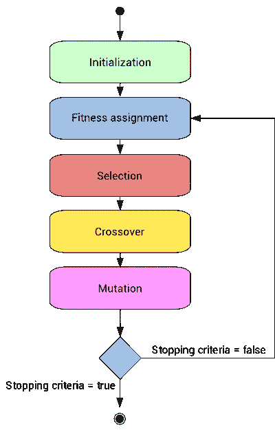
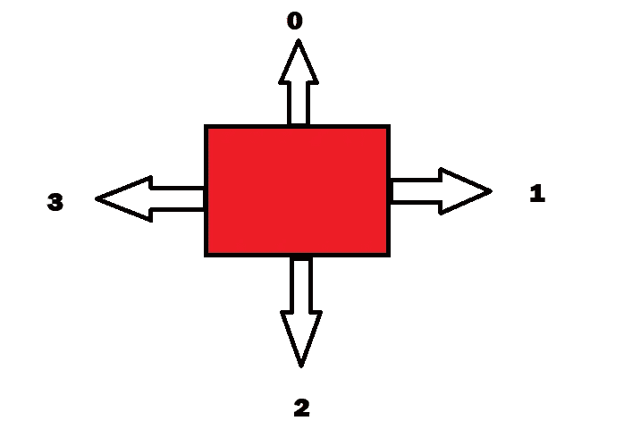
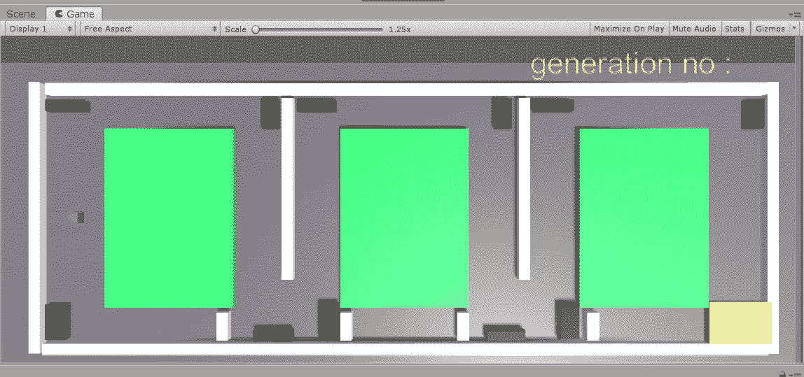

# 用 C#实现 unity 中的遗传算法

> 原文：<https://medium.com/analytics-vidhya/genetic-algorithm-in-unity-using-c-72f0fafb535c?source=collection_archive---------0----------------------->

## 用遗传算法帮助立方体到达目标

## 介绍

在这篇文章中，我将带你在 unity 中用 C#实现一个遗传算法。

在这里，我实现了一个非常基本的遗传算法，并加入了 unity。

正如你在下面的视频中看到的，红色方块必须到达黄色方块，最初红色方块向几个错误的方向移动，几代后最终到达黄色方块。

## 什么是遗传算法

遗传算法的灵感来自于自然选择的过程，在这一过程中，最适合的个体可以活得足够长，以传递他们的基因，而最弱的个体则很快灭亡。

下图显示了该算法的工作原理。

GA 流程图

如果你不知道它是什么，那么我建议你浏览这里的。这将带你了解什么是遗传算法。如果你已经理解了他是如何实现 GA 来输入短语“生存还是毁灭”，你就可以开始了。我在这里遵循了类似的方法。

## Unity 中的游戏环境

所以让我给你介绍一下 unity 的游戏环境。这里我们有一个红色的方块，它必须到达黄色的方块而不与白色或绿色的边碰撞。黑色块是边，当红色块与黑色块碰撞时，红色块必须改变其方向，即碰撞后，它必须直行或右转或左转或向后。

这个方向存储在一个数组中。每次红色方块击中一条边时，就会看到方向数组中相应索引处的数字，方块就会朝那个方向移动。例如，如果块与 3 边碰撞，则看到索引 2 处的数字(因为 C#中的索引是从 0 开始的)，如果数字是 1，则块右转。下图会给你一个简单的概念。

块的方向数组值

因为有 11 条边，所以方向数组必须是{0，1，2，1，0，1，2，1，0，1，2}，这样红色的块就可以到达黄色的块。该数组是目标数组，每个基因的适应度将根据它与该目标数组的接近程度来确定。

有 4 个脚本— newMove.cs、GAobj.cs、population.cs 和 DNA。铯

我将带你浏览所有这些，但要确保你对遗传算法有一个简单的了解。

unity3D 中的游戏环境

## **DNA 类**

DNA 类有两个主要的实例变量*基因、*，初始种群将随机生成，而*适应度*将根据它与该目标数组的接近程度来确定。

*构造函数*接受 int no，它是基因的大小，在我们的例子中是 11。

*fitnessCal()* 通过比较每个元素，根据基因与目标元素的相似程度计算得分，并将其标准化，以便以后可以使用概率方法创建交配池。

*DNA 杂交(DNA 伴侣)*首先计算基因中的随机中点，进行杂交或交配。

*Mutate()* 对孩子的 DNA 进行突变，这样后代就可以有遗传多样性，不会有和父母一样的基因。

## **人口阶层**

population 类由两个 DNA 类型的列表组成，其中保存了*matting pool*和 *bestgenesholder* ，这两个列表将被提供给 *GAobj* 类，GAobj 类使用它们来生成块以显示 GA 的工作情况。

构造函数创建初始群体并初始化一切。

在 while 循环中，首先计算所有个体的适应度，然后将最适应的基因附加到 *bestgenesholder* 之后，我们将检查收敛(在这种情况下，当目标基因被成功预测时，收敛发生)。

然后用概率方法创建交配池。例如，如果 A 的标准化分数为 0.3，那么交配池的 30%应该具有 A，因此当随机挑选两个亲本进行交配时，挑选 A 的概率应该是 30%。

在此之后，孩子的 DNA 发生突变，如果没有达到收敛，那么我们将后代传递回遗传算法，如此反复，直到我们达到收敛。

## **GAobj**

对于那些想知道的人来说，类名是无关紧要的。这个类基本上是从种群类，即*最佳基因阈值*中获取收敛后的输出，并产生从第 0 代到实现收敛的最佳基因的块。

在 *start()* 中，我们创建了一个新的种群，并将 *bestgenesholder* 放入这个脚本中，并调用 startInatantiating()，它实例化具有该特定代中最佳基因的街区或汽车，并继续下去直到最佳。

## **新移动**

当块被实例化后，它首先从该特定代的 *bestgenesholder* 列表中选择方向并移动。

如前所述，每当红色方块或汽车与边缘(黑色方块)发生碰撞时，它会检查这是哪条边缘，并选择下一个方向。

这就是它的伙计们——你已经建立了一个非常简单的遗传算法，并加入了 unity 来帮助街区移动。

感谢阅读！