# 遗传算法——向大自然学习解决复杂优化问题。

> 原文：<https://medium.com/analytics-vidhya/genetic-algorithm-learning-from-nature-to-solve-complexe-optimization-problems-8744ae7bffed?source=collection_archive---------19----------------------->

# 遗传算法听起来很复杂，我自己也以为是第一次听说，但绝对不是。

## **关于遗传算法**

这是一种基于模仿生物进化的自然选择过程来解决约束和无约束优化问题的方法。

我知道，更糟，但是继续读。

## 什么是自然选择？

自然选择是一个过程，通过这个过程，具有有利特征的个体生物更有可能生存和繁殖。*达尔文说。*

也表达为**、**适者生存，意思是如果你能适应你生活的条件和环境，那么你更有可能生存和繁殖，这样你的特征就能遗传给下一代。

总结一下:我们保留那些有特殊品质的人，让他们适合某项特殊的任务，并淘汰那些不好的。

## 它是如何工作的？

首先，让我们介绍一下将要用到的术语

**人口 *:*** *潜在方案随机挑选。*

**个体 *:*** *群体中的一个解。*

**染色体 *:*** *包含每个个体的性状。*

我们可以说，每个个体都是由其染色体来代表的。

**基因 *:*** *每一条染色体都是一组基因，每一个基因都代表了个体的一个特定性状。*

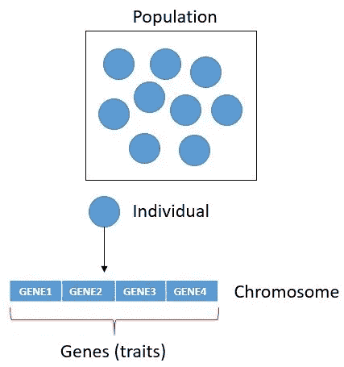

群体—个体—染色体—基因

我们前面说过只保留适者个体，淘汰他人，那么如何评价**适者**？

首先，我们定义一个依赖于问题的适应度函数，作为一个例子，我们假设我们有一个函数:

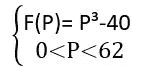

我们必须找到使 F(P)最大化的 P。

当然有更简单的方法来找到 P，在这种情况下，我举了一个简单的例子来解释适应度的概念。

(*我在开头提到的约束优化问题是指我们对目标函数的变量有约束，比如 0 < P < 62)*

## 第一步是随机选择一个人群:

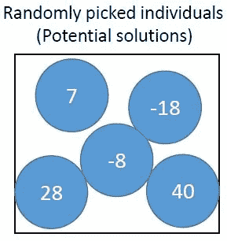

我们计算群体中每个个体的 F(P ),然后以降序方式对结果进行排序，以获得列表顶部的最适合者。

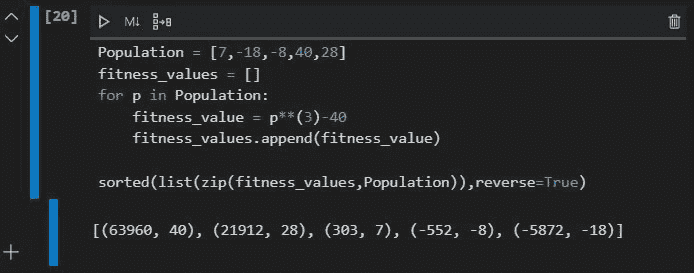

“40 岁”和“28 岁”是最适合的，所以他们会被保留下来把基因传给下一代。

通过与高质量的个体交配，有望获得比父母更好的结果。

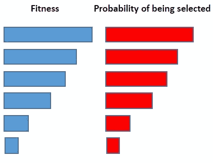

如果你有兴趣了解更多关于父母选择的信息，这里有一个链接。

**总结**:我们随机挑选代表潜在解决方案的个体，我们通过适应度函数评估他们的适应度，然后我们选择表现良好的个体。通过这样做，将有更高的机会只保留使这些父母好的解决方案的好基因，而放弃坏的基因。

适应度函数依赖于问题，如何解释适应度值也依赖于问题，如果目标是最小化 F(P)，我们可以选择“-18”作为最适合的个体。

## 接下来是什么？

我们之前说过，每个个体都是由其染色体代表的，因为染色体是由个体的基因组成的，这使得它们不是好的解决方案。

## 染色体表示:

染色体的表示方式因问题而异。

我将在本文中介绍的是**二进制**表示法，其中染色体被表示为一串 0 和 1。

该值按原样编码。

例如二进制的 **28** 表示如下:

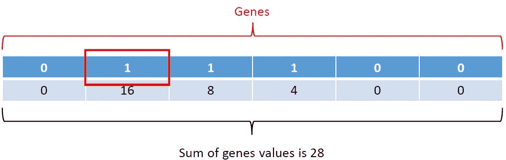

如果你懂的话。让我们回到当我们在群体中选择最适合的个体时，值 40 和 28 具有最高的适合值，它们会发生什么？

# 交配

我们创造新的孩子或后代的方法是对父母的染色体进行一些修改:

## 交叉

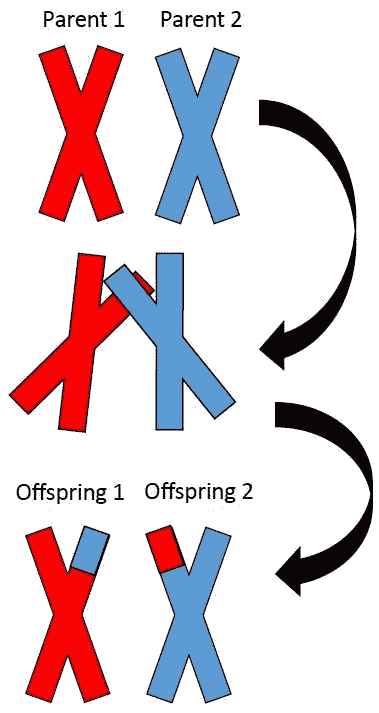

杂交是父母之间基因(性状)的交换。

如果两个个体具有使他们成为好的解决方案的特征，如果我们能把这些基因传递给孩子，他们会更好，因为他们将拥有父母双方的良好特征。

这就是交叉的含义，它非常重要，因为否则，孩子或后代将与他们的父母完全相同。

由于遗传算法是一种进化算法，我们正在寻求更好的结果。

染色体二进制表示的交叉:

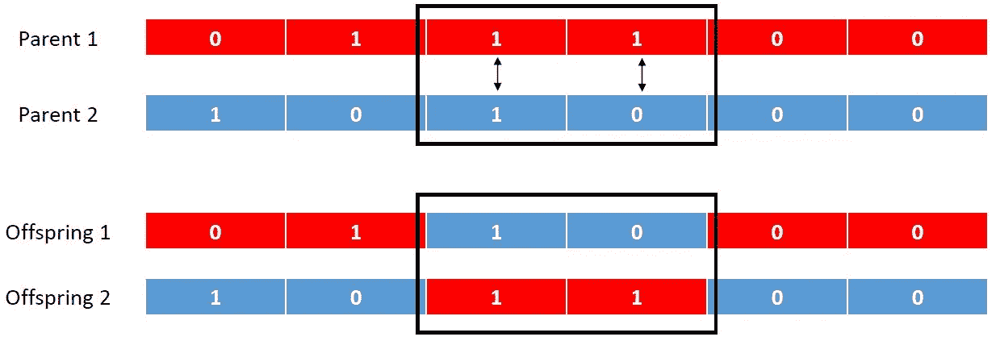

## 变化

现在我们有了这些新的后代，我们做的下一个变异算子是突变，这意味着我们选择一些基因(可能只有一个)并改变它们的值，对于二进制表示，如果是 0，我们用 1 代替基因值，反之亦然，这被称为位翻转突变。

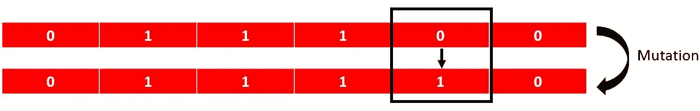

比特翻转突变

第二种方法是选择两个基因并交换它们的值

(交叉和突变基因的选择是随机的)

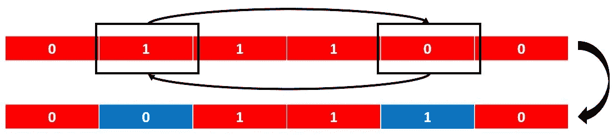

交换位突变

**总结:**通过交叉，我们利用现有的性状，而变异则是为了探索新事物。

我们通过交叉获得的染色体和通过突变获得的染色体将构成下一个群体，或下一代。

然后，相同的过程将应用于下一代，以产生新的一代，只要我们没有达到我们选择的特定条件，这将继续下去，它可能是有限数量的代，我们认为一个适应值就足够了...

# PID 控制器

在我知道遗传算法以及它们有多么神奇之前，我已经手动调整 PID 参数很久了。

这将是我们的优化问题，对于那些不知道 PID 控制器是什么的人来说，[这里有一个链接。](https://www.youtube.com/watch?v=wkfEZmsQqiA)

对于那些知道但需要快速提醒的人来说，目标是有一个快速、稳定和精确的输出。

我们的系统可能存在的不同问题的示例

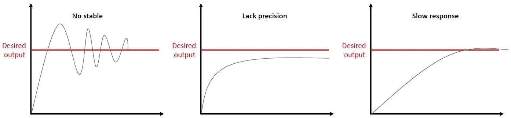

理想情况下，我们希望有这样的东西:

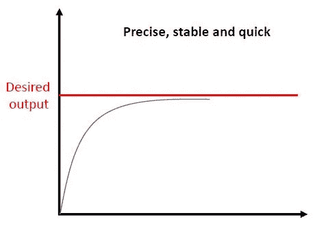

如果系统是完美的，我们将有如下的架构:

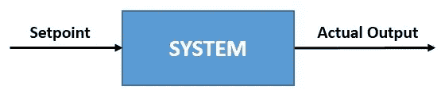

其中**期望输出=实际输出**。

不幸的是，事情并不是这样的，但没关系，我们能处理好。

由于实际输出不是期望的输出，这就需要 PID 控制器。

添加 PID 控制器后的新架构:

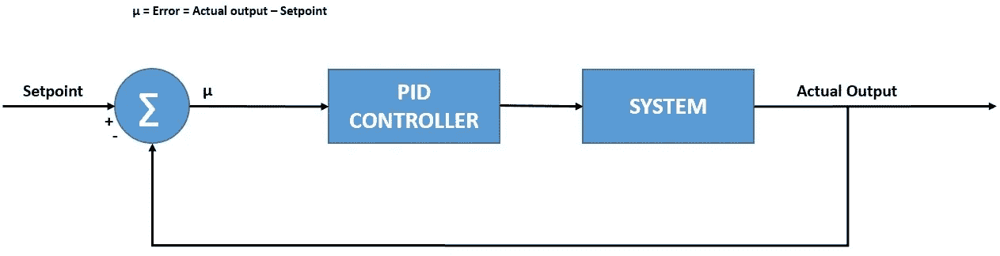

现在，这是一个闭环，设定点和输出之间的差异不断计算，以了解系统的表现，并产生更好的控制信号，以尽量减少误差。

PID 控制器的输出是三项之和，即比例、积分和微分。

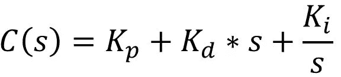

输出变成:

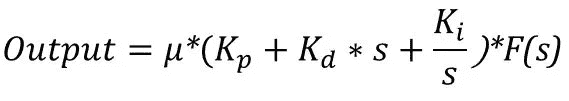

**F(s)** 是拉普拉斯域中的系统传递函数。

[这里有一个链接，可以更好地理解每个参数。](https://www.machinedesign.com/automation-iiot/sensors/article/21831887/introduction-to-pid-control#:~:text=PID%20is%20an%20acronym%20for,Proportional%20means%20a%20constant%20multiple.&text=All%20three%20of%20these%20PID,of%20the%20process%20being%20regulated.)

调整 PID 控制器是将其控制参数 **(Kp，Kd，Ki)** 调整到目标响应的最佳值。

当我第一次学习 PID 控制器时，我被告知这些参数不是计算出来的，所以它们必须手动调整…如果系统太慢，增加 Kp，如果系统振荡太多，增加 Kd，等等，这就是我一直在做的，这是一个漫长的，不好玩的过程，你可能永远不会找到一个保证稳定性，精度和良好的响应时间的三个参数的良好组合，例如，增加 Kp 肯定会增加系统的响应时间，但你也可能使它振荡太多。

因此不再需要手动调谐。

# MATLAB 中的实现

一旦我们将遗传算法调整模块添加到闭环架构中:

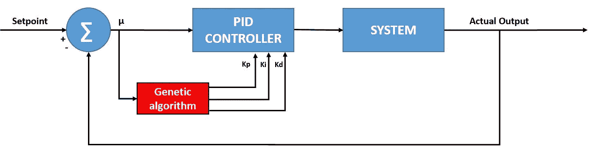

在视频的开始，我尝试手动调整 PID 参数，你可以看到，我们有太多的选择，我们可能永远不会找到稳定性、快速响应和精度之间的良好结合。

输入(设定点)是阶跃函数，系统传递函数不是一个特定的函数，我只是选择了脑海中出现的第一个函数。

在优化工具中，我什么也没改变，但是你可以指定各种各样的东西，比如停止标准或者其他什么。

我选择使用的成本函数是 ITAE(积分时间绝对误差)。如果你有兴趣了解更多，这里有一篇文章。

你可以下载我在 Github 上使用的 Matlab 脚本，链接如下:

[https://github . com/HamzaELHANBALI/Tunig-PID-parameters-using-Genetic-algorithm](https://github.com/HamzaELHANBALI/Tunig-PID-parameters-using-Genetic-algorithm)

我希望这在某种程度上对你有用，并可能启发你用它做一些事情。