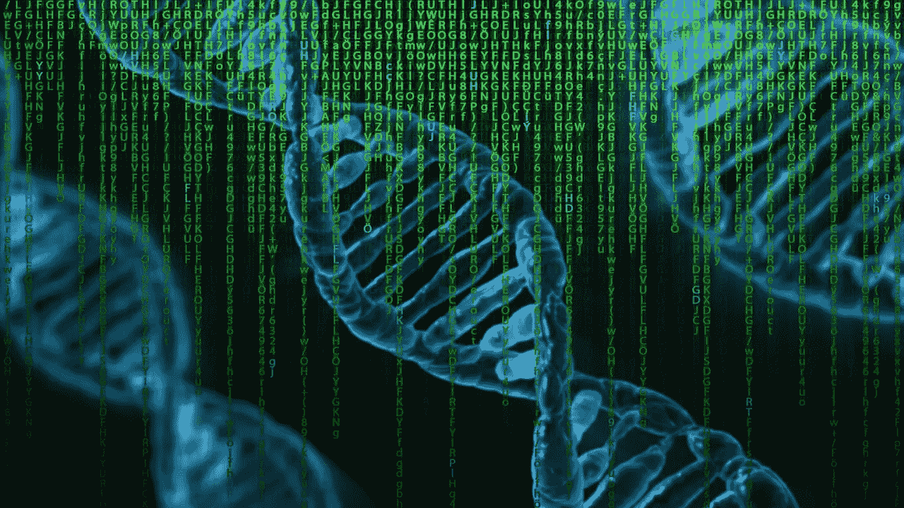
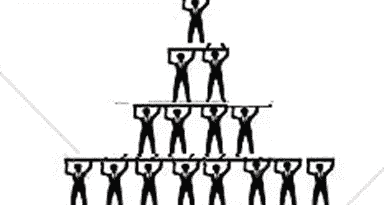
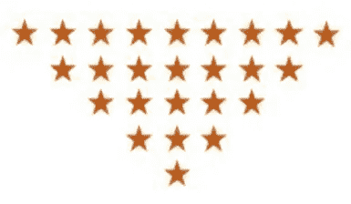
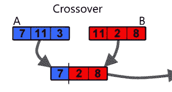
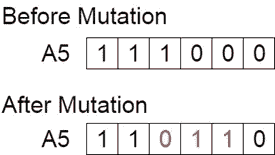
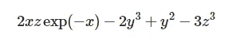
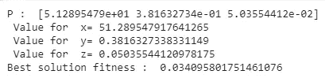
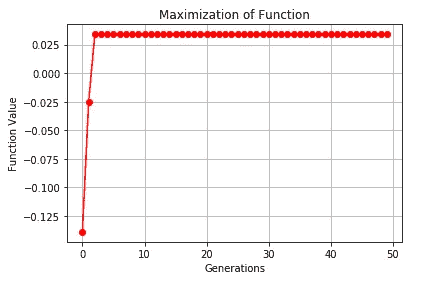

# 优化的遗传算法

> 原文：<https://medium.com/analytics-vidhya/genetic-algorithms-for-optimization-77cffeba37ea?source=collection_archive---------14----------------------->

由于遗传算法与遗传进化的相似性以及在优化技术中的应用，遗传算法最近变得流行起来。被称为遗传算法之父的霍兰德教授于 1960 年在密执安大学提出了这个概念。这个想法主要是受查尔斯·达尔文的进化论的启发。这些算法在当今的计算数学中被广泛使用。



图片提供:前线基因组学

遗传算法是一种不保证最优解的元启发式算法。试探法是一种算法，它执行搜索以找到无法直接解决的问题(如非多项式(NP)问题)的最佳解决方案。它使用生物算子，如选择、交叉和变异。在本文中，我们将描述引导搜索如何帮助这些算法进化到最佳解决方案。遗传算法是一种进化算法，可分为基于种群的算法和模因算法。此外，它还可以用于 NP 完全问题，如旅行商问题。

# **他们从哪里来？**

查尔斯·达尔文在他的《物种起源》一书中总结了他 20 年来对人类如何随时间进化的研究。它概括了进化的思想，提出了自然选择的理论。它强调世代间的适者生存。现代基因组告诉我们，每个人拥有 30 亿个核苷酸。(长到可以写在 262K A4 纸上)。



金字塔理论

让我们来看一个关于“你”是如何成为他人中最优秀者的小类比。一个简单的金字塔理论描述了你有两个父母，这两个父母有四个祖先。这个谱系崩溃告诉我们，如果你将这个链条进一步移动到 40 代，保持 25 年的平均代沟，那么你就有近 20 亿祖先，那些在地震、降雨、干旱、战争和疾病中幸存下来的人。因此，我很高兴这个星球上幸存的 20 亿最健康的人的产物正在阅读这篇文章。

> 你可以在这里阅读有关伯特关注[的内容](/analytics-vidhya/an-insight-to-bert-attentions-2e106f004dc0)。

# **如何利用这种进化进行编程？**

现在，让我们颠倒使用与倒金字塔理论相同的理论，在倒金字塔理论中，我们对任何问题都有数百万种可能的解决方案，我们希望从中选择最好的作为父母，并通过突变产生后代，在几代之后找到最合适的解决方案。

该算法可以被设想成树状表示。GA 有以下几个阶段

1.  **初始群体**
2.  **健身功能**
3.  **选择**
4.  **交叉**
5.  **突变**



基于倒金字塔的优化

> 即使是同卵双生的孩子，和其他人相比，每个人都有较小的变异。99%的人类 DNA 与其他人相似。此外，我们 96%的 DNA 与黑猩猩相似，与猫和牛分别有 90%和 80%相似。

## **1。起源(初始化种群)**

对于每个试探法，我们预期一些随机的解决方案来检查函数值，然后执行梯度搜索或模拟退火来检查我们的进展。对于一个数学问题，我们总是有几个变量，这些变量往往有一些限制或范围。群体越大，就越容易收敛到一个解，但是在一些系统中，存储大量的值会受到内存的限制。

```
# low = lower range for variables, high = higher range for variables
def genesis(size,var, high , low):
   pop_size = (size,var)
   new_pop = np.random.uniform(low=low,high=high,size=pop_size)
   return new_pop
```

## **2。健身功能**

这是一种为每个解决方案打分的功能，有助于选择最佳解决方案。这个适应度函数是一个我们想要最大化或最小化的数学方程。在人口较多的情况下，复杂的适应度函数会产生较高的计算成本。

```
def fitness(p):
# Evaluating fitness Interference function "double fit (doublep[])".
   fitness=np.zeros((len(p),1))
   for i in range(len(p)):
       x,y,z = p[i][0] , p[i][1] , p[i][2]
       fitness[i,0] = 2*x*z*np.exp(-x) - 2*y**3 + y**2 -3*z**3
   return fitness
```

## **3。选择**

在使用一个评分标准找到最合适的之后，我们使用几个父母来繁殖下一代。更多的父节点意味着解决方案更加多样化，更容易达到最优解。

```
def selection(pop, fitness, num_parents):
   parents = np.empty((num_parents, pop.shape[1]))
   for parent_num in range(num_parents):
      max_fitness_idx = np.where(fitness == np.max(fitness))
      max_fitness_idx = max_fitness_idx[0][0]
      parents[parent_num, :] = pop[max_fitness_idx, :]
      fitness[max_fitness_idx] = -99999999999
   return parents
```

## 4.交叉

执行此操作是为了创建混合，并避免重复相同的解决方案。这就像自然选择，不同地区的人采用不同的肤色和发色。交叉有不同的类型，如单点、两点和均匀。



```
def crossover(parents, offspring_size):
   offspring = np.empty(offspring_size)
   crossover_point = np.uint8(offspring_size[1]/2)
   for k in range(offspring_size[0]):
      parent1_idx = k%parents.shape[0]
      parent2_idx = (k+1)%parents.shape[0]
      offspring[k, 0:crossover_point] = parents[parent1_idx,     0:crossover_point]
      offspring[k, crossover_point:] = parents[parent2_idx, crossover_point:]
   return offspring
```

## **5。突变**

“变种人”这个词现在因电影《Xmen》而出名，在这部电影中，每个人都有独特的品质。我们初始化变异以增加解的多样性。突变率决定了我们想要在种群中引入多少变化。在人类的 DNA 中，同卵双胞胎可能会发生 0.1%到 0.4%的突变。有不同类型的突变，如位翻转、交换、反向、均匀、非均匀、高斯、收缩等。



```
def mutation(offspring_crossover):
   for idx in range(offspring_crossover.shape[0]):
      random_value = np.random.uniform(0, 10, 1)
# 10 percent change maximum keeping 90 percent mutation rate 
      i= randint(0, 2)
      offspring_crossover[idx, i] = offspring_crossover[idx, i] + random_value 
   return offspring_crossover
```

# 优化的一个例子:

我们想最大化这个等式。



> 注意:我们可以通过简单地用相同的代码使一个函数为负来最小化它，例如:g(x) = -f(x)

我们有三个变量 x，y，z，我们选择这些参数进行求解:

a) 50 代

b)突变率:10%

c)父母:2 人

d)春季突变:4

e)初始人口:10 万

```
import numpy as np
from random import randintnum_var = 3sizeof_pop= 100000
upper_limit = 100
lower_limit = 0num_parents = 2population = genesis(sizeof_pop , num_var, upper_limit ,lower_limit)
print(population)
Scores=[]num_generations = 50
for generation in range(num_generations):
   print("\n\nGeneration : ", generation)
   fitness_score = fitness(population)
   parents = selection(population, fitness_score, num_parents)
   print("Best Parents \n",parents)
   offspring_crossover = crossover(parents, offspring_size=(2*num_parents, num_var))
   offspring_mutation = mutation(offspring_crossover)
   print("Mutated OffSprings\n",offspring_mutation)
   population[0:parents.shape[0], :] = parents
   population[parents.shape[0]:6, :] = offspring_mutation
   Scores.append(np.max(fitness_score))
   print("Best result : ", np.max(fitness_score))
```

这将运行算法 50 代，并显示结果。colab 版本在[这里](https://github.com/NeelKanwal/GeneticAlgorithms)有售。

```
fitness = fitness(population)
best_match_idx = np.where(fitness == np.max(fitness))
print("P : ", population[best_match_idx, :][0][0])
print(" Value for  x= {}".format(population[best_match_idx, :][0][0][0]))
print(" Value for  y= {}".format(population[best_match_idx, :][0][0][1]))
print(" Value for  z= {}".format(population[best_match_idx, :][0][0][2]))
print("Best solution fitness : ", fitness[best_match_idx][0])
```

我们可以在每次运行中找到变量的不同值，如前所述，这不是一个确定性算法。



```
import matplotlib.pyplot as plt
Evaluations = Scores
plt.plot(Evaluations,'o-',color='red')
plt.xlabel('Generations')
plt.ylabel('Function Value')
plt.title("Maximization of Function")
plt.grid(True)
plt.show()
```



进化使方程式的价值最大化

使用 Matlab 的全局优化工具箱可以执行类似的任务。

代码可以在这里找到。

[](https://github.com/NeelKanwal/GeneticAlgorithms) [## 尼尔坎瓦尔/遗传算法

### 遗传算法由于其与遗传进化的相似性和在优化设计中的应用，最近得到了广泛的应用。

github.com](https://github.com/NeelKanwal/GeneticAlgorithms)