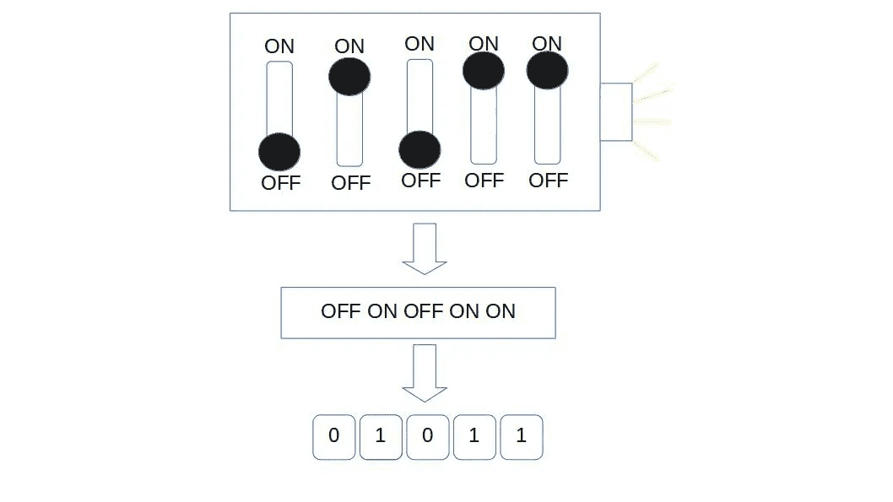
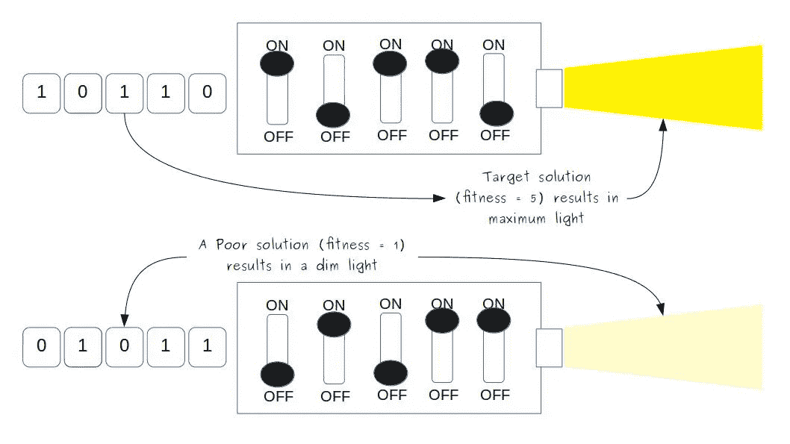
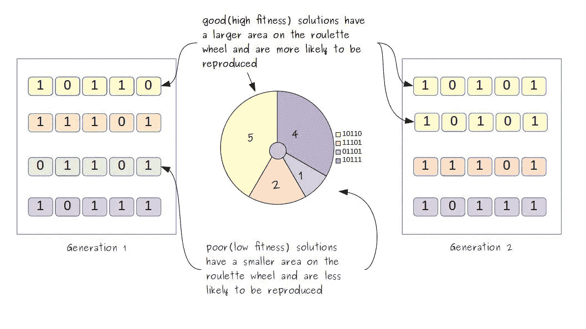
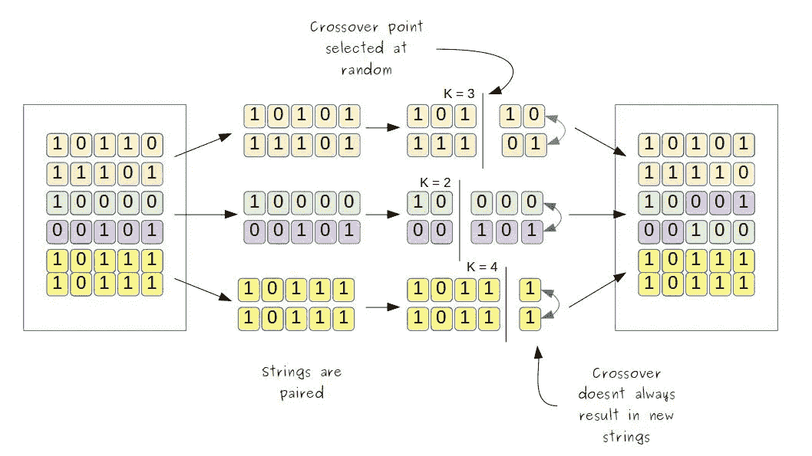
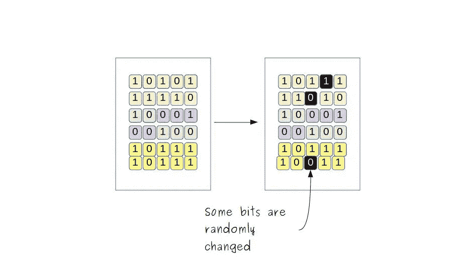

# 遗传算法导论

> 原文：<https://medium.com/analytics-vidhya/genetic-algorithms-with-python-part-i-introduction-3e36dc4a609b?source=collection_archive---------29----------------------->

## 遗传算法的简单概念介绍。

计算机科学的早期先驱们对生物学和心理学的兴趣不亚于对电子学的兴趣，他们将自然系统视为如何实现其愿景的指导性隐喻。

通过他们的努力，出现了三种受生物学启发的问题解决策略。第一个已经发展到神经网络领域，第二个发展到机器学习，第三个发展到现在所谓的“进化计算”，其中遗传算法是最突出的例子。

# 遗传算法

“搜索算法”是“搜索”问题解决方案的策略。遗传算法是一种受自然选择和遗传学机制启发的搜索算法。但是在找到解决方案之前，我们首先需要定义一个解决方案是什么样子的。

## 编码解决方案

让我们用一个玩具问题来理解编码。考虑一个有 5 个开关和一个灯泡的盒子。开关的特定组合(打开和关闭)打开灯泡。我们的目标是找到打开灯泡的正确开关组合。

编码解决方案

我们现在已经确定了问题，接下来是解决办法。解决方案是一些开关的组合。我们如何表示开关的组合？一种简单的方法是将其表示为开关状态序列，比如['关'，'开'，'关'，'开'，'关']。我们可以将其进一步简化为一串“0”和“1 ”,其中“0”表示开关关闭,“1”表示开关打开。例如，字符串“01011”表示第二、第四和第五开关打开，其余开关关闭。

找到盒子的解现在是找到正确的长度为 5 的二进制字符串。这个“编码参数集”的过程是遗传算法不同于其他搜索算法的一个方面。

既然我们已经定义了一个解决方案的样子，让我们继续实际的算法本身。遗传算法由以下步骤组成:

1.  复制/选择
2.  交叉
3.  变化

# 生殖

我们从随机候选解的**群体**开始。由于是随机的，这些可能不是正确的解决方案。然而，这是我们第一代**T3。繁殖过程包括通过从现有群体中选择成员来创建新的解决方案群体。我们选择成员的依据是什么？**

简单来说，我们要求好的方案更容易被选中(而且是多次)，而差的方案不太容易被选中。这将意味着，随着每一个连续的世代，我们期望群体包含更多的好解副本，而坏解被过滤掉。

但是我们怎么知道解决方案是好是坏呢？为此，我们定义了一个“**适合度**标准，让我们比较候选解决方案。

## 健康

回到开关盒的例子，假设开关盒对于组合“10110”完全点亮。这种组合是我们的目标解决方案。此外，假设对于接近目标解决方案的每个组合，框都部分变亮。换句话说，每一个被正确拨动的开关都会增加灯泡的亮度。

计算候选解的适合度

按照这个逻辑，对于组合‘01001’(每个开关都被错误地切换)，灯泡将完全关闭，而对于组合‘10111’(除了最后一个开关之外，所有开关都被正确切换)，灯泡将接近全亮度。因此，灯泡的亮度作为候选解决方案的适合性标准。

为了对这个灯泡及其亮度进行建模，我们可以简单地将“灯泡的亮度”替换为“正确切换的开关数量”，从而获得每个候选解决方案的适合度的数值。

既然我们有了每个候选解“适合”程度的数值度量，我们需要创建一个包含更多适合解的新群体。有很多方法可以做到这一点，本文将介绍'轮盘赌轮选择'。

## 轮盘赌选择

顾名思义，我们将当前群体中的所有候选解放在轮盘赌上，更合适的候选解占据更大的区域。这将确保候选人是根据他们的健康状况按比例挑选的。

轮盘赌选择

现在，我们只需多次旋转轮盘，将胜出的候选人复制到下一代。我们注意到，更适合的候选人可能会被选择多次，而不太适合的候选人可能根本不会被选择。下一步是交叉。

# 交叉

通过选择导致更好的解决方案的更多副本，它不会产生新的解决方案。毕竟，我们不能简单地希望初始随机群体恰好包含最佳解决方案！这就是交叉的用武之地。在本文中，我们将关注单点交叉。

交叉

在单点交叉中，所有单个字符串都被分组成对。对于一对字符串，在 1 和字符串长度之间随机选择一个随机数 *k* 。对于这对字符串，第*个*字符之后的每个字符(位)都被交换。对所有的字符串对都这样做。

现在我们有一种方法来确保新的解决方案可以被引入到人群中。最后一步是突变。

# 变化

变化

突变包括时不时地随机改变一点。换句话说，每个字符串的每一位都有很小的机会被改变(1 变成 0，0 变成 1)。

突变是必要的，因为有时最佳解决方案不能从现有的解决方案中形成。例如，如果群体中的所有字符串都以“0”作为第一位，而最佳解决方案要求以“1”作为第一位，那么再多的复制和交叉也不能产生最佳解决方案。

# 重复！

选择、交叉和变异的一个循环产生了新的一代。这个循环重复多次。多少次了？嗯，在我们找到解决办法之前最好是这样。但是万一我们的算法需要太长时间才能找到一个解，或者根本找不到一个解，我们可以设置一个代数的限制。

# 结论

至此，你应该对遗传算法的工作原理有了一个基本的了解，并准备开始实施。我有一篇文章安排在下周发表，我们将用 python 实现一个遗传算法来解决一个简单的问题。谢谢你。