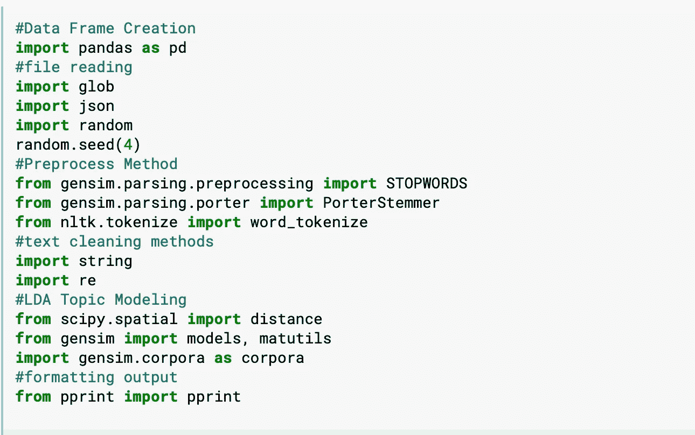
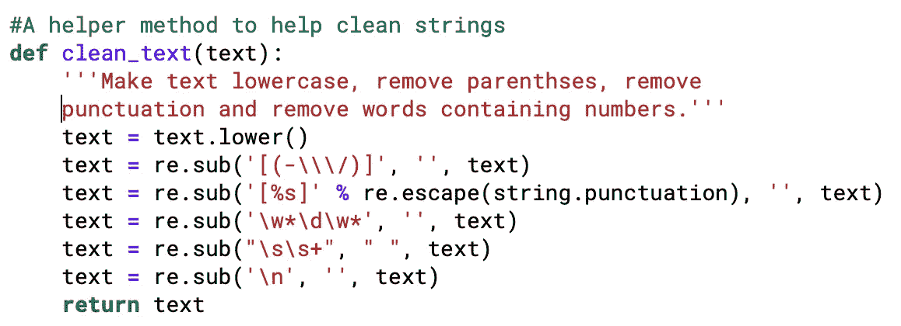
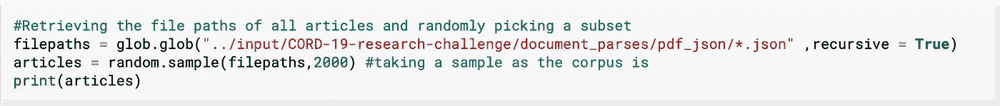
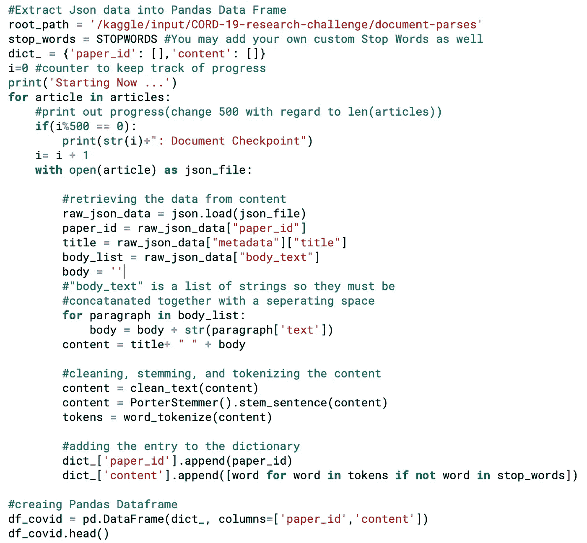
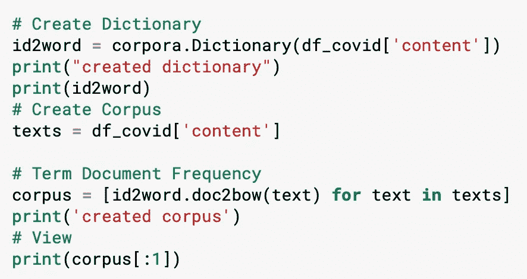
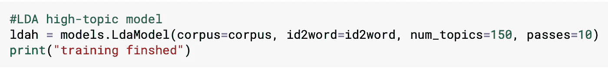
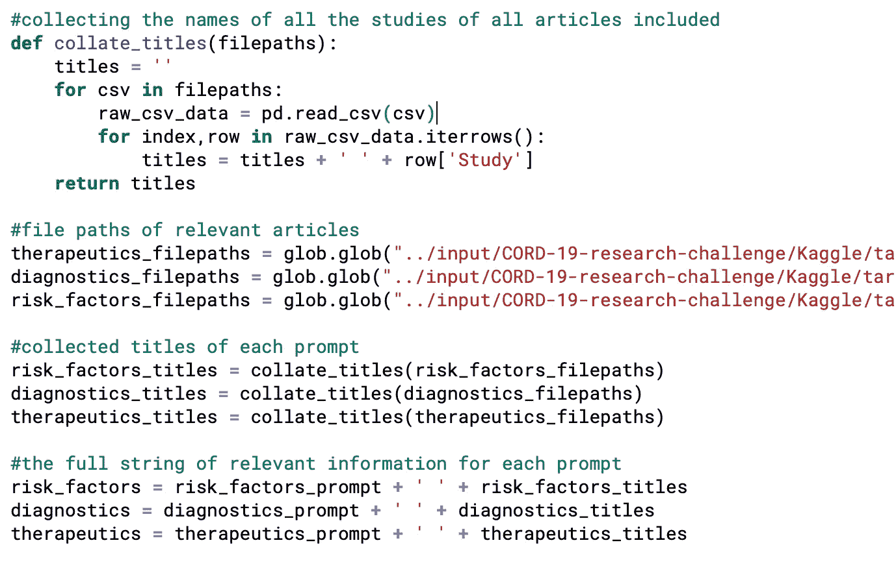
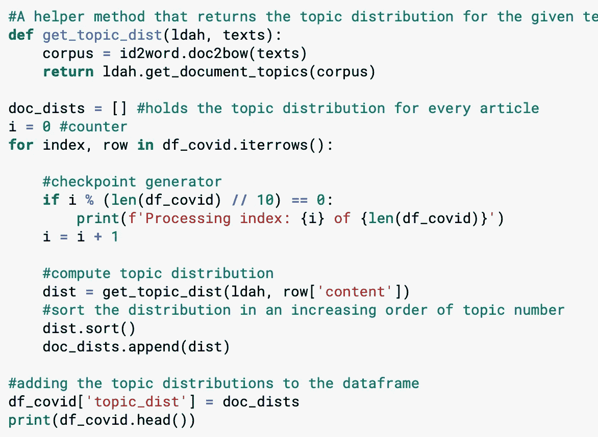
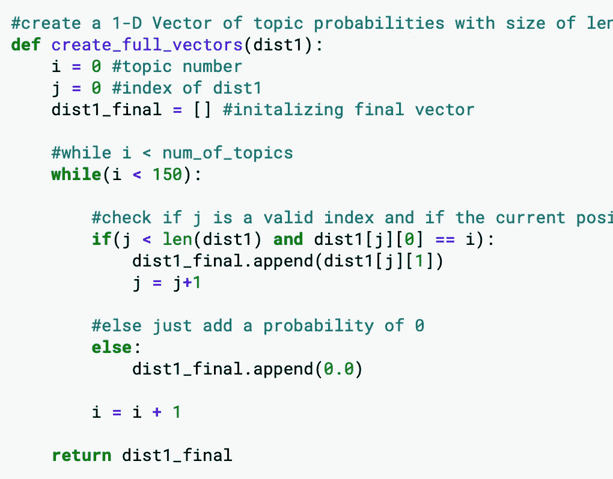
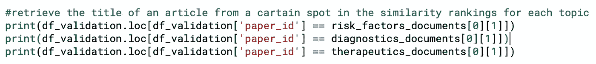

# 用于文章发现的 Gensim LDA 主题建模

> 原文：<https://medium.com/analytics-vidhya/gensim-lda-topic-modeling-for-article-discovery-9707237e4f0d?source=collection_archive---------11----------------------->

## **利用机器学习创建新冠肺炎研究工具**

LDA 模型的板符号(【https://en.wikipedia.org/wiki/Latent_Dirichlet_allocation】T2

# **目录:**

1.  项目概述
2.  进口
3.  文本清理方法
4.  创建熊猫数据框
5.  训练 LDA 模型
6.  创建提示语料库
7.  计算主题分布
8.  检索相关文章
9.  确认
10.  后续步骤和有用的链接

# **项目概述:**

这个项目的目的是使用 LDA 主题建模来查找与提示相关的科学期刊文章。我在 Kaggle 提供的笔记本上对此进行了编码，并使用了同样由 kaggle 提供的数千篇科学期刊文章的数据集。本教程结束时，你将能够输入一段信息，并检索类似性质的文章。

# **进口:**

这些都是我在项目中使用的导入。大多数是不言自明的——其他的将在出现时讨论。

# **文本清理方法:**

作为人，我们自动解析屏幕上的单词，不让不同的上下文影响我们对它们的理解。清理分析出不必要的噪音，如发音、数字和符号，这样就只剩下单词了。

使用 re python 库，我们可以使用正则表达式在字符串中找到不需要的模式并删除它们。检查[https://regex101.com](https://regex101.com/)来测试你自己的。

# **创建熊猫数据框:**

Pandas 库提供了一个易于使用的直观数据结构。我们所要做的就是填充一个字典对象并调用 pd。DataFrame()。

收集所有文件路径

Kaggle 将 JSON 格式的文章存储在子目录中，访问它们最简单的方法是添加每篇文章的完整文件路径。json 文件添加到一个列表中，并重复调用 json_load(filepath)。

这段代码中有很多内容，但实际上并不复杂。我们只是从 json 文件中检索数据，然后对其进行清理、词干化和标记化，然后将数据添加到字典中。

词干分析字符串并删除结尾，这样剩下的就是单词的词干。于是“跑得快的人比跑得慢的人跑得快”这句话就变成了“跑得快比跑得快跑得慢”。这很有帮助，因为作为人，我们理解跑步者、跑步和跑步之间的语义联系——但是对于 ML 算法，我们必须使这种联系更加明显。

标记化使每个单独的单词都有自己的标记，这种格式使得统计单词的频率和创建词典变得容易。

最后，我们删除所有包含在停用词数组中的标记。停用词是非常常见的词，它们对模型几乎没有任何有意义的贡献。Gensim 提供了一个最常用的列表，只需导入即可使用。

到了这一步，我们所有可读的科学文章都变成了一堆不协调的单词。

# **训练 LDA 模型:**

为了训练 LDA，我们需要 4 样东西:id2 单词字典、语料库、主题数量和通过次数。

Id2 单词字典:这个字典为输入的文本集合中的每个不同的单词分配一个 id。

语料库:语料库是模型将被训练的每个文档的字典中每个单词的频率。

主题数量:主题数量是模型应该将单词分成的概率聚类的数量。对于这种模式，我们将使用 150 个稍微多一点的主题。

通过次数:训练模型将通过整个语料库更新概率的次数。

# **创建提示语料库:**

每个提示都有一个子目录，里面全是相关的文章，所以我们可以写一个方法来收集和组合它们的标题。然后，我们可以将它与原始提示连接起来，创建一个最终的语料库，我们可以在查找其他相关文章时使用它作为比较。

然后，我们必须清理，阻止和标记字符串。

# **计算主题分布:**

首先，我们创建 helper 方法，该方法返回给定文章的主题分布。然后我们在每篇文章上调用它，并将结果保存到一个列表中，我们可以将该列表附加到数据框中。

到底什么是话题？在这种特定情况下，主题是单词的概率分布。对于相似的主题，相关的单词将具有更高的概率。

这些并不是完整的主题分布，因为它们没有涵盖所有 150 个主题。所以我们用另一个辅助方法 create_full_vectors 重复这个过程，它创建全概率向量。

# **检索相关文章:**

为了比较文章，我们将使用辣库提供的 jensen-shannon 距离。文章之间的距离越小，它们的相关性就越强。

# **验证:**

检查结果，并查看顶部文档与提示的相关程度。对于我们的模型，我们只使用了随机的 2000 篇文章，所以我们可能会错过一些文章。

# **下一步:**

这个模型可以通过几种不同的方式来改进性能。

*   执行一些 EDA 和一些更具体的停用词被过滤掉。你可以通过绘制一个单词在文档中至少出现 x 次的直方图来做到这一点。如果一个单词在大约 80%的文档中出现了至少 x 次，那么删除它可能是安全的。
*   测试不同数量的训练主题。我们做了 150 个——但是看看 100 个和 50 个主题的效果如何。
*   对超过 2000 个文档进行训练和测试，这会给你一个更精确的模型，也会给你一个可以容纳更多相关文章的更大的文档库。
*   尝试用不同的形式输入文章。也许简短的特定关键字加载查询会比大量随机相关信息更好？
*   二元模型和三元模型——除了为每个唯一的单词创建一个字典条目之外，还要为每个唯一的单词对和每个唯一的 3 个单词对创建一个字典条目。你可以从每一个文档中获得更多的信息——但是要注意训练时间。

# **有用链接:**

**LDA 教程**——【https://www.youtube.com/watch?v=3mHy4OSyRf0】T4

**Genism Docs**——[https://gensim.readthedocs.io/en/latest/index.html](https://gensim.readthedocs.io/en/latest/index.html)

**Kaggle 数据**—[https://www . ka ggle . com/Allen-institute-for-ai/CORD-19-research-challenge](https://www.kaggle.com/allen-institute-for-ai/CORD-19-research-challenge)