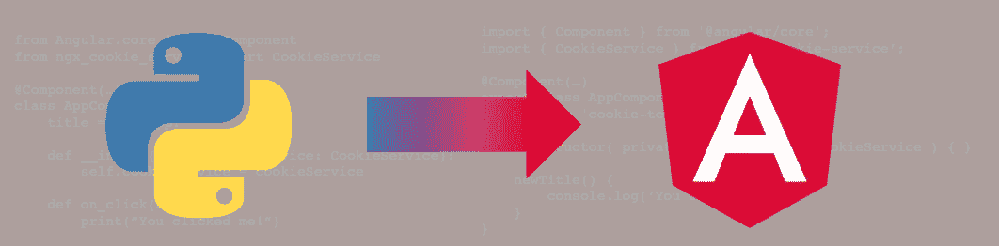
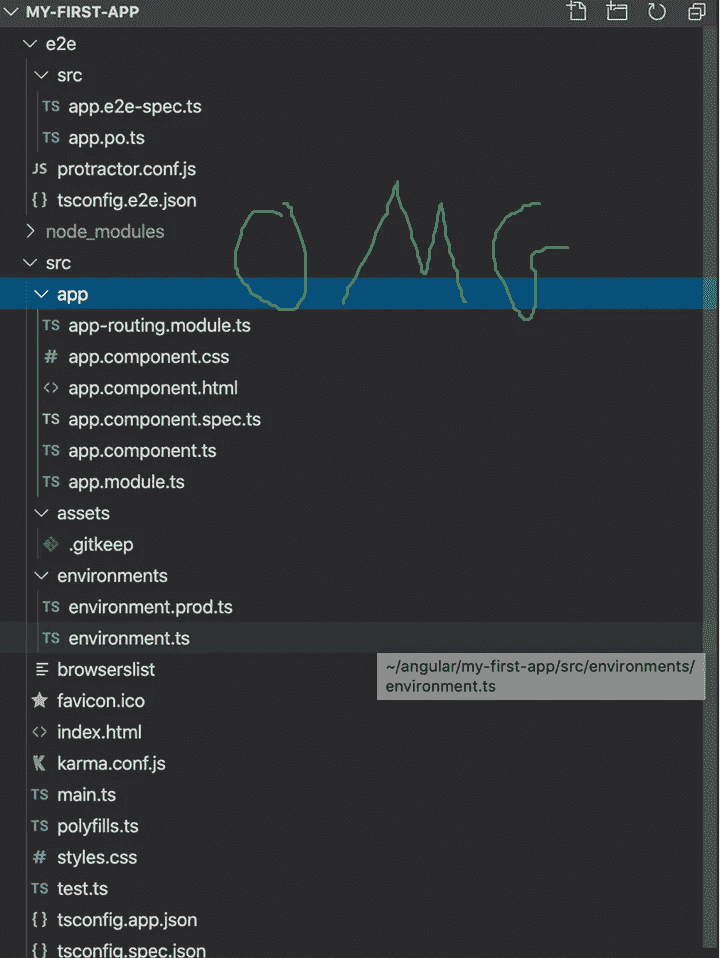
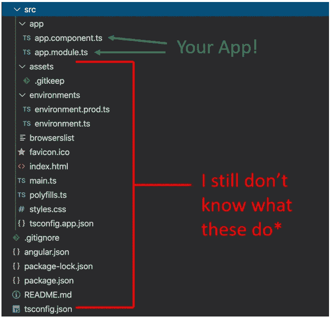

# 为受挫的 Python 开发人员介绍 Angular

> 原文：<https://medium.com/analytics-vidhya/gentle-intro-to-angular-for-frustrated-python-devs-9eb584c98463?source=collection_archive---------5----------------------->



作为 Angular 的新手，我仍然对自己的学习曲线有着新鲜的看法。作为一名具有面向对象经验的 Python 开发人员，我希望有人告诉我这些事情。

## 你的第一个(也可能是最后一个)Angular 应用

你还记得你写的第一个 Python 程序吗？这可能是一个快乐的时刻，它包含了一个叫做`hello.py`的简单的一行程序的创建:

```
print("Hello World!")
```

这么简单！一个文件，一行代码，它可以在任何版本的 Python 3 上运行。

现在，对于你的第一个 Angular 应用程序，你已经熟悉了 HTML、JavaScript 和 Typescript，你有了舒适的袜子和 2 小时的空闲时间。在浏览了一些教程后，您可能决定通过键入`ng new`来深入研究。如果您过去使用过 React，您可能希望它是一个独立的。js/。ts 文件已准备好由您喜欢的后端模板管理器提供服务。

继续，输入`ng new my-first-app`。我谅你也不敢。

在回答了几个无关紧要的问题并按下回车键后，你的控制台爆发出编译和文件创建的狂潮。10 秒钟和 31 个文件之后，你就有了你的“Hello World！”Angular 应用程序已创建。



一个人不能简单地“涉猎”角

可悲的是，这是大多数教程开始和热情结束的地方。

## 你的第二个应用

棱角分明是个庞然大物。它有一个内置的测试套件、git repo、linter 配置文件、Angular prod/dev 设置文件，甚至可以准备您的节点环境。也许未来的版本会帮你报税。以后，这一切可能会超级棒，但对于那些只想要一个 Hello World 示例的人来说，这可能是一件令人焦虑的事情。

幸运的是，这些东西大部分都可以忽略。有些甚至可以去掉。

对于更轻量级的东西，请尝试`ng new my-second-app --minimal --skip-git`。这在没有测试的情况下构造了我们的新项目 git，并将模板`.html`文件嵌入到实际的脚本中。这并不完全是“准系统”，但我希望现在你已经知道什么是不“准系统”的事情。



*好的，我知道他们中的一些人在做什么。

使用忽略事物的力量，我们的应用程序现在只有 2 个文件！:`app.module.ts`和`app.component.ts`。(如果我们真的想的话，我们可以把它们结合起来)。至于其他文件，暂时不用担心。他们在那里是有原因的。你会发现 Angular 就像一个 Flask 或 Django 或 Kivy 应用程序，或任何其他由一些神秘的后端力量执行的框架。您定义了函数和类，但是其他东西运行它。我们忽略的文件控制着这种行为。

## 简单的应用结构

## app.module.ts —项目定义

大多数通用编程语言都有类似的格式。一些导入，一些类声明，和一些函数。有角也不例外；如果你用 Python 做过面向对象的编程，或者使用过 Flask 这样的框架，你应该会开始觉得熟悉了。

看看`app.module.ts`，它定义了我们整个应用的结构:

```
import { BrowserModule } from '@angular/platform-browser';
import { NgModule } from '@angular/core';import { AppComponent } from './app.component';@NgModule(
  {
    declarations: [AppComponent],
    imports: [BrowserModule],
    providers: [],
    bootstrap:[AppComponent]
  }
)
export class AppModule { }
```

这里没有 HMTL，只有一些导入和一个空的(但是装饰过的)类。检查进口:

1.  `BrowserModule` —我不知道这是做什么的，但目前为止我不需要。
2.  `NgModule` —这是代码中使用的装饰器，也是 Angular core 的一部分。就像 Python 中的 Flask 一样，decorators 是 Angular 中真正的魔法。这告诉 Angular，这是你的应用程序的起点。
3.  `AppComponent` —这是你的应用！或者，它至少是你的应用程序中的一个组件。像`app.module.ts,`一样，它位于`/src/app`目录中。它提供了我们的`AppComponent`类，我们将修改它来改变我们的网站。

接下来是一些真实的代码。

这看起来很乱(乍一看)，但仔细一看，至少很熟悉。类本身不做任何事情。装饰器`@NgModule`将这个空类变成一个角度模块，并定义了`declarations`、`imports`、`providers`和`bootstrap`。TypeScript 中的装饰器与 Python 中的非常相似；他们只是修改他们正在装饰的物体/功能。在这种情况下，装饰者添加了一些特定于角度的属性，使它看起来像一个角度模块。没有装饰者也可以写这个[，但是我觉得这样干净多了。为什么 Angular 选择了 decorators 而不是继承，或者他们自己的预定义类的实例？谁知道呢。不管怎样:](https://embed.plnkr.co/on3W4t/)

1.  `declarations` —这是我们 Angular 应用中每个组件的列表。我们现在只有一个。
2.  `imports` —这些是组件所需的导入或包。
3.  `providers` —这些是 Angular 将准备并注入组件的类别。在本文的“奖励:构造函数”一节中，`CookieService`将作为一个提供者包含在内。
4.  `bootstrap` —你的应用入口。在这种情况下，它是在`app.component.ts`中定义的`AppComponent`。

`app.module.ts`没有什么太壮观的东西；它主要定义了我们项目的范围。对于实际的网站，看看`app.component.ts`。

## app . component . ts-您的网站

```
import { Component } from '@angular/core';@Component(
  {
    selector: 'app-root',
    template: `<div>{{title}}</div>`,
    styles: []
  }
)
export class AppComponent {
    title = 'my-second-app';
}
```

不同的文件，相同的故事:装饰类。然而，代替`@NgModule`的是`@Component`。组件是在你的网站上显示的实际部分。装饰器属性包括:

1.  `selector` —这是将被组件替换的 HTML 标签。在这种情况下，它是`app-root`，这意味着 Angular 将在上面的目录中的`index.html`中找到`<app-root></app-root>`——是的，我们刚刚弄清楚其中一个文件是做什么的！
2.  `templateUrl` —这是该组件的 HTML 模板。如果你做了`--minimal`，这将是真正的 HTML(为了简洁，我用`<div>{{title}}</div>`代替了它。如果没有，这将是一个模板`.html`文件。
3.  `styleUrls` —完全公开，我不是 UI/UX 的人(还不是？)，而且我鄙视用 CSS 工作。但是你可以在这里找到它。

## 角分量只是一个物体

所以 HTML 在一个单独的文件/blob 中，它是在装饰器中定义的…那么实际的类做什么呢？

当然是运行我们的代码！现在只有一行字:`title = my first app`。让我们想象 Angular 是为 Python 编写的。在这种情况下(完全公开，我从未在 Python 中使用过类装饰器),我们上面的代码看起来像这样:

```
from Angular.core import Component@Component(
    selector="app-root",
    templateURL="""<div>{{title}}</div>""",
    styleUrls=[]
)
class AppComponent():
   title="my-second-app"
```

Python-Angular 应用程序会惊人地相似。将 TypeScript 与 Python 进行比较，很明显`title`只是一个 TypeScript 类属性(或 Python 类属性)。这里有一个重要的注意事项:我们的 HTML 模板可以访问类属性。

再看一下“最小”模板文本，注意嵌入在 HTML 中的`{{title}}`内容。可能很明显，这显示了页面标题，花括号是负责任的。但是到底发生了什么？

1.  花括号表示从应用程序到视图的单向绑定。如果`AppComponent.title`变了，`{{title}}`也会变。习惯听到“绑定”；这仅仅意味着一件事(例如 angular 应用程序)导致另一件事(例如网页)发生变化。
2.  那么为什么`{{title}}`在楼盘名称前不需要`this.`或者`self.`或者`AppComponent.`？因为模板存在于类中！装饰者将其作为类属性注入。所以事实上，HTML 能看到的唯一变量是它自己的类属性！

## 角度组件有类方法

以上是一个单向绑定的例子，用于从应用程序更新视图。相反的单向绑定是视图通过事件更新应用程序。

让我们创建一个按钮，它调用一个类方法并将标题更改为“Clicked Title”:

```
import { Component } from '@angular/core';@Component(
  {
    selector: 'app-root',
    template: `<button (click) = "newTitle()">{{title}}</button>`,
    styles: []
  }
)
export class AppComponent {
    title = 'my-second-app'; newTitle() {
      this.title = 'Clicked Title';
      console.log('Title was changed!');
    }
}
```

在我们想象的 Python Angular 语言中，这可能看起来像:

```
from Angular.core import Component@Component(
    selector="app-root",
    templateURL="""
      <button (click) = "newTitle()">
        {{title}}
      </button>""",
    styleUrls=[]
)
class AppComponent():
  title="my-second-app" def newTitle(self):
    self.title="Clicked Title"
    print("Title was changed!")
```

太好了！在我们的 HTML blob 中，我们可以访问类方法！而类方法，当然可以访问类属性！注意`click`属性周围的`()`。括号让 Angular 知道它正在寻找一个类方法来生成一个事件——在本例中是`AppComponent.newTitle()`。

## 奖励:构造函数(又名 __init__())

通常需要将库和函数导入到组件中。以`CookieService`为例，它处理作为 Cookies 的变量的保存和检索。不是`pip install ngx-cookie-service`，是`npm install ngx-cookie-service`。

如果我们安装这个库并将其合并到我们的示例中:

```
import { Component } from '@angular/core';
import { CookieService } from 'ngx-cookie-service';@Component(
  {
    selector: 'app-root',
    template: `<div></div>`,
    styles: []
  }
)
export class AppComponent {
    title = 'cookie-test';

    constructor( private cookieService**:** CookieService ) { } newTitle() {
      this.title = 'Clicked Title';
      console.log('Title was changed!');
      this.cookieService.set('title', this.title);
      this.title = this.cookieService.get('title'); }
}
```

在我们想象的 Python Angular 项目中，这可能看起来像:

```
from Angular.core import Component
from ngx_cookie_service import CookieService@Component(
    selector="app-root",
    templateURL="""<div></div>""",
    styleUrls=[]
)
class AppComponent():
  title="my-second-app" def __init__(self, cookieService: CookieService):
    self.cookieService = cookieService def newTitle(self):
    self.title = "Clicked Title"
    print("Title was changed!")
    self.cookieService.set('title', self.title)
    self.title = self.cookieService.get('title')
```

`constructor`在 Python 中简单来说就是`__init__`！在 Angular 示例中，`cookieService`将是`app.module.ts`中的提供者，它将在 TypeScript 类型的帮助下被注入到`AppComponent`中。在 Python 示例中，我必须使用类型提示向我们想象的角度后端表明这应该是一个 CookieService 对象。

此外，你是正确的:上面的例子没有做任何有用的事情。

## 相同但不同

Python 和 Angular 显然是完全不同的野兽，但所有面向对象编程在某种程度上都是相似的。在任何情况下，你都有一个类，你有属性，你有类方法。所有的 Angular 都是面向对象的编程。

如果有什么是你应该从中吸取的，只要记住:一个角组件只是一个类！

## 进一步阅读

有了这种新的心态，为什么不再看看[之旅英雄角教程](https://angular.io/tutorial)？

此外，请务必复习以下内容:

1.  [Python 面向对象编程](https://realpython.com/python3-object-oriented-programming/)
2.  [面向对象编程](https://www.typescriptlang.org/docs/handbook/classes.html)