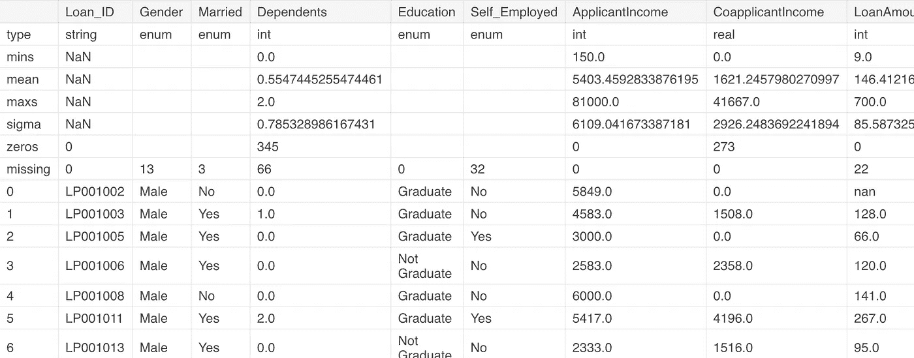

# 来自 H2O.ai 的 AutoML 温柔介绍

> 原文：<https://medium.com/analytics-vidhya/gentle-introduction-to-automl-from-h2o-ai-a42b393b4ba2?source=collection_archive---------0----------------------->


近年来，数据科学技能及其需求的趋势超过了技能供应。随着人工智能渗透到行业的每个角落，很难将数据科学家放在每个可能的用例中。

为了弥合这一差距，公司已经开始构建自动处理数据集和构建基线模型的框架。我们看到许多这样的实现都是开源的。据行业领军人物之一， [H2O.ai](https://medium.com/u/9aea625dfc27?source=post_page-----a42b393b4ba2--------------------------------) ，

> AutoML 接口被设计为具有尽可能少的参数，使得用户所需要做的就是指向他们的数据集，识别响应列，并且可选地指定时间约束或对训练的总模型数量的限制。

根据 Google Trends，Auto ML 的兴起始于 Q2 2017:


AutoML 谷歌趋势

AutoML 是 H2O 的一个功能，它可以自动构建大量模型，目标是在没有任何先验知识的情况下找到“最佳”模型。在本文中，我们将从 H2O.ai 中了解 AutoML。

该实现在 R 和 Python API 中都可用，当前版本的 AutoML(在 H2O 3.20 中)执行:

1.  训练并交叉验证默认随机森林(DRF)、极度随机森林(XRT)、梯度推进机器(GBM)的随机网格、深度神经网络的随机网格、glm 的固定网格。
2.  AutoML 然后训练两个堆叠集成模型。
3.  第一个集成包含所有模型，第二个集成仅包含每个算法类中性能最好的模型。

# 安装 H2O.ai

安装程序非常简单。你所需要做的就是安装以下依赖项，然后`pip`安装；

```
pip install requests
pip install tabulate
pip install "colorama>=0.3.8"
pip install futurepip install **-**f [http:**//**h2o**-**release**.**s3**.**amazonaws**.**com**/**h2o**/**latest_stable_Py**.**html](http://h2o-release.s3.amazonaws.com/h2o/latest_stable_Py.html) h2o
```

如果您已经安装了 anaconda，您可以直接使用`conda`命令；

```
conda install -c h2oai h2o=3.20.0.1
```

**注意**:在 OS X El Capitan 中从`pip`安装 H2O 时，用户必须包含`--user`标志。比如说-

```
pip install -f [http://h2o-release.s3.amazonaws.com/h2o/latest_stable_Py.html](http://h2o-release.s3.amazonaws.com/h2o/latest_stable_Py.html) h2o --user
```

关于 R 和 Hadoop 的安装，请参考官方文档[这里](http://docs.h2o.ai/h2o/latest-stable/h2o-docs/downloading.html#install-in-r)。

# 入门指南

通过导入 H2O.ai 和 H2OAutoML 实例来启动 h2o.ai 实例。

```
import h2o
from h2o.automl import H2OAutoML
h2o.init()
```

如果设置成功，将会看到以下集群信息。


在本例中，我们将使用 DataHack 练习题[贷款预测 III](https://datahack.analyticsvidhya.com/contest/practice-problem-loan-prediction-iii/) 中的数据集

这里的目标是预测客户是否会支付贷款，其中我们提供了详细信息，如性别、婚姻状况、教育程度等。

首先，让我们导入训练集并检查`.head()`和数据帧的数据类型。

```
df = h2o.import_file('train_u6lujuX_CVtuZ9i.csv')
df.head()
```


。head()方法框架

让我们用`.describe()`方法检查数据类型。



正如您在这个例子中看到的，我们的目标变量— `Loan_Status`的数据类型是 enum 类型。如果它被称为 int 类型，那么您必须使用以下命令将数据类型更改为 enum:

```
df[target] = df[target].asfactor()
```

**注意:如果不这样做，AutoML 会认为这是一个回归问题，如果你运行模型超过 10 个小时，代价会很大。**

所以，一定要小心。我想知道如果目标`y`有`nunique==2`，H2O.ai 开发者是否可以在后端自动转换这个。

现在我们必须分离特征和目标变量。AutoML 函数采用`x`和`y`变量中的特征和目标。

```
y = "Loan_Status"
x = ['Gender','Married','Education','ApplicantIncome',
    'LoanAmount','CoapplicantIncome','Loan_Amount_Term',
    'Credit_History','Property_Area']
```

太好了！现在我们准备启动汽车

```
aml = H2OAutoML(max_models = 30, max_runtime_secs=300, seed = 1)
aml.train(x = x, y = y, training_frame = df)
```

然后，您可以配置`max_runtime_secs`和/或`max_models`的值，为您的跑步设置明确的时间或型号数量限制。该模型将根据所提供的参数进行训练。在本教程中，我们用大约 2 分钟的时间来训练没有多少功能的模型。


一旦模型完成训练，您就可以访问**排行榜**。领先者模型存储在`aml.leader`处，排行榜存储在`aml.leaderboard`处。排行榜存储顶级模型的快照。顶级模型通常是堆叠的集合，因为它们可以轻松胜过单个训练模型。要查看整个排行榜，请将`head()`方法的`rows`参数指定为总行数:

```
lb = aml.leaderboard
lb.head()
lb.head(rows=lb.nrows) # Entire leaderboard
```


最佳模型得分 *0.77431 AUC。鉴于我们没有进行任何种类的预处理或模型调优，这是一个很好的成绩！*

## 预测和保存模型

你可以用最佳领导者模型来做预测。这可以通过使用以下命令来完成:

```
preds = aml.predict(test)
```

下一步是保存训练好的模型。有两种方法保存领导者模型——二进制格式和 MOJO 格式。如果您要将 leader 模型投入生产，那么建议使用 MOJO 格式，因为它是为生产使用而优化的。

```
h2o.save_model(aml.leader, path = "./Loan_Pred_Model_III_shaz13")
```

# 我们对汽车的看法

AutoML 会留在这里。我渴望看到数据科学进一步发展的方向。就特征工程而言，单个自动混音器肯定无法胜过人类的创造性思维，但以我的经验来看，AutoML 值得探索。

虽然 AutoML 本身不会让你在机器学习竞赛中获得冠军，但它绝对值得考虑作为混合和堆叠模型的补充。在最近的比赛中，AutoML 模型大大提高了我的分数，这使我开始探索并专注于混合部分。我强烈推荐看看 [H2O.ai](https://medium.com/u/9aea625dfc27?source=post_page-----a42b393b4ba2--------------------------------) 的 AutoML。并且，一定要让我知道你对它的看法，以及你对其他自动建模功能的体验。