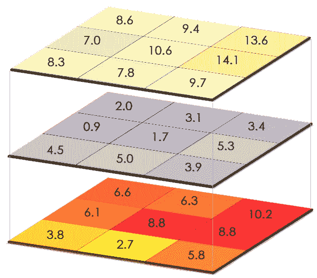

# 面向 Python 的地理成像系统(GIS)——简介

> 原文：<https://medium.com/analytics-vidhya/geographic-imaging-systems-gis-for-python-a-brief-introduction-f10b6f8fccee?source=collection_archive---------14----------------------->

## 可视化纽约市的医院设施分布

**地图投影/坐标参考系统:**
地图投影是一种在二维表面上显示三维数据的方式——最常用于在计算机屏幕或纸上显示地图数据，而不是投影到地球仪上。地球表面位置的纬度和经度必须转换成平面上的位置。这不可避免地会带来一定程度的扭曲。就我们的目的而言，地图投影和坐标参考系统(crs)本质上是一回事。

如果想要正确地绘制数据，投影的选择可能很重要，因为数据的显示方式会改变对数据的理解方式。在全局数据的情况下，[这张 XKCD 漫画](https://imgs.xkcd.com/comics/map_projections.png)展示了根据您选择的投影，您的结果可能看起来**完全**不同的方式。

本教程更加本地化，将集中在纽约市，我们实际上有一个坐标系的选择。这里，我们将使用 WGS 84/EPSG: 4326 地图，表示 WGS 84 参考椭球面上的纬度和经度坐标。参考椭球是一个数学定义的表面，它近似于地球的真实形状(或多或少是一个扁平的球体)。全球定位系统(GPS)和 OpenStreetMap 也使用 WGS 84 参考椭球。


[NYCityMap &超越](https://nycitymap.wordpress.com/2016/09/)

## GIS 数据类型


[矢量数据示例](https://gisgeography.com/spatial-data-types-vector-raster/)



[栅格数据示例](https://gisgeography.com/spatial-data-types-vector-raster/)

**矢量:**由顶点和路径组成
*点:x，y 坐标(想想 GPS 坐标)
*线:点之间的线(道路、河流、管道)
*多边形:用于显示与区域的边界/单元(邮政编码、市议会区)

**栅格:**由像素/网格单元构成
*离散:分类数据(陆地与海洋、城市与农村)
*连续:连续数据(海拔、温度、溢油周围的石油浓度)

有关 GIS 数据类型之间差异的更多信息，请参见[此链接](https://gisgeography.com/spatial-data-types-vector-raster/)。

## 使用 GeoPandas:

本教程将重点介绍矢量数据类型，特别是多边形和点。

```
# Import necessary libraries
import numpy as np
import pandas as pd
import geopandas as gpd
import scipy
import shapely
import matplotlib.pyplot as plt
```

对于 GeoPandas 中的 GIS 绘图，我们的数据必须有一个“geometry”列，其中包含所讨论的 GIS 数据类型的值-点、线、面等等。为了展示这个例子，我们使用纽约市邮政编码，这是纽约市开放数据公司提供的。

**盲目地使用你的形状文件:**

```
# Read in shapefile of NYC zipcodes
gdf = gpd.read_file('./zipcodes/ZIP_CODE_040114.shp')
```


注意:要做到这一点，所有其他相关文件(如下所示)必须与。shp 文件-


看看第一个邮政编码多边形:

```
gdf['geometry'][0]
```


还要注意几何列中为此多边形的边界给出的值:


这些值不像纬度和经度那样是容易理解的地理坐标参考。相反，它们是上面提到的参考椭球上的坐标——对于我们的目的来说，它们完全没有意义，因为我们没有它们的上下文。看看用这些坐标生成的地图:

```
fig, ax = plt.subplots(figsize = (6, 6))
gdf.plot(ax = ax);
ax.set_title('NYC Zipcodes', fontsize = 20);
```


参考椭球面上的纽约市邮政编码

地理形状是可以辨认的，但是坐标是天书。我们如何解决这个问题？一种方法可能是将这个邮政编码数据集与一个仍然使用邮政编码的数据集配对，但也包含纬度和经度坐标以供参考。在这种情况下，我们将使用[医院设施数据集](https://data.cityofnewyork.us/Health/NYC-Health-Hospitals-patient-care-locations-2011/f7b6-v6v3)，同样来自纽约市开放数据。

```
hospdf = pd.read_csv('./NYC_Health___Hospitals_Facilities_-_2011.csv')
hospdf.head()
```


下一步是将此 Pandas 数据框架转换为 GeoPandas 数据框架，它实际上是一个带有几何列的 Pandas 数据框架，但具有对某些 GIS 功能的额外访问权限:

```
hosp_gdf = gpd.GeoDataFrame(hospdf, geometry=gpd.points_from_xy(hospdf.Longitude, hospdf.Latitude))
```

现在，看看当我们绘制网格医院位置时会发生什么:

```
hosp_gdf.plot(figsize = (9,9));
plt.title('Hospital Facilities in NYC', fontsize = 20);
plt.xlabel('Longitude', fontsize = 16);
plt.ylabel('Latitude', fontsize = 16);
```


纽约市医院位置

我们有医院的位置，但没有地理参考！！接下来，我们尝试在同一块土地上绘制我们的邮政编码和医院。那应该是有帮助的，对吗？

```
fig, ax = plt.subplots(figsize = (9,9))
gdf.plot(ax = ax);
hosp_gdf.plot(ax = ax, color = 'r');
ax.set_title('Hospital Facilities in NYC', fontsize = 20);
```


纽约市邮政编码和医院(无益)

事实证明，没有那么多。多边形边界需要位于正确的参考系中-仅有适当的网格化点是不够的。

## **现在我们已经学得更好了:**

让我们再试一次——这一次，通过读取转换到本文开头提到的 EPSG 4326 坐标参考系统的纽约市邮政编码数据。

```
gdf = gpd.read_file('./zipcodes/ZIP_CODE_040114.shp').to_crs(epsg=4326)
```

这个数据帧看起来像什么？


注意，这里的多边形边界值是更容易识别的经纬度坐标。


当我们现在绘制这些数据时会发生什么？

```
fig, ax = plt.subplots(figsize = (9, 9))
gdf.plot(ax = ax);
ax.set_title('NYC Zipcodes', fontsize = 20);
```


EPSG 4326 坐标系中的纽约市邮政编码

接下来，让我们再次尝试将邮政编码和医院放在一起:

```
fig, ax = plt.subplots(figsize = (9,9))
gdf.plot(ax = ax);
hosp_gdf.plot(ax = ax, color = 'r');
ax.set_title('Hospital Facilities in NYC', fontsize = 20)
ax.set_xlabel('Longitude', fontsize = 16);
ax.set_ylabel('Latitude', fontsize = 16);
```


纽约医院和邮政编码(好多了！)

**下一步:**
1。清理两个数据帧(去掉 nan，将 zipcodes 转换成`int`数据类型，等等)
2。在医院数据框上按邮政编码分组，以获得每个邮政编码的医院数量
3。将其与共享邮政编码/邮政编码列
4 上的邮政编码数据帧合并。将其转换为 GeoPandas 数据帧

```
# Merge hospital data with zipcode polygons for easy plotting
gdf_merge = hosp_agg.merge(gdf, left_on = 'Postcode', right_on = 'ZIPCODE')# Create Gepandas DataFrame from merged data
gdf_geo = gpd.GeoDataFrame(gdf_merge, geometry = gdf_merge.geometry, crs = {'init':'epsg:4326', no_defs':True})
```

绘制时这个看起来像什么？

```
# Plot # of hospitals per zip
fig, ax = plt.subplots(figsize = (13, 13))
gdf.plot(ax=ax, color='white', edgecolor='black')
gdf_geo.plot('Facility Type', legend=True, ax=ax,  # All df columns are identical
            cmap='viridis_r', legend_kwds={'fraction':.035}, # Scale legend height to plot
             vmin = 0)
ax.set_title('Hospitals per Zipcode', fontsize = 20)
ax.set_xlabel('Longitude', fontsize = 16)
ax.set_ylabel('Latitude', fontsize = 16)
plt.show()
```


我们可以绘制不同邮政编码的医院分布图，而不是绘制单独的数据点。

**TL；
博士:** 1。确保多边形数据参考了可用的坐标系。
2。参见第 1 点。
3。你确定你已经完成了#1 吗？如果是，继续#4。
4。与您希望映射的数据合并。
5。制作有助于讲述故事的功能地图。