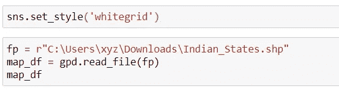
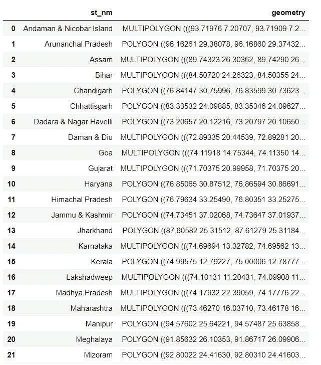
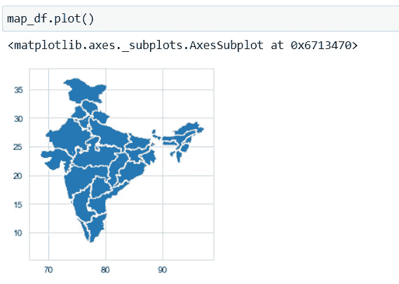
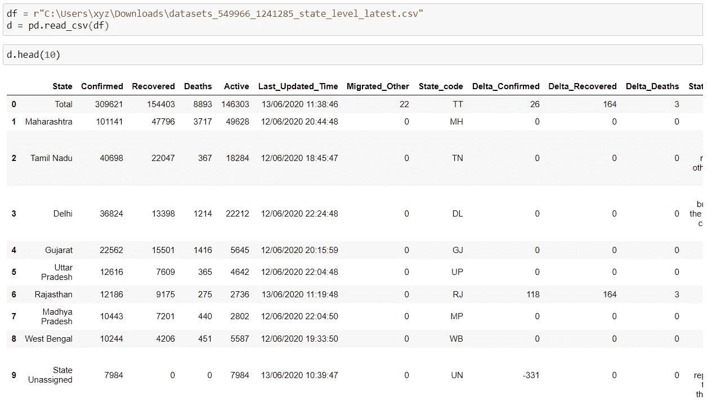
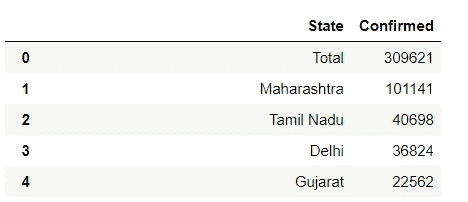
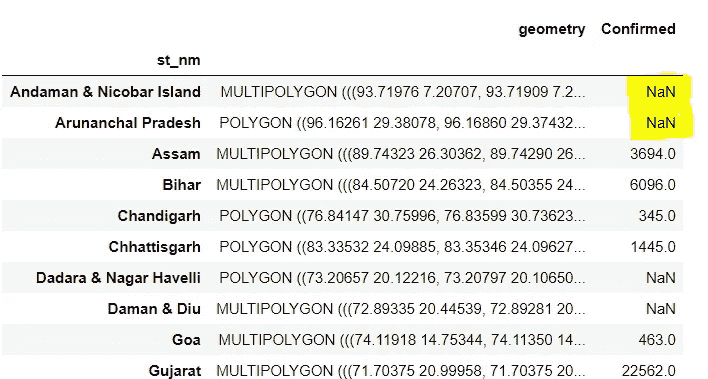
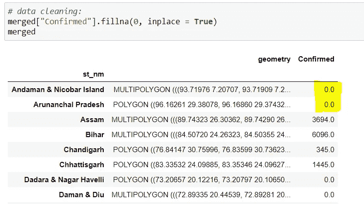
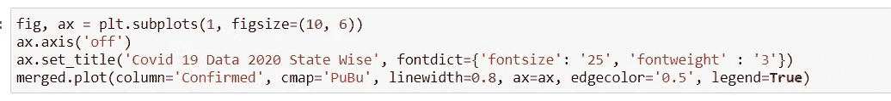
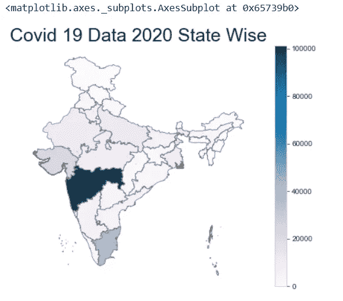

# 地理制图以可视化印度的新冠肺炎病例

> 原文：<https://medium.com/analytics-vidhya/geographical-mapping-to-visualize-covid-19-cases-in-india-6b6d67028da9?source=collection_archive---------32----------------------->


> 从原始数据中提取可操作的见解就是我们所说的数据科学。它是一个跨学科领域，使用科学方法、过程、算法和系统从许多结构化和非结构化数据中提取知识和见解。

冠状病毒或**新冠肺炎**无需介绍。它已经被世卫组织宣布为疫情，在过去的几周里，它的影响是有害的。 ***在这篇文章中，我将讲述如何使用地理图可视化新冠肺炎数据集，以及如何使用 python 追踪新冠肺炎在印度的传播。***

**目的:使用 Python 在印度地图上绘制出印度有冠状病毒病例的邦。**

# **使用的包:**

1-熊猫

2-MATLAB 程序库

3- Seaborn

4- GeoPandas

# 收集数据:

> 对于新冠肺炎数据集，我已经下载了。csv 文件包含最新的新冠肺炎记录在印度各州。
> 
> 为了得到印度地图，我已经从 www.igismap.com 的[](http://www.igismap.com)****下载了印度州的形状文件。****

# **让我们直接进入代码:**

## **步骤 1:导入必要的库→**

```
import seaborn as sns
import geopandas as gpd
import pandas as pd 
import numpy as np 
import matplotlib.pyplot as plt
```

## **步骤 2:导入形状文件→**

****

**导入形状文件后，输出如下:**

****

## **第三步:绘制地图→**

****

## **步骤 4:现在，导入新冠肺炎。您下载的 csv 文件→**

****

## **步骤 4:从数据集中删除不必要的列，因为我们只关心州和确诊病例→**

```
d.drop(['Recovered','Deaths','Active','Last_Updated_Time','Migrated_Other','State_code','Delta_Confirmed','Delta_Recovered','Delta_Deaths','State_Notes',],axis = 1,inplace =True)
```

**以下是输出:**

****

**仅包含州和确诊病例的记录**

## **步骤 5:这是最重要的一步，因为在这一步中，我们必须连接两个数据集以获得所需的结果→**

****

**使用连接操作连接两个数据帧**

****

> **由于上面的输出包含 **NaN** 值，所以我正在对获得的数据集执行数据清理，以便用 0 替换 **NaN** 值。**

****

**数据现已清除**

****步骤 6:最后，编写绘制图形的代码→****

****

**将获得以下输出:**

****

**地图显示了印度受冠状病毒影响最严重的邦。**

# **完整的代码如下:**

```
import seaborn as sns
import geopandas as gpd
import pandas as pd 
import numpy as np 
import matplotlib.pyplot as pltsns.set_style('whitegrid')#importing the shape file:fp = r"C:\Users\LENOVO\Downloads\Indian_States.shp"
map_df = gpd.read_file(fp)
map_df
map_df.plot()# importing the covid-19 dataset csv file:df=r"C:\Users\xyz\Downloads\datasets_549966_1241285_state_level_latest.csv"
d = pd.read_csv(df)# dropping unwanted columns:d.drop(['Recovered','Deaths','Active','Last_Updated_Time','Migrated_Other','State_code','Delta_Confirmed','Delta_Recovered','Delta_Deaths','State_Notes',],axis = 1,inplace =True)d.head()# joining the dataframes:merged = map_df.set_index('st_nm').join(d.set_index('State'))
merged.head()# data cleaning:merged["Confirmed"].fillna(0, inplace = True) 
print(merged)# plot the graph:fig, ax = plt.subplots(1, figsize=(10, 6))
ax.axis('off')
ax.set_title('Covid 19 Data 2020 State Wise', fontdict={'fontsize': '25', 'fontweight' : '3'})
merged.plot(column='Confirmed', cmap='PuBu', linewidth=0.8, ax=ax, edgecolor='0.5', legend=True)
```

> **因此，在上述代码的帮助下，通过在地图上绘制，人们可以很容易地跟踪和可视化印度不同邦的新冠肺炎病例。**

# **谢谢大家！！😊**