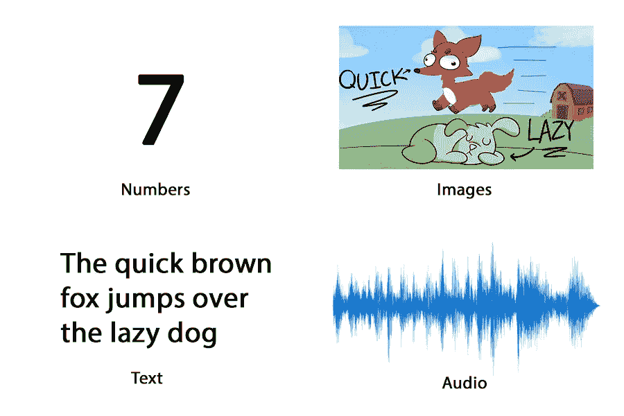
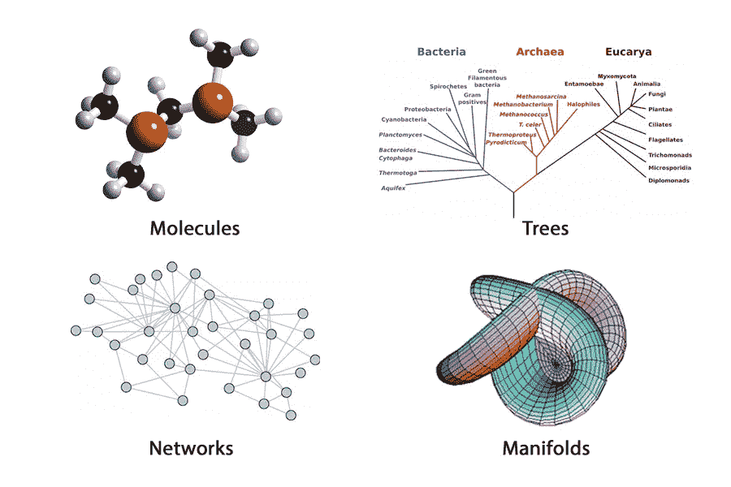
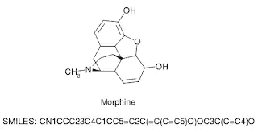
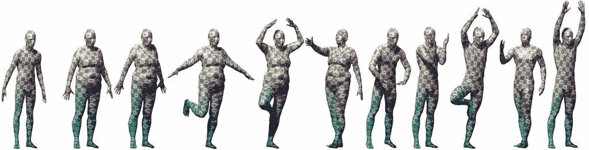
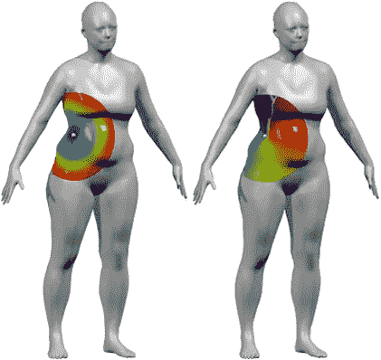
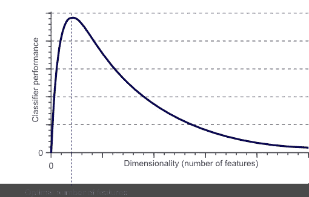
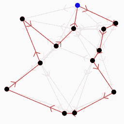

# 几何深度学习

> 原文：<https://medium.com/analytics-vidhya/geometric-deep-learning-eae0d3f91e44?source=collection_archive---------5----------------------->

在这篇短文中，我们将讨论“几何深度学习”，这是一种在图形和 3D 对象数据上工作的深度学习。如果您想为企业处理这些类型的数据，了解这种技术是很有用的。

下面是一个代码示例:[https://github.com/rusty1s/pytorch_geometric](https://github.com/rusty1s/pytorch_geometric)

部分视频讲座:[https://sung soo . github . io/2018/02/01/geometric-deep-learning . html](https://sungsoo.github.io/2018/02/01/geometric-deep-learning.html)

以及一篇相关博文:[https://towards data science . com/graph-convolutionary-networks-for-geometric-deep-learning-1 fa f17 dee 008](https://towardsdatascience.com/graph-convolutional-networks-for-geometric-deep-learning-1faf17dee008)

好吧，让我们开始吧！

大量的深度学习是在欧几里德数据上进行的。所有欧几里得数据包括图像、文本、音频和许多其他数据。

非欧几里得数据可以比 1D 或 2D 表示法更精确地表示更复杂的对象和思想:

当我们用非欧几里得的方式表示东西时，我们给了它一个归纳偏差。这是基于这样一种直觉，即给定任意类型、格式和大小的数据，通过改变该数据的结构，可以对模型进行优先级排序以学习某些模式。所使用的归纳偏差在大多数目前的研究努力和文献中是相关的。基于这种直觉，几何深度学习是深度学习保护伞下的利基领域，旨在构建可以从非欧几里德信息中学习的神经网络。

图形是非欧几里得数据类型的主要实例。图是一种由边连接的节点(实体)组成的数据结构。使用这种抽象数据结构来建模几乎任何东西都是可能的。我们想从图表中学习，因为:图表允许我们表示个人特征，同时也提供关于关系和结构的信息。

有不同种类的图，每一种都有一套规律、特征和可行的行为。图论是研究图形以及我们能从图形中学到什么。本系列的下一部分将讨论这个问题。
几何深度学习的例子这是两个最常见的应用和文献研究重点。它们经常被用作基准(非官方的)。

## **分子建模与学习**

我们可以看看计算科学，来具体说明图学习如何增强当前的机器学习功能。表示的概念、实体和关系是计算化学、生物学和物理学的瓶颈之一。科学本质上是经验性的，因此是许多内部变量和相互作用的结果。

这里有一些最明显的例子:蛋白质相互作用网络、神经网络、分子、费曼图、宇宙学地图等。我们目前对这些想法的计算表示技术可以被认为是“有损耗的”,因为我们丢失了许多宝贵的数据。例如，使用简化的分子输入行输入系统(SMILE)字符串来表示分子很容易计算，但会牺牲分子结构信息。

通过将原子视为节点，将键视为边，我们可以保存可用于下游预测或分类的结构数据。因此，我们可以使用分子图作为其几何等价物的输入，而不是使用代表分子的字符串作为递归神经网络(RNN)的输入。

## **3D 建模和学习**

作为几何深度学习如何让我们从从未使用过的数据类型中学习的一个例子，考虑一个人对着相机摆姿势:人们为 2D 照片拍摄摆姿势。这张照片是 2D，尽管我们知道它代表了我们脑海中的一个三维个体。我们目前的算法，即卷积神经网络(CNN)，正在预测标签，如仅给出 2D 图片的个体姿势和/或姿势类型。当体式变得极端时，困难就出现了，角度不再固定。照片中可能经常有衣服或物品阻挡了算法的视角，使得很难预测姿势。

现在想象同一个人摆姿势的 3D 模型:CNN 现在可以在物体本身上运行，而不是在物体的 2D 图片上运行。

显然，正如 2D 屏幕上显示的，这是一个 3D 模型，但要发挥你的想象力！(莫奈团队的礼貌)与其学习将信息限制在单一视角的 2D 表示法，不如想象一下，如果我们可以直接在物品本身上进行转换。与传统的 CNN 类似，每个“像素”表示为点云中的一个节点(基本上是一个围绕 3D 对象的图形)，将通过内核。它将覆盖 3D 模型上的每个角落和缝隙，并考虑数据。简而言之，普通 CNN 与几何等效物之间的区别是预测提供图像的 n 个对象标签，而不是预测给定 3D 模型的对象标签。

随着我们的 3D 建模、设计和打印技术的改进，人们可以想象将会实现多么精确和准确的结果。

## **维度的情况**

维度的概念已经普遍用于数据科学和机器学习，其中“维度”的数量与数据集中每个示例/数据点的特征/属性的数量相关。

起初，机器学习算法的效率在许多特征(维度)之后达到性能水平。这被称为维度诅咒。这个问题不是几何深度学习能解决的。相反，当使用具有许多特征的数据类型时，诸如图转换之类的算法降低了性能损失，因为关系数据被归纳偏见而不是作为额外的函数来看待。

几何深度学习中的维度只是使用信息来训练神经网络的问题。欧几里德信息，而非欧几里德信息则忠实于非欧几里德几何，遵守欧几里德几何的规律。非欧几何可以用一句话来概括:“两点之间的最短路径不一定是直线。”

其他怪异的法律包括:

—室内三角形的角度总和总是超过 180 度

—平行线可以无限相交，也可以永不相交

-四边形形状可以用曲线作为边。

有一整个领域的非欧几里得几何是另一个单独的学科。为了增加一点直觉，可以拍摄任何图片，这是最常见的欧几里德数据类型之一。

像素艺术可以被概念化为一组放置有左、右、上和下活动的像素。像素图片具有左、右、上和下的概念。通过在图片上递归地翻译一个函数，可以穿过图片。这正是 CNN 正在做的。

图表没有基本的方向感；它们更抽象。但是在图上没有左、右、上、下的概念。只有一个节点链接到多个任意节点。甚至可以将节点连接到自身。

在使用非欧信息训练神经网络时，仍然存在传统意义上的机器和深度学习的维度。例如，有许多完全可行的节点特征，其中每个特征都是一个不同的“方面”但在文学作品中，这个词很少被用来描绘这一点。

总之，几何深度学习是深度学习中的一个利基，旨在将神经网络的模型推广到非欧几里德域，如图形和乘数。在个人和自然中自然出现的一个概念是关系、关系和共有特征的概念。这是我们理所当然地从这些链接中理解和学习的东西。几何深度学习很重要，因为它使我们能够利用具有内在关系、联系和共享特征的信息。