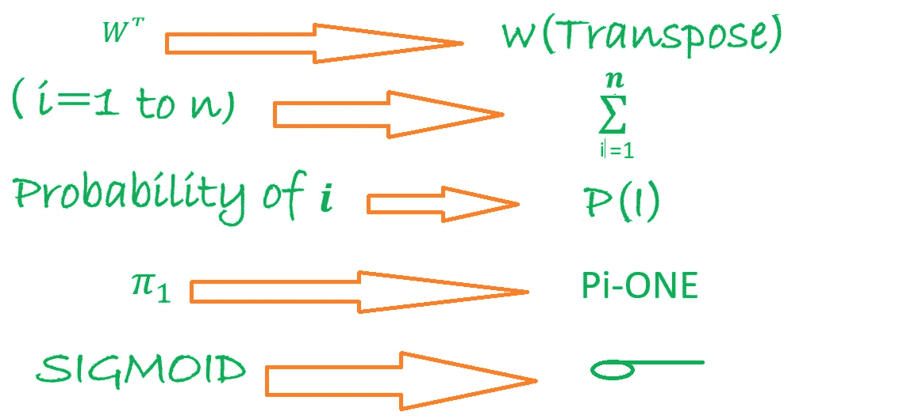

# 逻辑回归的几何直观

> 原文：<https://medium.com/analytics-vidhya/geometric-intuition-of-logistic-regression-2e2b57781743?source=collection_archive---------0----------------------->

**什么是逻辑回归:**

它是机器学习中使用的多类分类技术，用于预测类标签，即 Yi，s，其中 Yi 属于某个类，但不是真实值。

**让我们几何理解:**

**假设**:求解之前最大的假设是我们的数据是线性可分或者几乎线性可分的。现在我们有两类点，即正点和负点。

在上图中，我们有: **W** 垂直于平面，Pi(𝜋)平面

所以平面的方程将是: **W(转置)X+b=0** 其中 **b** 是标量

而如果我们让平面通过原点: **W(转置)X=0**

那么现在让我们给定数据集( **Dn)** 有正负点。

**逻辑回归中的任务是:**找出 **W** 和 **b** 找出一个平面，使得它分离正负点，即我们必须找到(𝜋).

在这里，在上面的图像 _1 中，我们可以找出从任意点到 Pi(𝜋).平面的距离我们还假设 W 是一个单位向量，垂直于平面。

所以现在通过下图看到有趣的部分，即如果我们计算:

1 正点到平面 **(** 𝜋 **)** 的距离为正，即 **di=W(转置)> 0** 因为( **W** 和 X **i** 在同一侧)。

**现在逻辑部分来了:**所以我们的分类器说！

如果 **W(转置)Xi > 0** ，那么 **Yi=+1** 和

如果 **W(转置)< 0** 则 **Yi=-1**

现在我们来看不同的案例:

**情况 1:对于阳性点:**

**l**et**pi(**𝜋**)**通过原点。

现在如果**易**为正即(+1)而 **W(转置)> 0 →(那么**我们的量词说！)**现在**如果

(**易*** **W(转置)> 0** 和**易**为正则 **W** 为正确分类正点。

**情况 2:针对负积分:**

让**圆周率(** 𝜋 **)** 通过原点

如果**易**是否定的，即(-1)**W(转置)< 0 (** 我们的量词说！)

**现在**如果:(**伊*W(转置)> 0** 和**伊**为负

因为(-)*(-)=(+)那么 **W** 就是对负分的正确分类。

**观察**:从上面的逻辑部分来看是:正反两面分！

如果( **Yi*** **W(转置)> 0 那么 L.R** 模型是正确分类了点 Xi，s **……**

现在以同样的方式对负点进行如下处理:

**情况 3:** 如果 Yi 是正的，即(+1)**W(转置)】< 0** 那么 **L.R** 就是说它是负类:

然后(**易*** **W(转置)< 0 即错过归类点。**

**情况 4:** 如果 Yi 为负，即(-1)**W(转置)】> 0** 那么 **L.R** 表示它是正类:

然后(**易*** **W(转置)< 0 即错过归类点。**

**观察**:从上面逻辑部分是:

对于正负两点:

如果(**易*** **W(转置)< 0)那么 L.R 模型是不正确地分类了点，s.**

在一天结束时，我们希望我们的分类器 V.good，即最小化错误分类的数量或最大化正确分类的点的数量。也就是说，我们希望尽可能多的点:

(【易*】**)W(转置)> 0**

**即:W*=arg max(w)(i=1 到 n):(易* W(转置)……..**(优化问题)

这里在上面的方程中**和**易**是固定的来自**(Dtrain)**现在我们必须在这里计算 **W** 变量，所以我们这里的优化问题是找到 W*(最优 W)最大化:**

**现在通过理解函数我们得到(**易*** **W(转置))**是有符号距离。现在，让我们假设看下图:**

****

**从上图观察:**

**设 10 个点与 Pi-one(𝜋1 平面的距离相等，与 Pi-one(𝜋1):平面的距离为 X 100 个单位**

**情况 1:现在如果我们选择 W1 和 Pi-one(𝜋1)作为我们的分隔符**

**然后 **(i=1 到 n):(Yi* W1(转置)=**5+5–100 =-90**，**这里我们试图最大化符号距离。**

**情况 2:现在如果我们选择 W2 和 Pi-two(^2)作为我们的分隔符**

**然后 **(i=1 到 n):** ( **易*** **W2(转置)=**1+2+3+4+5-1-2-3-4–5+1 = 1**

**现在根据我们的目标，我们将选择 **Pi-two(** 𝜋 **2)** 作为我们的分类器。但是如果我们直觉地认为**π-2(**𝜋**2)**是可怕的分类器，即只有一个点被正确分类。**

****现在 Pi-one(𝜋1)=(10/11)=0.909 的准确度****

****和 Pi-two(𝜋2)=(6/11 的精度)=0.545****

**这里，作为分类器，对符号距离的最大和的精度**π-2(**𝜋**2)**比**π-1(**𝜋**1)**。**

**这是因为在 **W1、**方向上距离**pi-one(**𝜋**1)**100 个单位距离的极值点，即单个极值/异常点正在改变我们的模型。因此，符号距离的最大和会受到异常值的影响。**

**现在我们要通过被称为 **Squshing 的技巧来修改 **W*=(arg max(w)(i=1 到 n):(Yi* W(转置))**。****

# ***挤压→***

**因此，我们不使用简单的符号距离，而是使用:如果符号距离很小:按原样使用。如果有符号的距离很大:使它成为一个小值。所以我们想要一个函数:当它的值很小时:线性增加。当它的值变大时:轻敲它。现在，我们有一个这样的函数是 **SIGMOID 函数****

****

**现在，如果我们对 W*应用 Sigmoid 函数，我们将得到:**

**W*= **(arg max(w)(i=1 到 n):1/1+(exp(-(易* W(转置)))。****

****

**因此，上述函数将较少受到异常值的影响。**

**现在我们知道了**单调函数**的性质:**

****

**如果 x 增加，则 G(x)增加，并且**如果 x1 > x2，则 G(x1) > G(x2)****

**如果 G(x)是单调的，那么…..**

****1>arg min F(x)= arg min G(F(x))………****

****2>arg maxf(x)= arg max G(F(x))……****

**现在— ->我们知道 log 是单调函数，log(1/x)=-log(x)，现在如果我们暗示 log 在 W*上，那么 W*将是:**

**W*=(arg max(w)(i=1 到 n):log(1/1+(exp(-(易* W(转置)Xi))))**

**W*=(arg max(w)(i=1 到 n): -log(1+(exp(-(易* W(转置)Xi))))**

****W*=(arg min(w)(i=1 到 n): log(1+(exp(-(易* W(转置))))……(等式 1)****

**如果上面的等式中没有 1，那么:**

**W*=(arg min(w)(i=1 到 n): log((exp(-(易* W(转置)Xi))))**

**W*=(arg min(w)(i=1 到 n): -(易* W(转置))**

****W*=(arg max(w)(i=1 到 n): (Yi* W(转置)……(等式 2)即有符号距离的和****

**因此，在使用 exp 和 log 的具有小变化的逻辑回归的优化问题中，我们具有带符号距离的和，其具有巨大的异常值问题，因此，这就是为什么我们将不使用 **…(等式 2)** 来优化问题。**

**使用概率方法的 W*的其他公式如下，我们在这里直接写出来只是为了关联:**

****W*=arg min(w)(i=1 到 n):-{ Yi * log(P(I))+(1-Yi)* log(1-P(I))}****

**如果我们将这个等式与 **……(等式 1)**相关联**

****然后 P(I)****s 形(W(转置)Xi)。****

****

**现在从 **……(等式 1)** 我们得到 **W*最优，W** 也被称为**权重向量****

****即** W 属于 Rd = < w1，w2，w3……..wd >，d =特征/尺寸的数量。**

**在 L.R 中，我们将权重与每个特征相关联:**

**如果 Wi 为正，则 Xqi 为高 Wi*Xqi 将为高(i:1 至 d (Wi*Xqi))然后 sigmoid(W(转置)Xi)也为高，即 P(Yq =正)将为高。**

****以类似的方式:****

**如果 Wi 为负，则 Xqi 为高 Wi*Xqi 将为低(i:1 至 d (Wi*Xqi))然后 sigmoid(W(转置)Xi)也将为低，即 P(Yq =正)将为低 P(Yq =负)将为高。**

## **L2 正则化过度拟合和欠拟合；**

**所以我们的优化问题是:从等式……..一**

****W*=(arg min(w)(i=1 到 n): log(1+(exp(-(易* W(转置)))))****

**设**(易* W(转置))=子****

**然后 **W*=(arg min(w)(i=1 到 n): log(1+(exp(-Zi)))，现在****

********

**因此，如果我们选择 W，使得所有训练点被正确分类，并且所有 Zi →(负无穷大),那么这样的 W 是最佳 W，但是对于最佳 W，如果一些点是不正确的或异常的，即**过拟合的情况，我们会有问题。****

**因此，上述问题的解决方案是在这里添加正则化子，即 L2:现在整个优化方程将是:**

****

**现在，如果我们看到的是**Wj→无穷大**，那么**平方(Wj)** → **无穷大**，我们的系统不会让它发生，因为我们的优化系统正试图最小化 W*。所以通过加上[ **W(转置)W** ，避免了 Wj 到— - >无穷大。现在我们最终的**优化方程将是:****

********

**一些缩写**

**感谢阅读！**