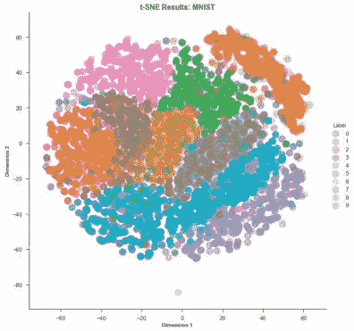
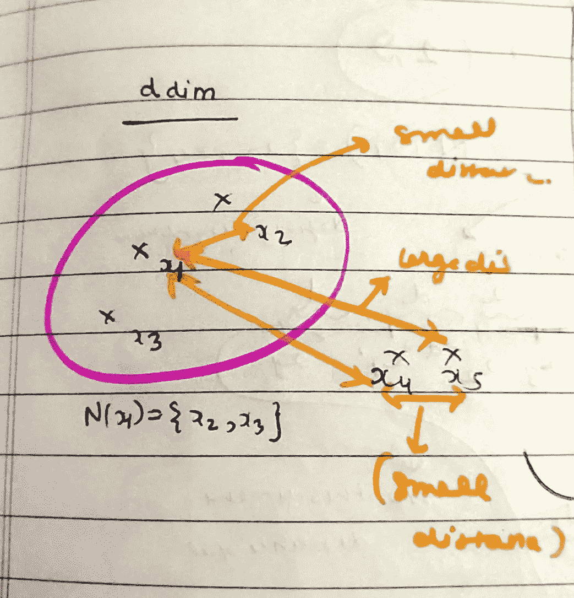
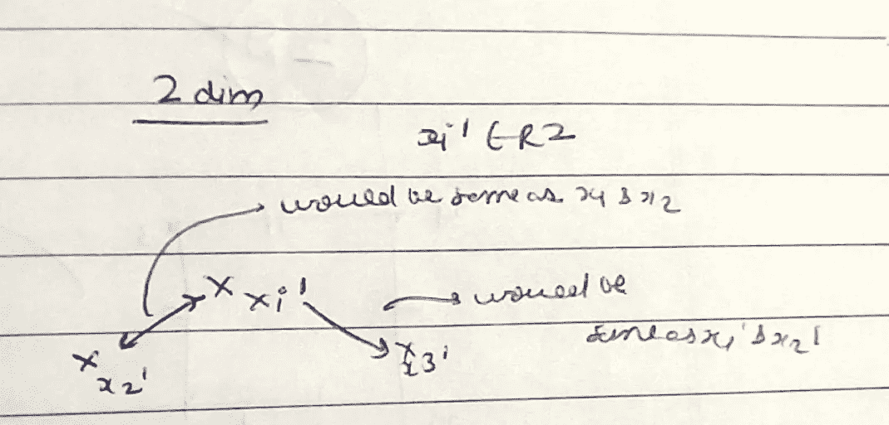
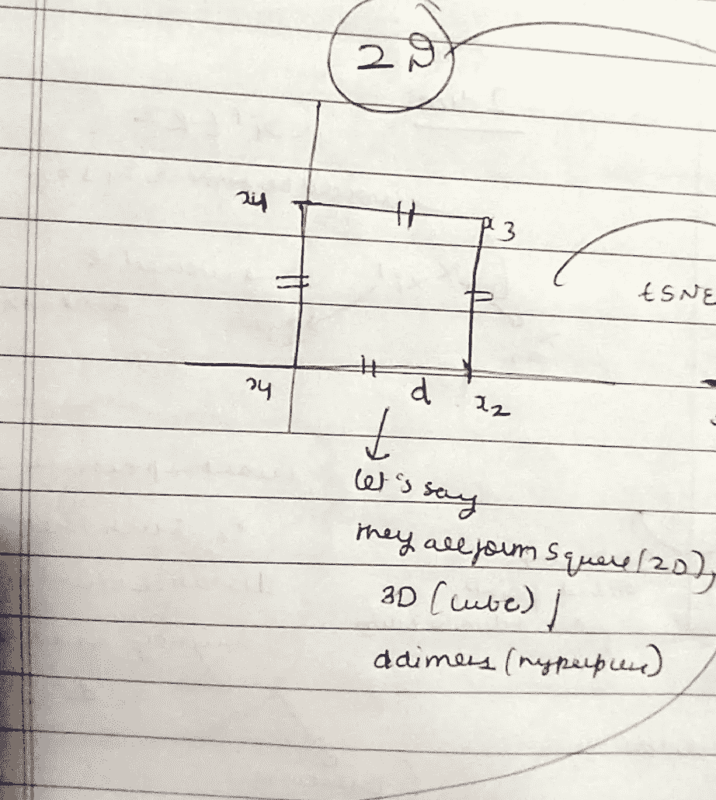
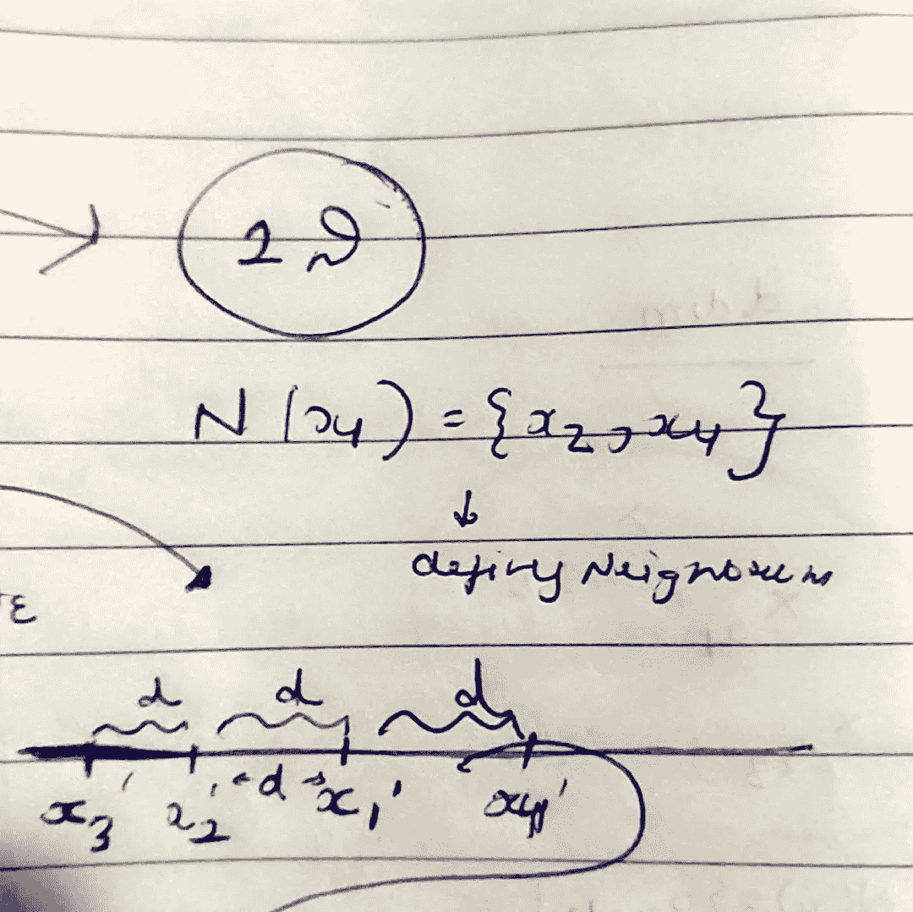

# SNE 的几何直觉

> 原文：<https://medium.com/analytics-vidhya/geometric-intution-of-t-sne-a1b469c5199b?source=collection_archive---------24----------------------->

在上一篇文章中，我已经介绍了 [PCA(主成分分析)](https://link.medium.com/YaJORCJVT2)的降维和几何直观化

如果你想了解它，去上面的链接。

现在是时候介绍 SNE 霸王龙的最新技术了。

T-SNE 是由杰弗雷·牛顿(也被称为深度学习之父)介绍的

**T-SNE 代表:-**

**T- t 分布**

(现在只需记住，当总体方差未知时，引入了 t 分布或学生 t 分布)

**S 随机**

(概率分布)或者，如果您多次应用 T-SNE 算法，它可以被记为使用相同的数据集，在不同的时间，它会给出稍微不同的结果。

**N 邻域**

邻域仅仅意味着如果有六个点 x1、x2、x3、x4、x5、x6，并且 x1 到 x2、x3 和 x4 之间的距离相对小于 x5 和 x6，那么

x1=N(x2，x3，x4)意味着 x2，x3，x4 是 x1 的邻域。

而 x5 和 x6 不是。

**电子估算值**

假设 D 是一个很大的数字，例如 784

它仅仅意味着对于 D 维 xi 中的每一个点(任何点)，我们都在寻找低维中的对应点。

**PCA 和 T-SNE 的根本区别是什么？**

1.  Pca 试图保持全局结构/形状，而 T-SNE 试图保持局部结构。
2.  PCA 不关心点与点之间的距离，而 T-SNE 关心点与点之间的距离(我们将看到如何)

现在我们知道 T-SNE 用于多维数据可视化。

所以让我们来理解它的几何意义。

**几何膨胀**

让我们举一个例子，

假设在 D 维空间中我们有五个数据点，

x1，x2，x3，x4，x5

从图中，我们可以说 x1 与 x2、x3 相邻，但不与 x5 和 x6 相邻。

N(x1)=(x2，x3)

**T-SNE 试图将点从 D 维嵌入到 2 维，这样邻居之间的*距离保持与 D 维相同。***

这就是 SNE 霸王龙想要做的。

让我们继续同一个例子，

让我们假设 T-SNE 成功地将 D 维数据转换成 2D 或 2 维，所以让我们在 2D 取新的点为 x1’(对应于 x1 的点)，x2’(对应于 x2 的点)，x3’，x4’，X5’。

现在 x1 '和 x2 '之间的距离将等于它在 D 维中 x1 和 x2 之间的距离，x1 和 x3 也是如此。

所以我们可以说，

d(x1，x2)将近似等于 d(x1’，x2’)

d 是两点之间的距离。

**拥挤问题**

现在让我们假设我在 2D 维中有四个点形成一个正方形，这意味着所有的点彼此之间的距离相等，如图所示。

点是 x1，x2，x3，x4，使得 x1 的 N(x1)={x2，x4}邻居是距离为“d”的 x2 和 x4

不要混淆 D(尺寸)和 D(x1 和 x2 之间的距离)

现在让我们假设我应用了 T-SNE 并将 2D 维度数据转换成 1D 维度数据。

如图所示，x1 '(x1 在 1D 的对应点)和 x2 '(x2 在 1D 的对应点)之间的距离与 x1 和 x2 相同，即“d”。

x1 '和 x4 '距离也与 x1 和 x4 相同。

但是如果你观察 x3 的邻居

N(x3)={x4，x2}

x3 邻居是 x4 和 x2。

**现在有一个问题**

在一维中，x3’和 x4’之间的距离是 3d，而在 2D 中，x3 和 x4 之间的距离是 d

这就是所谓的拥挤问题。

**有时不可能保持邻域内的所有距离，这样的问题被称为拥挤。**

t 分布是专门为解决这种拥挤问题而引入的，t 分布试图解决这个问题的大部分而不是全部。

现在，T 分布如何做到这一点超出了本文的范围，因为需要一篇全新的文章来解释 T 分布。

在继续之前，如果你想了解更多关于 T-SNE 的情况，你应该参考“distill.pub ”,那里有一篇关于维数约简的漂亮文章。

**现在，在你阅读 T-SNE 之前，你应该记住这几点。**

1.  总是运行步骤/迭代，直到图的形状稳定下来。
2.  改变困惑 2

where n is the total number of points and p is perplexity(A hyperparameter in T-SNE)

Perplexity- Loosely it is number of neighbourhood points from one point.

Lets say you choose the value of p=5 means you are saying T-SNE that it take 5 value from every point and try to preserve the distance between those 5 points in 2 Dimension.

P is generally between 5 to 50 for MNIST DATA SET where step size is 5000.

3\. Never run T-SNE once, always run it few times as it is probablistic algorithm, the results might differ with a different run.

4\. Re run T-SNE with same perplexity and steps and see whether shape is stable or not.

These are few points to remember in T-SNE.

**享受机器学习，感谢阅读……**