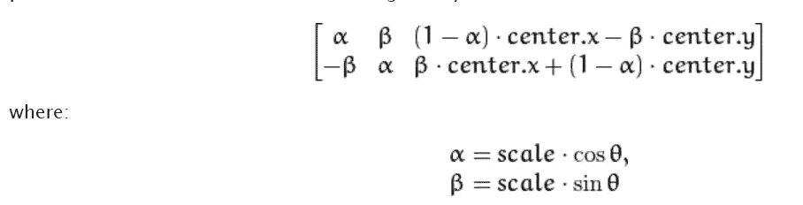

# 使用 OpenCV 的图像几何变换|图像处理第 1 部分

> 原文：<https://medium.com/analytics-vidhya/geometric-transformations-of-images-using-opencv-image-processing-part-1-828c9bf98aa7?source=collection_archive---------4----------------------->

在本文中，我们将学习如何使用 Python 语言中的 OpenCV 对图像执行几何变换算法。

我们将从简单介绍一下图像处理开始，然后继续看图像处理可以派上用场的不同应用/场景。那么，让我们开始吧！

## 什么是图像处理？

在深入研究图像处理之前，了解图像处理到底是什么以及它在更大范围内的作用是很重要的。图像处理通常被称为“数字图像处理”，其经常使用的领域是“计算机视觉”。

图像处理算法和计算机视觉(CV)算法都将图像作为输入；然而，在图像处理中，输出也是一个*图像*，而在计算机视觉中，输出可以是关于图像的一些*特征/信息。*

## 安装 OpenCV

要在您的系统上安装 OpenCV，请运行以下 pip 命令-

对于 Windows:

> pip 安装 opencv-python

对于 MacOS:

> brew 安装 opencv 3-with-contrib-with-python 3

现在 OpenCV 已经成功安装在我们的系统中，我们已经准备好了。让我们用一些图片来娱乐一下吧！

要求已经得到满足，因为我已经在我的系统中安装了它

# 让我们开始使用 OpenCV 库-

## 1.导入所需的库

> *cv2* -用于 OpenCV(用于图像处理)
> 
> *matplotlib* -用于 matplotlib(用于绘图和可视化)
> 
> *numpy* -用于 numpy(用于科学计算)

必需的库

## 2.使用 OpenCV 库读取图像

我们可以使用 OpenCV 和 Matplotlib 库来读取图像。

打开图像

## 3.图像分析

了解图像的类型或形状。

## 4.图像的几何变换

学习对图像应用不同的几何变换，如缩放、平移、旋转、仿射变换等。

*   ***调整图像大小(缩放)***

缩放只是调整图像的大小。为此，OpenCV 附带了一个函数 **cv2.resize()** 。可以手动指定图像的大小，也可以指定缩放因子。

调整图像输出大小

*   ***旋转图像***

图像旋转角度θ是通过以下形式的变换矩阵实现的

但是 OpenCV 提供了可调节旋转中心的缩放旋转，因此您可以在任何您喜欢的位置旋转。修改后的变换矩阵由下式给出

为了找到这个变换矩阵，OpenCV 提供了一个函数，**cv2 . getrotationmatrix 2d**。

旋转图像输出

*   ***仿射变换***

*在仿射变换中，原始图像中的所有平行线在输出图像中仍然是平行的。*为了找到变换矩阵，我们需要来自输入图像的*三个* *点*以及它们在输出图像中的对应位置。然后 **cv2.getAffineTransform** 将创建一个 2×3 的矩阵，该矩阵将被传递给 **cv2.warpAffine** 。

仿射变换输出

*   ***透视变换***

对于透视变换，你需要一个 3x3 的变换矩阵。*即使变换后，直线仍将保持直线。*为了找到这个变换矩阵，我们需要输入图像上的 *4 个点*和输出图像上的对应点。这 4 个点中，有 3 个不应该是共线的。然后通过函数**cv2 . getperspective transform**可以找到变换矩阵。然后用这个 3x3 变换矩阵应用 **cv2.warpPerspective** 。

透视变换输出

这就把我们带到了本文的结尾。希望你已经很清楚的理解了 Python 中 OpenCV 的图像处理基础知识。 ***确保你尽可能多的练习*** 。

请留意本系列中的其他 [Jupyter 笔记本](https://github.com/Ravjot03/Image-Processing)，它们将解释使用 Python 中的 OpenCV 进行图像处理的各个其他方面。

如果你想查看更多与数据科学和机器学习相关的资源，你可以参考我的 [Github 账户](https://github.com/Ravjot03)。

希望你喜欢这个帖子。