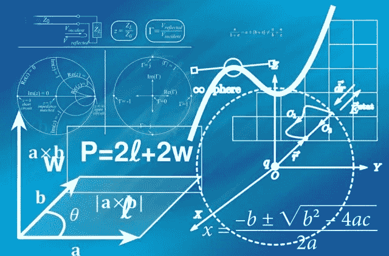
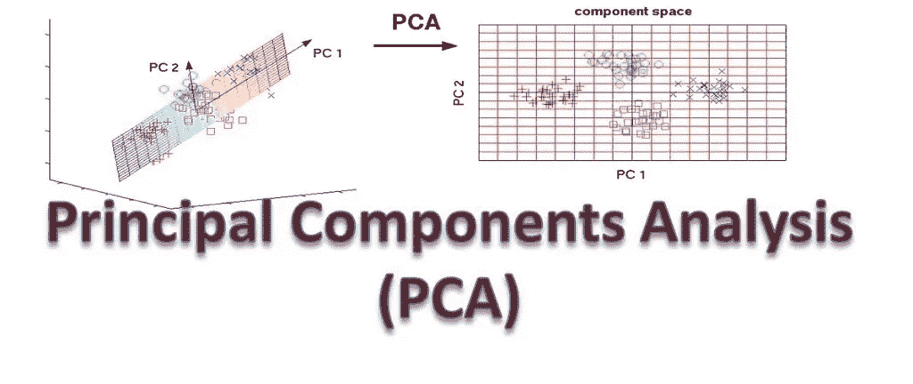
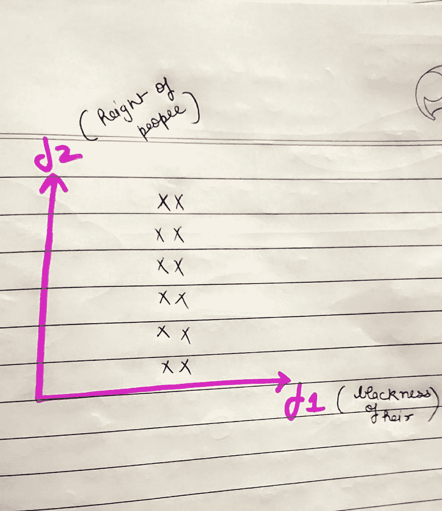
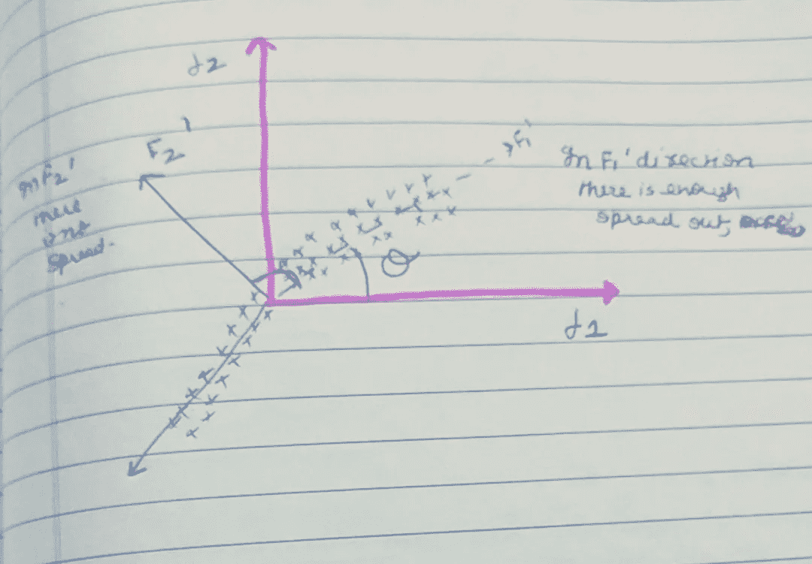
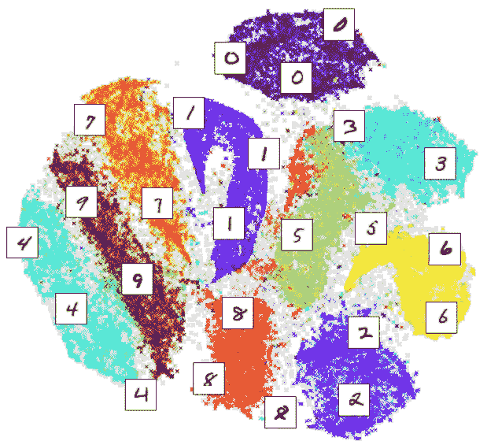
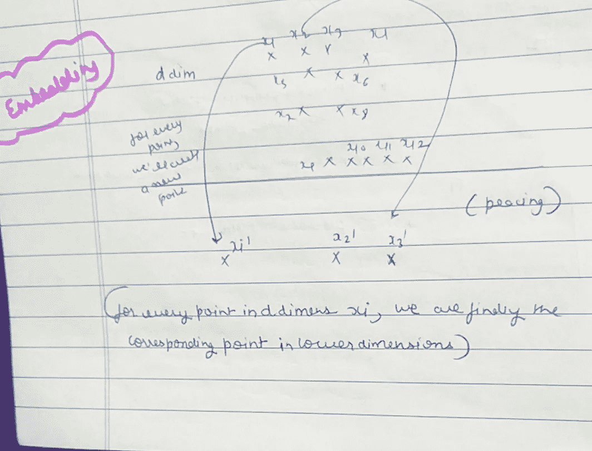

# 几何让 PCA 和 T-SNE 变得如此简单！

> 原文：<https://medium.com/analytics-vidhya/geometry-made-pca-and-t-sne-so-easy-b8b35f209730?source=collection_archive---------17----------------------->

在这篇文章中，我们将看到当我们戴上几何眼镜来理解主成分分析和 T-SNE 降维时，事情是如何变得简单的。

**什么是降维？？？**

我们得先知道基本的，对！！否则机器学习有能力狠狠踢我们一脚。

我被踢过很多次。

降维简单来说就是在机器学习语言中降低维度或者特征，这样我们就可以得到一个更易解释的模型。

**我给你举个例子**，假设我们有 784 个特征，通常和 MNIST 数据集打过交道的人都会明白我为什么要取 784 个特征。

如果你不明白，没关系，想象任何一个大的数字，试着把每个特征看成一个维度。

你能在脑海中思考 784 个维度吗？

你能想象 784 维空间的分散点吗？

**这就是为什么降维很重要。**

**让我给你举另一个例子**，假设你是一名数据科学家，你必须向不了解机器学习的客户解释你的模型，你将如何让他们了解 784 特征或维度的工作。

用简单的语言“**模型的可解释性**”。

这是降维之所以重要的第二个原因。

**现在让我给你举第三个例子**，假设你在一家基于互联网的公司工作，那里的输出必须在毫秒或更短的时间内，所以“时间复杂度”和“空间复杂度”很重要。

更多的功能需要更多的时间，这些公司负担不起。

简单！

所以简而言之， ***降维*** 基本有三个原因

1.  可视化。
2.  可解释性。
3.  时空复杂度。

**在本文中，我们将专门致力于降低可视化的维度。**

所以可视化 784 维会非常困难，所以有一种技术可以减少这些维度。

所以第一个也是最古老的技术是" **PCA** "

PCA 代表**主成分分析。**

为了让每个人都简单明了，让我们把 2D 转换成 1D，如果我们能做到的话，我们将把线性代数应用到更高维度。

所以让我们从几何学上理解什么是真正的 PCA。

**主成分分析的几何直觉**

我们的目标是让 2D 改信 1D 教。

**案例 1**

让我们举个例子，我们有两个特征 F1(头发的黑色)和 F2(人的高度)

假设头发的黑度是一个实数，假设有一些标准来衡量头发的黑度。

在图中，你可以看到分布或散射，假设这是一个印第安人的分布。

因此，我们可以很容易地说，几乎同样黑色头发的人有很大的身高差距，或者我们知道大多数印度人有黑色头发，这就是为什么它覆盖了所有的身高。

如果我把这个分布带到美国，情况会有所不同，我们可以看到金发，黑发等等。

所以在高度轴上分布较多而头发的黑色分布很少。

因此可以说，在印度，头发的黑色不会给我们提供太多信息，因为传播非常低，它不会给我们的模型增加任何价值。

所以我可以去掉这个特征(黑色的头发)，因为我们知道大多数印度人都有黑色的头发，所以传播很少。

所以基本上这个想法是，如果我们被迫跳过一个特征，我们将跳过对我来说不太重要的特征。

**换句话说，PCA 保持具有最大扩散或方差的方向。**

**案例二**

现在，在这种情况下，传播在两侧是相等的，所以我们不能丢弃一个特征。

**现在该怎么办？**

因此，如果我们可以将我们的轴旋转θ到最大方差或最大扩散的方向(参考图像)，那么我们可以删除具有最小方差的特征。

在我们例子中，第一步是找到 F1 '和 F2 '，第二步是去掉 F2 '，因为 F2 '方差很小。

所以关键是，如果我定义 X= 2 维数据集，我们希望找到一个方向 F1 ’,使得投影到 F1’上的方差最大。

**怎么做？？？**

这涉及到 PCA 的数学目标，我们将在后面讨论。

但是现在只要理解这一点，它将涉及一些优化问题(距离最小化)

**T-SNE**

它是由 Jefry Newton(也被称为深度学习之父)创建的

这是一项创立于 2008 年的艺术技术。

**什么是 SNE 霸王龙？？？**

T- **t 分布**(现在只要记住 t 分布或学生 t 分布是在人口方差未知时引入的)

在接下来的几篇文章中，我将详细讨论 t 分布，但现在就让它去吧。

S- **随机**(概率分布)或者可以记为对同一数据集多次应用 T-SNE 算法，它会在不同时间给出略有不同的结果。

N- **邻域**

邻域仅仅意味着如果有六个点 x1、x2、x3、x4、x5、x6，并且 x1 到 x2、x3 和 x4 之间的距离相对小于 x5 和 x6，那么

x1=N(x2，x3，x4)意味着 x2，x3，x4 是 x1 的邻域。

而 x5 和 x6 不是。

E- **嵌入**

假设 D 是一个很大的数字，例如 784

它仅仅意味着对于 D 维 xi 中的每一个点(任何点)，我们都在寻找低维中的对应点。

我们如何找到对应点？

我们将在探索它的数学目标时讨论它，现在我们将集中在几何直觉上。

我本想只在这篇文章中介绍 T-SNE 几何直觉，但这对于一篇文章来说太多了。

因此，在下一篇文章中，我将涉及这一点。

感谢阅读…