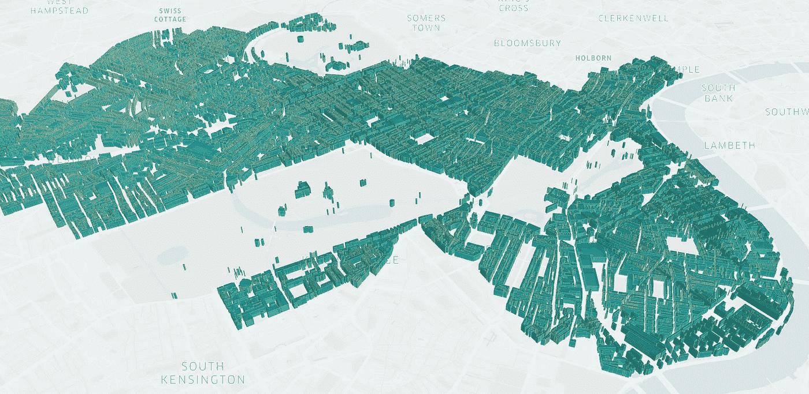
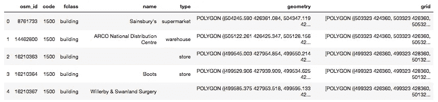
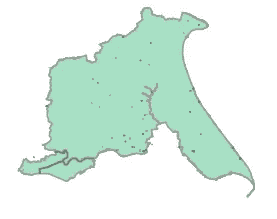

# 地理空间冒险。第三步。多边形生长在 R 树上。

> 原文：<https://medium.com/analytics-vidhya/geospatial-adventures-step-3-polygons-grow-on-r-trees-2f15e2712537?source=collection_archive---------6----------------------->



使用 KeplerGL 生成

*在本系列的前几期文章中，我们已经讨论了在 shapely* *中使用* [*几何对象，并对 GeoPandas*](/@datingpolygons/geospatial-adventures-step-1-shapely-e911e4f86361) *做了一个温和的* [*介绍。这意味着我们现在准备谈论一些更令人兴奋的事情。我将简要介绍如何处理大量的多边形和一些基本的方法，这些方法有助于保持这项任务的可控性。*](/@datingpolygons/geospatial-adventures-step-2-pandas-vs-geopandas-16e842d0e3a7)

首先，让我们得到一些数据来玩。在[步骤 2](/@datingpolygons/geospatial-adventures-step-2-pandas-vs-geopandas-16e842d0e3a7) 中，我们查看了英国地方当局的边界地图，我还在文章末尾发布了一些地理空间数据集的链接，其中包括英国 OSM 数据的链接(开放街道地图对象)。在这篇文章中，我将使用地方当局和建筑多边形。文件很充实，所以我建议只看英格兰。

事实上，我在之前的帖子中使用了 2017 年地方当局的文件，让我们来点更新鲜的东西，并下载 2019 年 12 月版:

[https://geo portal . statistics . gov . uk/datasets/local-authority-districts-December-2019-boundaries-uk-bfc](https://geoportal.statistics.gov.uk/datasets/local-authority-districts-december-2019-boundaries-uk-bfc)

OSM:

[http://download.geofabrik.de/europe/great-britain.html](http://download.geofabrik.de/europe/great-britain.html)(这里是英国的. shp.zip 文件，1.62 GB——注意)

太好了。

如果你打开 OSM 的压缩文件，你会发现里面有太多的东西值得一看。在这篇文章中，我们只对建筑感兴趣，但是你绝对可以继续玩其他的。铁路、公路、水路、名胜古迹、宗教场所等。等等。这是一场有用信息的盛宴。(我想象着一个茫然的眼神和“耶…哦…好吧…”我得到的回应是…哦，好吧。继续前进)

让我们把它们装进去。我们还需要在这里导入我们的主要库。

```
import geopandas as gpd
import swifter
import numpy as npla = gpd.read_file( 'Downloads/Local_Authority_Districts_December_2019_Boundaries_UK_BFC/Local_Authority_Districts_December_2019_Boundaries_UK_BFC.shp'
)bd = gpd.read_file(
'Downloads/england-latest-free.shp/gis_osm_buildings_a_free_1.shp'
)
```

惊喜，惊喜…英格兰有很多建筑，所以文件很大，只有 1gb 多一点。加载需要一点时间，不过还是很容易控制的。从好的方面来说，你可以在装咖啡的时候去买一杯。

我们要尝试解决的问题是——通过简单地观察几何图形，我们将尝试识别哪些建筑位于哪个地方政府。事实上，对于仅仅尝试一些东西来说，这可能是一个太大的项目。我们将确定哪些建筑位于约克郡的东车道。喜欢这个名字…它坐落在约克的东部(喜欢那个地方！)并环绕赫尔(没去过，但听说很精彩)。

在这次演习中选择它的一个原因是它复杂的海岸线。当然，我们可以求助于 Shapely 的简化方法，让它变得平滑，但是我们冒着把婴儿和洗澡水一起倒掉的风险。赫尔市就在它旁边，所以如果我们不小心的话，一些建筑会小到最终被完全忽略或者被错误地归类。

还有另一个同样重要的原因，我现在要保密。(很刺激，不是吗？…嗯…对…)

在我们走得更远之前，我们必须做一些真正重要的事情，我必须承认，这在过去曾让我绊倒过几次。养成检查数据集是否引用相同 CRS 的习惯是个好主意。如果您是本系列的新手，请查看第 2 步，了解更多信息和一些有用的链接。让我们来看看这两个公司使用的是什么样的 CRS:

在:

```
la.crs
```

出局:

```
<Projected CRS: PROJCS["OSGB_1936_British_National_Grid",GEOGCS["G ...>
Name: OSGB_1936_British_National_Grid
Axis Info [cartesian]:
- E[east]: Easting (metre)
- N[north]: Northing (metre)
Area of Use:
- undefined
Coordinate Operation:
- name: unnamed
- method: Transverse Mercator
Datum: OSGB 1936
- Ellipsoid: Airy 1830
- Prime Meridian: Greenwich
```

对于建筑物:

在:

```
bd.crs
```

出局:

```
<Geographic 2D CRS: EPSG:4326>
Name: WGS 84
Axis Info [ellipsoidal]:
- Lat[north]: Geodetic latitude (degree)
- Lon[east]: Geodetic longitude (degree)
Area of Use:
- name: World
- bounds: (-180.0, -90.0, 180.0, 90.0)
Datum: World Geodetic System 1984
- Ellipsoid: WGS 84
- Prime Meridian: Greenwich
```

还好我们检查过了！OSGB 1936 本质上和我们在上一篇文章中使用的 epsg: 27700 是一样的。我确实提到过我更喜欢使用格网，因为它更直观，所以让我们继续将建筑物数据集转换为相同的 crs，即使它更大，因此需要更长的时间。振作起来:

```
bd = bd.to_crs(epsg=27700)
```

我们可以在这个阶段尝试一种强力方法，看看我们是否可以在每个 6.5 米的建筑多边形上应用 intersects 方法，以将它们与我们选择的地方当局区域匹配，但是，这将需要一段时间，所以让我们看看是否可以找到一种更好的方法。

我马上想到的一个想法是——如果我们先用一个简单的形状代替复杂的多边形，会怎么样？毕竟我们使用的是网格方法，所以我们可以为每个多边形取一个边界框，然后过滤掉在我们的地方当局的边界框中至少有一个角的多边形。对熊猫来说，这既容易做到，也相对较快。当然有一个警告。还记得我们选择约克郡东区作为例子的特殊原因吗？该出牌了。事实上，它是围绕赫尔周围的踢脚线真的把事情弄糟了——整个城市最终将被包含在我们的边界框中。不酷。它有相当多的建筑物，所以我们最终不得不筛选我们的误报，并正确地检查它们与我们的多边形的交集。

我们可以先把我们的地方当局分割成一堆更小的多边形，然后再对它们进行搜索。事实上，在整个地图上使用这样的网格还有其他优点。它将允许我们以非常有效的方式搜索最近的邻居，而不必计算所有 6.5 毫米建筑多边形之间的距离。

这正是我们要做的。让我们从创建一个标准网格开始，它将跨越我们选择的地方当局。当然，我们可以使用整个英格兰或整个英国的大小，但是使用大小也会导致性能损失。我认为，如果我们想对所有事情进行归因，最好的方法是对每个县分别进行归因，然后合并结果。

准备好了吗？

我们开始吧:

首先，我们获得跨越整个本地机构的边界框的坐标。

```
ery = la[
    la['lad19nm'] == 'East Riding of Yorkshire'
]['geometry'].iloc[0]
xmin = ery.bounds[0]
xmax = ery.bounds[2]
ymin = ery.bounds[1]
ymax = ery.bounds[3]
xmin, xmax, ymin, ymax
```

得到

```
(459323.7011000002, 542151.1449999996, 410360.27600000054, 476832.8973999992)
```

当然，我们不需要那么精确。事实上，值得记住的是，数据集并没有首先为我们提供这些，但我们会保持这种方式。不疼。但是，我们将在构建网格时删除它:

```
X, Y = np.mgrid[int(xmin): round(xmax, -3) + 2000: 2000,
                int(ymin): round(ymax, -3) + 2000: 2000]
```

如果您还没有遇到过 numpy mgrid 函数，我强烈建议您快速浏览一下文档并使用一些示例。简而言之，我们在这里所做的是创建一个数值网格，其跨度从 *xmin* 向下舍入到整数值到 *xmax* 舍入到最接近的 1000，然后向上舍入到 2000。我们网格的步长设置为 2000。这可能有助于更好地理解它: *np.mgrid[ xmin : xmax : step，ymin : ymax : step ]*

结果是在 X 分量和 Y 分量之间分割的坐标矩阵。

现在我们有了网格，我们需要把它转换成正确的格式，为每个网格单元创建多边形。

```
grid = list(
            map(
                list,
                list(
                    zip(
                        list(
                            zip(X.flatten(), Y.flatten())
                        ),
                        list(
                            zip(X.flatten(), Y.flatten() + 2000)
                        ),
                        list(
                            zip(X.flatten() + 2000, Y.flatten() + 2000)),
                        list(
                            zip(X.flatten() + 2000, Y.flatten())
                        )
                    )
                )
            )
        )
```

这里我们将矩阵展平成长列表，然后压缩成元组列表。我们重复四次——对我们正在构建的正方形的每个角重复一次，最后我们得到一个元组列表。有点拗口，我知道…基本上是一个预期多边形列表，其中每个元素都是一个角坐标列表。更清楚？没有吗？好吧…就在你的笔记本上玩玩它，获得一些直觉。

这是这个网格的前几个元素的样子:

```
[[(459323.0, 410360.0),
  (459323.0, 412360.0),
  (461323.0, 412360.0),
  (461323.0, 410360.0)],
 [(459323.0, 412360.0),
  (459323.0, 414360.0),
  (461323.0, 414360.0),
  (461323.0, 412360.0)],
 [(459323.0, 414360.0),
  (459323.0, 416360.0),
  (461323.0, 416360.0),
  (461323.0, 414360.0)]...
```

让我们继续把它们转换成多边形。

```
from shapely.geometry import Polygon
grid_poly = [Polygon(a) for a in grid]
```

还有一步——这些覆盖了所有的边界框，我们特别想雕刻出尽可能接近我们原始形状的东西(例如，我们想去掉外壳)。在这种情况下，我们可以遍历它们，并检查与本地机构的交集:

```
grid_poly = [a for a in grid_poly if a.intersects(ery)]
```

好了，我们快到了。我们已经有了多边形网格。我们如何有效地搜索这些信息？

R-Trees 来拯救。你可以在这里阅读它们[，在这里](https://en.wikipedia.org/wiki/R-tree)阅读它们的实现[。这个想法在原理上非常简单:我们将空间分成一堆矩形(在我们的例子中是正方形)，这些矩形被分组并映射到更大的边界矩形，等等。等等。我们的正方形是多边形树中的叶子，连接到小树枝，然后是大树枝，以此类推。因此，如果我们正在比较一个位于很远很远的地方的面，只需检查它是否属于不同的分支，然后就在那里停止检查。](https://shapely.readthedocs.io/en/latest/manual.html#str-packed-r-tree)

我们现在要做的就是跑:

```
from shapely.strtree import STRtree
s = STRtree(grid_poly)
```

然后—对我们的整个 bd 表进行检查(在我的笔记本电脑上，这大约需要 35 秒):

```
bd['grid'] = bd['geometry'].apply(lambda x: s.query(x))
```

现在，熊猫设计师和纯粹主义者会在这一点上生气，因为我刚刚用列表填充了熊猫专栏，其中一些是空列表。是的，我知道，它不应该被这样使用。但是你知道吗？咬我！它完成了任务。

现在让我们来看看返回匹配项的记录:

```
bd_ery = bd[bd['grid'].apply(len) > 0].reset_index(drop=True)
```

从技术上讲，这里我们还应该运行类似于:

```
bd_ery['check'] = bd_ery['geometry'].swifter.apply(lambda x: x.intersects(ery))
```

来检查一些接近边界的多边形，它们设法进入了我们的集合。然而，当我们在更大的范围内这样做时，我们可以跳过这一步来处理分别属于多个区域的多边形。这样会快很多。或者，我们可以识别边界网格多边形，并仅对与这些边界网格单元匹配的建筑物运行检查。

让我们快速浏览一下数据集:

```
bd_ery.head()
```



我们能一起看吗？绝对的。虽然 161K 多边形可能不会被你的计算机普遍喜欢。我们去看看所有的住宅楼怎么样？

记住，我们需要几何图形集合来将它们集合起来。让我们也添加实际的地方当局多边形，看看他们真的坐在对方的顶部。

```
from shapely.geometry import GeometryCollection
gc = GeometryCollection(
    list(
        bd_ery[
            bd_ery['type'] == 'residential'
        ]['geometry']
    )+[ery]
)
gc
```



不是世界上最好的图形表示，但你可以在我们的地方当局多边形上看到一些更暗的小点。有一对夫妇坐在边界外面，所以我们也需要清理一下。

但今天够了。

我们能用观想做得更好吗？绝对的。这正是我在下一篇文章中所要讨论的。敬请期待！