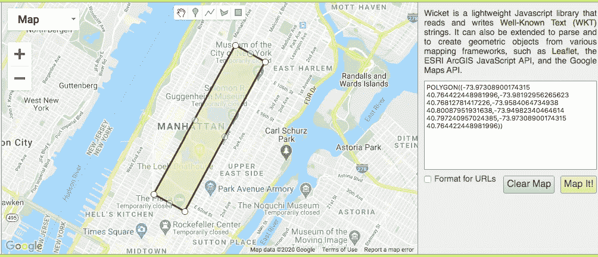

# 使用 GridDB | GridDB 对纽约市犯罪数据进行地理空间分析:面向物联网的开源时间序列数据库

> 原文：<https://medium.com/analytics-vidhya/geospatial-analysis-of-nyc-crime-data-with-griddb-griddb-open-source-time-series-database-for-2a80c70ea395?source=collection_archive---------29----------------------->


GridDB Community Edition 4.1 和更新版本提供了一种几何数据类型，允许开发人员在他们的应用程序中结合时间序列和地理空间分析。我们之前在关于[的文章中讨论过 GridDB 的几何特性，使用 GridDB](https://griddb.net/en/blog/using-geometry-values-griddb/) 和[几何数据应用](https://griddb.net/en/blog/geometry-data-application/)的几何值。

这篇博文通过查看纽约市的历史犯罪投诉数据，深入研究了几何数据类型的实际用途。该数据提供了所报告犯罪的纬度和经度，因此我们将使用 GridDB 来查看投诉发生在哪个区域。在演示了如何从纽约市开放数据中获取犯罪数据后，我们将看看中央公园每月的犯罪率有何不同。我们还将通过查看各个辖区的投诉数量来加载外部多边形数据。

将 GridDB 的几何数据类型用于地理空间数据点的主要目的是能够搜索点、多段线(路径)或多边形(区域)的相交处。使用[众所周知的文本(WKT)](https://en.wikipedia.org/wiki/Well-known_text_representation_of_geometry) 定义点、折线和多边形，这是一种在地图上定义矢量几何对象的标记语言。

# 吸收

我们从纽约市公开数据中获取了历史犯罪数据。下表显示了 CSV 数据字段和 GridDB 模式。

CSV 值 GridDB 架构

*   CMPLNT_NUM(唯一 ID)
*   CMPLNT_FR_DT(投诉日期)
*   CMPLNT_FR_TM(投诉时间)
*   CMPLNT_TO_DT
*   CMPLNT_TO_TM
*   ADDR _ 百分比 _ 光盘
*   RPT_DT
*   KY_CD
*   OFNS
*   PD_CD
*   PD
*   CPTD 的客户关系管理
*   法律 _ 猫 _ 光盘
*   博罗纳米
*   DESC 发生地点
*   desc TYP PREM
*   DESC 朱利斯
*   管辖区 _ 代码
*   公园 _NM
*   HADEVELOPT
*   住房 _PSA
*   x 坐标 CD
*   y _ 坐标 _CD
*   SUSP 年龄组
*   SUSP 赛跑
*   SUSP _ 性别
*   公交 _ 区
*   纬度(浮点纬度)
*   经度(浮点经度)
*   拉特隆(拉特隆 WKT)
*   巡逻 _ 博罗
*   车站名称
*   维克年龄组
*   维克比赛
*   维克性别

```
public class Complaint {
    int CMPLNT_NUM;
    Date CMPLNT_FR_DT;
    Date CMPLNT_TO_DT;
    int ADDR_PCT_CD;
    Date RPT_DT;
    int KY_CD;
    String OFNS_DESC;
    int PD_CD;
    String PD_DESC;
    String CRM_ATPT_CPTD_CD;
    String LAW_CAT_CD;
    String BORO_NM;
    String LOC_OF_OCCUR_DESC;
    String PREM_TYP_DESC;
    String JURIS_DESC;
    int JURISDICTION_CODE;
    String PARKS_NM;
    String HADEVELOPT;
    String HOUSING_PSA;
    int X_COORD_CD;
    int Y_COORD_CD;
    String SUSP_AGE_GROUP;
    String SUSP_RACE;
    String SUSP_SEX;
    int TRANSIT_DISTRICT;
    float Latitude;
    float Longitude;
    Geometry Lat_Lon;
    String PATROL_BORO;
    String STATION_NAME;
    String VIC_AGE_GROUP;
    String VIC_RACE;
    String VIC_SEX;
}
```

为了简单起见，我们只使用一个容器，而不是将数据分成多个容器。

使用 CSVParser 库解析 CSV 很容易:

```
Iterable records = CSVFormat.RFC4180.withFirstRecordAsHeader().parse(in);
   for (CSVRecord record : records) {
        Complaint c = parseCsvRecord(record);
        if(c != null)
            col.put(c);
   }
   col.commit();
```

需要在 parseCsvRecord 函数中对数据进行一些更改。首先，投诉时间是一种非标准但容易解析的格式，如 MM/DD/YYYY 和 HH:MM:SS。

```
String dt[] = r.get("CMPLNT_FR_DT").split("/");
String tm[] = r.get("CMPLNT_FR_TM").split(":");
c.CMPLNT_FR_DT = new Date(Integer.parseInt(dt[2])-1900, Integer.parseInt(dt[0])-1, Integer.parseInt(dt[1]), Integer.parseInt(tm[0]), Integer.parseInt(tm[1]), Integer.parseInt(tm[2]));
```

虽然原始 CSV 包含“lat lon”中犯罪发生点的 WKT 文本，但可接受的 WKT 格式是 POINT(x y”)，纬度表示 Y 轴，经度表示 X 轴，因此我们翻转它们。

```
c.Lat_Lon =   Geometry.valueOf("POINT("+c.Longitude+" "+c.Latitude+")");
```

# 按辖区划分的犯罪

纽约市开放数据中心还提供了 WKT 各个警区的多边形，可点击此处[https://Data . cityofnewyork . us/Public-Safety/Police-Precincts/78dh-3 ptz](https://data.cityofnewyork.us/Public-Safety/Police-Precincts/78dh-3ptz) 。与投诉数据一样，使用 CSVParser 很容易加载该数据，但由于每个辖区可能由多个多边形组成，并且使用 WKT 多多边形类型，因此需要进行一些进一步的处理，以将多多边形分割成简单的多边形。

```
String polys[] = record.get("the_geom").split("\\),");
int count=0;
for(int i=0; i < polys.length; i++) {
    String subpoly = polys[i].replace("MULTIPOLYGON (", "").replace(")))", ")");
    query = col.query("select * where ST_MBRIntersects(Lat_Lon, ST_GeomFromText('POLYGON"+subpoly+")') )");
    rs = query.fetch(false);
    count =+ rs.size();
}
```

结果如下:

```
Precinct 1: 243         Precinct 52: 888
Precinct 5: 177         Precinct 60: 185
Precinct 6: 216         Precinct 61: n/a
Precinct 71: 227        Precinct 62: 210
Precinct 72: 262        Precinct 63: 324
Precinct 7: 132         Precinct 66: 261
Precinct 9: 233         Precinct 68: 233
Precinct 22: 345        Precinct 69: 220
Precinct 10: 203        Precinct 70: 369
Precinct 13: 400        Precinct 76: 135
Precinct 14: 428        Precinct 77: 334
Precinct 17: 174        Precinct 78: 211
Precinct 20: 132        Precinct 81: 12
Precinct 18: 379        Precinct 83: 498
Precinct 19: 225        Precinct 84: 175
Precinct 23: 225        Precinct 88: 174
Precinct 24: 147        Precinct 90: 290
Precinct 25: 336        Precinct 94: 102
Precinct 79: 266        Precinct 100: 8
Precinct 26: 217        Precinct 101: 0
Precinct 28: 213        Precinct 102: 283
Precinct 30: 206        Precinct 103: 367
Precinct 32: 361        Precinct 104: 511
Precinct 73: 410        Precinct 105: 481
Precinct 33: 152        Precinct 106: 227
Precinct 34: 224        Precinct 107: 294
Precinct 75: 529        Precinct 108: 262
Precinct 40: 444        Precinct 109: 299
Precinct 41: 304        Precinct 110: 431
Precinct 42: 487        Precinct 111: 138
Precinct 43: 408        Precinct 112: 178
Precinct 48: 495        Precinct 113: n/a
Precinct 44: 559        Precinct 114: 28
Precinct 45: 323        Precinct 115: 246
Precinct 46: 400        Precinct 120: 228
Precinct 47: 441        Precinct 121: 194
Precinct 49: 267        Precinct 122: 217
Precinct 50: 219        Precinct 123: 83
Precinct 67: 504
```

# 中央公园

我们的第一个地理空间分析是逐月观察中央公园的犯罪情况，看看犯罪投诉是否随着温度的变化而增加或减少。由于中央公园没有与南北轴对齐，你不能简单地使用一个边界框(其中 lat > min & & lat< max && lon >min & & lon< max) as you would rudimentary geospatial analysis queries. Instead we can build a polygon of each corner of Central Park and query crime complaints that intersect with that polygon. To find the points of Central Park and build the WKT object a useful tool is [Wicket](https://arthur-e.github.io/Wicket/sandbox-gmaps3.html))。



这样，我们就可以构建 TQL 查询了

```
String CentralParkWKT = "POLYGON((-73.97308900174315 40.764422448981996,-73.98192956265623 40.76812781417226,-73.9584064734938 40.80087951931638,-73.94982340464614 40.797240957024385,-73.97308900174315 40.764422448981996))";

for(int month=0; month <= 11; month++) {
    int count=0;
    for (int year=108; year <= 118; year++) {
        Date start = new Date(year, month, 1);
        Date end = new Date(year, month+1, 1);

	Query query = col.query("select * where ST_MBRIntersects(Lat_Lon, ST_GeomFromText('"+CentralParkWKT+"')) and CMPLNT_FR_DT >= TO_TIMESTAMP_MS("+start.getTime()+")  and CMPLNT_FR_DT < TO_TIMESTAMP_MS("+ end.getTime()+") ");
        RowSet rs = query.fetch(false);
        count += rs.size(); 
    }
    System.out.println(month+": "+count);
}
```

现在来回答我们最初的问题，犯罪率会随着温度的变化而变化吗？

```
January: 30
February: 23
March: 36
April: 33
May: 29
June: 19
July: 26
August: 49
September: 25
October: 23
November: 26
December: 18
```

12 月和 8 月的总数会支持这一论点，但 1 月和 6 月不一致，因此结果是不确定的。

如果您有兴趣进一步探索数据或查看完整的代码，可以在[这里](https://griddb.net/en/download/26535/)找到。

*原载于 2020 年 5 月 5 日 https://griddb.net**的* [*。*](https://griddb.net/en/blog/geospatial-analysis-of-nyc-crime-data-with-griddb/)