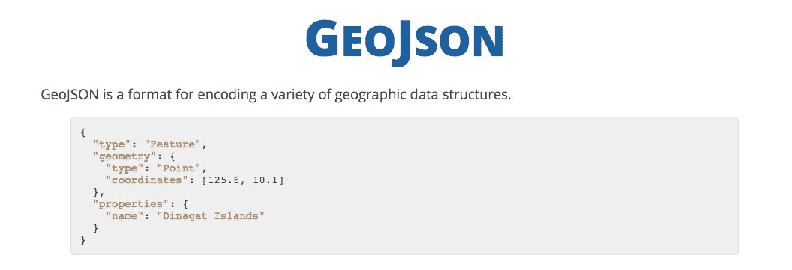
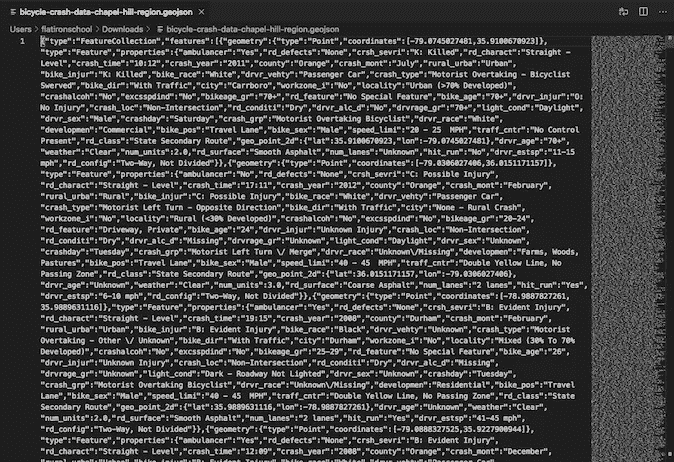
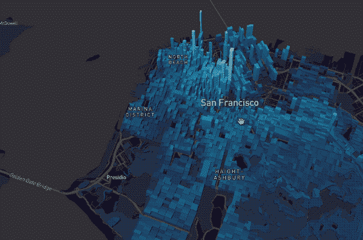
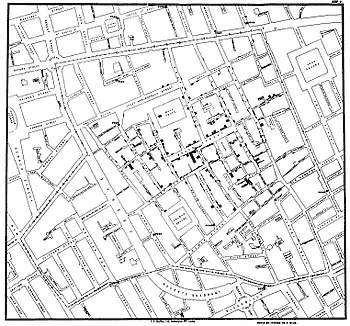

# 地理空间数据及其在数据科学中的作用

> 原文：<https://medium.com/analytics-vidhya/geospatial-data-and-its-role-in-data-science-c60b2e0d3f7f?source=collection_archive---------11----------------------->

凯尔·格伦在 [Unsplash](https://unsplash.com?utm_source=medium&utm_medium=referral) 上的照片

在数据科学中使用基于位置的数据对这个世界和其他世界都有强大的影响。

数据可以以多种不同的形式出现，并经过优化以满足各种不同的目的。但是地理和空间数据可能对数据科学和世界有一些最强大的影响。

地理空间数据被定义为与地球的相对位置保持隐式或显式关联的数据。但更简单地说，根据[数据营](https://www.datacamp.com/community/tutorials/geospatial-data-python)，它的数据告诉我们一个城镇、城市、建筑、汽车、人或实物可能在哪里。它不仅能告诉我们物体的位置，还能告诉我们它们的大小、面积或形状。

GeoJSON 文件格式|来源:[GeoJson.org](https://geojson.org/)

位置数据通常保存在 GeoJSON 文件中，并经常以存储坐标的字典集合的形式出现。但是它们也可以组合列表、元组，并相互嵌套多个这些元素。它们会很快变得非常复杂。

python 中的地理数据分析通常通过使用 RTree、GDAL、Fiona、Shapely、PySAL 以及 Python 的 Pandas 的 GeoPandas 扩展来完成，这些扩展允许对几何信息进行空间操作。

GeoJSON 文件记录了 2007 年至 2014 年北卡罗来纳州教堂山的自行车碰撞地点|[Data.gov](https://catalog.data.gov/dataset/bicycle-crashes)

但是 GeoJSON 文件并不是用于存储位置数据的唯一文件类型。TopoJSON 文件也可用于通过包含土地的拓扑来扩展 GeoJSON 文件。它们可以用来描述各种各样的事情，从绘制火星表面到告诉人们他们想租的滑板车在哪里。但是所有这些信息来自哪里呢？

显示旧金山人口密度的可视化图| [地图框](https://blog.mapbox.com/dive-into-large-datasets-with-3d-shapes-in-mapbox-gl-c89023ef291)

私人公司和公共实体都大量使用位置数据。位置数据最著名的持有者是 [Mapbox](https://www.mapbox.com/) 、[谷歌地图](https://developers.google.com/maps/documentation)和[美国政府](https://catalog.data.gov/dataset?res_format=GeoJSON&page=1)。也有一些开源提供商，如 [Openstreetmap](https://www.openstreetmap.org/#map=4/30.22/-54.49) ，它们会根据用户的贡献不断更新。

石灰滑板车[应用](https://www.pinterest.com/pin/556546466447592392/?nic=1)

每天都有越来越多的公司在创造性地使用位置数据。

例如，加拿大公司 [GHGSat](https://www.ghgsat.com/) 使用位置数据来监控工业设施的排放。并且 [Drive.ai](http://Drive.ai) 是许多通过确定物体与汽车的距离来使用无人驾驶汽车位置数据的公司之一

虽然地理空间数据的分析已经成为一个价值数十亿美元的行业，负责从绘制海底地图到向人们显示他们的优步在哪里的创新，但它并不是这样开始的。

伦敦霍乱爆发地图|来源:[维基共享资源](https://commons.wikimedia.org/wiki/File:Snow-cholera-map-1.jpg)

测绘地理空间数据最早始于 1854 年的英国伦敦。在 1854 年伦敦霍乱爆发期间，英国医生约翰·斯诺博士用一张伦敦地图标出了霍乱爆发的地点，包括道路、地界和供水线。在这样做的时候，Snow 发现疾病的爆发都是围绕着水泵，反驳了通常认为它是通过空气传播的观点，并诞生了空间分析和疾病传播研究的第一个用例。

继斯诺之后，使用基于位置的数据的先驱人物之一是罗杰·汤姆林森。1971 年，为加拿大政府工作的他创建了一个加拿大各地土壤、排水和气候特征的数据库，以确定哪些作物类型适合该国不同地区。从那以后，基于位置的数据被许多其他国家收集和使用，包括美国和英国。