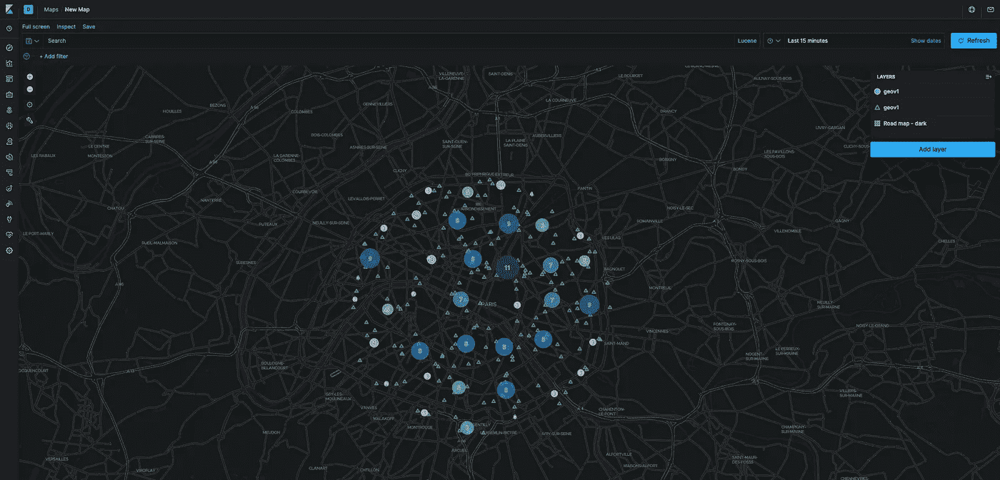

# 使用弹性搜索的地理空间数据

> 原文：<https://medium.com/analytics-vidhya/geospatial-data-with-elasticsearch-c7d3d5e51918?source=collection_archive---------5----------------------->



在本文中，您将发现如何使用 ElasticSearch 实现地理空间数据索引策略、可视化和分析。

在我的例子中，我创建了关于巴黎餐馆的假数据。

# 什么是弹性搜索

**Elasticsearch** 是一个基于 rest 的分布式开源搜索和分析引擎。这是一个非常强大的搜索字符串数据的工具。

也许你知道 ELK(elastic search Logstash Kibana)栈， **ElasticSearch** 它用来索引所有日志服务器或应用程序，并允许搜索或统计。

就我个人而言，我在我的中间微服务项目中使用了 **ElasticSearch** 来获取所有数据事件，这样我就可以搜索或统计我的应用程序和所有微服务的所有数据。但这将是另一篇文章:D

# 指数化策略

你要知道，在和 **ElasticSearch** 合作的时候，指数化策略是一件非常重要的事情。搜索的效率/质量取决于您的映射。所以在创建和索引你的数据之前有最好的反思是非常重要的。

在这个例子中，它是巴黎餐馆的假数据表示(我喜欢美食)。因此，一个餐馆有一个名字，一个平均价格，一个分数来检查在巴黎的某个地方是否受欢迎。

```
properties: {
    name: {
        type: 'text'
    },
    location: {
        type: 'geo_point'
    },
    score: {
        type: 'float'
    },
    price: {
        type: 'integer'
    }
}
```

为了在 ElasticSearch 中表示**地理空间**数据，您有两种数据类型:“geo_point”和“geo_shape”。

## `geo_point`

字段接受经纬度对，可用于:

*   在[边界框](https://www.elastic.co/guide/en/elasticsearch/reference/current/query-dsl-geo-bounding-box-query.html)内、在中心点的某个[距离](https://www.elastic.co/guide/en/elasticsearch/reference/current/query-dsl-geo-distance-query.html)内或在[多边形](https://www.elastic.co/guide/en/elasticsearch/reference/current/query-dsl-geo-polygon-query.html)内寻找地理点。
*   按地理位置或距中心点[距离](https://www.elastic.co/guide/en/elasticsearch/reference/current/search-aggregations-bucket-geodistance-aggregation.html)聚集文档[。](https://www.elastic.co/guide/en/elasticsearch/reference/current/search-aggregations-bucket-geohashgrid-aggregation.html)
*   将距离整合到文档的[相关性分数](https://www.elastic.co/guide/en/elasticsearch/reference/current/query-dsl-function-score-query.html)中。
*   到[按距离排序](https://www.elastic.co/guide/en/elasticsearch/reference/current/search-request-body.html#geo-sorting)文档。

## `geo_shape`

使用这种数据类型，您可以拥有更多表示**地理空间**的数据:

*   **点**:由一个带经纬度的点定义。
*   **Linestring** :由两个或更多位置的数组定义。
*   **多边形**:由一列点列表定义。
*   **多点**:geo JSON 点列表。
*   **多线串**:geo JSON 线串列表示例。
*   **多多边形**:geo JSON 多边形列表。
*   **geometry collection**:geo JSON 几何对象的集合。
*   **包络**:由形状的左上角和右下角的坐标组成，以`[[minLon, maxLat], [maxLon, minLat]]`的格式表示一个边界矩形。
*   **圆**:由一个中心点和一个半径组成。

创建地图后，您可以索引巴黎餐厅的虚假数据:

```
POST geov1/_doc
{
  "name": "Restaurant Bar J&J",
  "price": 20,
  "score": 3.7,
  "location": {
      "lat": 41.12,
      "lon": -71.34
  }
}
```

如果你想查看你的数据，有一个非常好的模块:Kibana Maps **。**

# 用 Kibana 可视化

对于这个例子，我有指数 200 的数据。


我使用了**网格聚合**来显示一组数据。您可以应用常规过滤器来搜索特定数据。例如，你想为你和你的朋友找到最好的餐馆，你必须在分数字段显示多于 3 的餐馆。

地图允许在您的地图(图层)中添加多种表示数据，并具有多种类型的可视化来表示它:

## 文档

来自 Kibana 索引模式的矢量数据。您可以在地图上表示数据的所有点。

## 网格聚合

地理空间数据分组在网格中，每个网格单元都有度量标准。允许拥有一组数据的餐厅。

## 点对点

源和目标之间的聚合数据路径。

您可以添加聚合数据，获得有关您的组的更多信息，并应用特定的过滤器。

地图模块可视化是一个非常完整的模块，非常容易使用和代表您的数据。

你想有一个 API 来获取数据并使用自定义可视化， **ElasticSearch** 有一个针对**地理空间**的特定查询算法。

# **地理空间查询**

您可以通过以下方式进行搜索:

*   **geo_bounding_box** :查询查找地理点落入指定矩形的文档。
*   **geo_distance** :查询查找地理点在中心点指定距离内的文档。
*   **geo_polygon** :查询在指定的多边形内查找具有地理点的文档。
*   **geo_shape 查询**:查找与指定的 geo-shape 相交、包含或不相交的 geo-shape 文档。

## 根据分数或价格查找最佳餐厅

和你的朋友一起，你试着为你找到周围最好的餐馆。您必须使用“地理距离”查询并添加到您的最大距离。在分数字段上添加范围，以获得最佳结果。

现在是月底，你没有多少钱，你可以通过价格增加搜索范围。

```
GET /geov1/_search
{
  "query": {
        "bool" : {
            "must" : [
              {
                "range" : {
                  "score" : {
                    "gte" : 3
                  }
                }
              },
              {
                "range" : {
                  "price" : {
                    "lte" : 50
                  }
                }
              }
            ],
            "filter" : {
                "geo_distance" : {
                    "distance" : "2km",
                    "location" : {
                        "lat" : 48.86412,
                        "lon" : 2.31959
                    }
                }
            }
        }
    }
}
```

您有一个搜索餐馆的列表:

```
{
 ...
  "hits": [{
   "_index": "geov1",
   "_type": "_doc",
   "_id": "0ViFTXABslN6y7ybtKv4",
   "_score": 0.0,
   "_source": {
    "name": "SCOP",
    "location": [
     2.3415306337020105,
     48.84326254846303
    ],
    "score": "3.9",
    "price": "18"
   }
  }...]
 }
}
```

还有其他有趣的搜索案例。例如，你想搜索该地区最好的餐馆。使用“geo_polygon ”,通知所有点，您将搜索到该地区所有最好的餐馆。

# 聚集统计

你可以创建巴黎所有餐馆的统计数据。例如，您不会得到卢浮宫博物馆区附近所有餐馆的平均分。您必须使用“地理距离聚合”，告知博物馆的位置和卢浮宫附近 1000 公里范围内的最大距离。在“分数”字段中添加平均指标，得到餐厅的平均分数。

```
GET /geov1/_search?size=0
{
  "aggs" : {
        "rings_around_louvre" : {
            "geo_distance" : {
                "field" : "location",
                "origin" : "48.8592,2.3417",
                "ranges" : [
                    { "to" : 1000 }
                ]
            },
            "aggs" : {
              "avg_score" : { "avg" : { "field" : "score" } }
            }
        }
    }
}
```

在我的例子中，结果是 3.04。我不知道这是不是随机做出的好事，但在这个例子中，如果你有时间，就搬到:D 的另一个区

```
"aggregations" : {
    "rings_around_louvre" : {
      "buckets" : [
        {
          "key" : "*-1000.0",
          "from" : 0.0,
          "to" : 1000.0,
          "doc_count" : 9,
          "avg_score" : {
            "value" : 3.0444444682863026
          }
        }
      ]
    }
  }
```

**ElasticSearch** 是一个非常强大的搜索或统计数据的引擎。使用 Kibana，您可以轻松呈现可视化**地理空间**数据并创建仪表板。所以我们去工作吧！

谢谢你的时间，:D