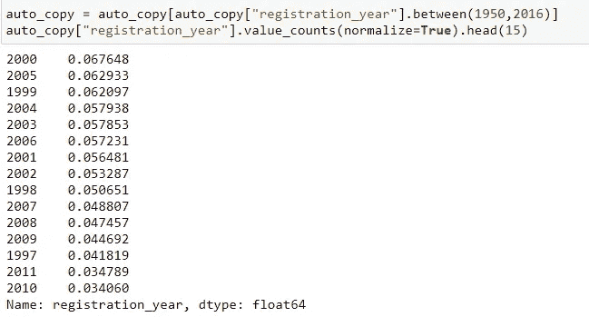
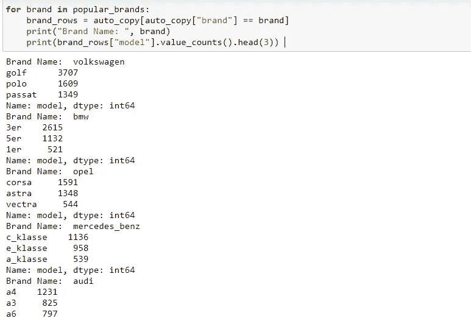

# 德国易贝汽车销售-数据探索与洞察

> 原文：<https://medium.com/analytics-vidhya/german-e-bay-car-sales-data-exploration-insights-87e9fd74648b?source=collection_archive---------17----------------------->

[梅里达勒](https://unsplash.com/@meric?utm_source=medium&utm_medium=referral)在 [Unsplash](https://unsplash.com?utm_source=medium&utm_medium=referral) 上的照片

让我们看看德国易贝网站分类广告区[的*易贝·克莱纳泽根*的二手车销售。](https://en.wikipedia.org/wiki/Classified_advertising)

数据包含一些默认编码无法读取的字符-“UTF-8”。所以，你可能想用`Latin-1`或者`Windows-1252 encodings.`

info()方法显示有 20 列，其中 4 列是数字——邮政编码、照片数量、制造年份、powerPS。列名在“camelcase”中，不像 Python 的首选“snakecase”。首先，我们可以将列名重命名为“snakecase”样式。

将列重命名为 snakecase 样式

信息()

大多数列名都很直观，除了‘ab test’—这是为了了解列表是否包括在 A/B 测试中。更多信息—[https://en.wikipedia.org/wiki/A/B_testing](https://en.wikipedia.org/wiki/A/B_testing)。

PowerPS 一栏的意思是马力。

通过'价格'，'里程表'列扫描，我们意识到有逗号和货币值或' km '，需要清理并转换为浮点数据类型。

清洁价格栏

清洁里程表柱

这三列“图片数量”、“卖家”、“报价类型”提供不了多少价值。它们在 50K 条记录中具有几乎相同的值。

删除列不会增加值

移除异常值—探索价格列，大约有 1400 条 50 K 记录的价格为 0，并且有些汽车太贵了。我们可以去掉这个。这可能是因为易趣拍卖网站([https://pages.ebay.in/sellercentral/auctions.html](https://pages.ebay.in/sellercentral/auctions.html))竞价网站从低价值开始，达到高价值，然后再次下降到更务实的价值。

所以我们将保留价格在 1 到 200000 美元之间的行。

移除异常值

> 观察-网站中的下拉选项很可能将 1000/9999 作为注册年份值。

观察

Scraper 已列出到 2016 年，因此注册年份超过 2016 年的汽车将是不正确的，或者必须删除 1950 年(注册程序为时尚早)之前的行。在删除之前，让我们考虑总记录的百分比。

占总记录的百分比非常小

它少于总集的 4 %，我们可以安全地删除它们。

> 同时，我们可以从上面推断出大多数注册发生在过去 20 年。

让我们来探究一下这些品牌——德国汽车是大众汽车(“V”读作“F”)；-))，宝马，欧宝，奔驰，奥迪——美国车是福特——法国车是雷诺，标致——意大利车是菲亚特——西班牙车是西亚特——捷克车是斯柯达——日本车是日产，马自达。

normalize()的使用

注意 value_counts(normalize=True ),它给出了相对频率。在这里阅读更多[https://pandas . pydata . org/pandas-docs/stable/reference/API/pandas。Series.value_counts.html](https://pandas.pydata.org/pandas-docs/stable/reference/api/pandas.Series.value_counts.html)

> 我们可以推断，前 5 名品牌是德国汽车，大众是受欢迎的品牌，它等于后面两个品牌的总和。

下面是我们看到的最受欢迎的品牌

让我们看看流行品牌的平均价格，看看我们是否能对此有所了解。

不同流行品牌的平均价格

> 在 7 大品牌中，存在明显的价格差距:
> 
> 奥迪、宝马、奔驰更贵
> 
> 福特和欧宝更便宜
> 
> 大众介于两者之间——这可能解释了它受欢迎的原因，它可能是一个“两全其美”的选择。

在上面的方式中，我们尝试在受欢迎的汽车中计算平均里程。

找出热门汽车的里程数

下表列出了平均价格和平均里程。

> 请注意，最贵的两辆车(奥迪、奔驰)不一定有最高的里程数。事实上，低端汽车——欧宝、雷诺的里程数接近大众，汽车的平均价格几乎是大众的一半。

行中有一些德语单词，我们可以使用 applymap()方法将它们转换成英语。“german_convert_english”是自定义函数。

德语 _ 转换 _ 英语功能在笔记本里

让我们分析一下邮政编码列。

各个城市的邮政编码

10115 是柏林。尽管柏林被认为是适宜步行的城市，但汽车仍然是居民出行的主要方式。65428 是吕塞尔斯海姆，45888 是盖尔森基兴，66333 是沃尔克林根，44145 是多特蒙德。人们可以在谷歌地图中注意到，公共交通工具少了一些，人们倾向于使用汽车作为首选的出行方式。

> 问题——受损汽车比未受损汽车便宜多少？

> 从上面我们可以推断，未受损的汽车比受损的贵 2.5 倍。

**找到最常见的品牌/型号组合**

我们现在知道流行的品牌，对照它们检查模型。Value_counts()以降序给出，这正是我们想要的。

分类列有德语单词，我们可以将其转换成英语。

使用正则表达式和替换方法

希望你喜欢这个！！！

我的 Jupyter NB 在这里——【https://github.com/indgoddess/EBay-Used-Car-Sales 