# 德国交通标志识别基准

> 原文：<https://medium.com/analytics-vidhya/german-traffic-sign-recognition-benchmark-5477ca13daa0?source=collection_archive---------2----------------------->

使用深度学习和计算机视觉准确检测和分类交通标志图像。


# 目录:

1.  业务/现实世界的限制。
2.  探索性数据分析。
3.  设置数据输入管道。
4.  模型定义和训练。
5.  预测测试数据的输出。
6.  训练更快-RCNN。
7.  将 fast-RCNN 与我们的定制模型相结合。
8.  结论和未来工作。
9.  有用的参考。

# 1-业务/现实世界的限制:

## 1.1-问题陈述:

*   交通标志是道路基础设施不可或缺的一部分。如果没有这些有用的标志，我们很可能会面临更多的事故，因为司机不会得到关于他们可以安全行驶多快的重要反馈，或者关于道路工程、急转弯或前方学校路口的信息。
*   自然，自动驾驶汽车也必须遵守道路法规，因此能够识别和理解交通标志。
*   交通标志检测的目标是在大规模搜索图像中的候选标志后，识别应该发现交通标志的感兴趣区域(ROI)并验证该标志。
*   它在自动驾驶汽车中有非常重要的作用，这是汽车工业的未来。

**你的车所见……(特斯拉 Autopilot 全自动驾驶)**

*   德国交通标志基准是在 2011 年国际神经网络联合会议(IJCNN)上举行的多类别、单图像分类挑战赛。
*   数据集可以从这个[链接](https://www.kaggle.com/meowmeowmeowmeowmeow/gtsrb-german-traffic-sign)下载。
*   与此案例研究相关的所有文件都可以在此 [GitHub repo](https://github.com/HardikVagadia1997/German-Traffic-Sign-Recognition-Benchmark.git) 找到。

## 1.2-目标和限制:

*   每个交通标志都应该被正确识别。因此，[多级对数损耗](https://www.tensorflow.org/api_docs/python/tf/keras/losses/categorical_crossentropy)需要改进。
*   加权的 [F1 分数](https://scikit-learn.org/stable/modules/generated/sklearn.metrics.f1_score.html)将用于判断分类性能，而[均方差(MSE)](https://scikit-learn.org/stable/modules/generated/sklearn.metrics.mean_squared_error.html) 用于判断包围盒检测性能。
*   此外，时间是一个主要的制约因素，因为即使是一秒钟的延迟也可能是生死攸关的问题。

# 2-探索性数据分析:

**2.1-文件夹结构:**

*   数据集包含训练和测试文件夹。火车文件夹有 43 个不同的文件夹，从 0 到 42 命名。每个文件夹包含各自类别的图像。
*   有 39，209 个训练图像和 12，630 个测试图像。所有图像都是 3 通道 RGB 图像。
*   还有 Train.csv 和 Test.csv 文件，其中包含有关训练和测试图像的信息。
*   所有的图像分布在 43 个不同的类中。

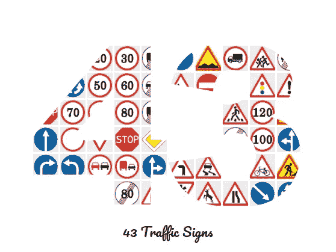

**43 类交通标志**

*   Train.csv 文件包含每个训练图像的以下信息:

1.  **宽度:**图像的宽度，以像素为单位。
2.  **高度:**图像的高度，以像素为单位。
3.  **投资回报率。X1 :** 边框左上角的 X 坐标。
4.  **投资回报率。Y1 :** 边界框的左上角 Y 坐标。
5.  **投资回报率。X2 :** 包围盒右下角的 X 坐标。
6.  **投资回报率。Y2 :** 边框的右下 Y 坐标。
7.  **ClassId** :图像的类标签。它是一个介于 0 和 43 之间的整数。
8.  **路径:**图像在 Train 文件夹中出现的路径。其格式为:“/Train/ClassId/image_name.png”。

**2.2-检查训练集中的类不平衡:**

*   下图显示了训练图像的类别分布。

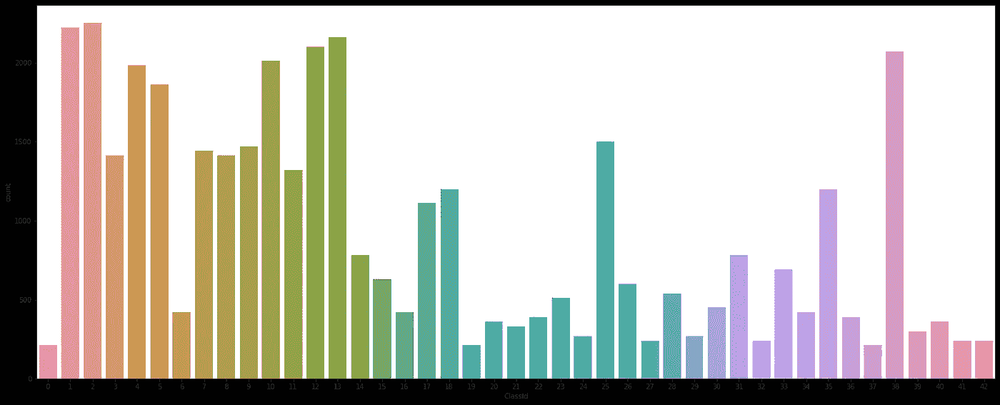

**训练集中的类分布**

# 观察结果:

*   目标类显然不是均匀分布的。
*   这是很符合逻辑的，因为像“保持速度低于 30 K-mph”或“前方颠簸”这样的标志比“前方道路施工”这样的标志出现得更频繁。
*   各个阶层的形象分布不均。一些班级有大约 2500 张图片，而其他班级只有 250 张图片。
*   较少数量的图像会破坏训练过程。我们可以使用数据扩充来克服某些类别中图像数量不足的问题。要了解更多关于数据扩充的信息，请参考此[链接](https://www.geeksforgeeks.org/python-data-augmentation/)。

**2.3-检查测试集中的类别不平衡:**

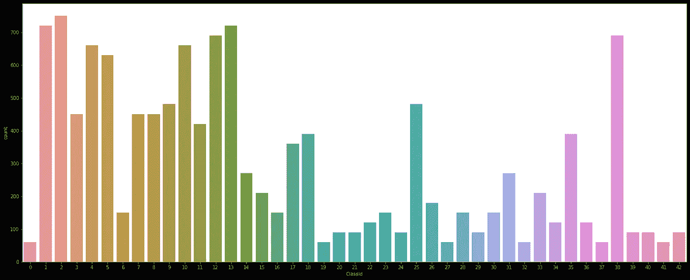

**测试集中的类别分布**

# 观察结果:

*   对测试数据的观察与对训练数据的观察非常相似。
*   这里也有一些课程比其他课程更频繁。

**2.4-分析图像尺寸:**

*   下面的直方图显示了训练集和测试集图像的高度和宽度分布:

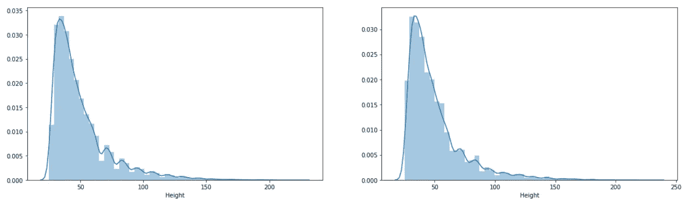

**训练图像的高度和宽度分布显示，大多数图像的尺寸在 30 到 50 像素之间。**

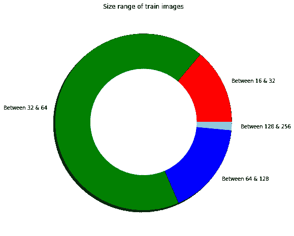

**饼图显示大多数图像的尺寸小于 64。**

# 观察结果:

*   从上面的图中可以明显看出，我们的训练集和测试集图像遵循相似的高度和宽度分布。
*   由于所有的图像都有不同的尺寸，我们需要固定每个图像的高度和宽度常数。
*   我们需要以数据丢失最少的方式执行此操作。
*   对于较小的图像，我们需要做适当的填充。
*   对于这个案例研究，我们将调整我们的图像的高度和宽度为(32，32 ),因为大多数。我们将在这篇文章的后面讨论如何调整图片的大小。
*   还要注意的是，截断图像比添加更多的噪声要好。因此，保持尽可能低的尺寸，使得大多数图像在其附近具有它们的原始尺寸，但是也不要太低。

**2.5-现在我们来看一些图片:**

*   我们数据集中的图像有不同的大小，如下图所示:

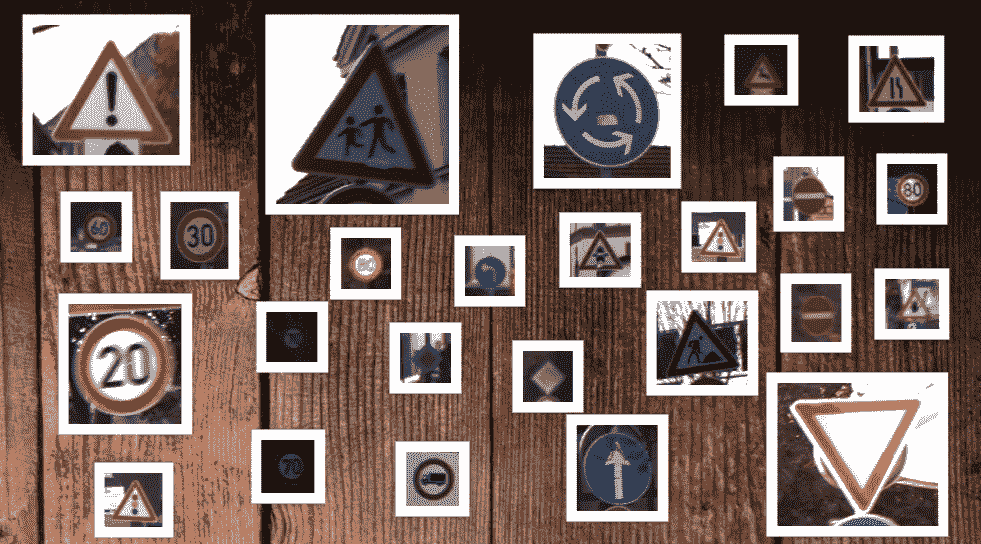

**图像有不同的宽度和高度。有些相当大，有些像邮票一样小。**

*   有些是亮的，有些是暗的。

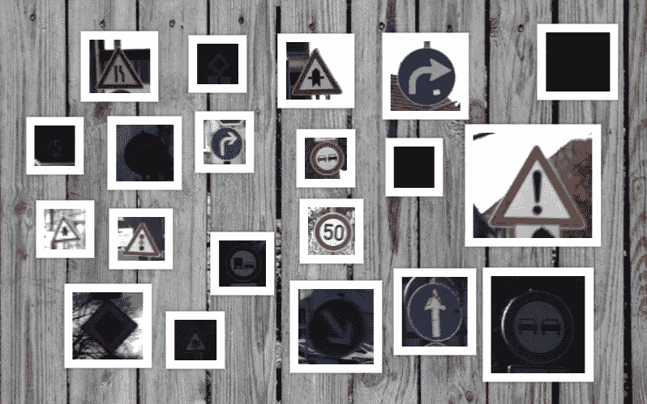

**有些图像是在合适的日光下拍摄的，而有些图像似乎是在黑暗中拍摄的，难以辨认。**

*   有些图像很清晰，而有些图像看起来很模糊。

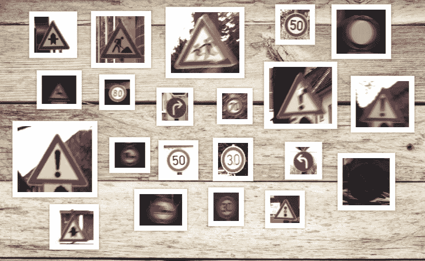

# 3-设置数据输入管道:

**3.1-导入库并设置随机种子:**

*   让我们从导入必要的库并为 python、numpy 和 tensorflow 设置随机种子开始。

**3.2-从 kaggle 下载数据集:**

*   我们将数据集从 kaggle 下载到 google-colab 的本地内存中。你也可以把它下载到你的 google drive 上，但是在训练期间获取这些图片会很慢。因此，我将它们保存在 colab 的本地内存中。

*   在执行上述函数时，系统会提示您上传 kaggle api 令牌，之后会下载并解压缩数据集。

**3.3-将训练数据分为训练集和验证集:**

*   在训练我们的模型时，我们将使用 25%的图像进行交叉验证。下面是创建验证集的代码。

*   现在，我们需要设置一些常数，如每个图像的高度和宽度。我们需要有相同的高度和宽度的每幅图像，然后再将它们输入神经网络。
*   正如我们在探索性数据分析部分所讨论的，我们将宽度和高度设置为(32，32)。
*   此外，我们在训练集和验证集中获取每个图像的路径和名称。

*   现在，我们从路径中提取每个图像的标签。

**3.4-更新图像边界框坐标:**

*   因为我们要将每张图片的形状调整为(32，32)，所以我们也需要更新坐标。
*   请注意，这些坐标是像素数，而不是图像比例。因此，更新它们非常容易。我们需要做简单的加法/减法。下面的代码将使它变得清晰:

*   现在，我们将把数据帧分成训练和验证数据帧:

**3.5-创建数据生成器:**

*   下面是创建和返回数据生成器的函数。循序渐进地正确理解是非常重要的。

1.  首先，我们读取图像，对其进行解码，并将数据类型转换为“float32”。
2.  然后我们调整亮度和对比度。我们将只增强大约 5%最暗图像的亮度。以下是增强亮度前后的图像示例:

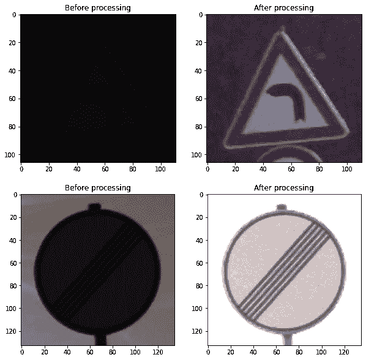

**增强亮度前后的图像。**

3.在下一步中，我们将调整图像的大小为(32，32)并将其归一化。

4.注意，我们的数据集返回图像、它的标签和边界框坐标。

5.我们使用“*tensor flow . data”*API 来生成数据生成器。它是一个 Tensorflow api，用于生成复杂的输入管道。要了解更多，请参考这个[链接](https://www.tensorflow.org/guide/data)。

# 4-模型定义和培训:

**4.1-定义模型:**

*   我们要定义的模型既能分类，又能包围盒回归。

*   上面代码中的“**shape n-layer”**锐化了图像中对象的边缘。下图显示了图像锐化前后的一些示例。

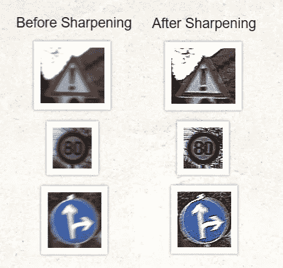

**左侧图像为原始图像，右侧图像为锐化图像。我们可以清楚地看到，它加强了图像中物体的边缘。**

*   模型的其余部分是卷积层、最大池层和全连接层的组合。
*   **“分类”**层返回适当的类标签，而**“回归”**层返回预测边界框的左上角和右下角的 x 和 y 坐标。
*   下图显示了模型图:

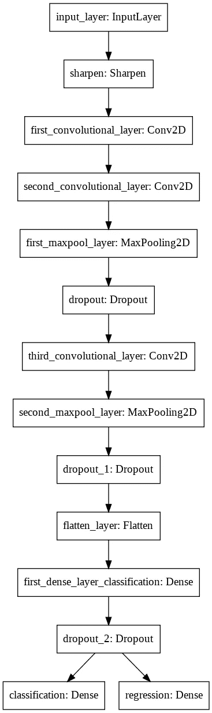

**模型图**

**4.2-培训:**

*   现在我们已经有了模型，让我们定义损失函数。请注意，将有 2 个不同的损失函数。对于分类，我们将使用[**【SparseCategoricalCrossentropy】**](https://www.tensorflow.org/api_docs/python/tf/keras/losses/SparseCategoricalCrossentropy)**，对于包围盒回归，我们将使用[**【R 平方】**](https://www.kaggle.com/c/mercedes-benz-greener-manufacturing/discussion/34019) 。**
*   **如上所述，我们将根据加权 F1 分数来判断我们的模型的分类性能。我们将定义一个自定义回调，在每个时期结束时打印 F1 分数。下面是做同样事情的代码，也是用于训练模型的代码。**

*   **下图显示了张量板图。要了解更多关于 Tensorboard 的信息，请参考此[链接](https://www.tensorflow.org/tensorboard)。**

**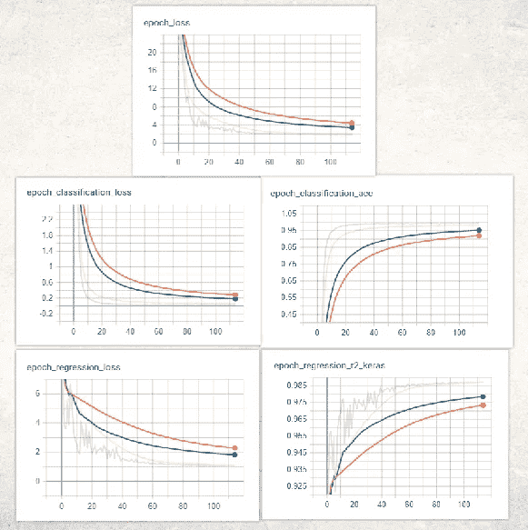**

****上述图表显示，由于训练和验证损失之间没有重大差异，因此不存在过度拟合。****

# **5-预测测试数据的输出:**

*   **现在让我们在看不见的测试数据图像上评估我们的模型。我们的数据集中有一个包含 12，630 张测试图像的测试文件夹。**
*   ****"Test.csv"** 文件包含测试图像的路径以及它们的实际标签和边界框坐标。请注意，我们将不得不在这里更新坐标，就像我们对训练和验证图像所做的那样，因为我们要将每个图像的大小调整为(32，32)。我不打算重复代码，因为我已经附上了上述代码。**
*   **下面是评估测试集图像的函数。它返回每个测试集图像的预测标签和边界框。**

*   **现在让我们看看我们模型的测试集性能:**

**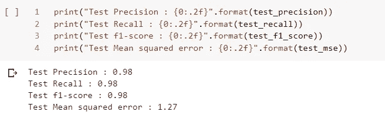**

****测试我们模型的性能****

*   **下图描绘了预测的和实际的边界框:**

**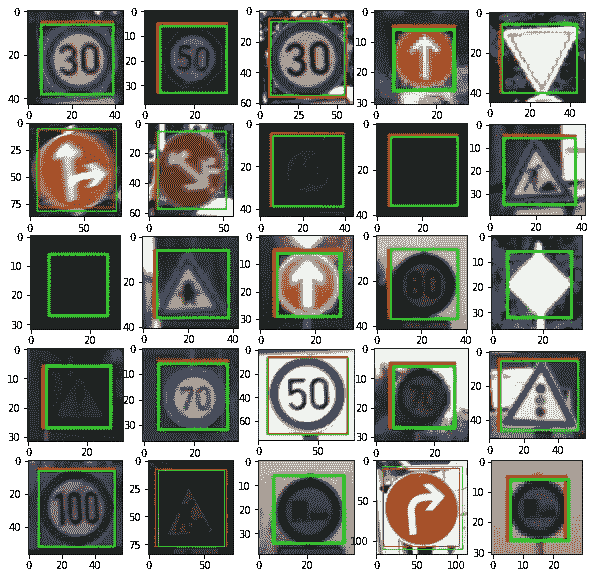**

****实际的包围盒是红色的，而绿色是预测的。我们可以清楚地看到，它们几乎相互重叠。****

*   **现在，让我们看看一些标签被我们的模型错误分类的图像:**

**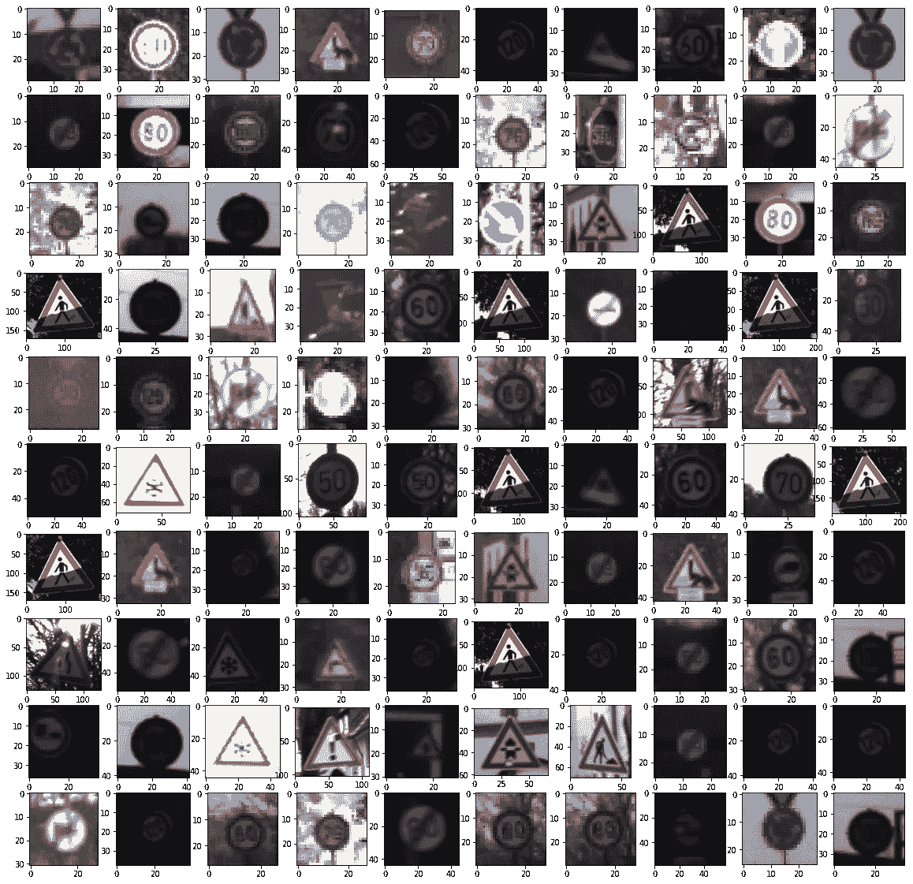**

****误分类图像****

# **观察:**

*   **少于 2.5%的图像被错误分类。**
*   **大多数误分类的图像在尺寸上非常小，并且非常不清晰。**
*   **有些甚至不在相框里。**
*   **其中许多甚至连人类都无法识别。**

# **6-训练速度更快-RCNN:**

*   **让我们尝试一种用于对象检测目的的高级模型。对于我们之前的模型，我们得到了 1.27 MSE，这是相当好的，预测的边界框也几乎是完美的。但是有一些先进的模型在目标检测问题上表现出色。让我们用一个这样的模型来解决包围盒问题。**
*   **fast-RCNN 是 RCNN 家族中使用最广泛的最新版本。在这篇博客中，我不会详细介绍更快的 RCNN 架构。要了解更多信息，请点击此[链接](https://towardsdatascience.com/faster-r-cnn-for-object-detection-a-technical-summary-474c5b857b46)。**
*   **现在让我们在数据集上训练更快的 RCNN。首先下载数据集，创建验证目录，并像前面一样设置输入管道。在这种情况下，不需要调整图像的大小，因此不需要更新坐标。然后我们需要安装一些依赖项。**

```
!apt-get install protobuf-compiler python-pil python-lxml python-tk
!pip install Cython
```

*   **首先创建一个名为“桌面”的文件夹。这将是我们的项目目录。将这个 [Git-hub 存储库](https://github.com/tensorflow/models)克隆到其中。**

```
!mkdir "/content/Desktop"
%cd "/content/Desktop"
!git clone [https://github.com/tensorflow/models.git](https://github.com/tensorflow/models.git)
```

*   **然后在 object_detection 文件夹中创建两个文件夹，如下所示。“images”文件夹将保存所有数据,“training”文件夹将保存我们接下来将看到的培训所需的文件。**

```
!mkdir "/content/Desktop/models/research/object_detection/images"
!mkdir "/content/Desktop/models/research/object_detection/training"
```

*   **将所有数据文件夹移动到“object_detection/images”文件夹中。**

```
!mv "/content/Data/Train" "/content/Desktop/models/research/object_detection/images/"!mv "/content/Data/Validation" "/content/Desktop/models/research/object_detection/images/"!mv "/content/Data/Test" "/content/Desktop/models/research/object_detection/images/"
```

*   **现在运行以下命令:**

```
!apt-get install protobuf-compiler python-pil python-lxml python-tk
!pip install Cython
```

*   **现在，将工作目录更改为研究文件夹，并运行以下命令集:**

```
%cd "/content/Desktop/models/research"
!protoc object_detection/protos/*.proto --python_out=.#Setting enviornment variable
os.environ['PYTHONPATH'] += ':/content/Desktop/models/research/:/content/Desktop/models/research/slim'
```

*   **现在使用以下参数运行“setup.py”文件:**

```
!python setup.py build
!python setup.py install
```

*   **现在安装“tf_slim”，将目录更改为 object_detection/builders 并运行 model_builder.py 文件:**

```
!pip install tf_slim
%cd /content/Desktop/models/research/object_detection/builders/
!python model_builder_test.py
```

*   **现在创建一个名为“generate_tfrecord.py”的文件，将以下代码复制到该文件中，并将其复制到 object_detection 文件夹中:**

*   **创建一个名为“label_map.pbtxt”的标签映射文件，并将如下所示的标签映射复制到该文件中:**

*   **将模型配置文件移动到 object_detection/training 文件夹中:**

```
!cp -r /content/Desktop/models/research/object_detection/samples/ configs/faster_rcnn_resnet101.config.config /content/Desktop/models/research/object_detection/training
```

*   **在配置文件中，我们需要编辑一些代码段。现在，简单的复制下面的代码到里面。config 文件非常容易理解，如果需要，可以很容易地调整任何参数。**

*   **现在，我们必须创建培训、验证和测试记录。将目录更改为 object_detection 文件夹，并运行以下命令:**

```
%cd "/content/Desktop/models/research/object_detection"!python generate_tfrecord.py --label='GTSRB' --csv_input=data/train_labels.csv --img_path=images/Train  --output_path=training/train.record!python generate_tfrecord.py --label='GTSRB' --csv_input=data/validation_labels.csv --img_path=images/Validation  --output_path=training/validation.record!python generate_tfrecord.py --label='GTSRB' --csv_input=data/test_labels.csv --img_path=images/Test  --output_path=training/test.record
```

*   **从 tensorflow.org 下载 Faster-RCNN 模型并解压 zip 文件:**

```
!wget http://download.tensorflow.org/models/object_detection/faster_rcnn_resnet101_coco_2018_01_28.tar.gz!tar -xvf faster_rcnn_resnet101_coco_2018_01_28.tar.gz
```

*   **将“train.py”和“eval.py”文件移到 object_detection 文件夹中:**

```
!mv "/content/Desktop/models/research/object_detection/legacy/train.py" "/content/Desktop/models/research/object_detection/"!mv "/content/Desktop/models/research/object_detection/legacy/eval.py" "/content/Desktop/models/research/object_detection/"
```

*   **现在，是时候训练我们的模型了。我要训练它走 3000 步。**

```
!python train.py --logtostderr --train_dir=training/ --pipeline_config_path=training/faster_rcnn_resnet101.config
```

> **注意:如果关于 Faster-RCNN 的训练还有什么不清楚的，那么我已经在这个 [git-hub 库](https://github.com/HardikVagadia1997/German-Traffic-Sign-Recognition-Benchmark.git)上传了 IPython 笔记本，上面有全功能的分步代码，你可以用来训练和推断。**

# **7-将 fast-RCNN 与我们的定制模型相结合:**

*   **现在，作为最终的解决方案，我们将结合我们的两个模型。我们将使用我们定制的模型进行分类，但丢弃其边界框输出。我们将使用 fast-RCNN 进行包围盒预测。下图描述了我们的最终解决方案架构:**

**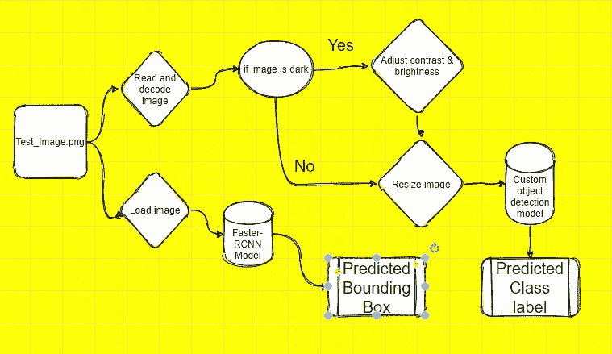**

****最终解决方案图****

*   **首先运行下面的代码来导入推理图并设置一些路径和变量:**

```
# This is needed since the notebook is stored in the #object_detection folder.
sys.path.append("..")#Importing essential libraries
from object_detection.utils import ops as utils_ops
from object_detection.utils import label_map_util
from object_detection.utils import visualization_utils as vis_util### Model preparation variable
MODEL_NAME = 'trained_inference_graph'
PATH_TO_FROZEN_GRAPH = '/content/drive/My Drive/CaseStudy2/frozen_inference_graph.pb'PATH_TO_LABELS = 'training/label_map.pbtxt'
NUM_CLASSES = 1 #remember number of objects you are training? cool.### Load a (frozen) Tensorflow model into memory.
detection_graph = tf.Graph()
with detection_graph.as_default():
   od_graph_def = tf.GraphDef()
   with tf.gfile.GFile(PATH_TO_FROZEN_GRAPH, 'rb') as fid:
      serialized_graph = fid.read()
      od_graph_def.ParseFromString(serialized_graph)
      tf.import_graph_def(od_graph_def, name='')###Loading label map
category_index = label_map_util.create_category_index_from_labelmap(PATH_TO_LABELS, use_display_name=True)### Load image into numpy function
def load_image_into_numpy_array(image):
   (im_width, im_height) = image.size
   return np.array(image.getdata()).reshape((im_height, im_width,   3)).astype(np.uint8)###STATING THE PATH TO IMAGES TO BE TESTED
PATH_TO_TEST_IMAGES_DIR = 'test_images/'#TEST_IMAGE_PATHS = [ os.path.join(PATH_TO_TEST_IMAGES_DIR, 'image{}.png'.format(i)) for i in range(1, 10) ]TEST_IMAGE_PATHS = test_df.iloc[:, 0]
IMAGE_SIZE = (256, 256)
```

*   **负载分类模型:**

```
#Loading classification modelIMG_WIDTH, IMG_HEIGHT = 32, 32
N_CHANNELS = 3
N_CLASSES = 43object_detection_model = u.get_model(IMG_WIDTH, IMG_HEIGHT, N_CHANNELS, N_CLASSES)object_detection_model_path = "/content/drive/My Drive/CaseStudy2/BestScoreTillNow.h5"object_detection_model.load_weights(object_detection_model_path)
object_detection_model.compile()
```

*   **以下函数将图像路径作为输入，并使用自定义对象检测模型返回预测的类别标签，使用 fast-RCNN 模型返回边界框:**

*   **与我们以前的模型相比，为包围盒检测获得的测试均方误差要好得多。以下是我们的最终得分:**

**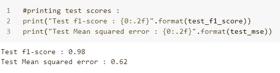**

****最终 F1 分数和 MSE****

# **8-结论和未来工作:**

*   **更快-RCNN 在对象检测方面表现更好。然而，这对于分类来说并不是那么好。因此，我们将自定义模型与 fast-RCNN 相结合。**
*   **为了更好的概括而扩充数据。**
*   **作为未来工作的一部分，尝试不同的模型，如 RetinaNet 和 yolov3。**
*   **对分类错误的图像尝试不同的图像预处理技术。**
*   **我们还可以使用像 vgg-16 这样的模型来获取特征地图，并将其传递给我们的模型。**
*   **这样的例子不胜枚举…**

# **9-有用的参考资料:**

*   **[fast-RCNN 研究论文](https://arxiv.org/pdf/1506.01497.pdf)。**
*   **RetinaNet [研究论文](https://arxiv.org/pdf/1708.02002.pdf)和[实施](https://github.com/fizyr/keras-retinanet)。**
*   **[INI 基准网站](http://benchmark.ini.rub.de/?section=home&subsection=news)。**
*   **[用很少的数据构建非常强大的图像分类模型](http://Building a very powerful image classification model with very little data)。**
*   **[野外交通标志分类](https://cg.cs.tsinghua.edu.cn/traffic-sign/)。**
*   **[神经网络的有效训练和调试](https://udai.gitbook.io/practical-ml/nn/training-and-debugging-of-nn)。**
*   **[用 Tensorflow 创建数据管道](https://www.tensorflow.org/guide/data)。**

**如果你喜欢我的作品，那么请在这个帖子上鼓掌。**

**在 [LinkedIn](https://www.linkedin.com/in/hardik-vagadia/) 上联系我。**

**我的 [Github 简介](https://github.com/HardikVagadia1997)。**