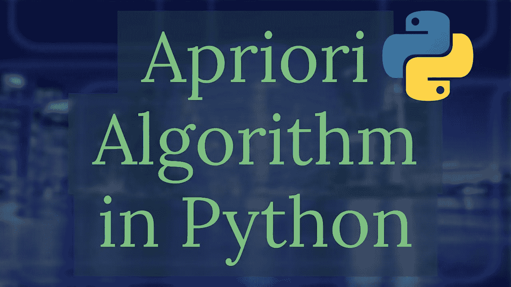
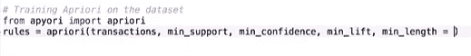
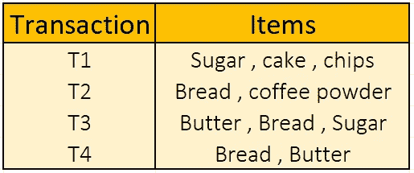
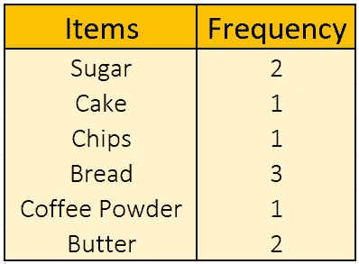
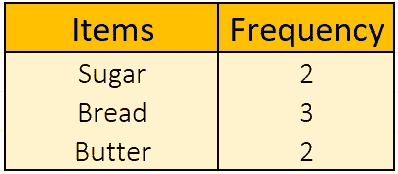
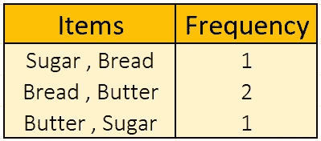
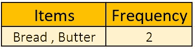
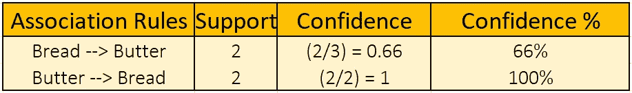

# 在使用 Apriori 算法之前先了解它

> 原文：<https://medium.com/analytics-vidhya/get-a-prior-knowledge-of-apriori-algorithm-before-using-it-4cf72bdaf7dd?source=collection_archive---------19----------------------->

Apriori 算法是一种关联或推荐算法，它通过创建规则来帮助我们关联数据集中的对象。它主要用于电影推荐、网上购物推荐等。

使用先验算法。在 Python 中

正如我们所看到的，apriori 函数将事务、min_support、min_confidence、min_lift 和 min_length 作为其参数，因此将逐一讨论它们的重要性。

给定项目的 **min_support** 等于(**给定项目在每笔交易中的频率** / **总笔数**)。将出现在我们的规则中的项目应该具有比 min_support 更高的支持度。

min_confidence 是对我们创建的规则的正确性的度量。

**min_lift** 是衡量规则强度的绝佳洞察力。

**min_length** 是我们将创建规则的最小项目数

## Apriori 算法的工作原理:-

为了理解 Apriori 算法的工作原理，我们将使用下表中包含各种项目的事务。

4 个不同项目的不同交易

我们将考虑**最小支持度= 50%** 和**最小置信度= 50%** ，因此，我们交易的最小支持度的数值将= ( **给定百分比值**/**100**)*****(**交易数量** ) = (50/100)*4 = **2**

现在我们将构建一系列候选表(C1，C2 …)来检查事务表中每一项的出现频率。

## 由此表 C1: →

第一候选表

由于最小支持度的数值= 2，因此，我们将只提取 L1 表中频率大于或等于 2 的值

L1 表

现在，我们将从表 L1 中创建一组 2 个项目，并计算它们在表 C2 中的频率

C2 候选人表

我们将再次重复相同的步骤来生成频率大于或等于 2 的 L2 表

L2 表

由于我们没有更多大于或等于 2 的组合，因此我们将使用 L2 表的以下项目创建我们的规则。

因为我们这里只有面包和黄油这两个项目，所以我们只能创建两个规则，即**面包→黄油**和**黄油→面包**，但是如果我们有两个以上的项目，即 **p、q、r、s** ，那么我们可以创建类似于 **p^q^r →s、p^q → r^s 等的规则……**

为了计算置信度，例如 p → q，必须使用**support/(p 的出现)**。

最终规则表

由于最小置信度被规定为 50%，所以我们必须只选择那些大于或等于 50%置信度的规则。这里，两个规则都具有高于 50%的置信度，因此它们都将被考虑。

因此，我们可以得出这样的结论:如果有人买了面包，他有 66%的机会买黄油，而如果有人买了黄油，他有 100%的机会买面包 。这就是 APRIORI 算法的工作原理。如果有人在评论区有任何问题、评论或担忧，请告诉我，在此之前，请享受学习的乐趣。