# 使用 HMS 工具包云测试，在几分钟内获得应用洞察并开始改进您的应用

> 原文：<https://medium.com/analytics-vidhya/get-application-insights-and-start-improving-your-application-in-minutes-using-hms-toolkit-cloud-512dc40fb6cb?source=collection_archive---------25----------------------->

# **简介**

*   你想知道你的安卓应用的详细分析吗？
*   您想通过修复潜在的错误来提高应用程序的性能吗？
*   要不要节省自己未来的时间和努力？

大多数 android 开发者经常面临这些问题。为了解决这个问题，HMS Toolkit 提出了云测试。

借助云测试，您不仅可以深入了解您的应用，还可以自动获得多个设备上的应用性能。

这将节省您的时间和资源，您可以利用这些来增强您的应用程序。

在非常早期的阶段，您可以识别内存泄漏、存储利用率、电池利用率等。

## **让我们看看云测试。**

你为什么需要这个？

一旦您的应用程序为生产做好准备，您可能需要检查一些参数，看看它在生产中的表现如何。

*   兼容性测试
*   性能试验
*   功耗测试
*   稳定性试验

一旦您分析并纠正了这些数据中的错误/改进，您的应用程序就可以部署了。

要开始这个过程，请遵循以下步骤。

**第一步:**进入 **HMS** ，点击**云测试**，如下图。

它将在侧边栏中打开一个新窗口。

**步骤 2:** 选择一个**新任务**开始测试过程。

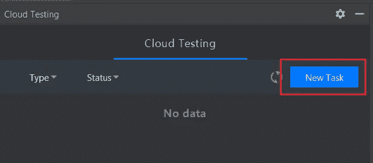

一个新的窗口将会出现，询问你想要在你的 android 应用上执行什么。

**步骤 3:** 让我们从选项中选择**兼容性测试**。

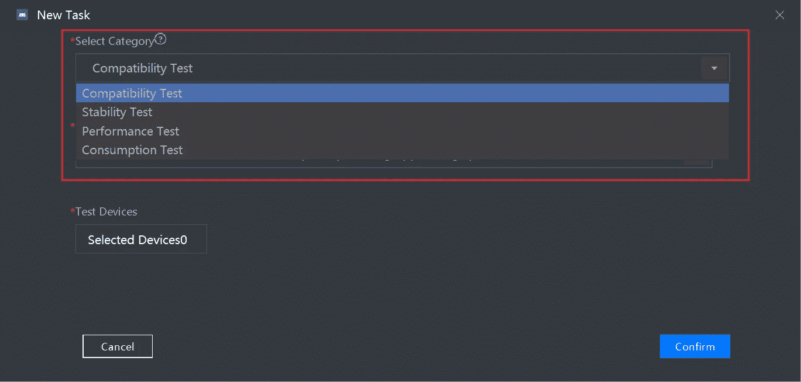

**第四步:**点击**选择设备**，出现如下窗口。

如果您想在特定设备上进行测试，也可以选择过滤器。

**注意:**您可以选择多个设备，但为了演示，我将只选择一个。

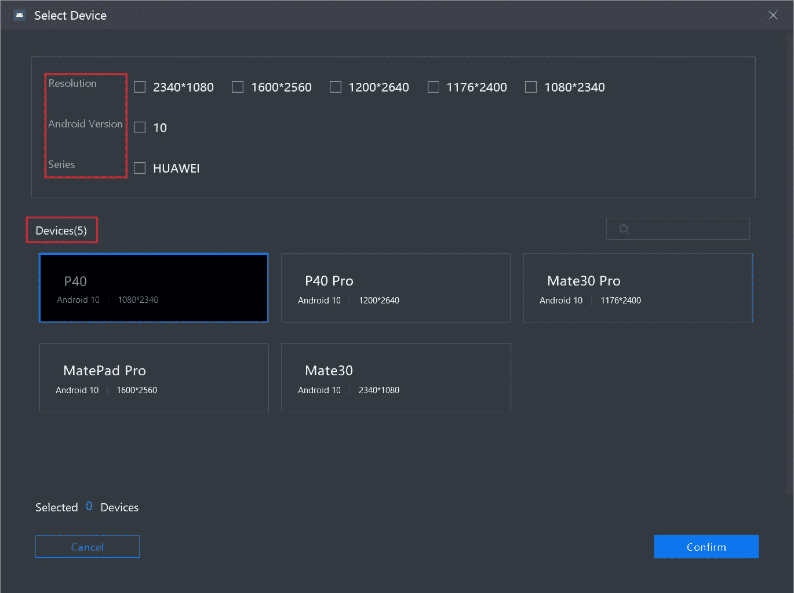

**第 5 步:**填写完所有选项后，应显示以下屏幕。点击**确认**继续

您的 apk 将被上传进行测试，一旦 apk 上传完成，您可以继续下一步。

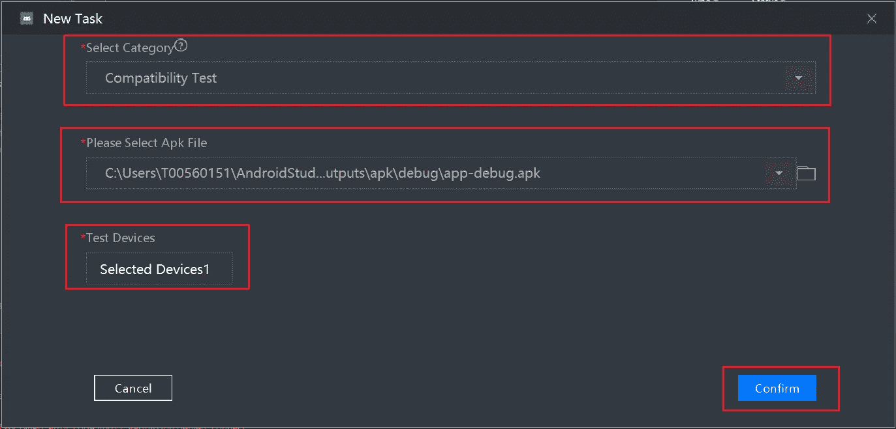

一个新的**兼容性测试任务**将会生成，您可以在**挂起**状态中看到它。

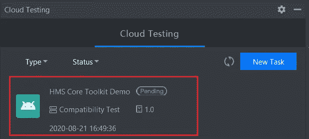

很快，状态颜色将从待定灰色变为绿色。这意味着你的测试已经开始。

你也可以看到一个新的选项出现在任务的右侧。这是查看报告。点击这里，你可以看到现场结果。

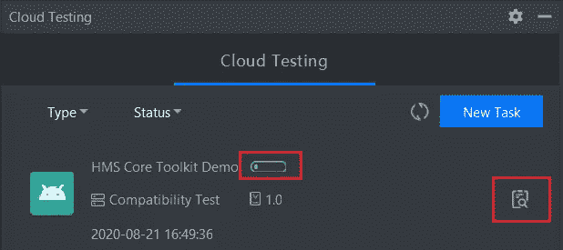

下面是我的申请进行中状态的现场结果。

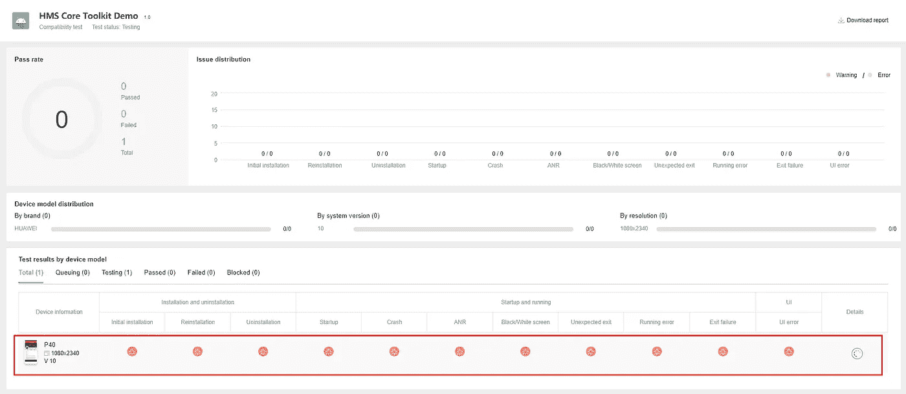

一旦测试完成，你可以看到任务更新成功在 Android Studio。

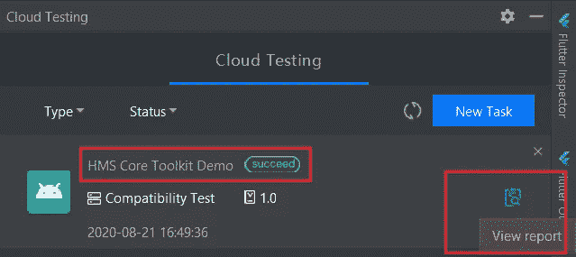

让我们再次点击**查看报告**。

在这里你可以看到所有的测试都处于通过状态，看起来我的应用程序兼容性非常稳定。

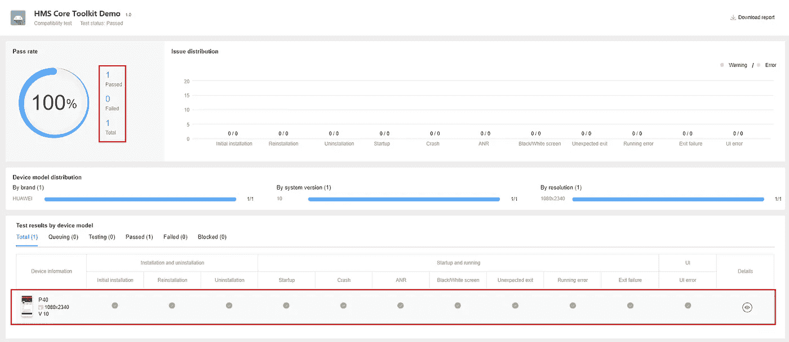

我们需要一些真实的数据来获得实际的分析，所以让我们在一个生产应用程序上工作。

如果我们一起对单个应用程序进行并行测试，让我们检查一下稳定性和性能。

我已经开始了所有 4 种类型的测试，以检查我们可以获得的关于我的应用程序的所有信息。

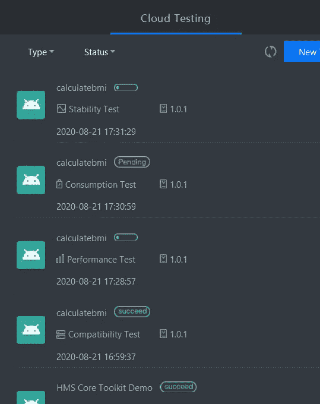

很快测试结果出来了，下面是所有的报告。

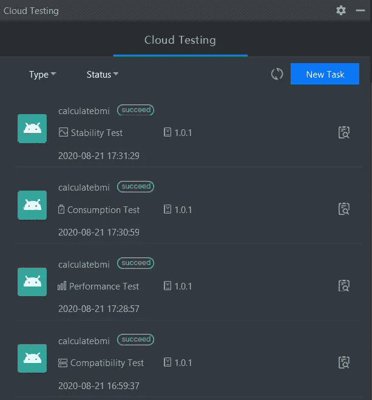

## **稳定性测试**

通过稳定性测试，我能够识别以下瓶颈点。

*   安装和启动
*   猛撞
*   ANR
*   本机崩溃
*   渗

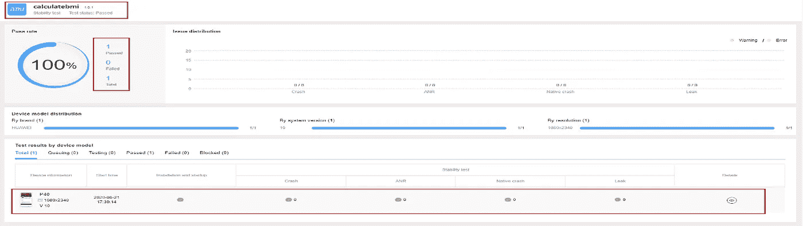

进一步单击详细信息，我还可以看到资源利用率。

*   平均杯用量
*   平均内存使用率
*   平均电池温度

当我的应用程序处于测试模式时，每 2 秒钟就可以得到这些细节。

## **资源追踪**

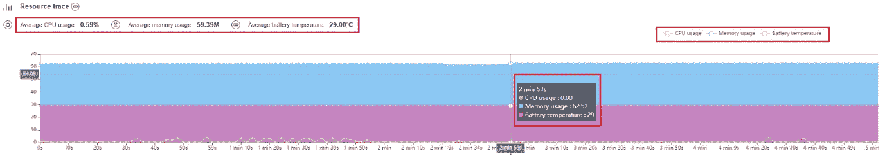

除了资源跟踪之外，您还将获得

*   错误代码和描述
*   测试截图
*   错误信息
*   Logcat 日志

## **功耗**

通过功耗测试，我能够识别以下瓶颈点。

*   安装和启动
*   资源使用
*   唤醒锁定持续时间
*   屏幕使用
*   无线局域网使用
*   WLAN 扫描
*   音频使用
*   相机使用
*   位置传感器的使用
*   唤醒警报

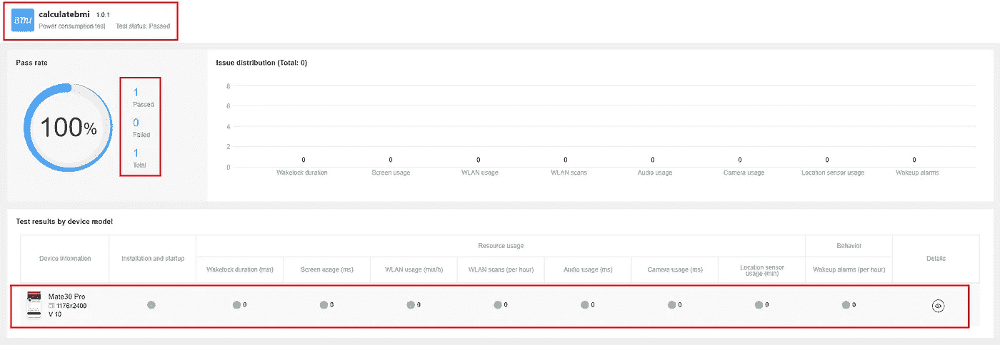

进一步单击“detail ”,我可以看到资源利用率以及我们在稳定性测试中获得的资源利用率。

当我的应用程序处于测试模式时，每 2 秒钟就可以得到这些细节。

## **资源追踪**

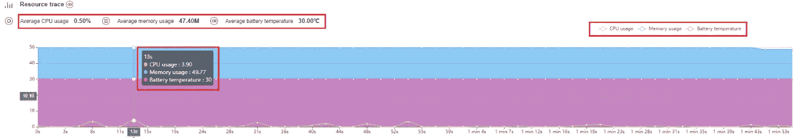

# **性能测试**

通过性能测试，我能够识别以下瓶颈点。

*   安装和启动
*   启动持续时间
*   冷启动
*   热启动
*   用户界面显示
*   帧频
*   内存使用
*   内存泄漏
*   前台内存
*   背景记忆
*   背景屏幕-内存
*   背景屏幕关闭内存
*   CPU 使用率
*   CPU 上的背景屏幕
*   后台屏幕关闭 CPU

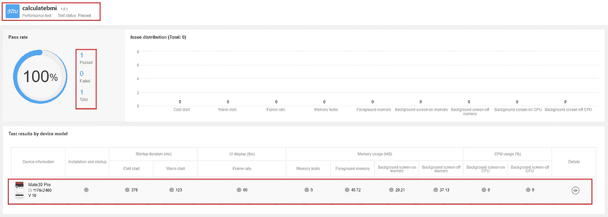

进一步单击“detail ”,我可以看到资源利用率以及我们在稳定性测试中获得的资源利用率。

当我的应用程序处于测试模式时，每 2 秒钟就可以得到这些细节。

## **资源追踪**

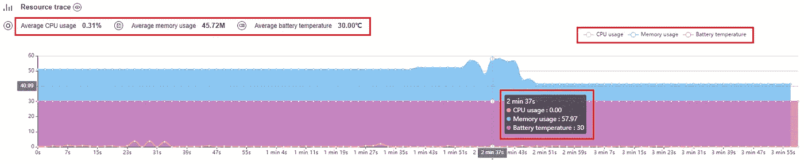

## **兼容性测试**

通过兼容性测试，我能够确定以下瓶颈点。

*   初始安装
*   重新安装
*   卸载
*   启动并运行
*   开始
*   ANR
*   碰撞
*   黑/白屏
*   意外退出
*   跑步出口
*   退出失败
*   UI 错误

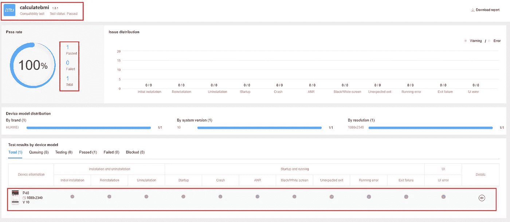

进一步单击“detail ”,我可以看到资源利用率以及我们在稳定性测试中获得的资源利用率。

当我的应用程序处于测试模式时，每 2 秒钟就可以得到这些细节。

## **资源追踪**

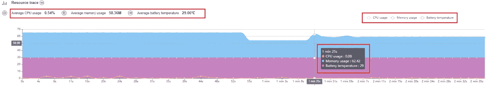

# **检测报告**

您也可以下载兼容性测试报告。

以下是报告的详细内容。

## **概览报告**

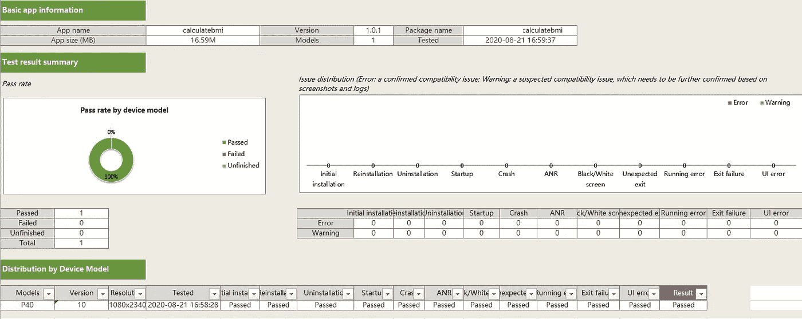

## **性能数据报告**

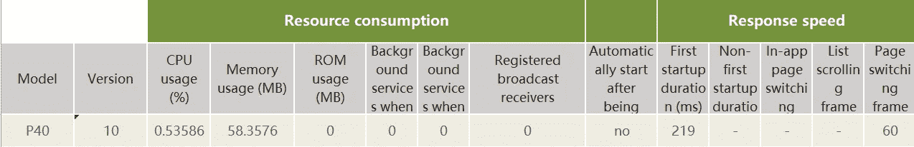

## **错误报告**

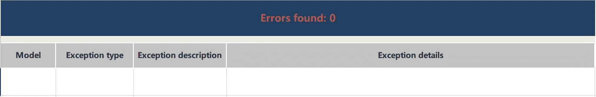

## **警告报告**

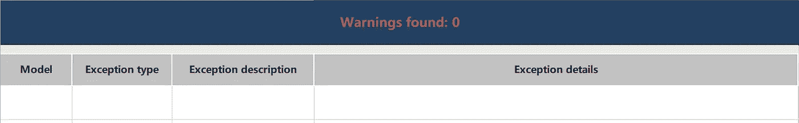

## **备用访问:**

您可以进入控制台，点击主页上的测试卡，查看以上所有详细信息。在这里你可以找到所有创建的测试任务。

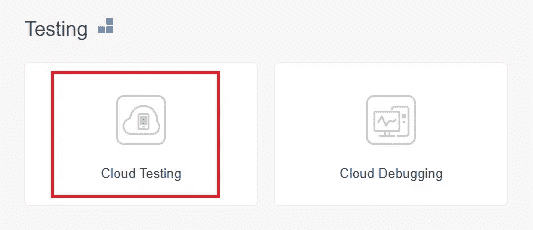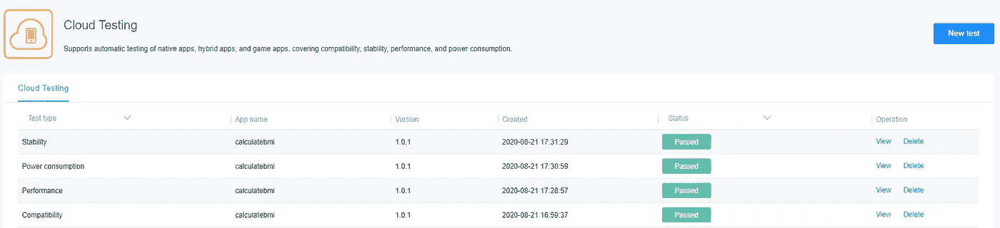

## **常见问题解答**

**无法在插件部分搜索工具包。**

检查 HTTP 代理设置，并将其设置为无。

**我在哪里可以下载最新版本的工具包插件？**

 [## 文件

### 编辑描述

developer.huawei.com](https://developer.huawei.com/consumer/en/doc/development/Tools-Library/toolkit-download-0000001050148172) 

# **结论**

我希望你喜欢这个功能，我非常肯定这个功能将有助于你在应用程序性能的改善。如果您在执行或获取报告时遇到任何困难，请发表评论。

# **参考文献**

**使用 HMS Toolkit Cloud Debugger 在任何 HMS 支持的模型上调试您的应用程序——不需要真实的设备**

 [## 华为开发者论坛

### 使用 HMS 工具包在任何 HMS 支持的模型上调试您的应用程序——不需要真正的设备

forums.developer.huawei.com](https://forums.developer.huawei.com/forumPortal/en/topicview?tid=0201336709130540054&fid=0101188387844930001) 

**HMS 工具包—自动 HMS SDK 集成**

 [## 华为开发者论坛

### HMS 工具包—自动 HMS SDK 集成

forums.developer.huawei.com](https://forums.developer.huawei.com/forumPortal/en/topicview?tid=0201249144855100206&fid=0101188387844930001) 

**HMS Toolkit Converter——您迁移的新朋友**

 [## 华为开发者论坛

### HMS 工具包转换器—您迁移的新朋友

forums.developer.huawei.com](https://forums.developer.huawei.com/forumPortal/en/topicview?tid=0201222324451440007&fid=0101187876626530001)