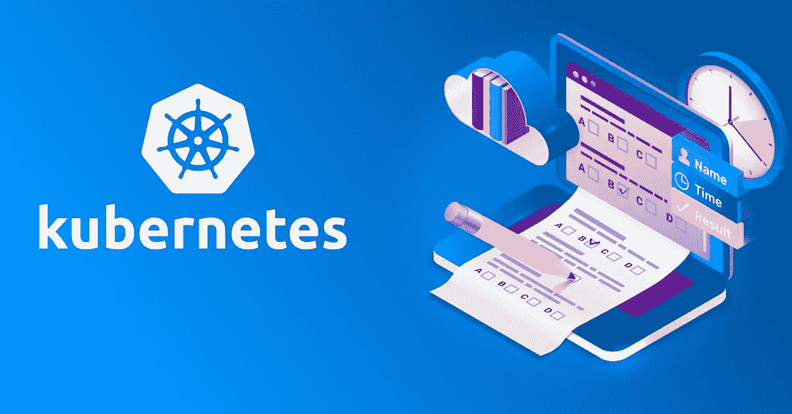
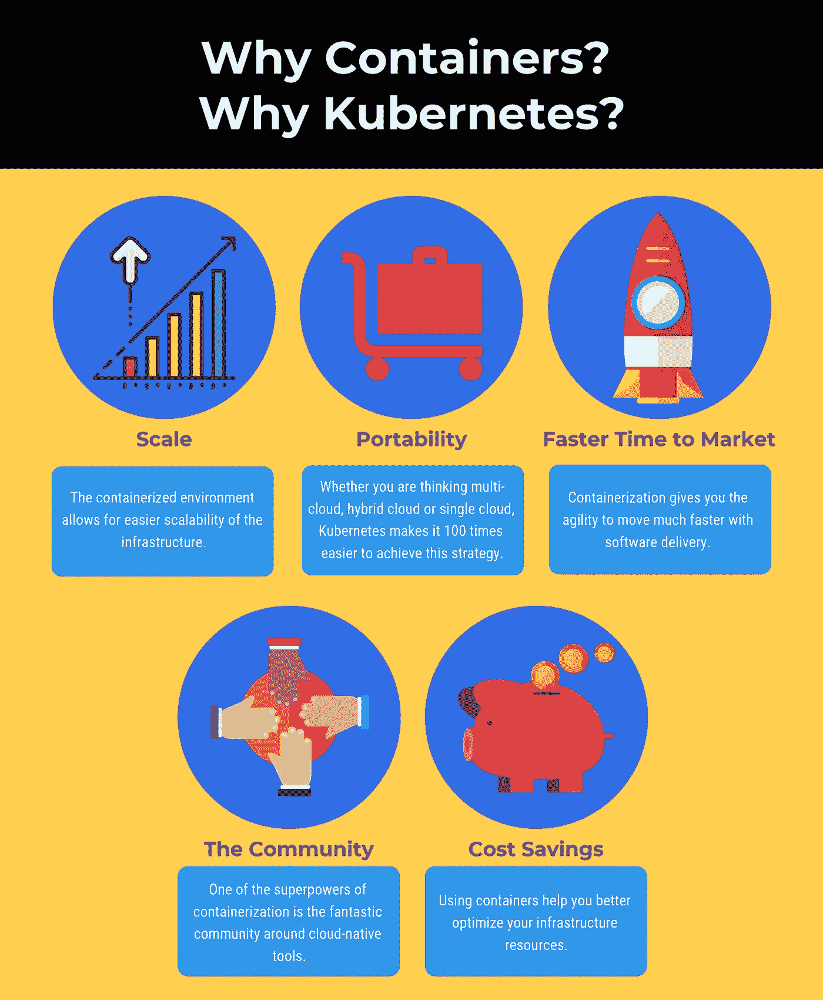
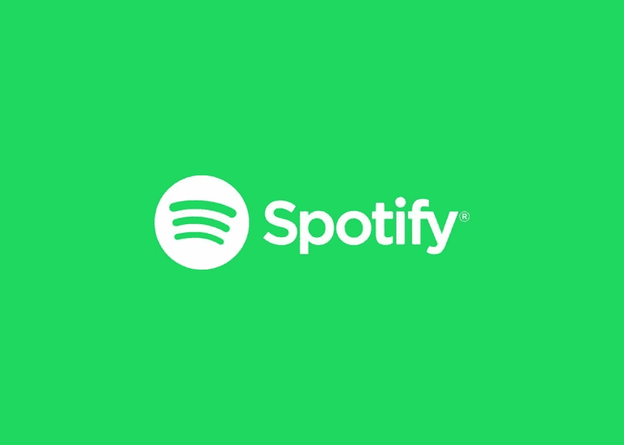
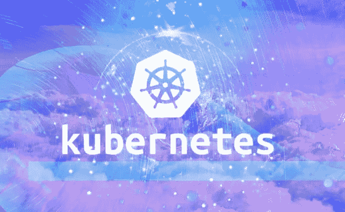

# 走进库伯内特的世界

> 原文：<https://medium.com/analytics-vidhya/get-into-the-world-of-kubernetes-a8aaa2b89dad?source=collection_archive---------20----------------------->

# Kubernetes:不仅仅是容器

> *在*旅程中作为 **ARTH 的学习者**在节目[**【ARTH-2020】**](https://www.rightarth.com/)中在‘世界纪录保持者 [**维姆达加先生**](https://www.google.com/search?q=vimal+daga&oq=vimal+daga&aqs=chrome..69i57j35i39j0l4j69i60l2.2332j0j7&sourceid=chrome&ie=UTF-8) **爵士**的指导下，我得到了更多的探索，在这里我分享一些学习，以获得对 Kubernetes 的一些见解。

深入库伯内特斯

> ***Kubernetes*** ，也称为 K8s，是一个用于自动化部署、扩展和管理容器化应用程序的开源系统。

它将组成应用程序的容器分组到逻辑单元中，以便于管理和发现。它有一个庞大的、快速增长的生态系统。Kubernetes 的服务、支持和工具随处可见。

现代应用程序越来越多地使用容器构建，容器是封装了依赖项和配置的微服务。Kubernetes 是用于大规模部署和管理这些容器的开源软件，也是希腊语中船只舵手或飞行员的意思。

Kubernetes 是一个非常灵活和可扩展的平台。它允许您使用它的功能，或者使用您自己的解决方案作为内置功能。另一方面，您也可以将 Kubernetes 集成到您的环境中，并添加额外的功能。

# 为什么是 Kubernetes？

> ***Kubernetes*** 正在席卷应用程序开发界。到 2022 年，超过 75%的全球组织将在生产中运行容器化的应用程序。

保持容器化的应用程序正常运行可能很复杂，因为它们通常涉及部署在不同机器上的许多容器。Kubernetes 提供了一种方法来调度和部署这些容器，另外还可以将它们扩展到所需的状态，并管理它们的生命周期。使用 Kubernetes 以可移植、可伸缩和可扩展的方式实现基于容器的应用程序。

Kubernetes 减轻了配置、部署、管理和监控最大规模的容器化应用程序的负担。它还帮助 It 专业人员管理容器生命周期和相关的应用程序生命周期，以及包括高可用性和负载平衡在内的问题。

**为什么要用 Kubernetes**

## 使工作负载可移植

因为容器应用与它们的基础设施是分离的，所以当你在 Kubernetes 上运行它们时，它们变得可移植。将它们从本地机器转移到内部、混合和多个云环境中的生产环境，同时保持跨环境的一致性。

## 轻松扩展容器

人们甚至可以定义复杂的容器化应用程序，并使用 Kubernetes 将它们部署在一个服务器集群上。当 Kubernetes 根据期望的状态扩展应用程序时，它会自动监控和维护容器的健康状况。

## 构建更多可扩展的应用

一个由开发人员和公司组成的大型开源社区正在积极构建扩展和插件，为 Kubernetes 增加安全性、监控和管理等功能。

# 库伯内特斯-多克公司

虽然在实践中 ***Kubernetes*** 最常与最流行的容器化平台 ***Docker*** 一起使用，但它也可以与任何符合开放容器倡议(OCI)容器图像格式和运行时标准的容器系统一起工作。

由于 Kubernetes 是开源的，对其使用方式的限制相对较少，任何想要运行容器的人都可以免费使用它，几乎可以在任何地方运行它们——本地、公共云中或两者都有。

Kubernetes 并没有取代 Docker，而是增强了它。然而，Kubernetes*确实取代了围绕 Docker 出现的一些更高级的技术。*

# *Kubernetes 用例*

## *Spotify 的 Kubernetes 故事*

> ***Spotify 采用 Kubernetes 的黄金之路***

*该公司从小规模起步，在 Kubernetes 集群上试验了一些服务，然后转向更复杂的工作负载和自助迁移。*

****

***Spotify 迈向 Kubernetes 的旅程***

> *Spotify 因其音乐服务而闻名全球。不太为人所知的是，它通往 Kubernetes 部署的道路是一条曲折的道路。*

*可能让许多人感到惊讶的是，Spotify 是 Kubernetes 的资深用户，它的产品交付能力在很大程度上归功于其敏捷的 DevOps。事实上，Spotify 继续越来越依赖于容器和微服务基础设施以及云原生部署来提供许多优势。这使得其 DevOps 团队能够持续改善数百万用户的整体流媒体体验。*

*Spotify 在 2014 年开源了其内部容器编排服务 ***Helios*** 。经过几年的使用，Spotify 决定从 Helios 转向 Kubernetes。在数千名开发者的支持下，Kubernetes 背后有一个庞大的生态系统，试图与其他企业未广泛采用的内部系统在功能上对等是很困难的，即使是像 Spotify 这样大的企业。*

*很明显，Spotify 需要一个托管的解决方案，而不是从零开始运营集群。通过转移到 Kubernetes，Spotify 将受益于 Kubernetes 提供的几个功能。*

# *Spotify 是如何做到的，现在仍然在做*

*Spotify 决定从小规模开始，尝试在一个 Kubernetes 集群上运行一项服务，然后在几天内将三项服务转移到一个共享集群上。*

*自几年前采用 Kubernetes 以来，Spotify 每月都在继续扩大对它的使用。此前，Spotify 在开始考虑 Kubernetes 可能带来的潜在好处之前，就已经开始将其运营转向集装箱化的基础设施。*

*尽管 Spotify 很早就被采用，但它在大约两年前就开始认真转向 Kubernetes。此后，Kubernetes 在 Spotify 的 DevOps 中以两种关键方式发挥了关键作用。这包括该平台如何帮助减少辛劳。Kubernetes 提供的第二个主要优势是云原生基础设施的采用如何使音乐流媒体巨头增加了许多新的工具和平台，以改善其生产渠道和运营。*

*在过去的一年里，Spotify 一直在扩大其在 Kubernetes 上运行的服务数量，同时利用其高度分布式的结构。例如，Spotify 如何将数据管道和机器学习转移到 Kubernetes，并“依靠它来建立短暂的环境。”展望未来，该公司仍需应对一些挑战，包括集群管理、每个地区的多集群运营以及建立对数据作业、机器学习工作负载和 GPU 工作负载的支持。*

*一步一步地稳步增加目标，而不是单一的整体迁移，使 Spotify 能够稳步增加范围和复杂性，并以可管理的速度处理未知因素，保持开发人员的士气。*

**

*在一次采访中，Jai Chakrabarti 先生说:*

> *“我们看到了在 Kubernetes 周围发展起来的令人惊叹的社区，我们希望成为其中的一员。我们希望从更高的速度和更低的成本中获益，并在最佳实践和工具方面与行业内的其他公司保持一致。”*
> 
> ***——JAI CHAKRABARTI，SPOTIFY 工程、基础设施和运营总监***

# *结论*

*Kubernetes 是编排容器化应用程序的一个很好的工具。它自动执行实时动态扩展应用程序的复杂任务。Kubernetes 使企业能够轻松、快速、安全地解决常见的开发和运营问题。它还提供了其他优势，例如构建无缝的多/混合云战略、节省基础架构成本和加快上市时间。*

****现在，这是一个很大的覆盖面，但如果你读了它，称赞！****

*请继续关注关于 ***的进一步阅读，深入了解 Kubernetes*** 以及更多关于 Kubernetes 的案例研究，它们将与本文一样更有见地，它将对这些服务进行概述，并帮助您理解容器技术的强大功能。*

****注意安全！继续学习！****

****#vimaldaga #righteducation #educationredefine #rightmentor #worldrecordholder #linuxworld #makingindiafutureready #ryskaucation #arthbylw #ansibleglaxy#rightansibleconcepts #usecase #kubernetes #microservices****