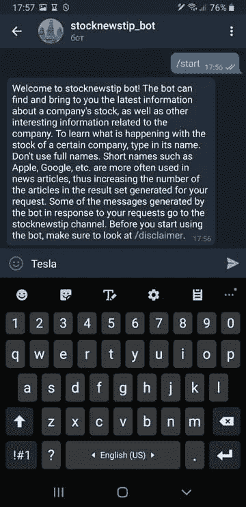

# 在 Messenger 中通过您自己的渠道获取最新的商业信息

> 原文：<https://medium.com/analytics-vidhya/get-latest-business-information-via-your-own-channel-in-a-messenger-dbd905521a3?source=collection_archive---------30----------------------->


照片由伊戈尔·沙巴林拍摄

手动在互联网上查找必要信息的过程可能非常耗时。本文讨论了如何在 messenger 中调整您自己的频道，以自动获取您感兴趣的主题的最新信息。想法如下:您创建一个将为您的通道收集信息的机器人，然后将这个机器人连接到通道。你需要让每个人都可以使用机器人，这样机器人用户的请求结果就会到达你的渠道。

这种方法允许您发现最新的趋势，因为您将收到用户感兴趣的信息。例如，如果你注意到许多用户最近对特斯拉股票感兴趣，它可能会鼓励你仔细看看它。由于你的渠道，你会以股票分析师就此话题撰写的最新文章的形式获得这些信息。

# 它通常是如何工作的

创建新闻频道的过程非常简单。一般步骤可描述如下:

1.  使用新闻搜索 API
2.  在 messenger 中创建机器人
3.  将机器人连接到频道

作为一个新闻搜索 API，您可以使用新闻 API:[https://newsapi.org/](https://newsapi.org/)，允许您以编程方式从广泛的新闻来源和博客中搜索感兴趣主题的最新文章。要使用 API，您需要一个密钥。开发者密钥是免费的。如果你想看一个如何用新闻 API 从 Python 发出请求的例子，请参考我以前的文章:[用抓取和自然语言处理开门见山](/swlh/getting-straight-to-the-point-with-scraping-and-natural-language-processing-1a62aba65586)

至于创建一个机器人，这可以在 Telegram bot 平台上轻松完成。Telegram 是一款基于云的信使，也是世界上最顶尖的信使应用之一。在下一节中，您将看到这种机器人的实现框架。一些进一步的细节可以在我前面提到的文章中找到。关于如何部署电报机器人的详细信息，请访问 https://core.telegram.org/bots[的机器人:开发者介绍页面。](https://core.telegram.org/bots)

Telegram 允许将内容从机器人直接发送到任何聊天、群组或频道。如[https://telegram.org/tour/channels](https://telegram.org/tour/channels)的电报通道页面所述，您只需点击几下鼠标即可创建一个电报通道。你可能也想在[https://telegram.org/faq_channels](https://telegram.org/faq_channels)查看频道常见问题。

一旦你有了一个渠道，你可以把它作为一种向许多人传递信息的方式，这些人会想要加入你的渠道。

# 实现机器人

正如您可能猜到的，实现一个 bot 是这里最复杂的部分，因为您需要编写一些编程代码并将其部署到 Telegram 开发平台。特别是，您需要实现一个使用新闻搜索 API 来获取指定主题的最新文章的机器人。此外，机器人应该使用一些自然语言处理(NLP)技术来过滤文章，选择最相关的文章。下面是这样一个机器人的骨架:

```
from telegram.ext import Updater, MessageHandler, Filters
def input_handler(update, context):
 inpt = update.message.text
 keywrd = inpt + ' ' + 'stock' 
 keywrd_syn = inpt + ' ' + 'shares' 
 answers_stock = []
 #Sending a request to News API
 …
 #Filtering the results of the request
 …
 for ent in doc.ents:
 if (ent.label_ == 'MONEY') or (ent.label_ == 'PERCENT'):
 answers_stock.append(sent.text.strip() + '| '+ article['publishedAt'] + '| '+ article['url'])
 break
 …
 #Sending the filtered results of the request to the channel
 context.bot.send_message(chat_id=********, text=output)
 …
def main():
 updater = Updater(‘TOKEN’, use_context=True)
 updater.dispatcher.add_handler(MessageHandler(Filters.text, input_handler))
 updater.start_polling()
 updater.idle()
if __name__ == ‘__main__’:
 main()
```

# Bot/Channel 实现的工作示例

我已经实现了一个机器人，它可以检索关于公司股票的最新文章的链接。你可以在 https://t.me/stocknewstip_bot 找到这个机器人。在你尝试之前，你需要注册一个电报账户。登录 Telegram 后，点击 Telegram 搜索，输入 [@stocknewstip_bot](http://twitter.com/stocknewstip_bot) ，找到 bot。要开始与机器人对话，请键入/start。之后，您可以输入公司的名称，如下图所示:



因此，将输出三篇最相关的文章:


机器人中显示的文章然后也可以出现在与机器人连接的【https://t.me/stocknewstip】频道的[中。但是，请注意，系统不允许同一篇文章出现在频道中。所以，你在机器人中看到的一些链接不一定会出现在频道中。](https://t.me/stocknewstip)