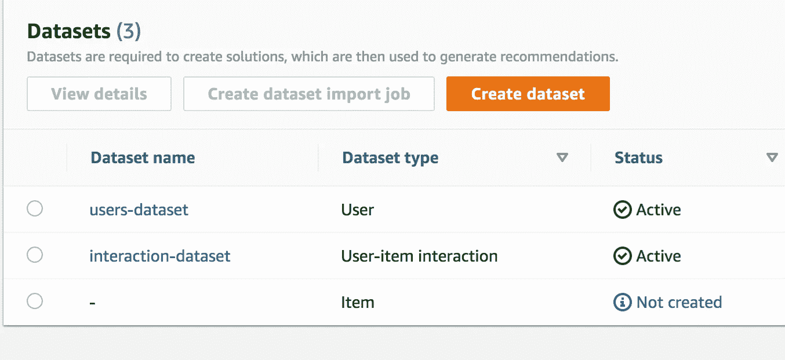

# 使用 AWS 和 Node 获得个性化推荐。射流研究…

> 原文：<https://medium.com/analytics-vidhya/get-personalized-recommendations-using-aws-and-node-js-e79f7442549d?source=collection_archive---------11----------------------->

## 机器学习，JavaScript，Web 开发，推荐

# 什么是 AWS 个性化？

AWS Personalize 是一种机器学习服务，它使非机器学习工程师能够轻松地为他们的用户生成个性化建议。它是一个强大而又对开发者友好的工具，不需要任何机器学习方面的先验知识。你所需要做的就是通过 S3 提供个性化的数据，个性化会处理从识别特征到训练模型的一切事情。


来源:https://aws.amazon.com/personalize/

# 我的经历

在我之前的一个项目中，我有机会与 AWS 密切合作，因为我当时工作的公司是[AWS 创新资助计划](https://aws.amazon.com/government-education/nonprofits/aws-imagine-grant-program/)的接受者。AWS 团队建议我们使用 Personalize 根据用户在应用程序上的活动为他们生成智能推荐。从那以后，它一直是我在 AWS 上最喜欢的服务之一。

*第一步—开始—准备数据*

*步骤 2——在 S3 存储数据*

*步骤 3 —创建数据集组*

*步骤 4 —创建用户-项目交互数据*

*步骤 5 —导入用户-项目交互数据*

*第 6 步—创建解决方案*

*第 7 步—创建活动*

*第 8 步——获得真正的推荐*

*可选—使用节点生成真实建议。JS*

# 开始—准备数据(步骤 1)

首先，准备好 CSV 格式的数据。如果您愿意，欢迎您使用此[链接](https://www.kaggle.com/prajitdatta/movielens-100k-dataset)下载一些样本数据进行测试。只需对数据做一些清理和重命名工作，并确保有以下 3 列: **USER_ID、ITEM_ID 和时间戳**。原因是，Personalize 将这 3 个字段视为一组“交互”，这是 Personalize 训练模型的强制功能。为了便于你阅读，我把数据复制到了 excel 表格中。


# 在 S3 存储数据(步骤 2)

接下来，我们将 CSV 数据存储在 S3 存储桶中。通过提供到该文件位置的路径进行个性化，它将可以访问数据。别忘了把这个 [*政策*](https://docs.aws.amazon.com/personalize/latest/dg/data-prep-upload-s3.html) 附到你的桶里。如果不这样做，默认情况下，Personalize 将被阻止访问存储桶。


# **创建数据集组(步骤 3)**

让我们创建一个数据集组！什么是数据集组？本质上，我们可以把它看作一个项目。每个数据集组都有自己的数据集、解决方案和 API。每个数据集组都是相互独立的。如果您想用新的数据集启动一个新项目，那么您必须启动一个新的数据集组。


在 Personalize 的第一页，点击“创建数据集”并随意命名。


命名您的第一个数据集组。

# 创建用户-项目交互数据(步骤 4)

创建数据集组后，下一步是提供数据集，命名数据集，然后单击“创建新模式”。


默认情况下，个性化将为您生成以下方案。该模式用于描述交互数据集的结构。


默认模式

# 导入用户项目交互数据(步骤 5)

在步骤 2 之后，您需要创建一个导入作业。提供存储 CSV 数据的 S3 存储桶的文件位置的路径。


点击“完成”后，导航回“数据集”页面。在 Status 列下，对于您刚刚创建的数据集，它应该显示“Active”。在我的例子中，有两个数据集——用户类型和用户-项目交互项目。现在不要担心用户类型。这不是强制性的。



# 创建解决方案(步骤 6)

导航至概览页面。点击“创建解决方案”。同样，它会要求您命名您的解决方案。创建解决方案需要一段时间。完成后，如果您点击“查看解决方案”，您应该能够在状态下“活动”。


单击创建解决方案


“活动”状态

# 创建活动(步骤 7)

生成您的解决方案后，单击概述页面中的“创建新活动”。同样，提供一个名称。然后选择刚刚生成的解决方案。对于“minimum provisioned…”字段，现在可以使用 1。

这可能是最耗时的一步。请随意去做一些咖啡，然后回来！


完成后，导航到“活动”页面，您应该能够在状态下看到“活动”。如此接近！


活动生成后…

# 产生真正的建议(第 8 步)

单击您刚刚创建的活动，它会将您带到如下所示的页面。如果您向“用户 ID”字段提供一个用户 ID，它将自动生成一个项目 ID 列表，该活动认为用户可能会喜欢这些项目 ID。是不是很酷？


# 使用 Node 生成真实的推荐。JS(可选)

如果您想在您的服务器中使用这个特性，下面是一个代码片段，您可以将其用作示例。您可以使用用户 ID 将 AWS 个性化 API 调用到活动的 ARN，并获得相同的结果。它是用 Node 写的。

```
var AWS = require ('aws-sdk');
require ('dotenv');
AWS.config.loadFromPath ('./config.json');AWS.config.getCredentials (function (err) {if (err) console.log (err.stack);else {
 console.log ('Access key:', AWS.config.credentials.accessKeyId);
 console.log ('Region:', AWS.config.region);}});const personalizeRuntime = new AWS.PersonalizeRuntime ();
const campaignARN = [GET IT FROM YOUR CAMPAIGN]personalizeRuntime.getRecommendations({ 
 campaignARN,
 userId: [WHATEVER USER ID YOU HAVE],
},function (err, data) {
  if (err) {
   console.error (err);
  }
   console.log ('RECOMMENDATIONS: ', data);
 }
);
```