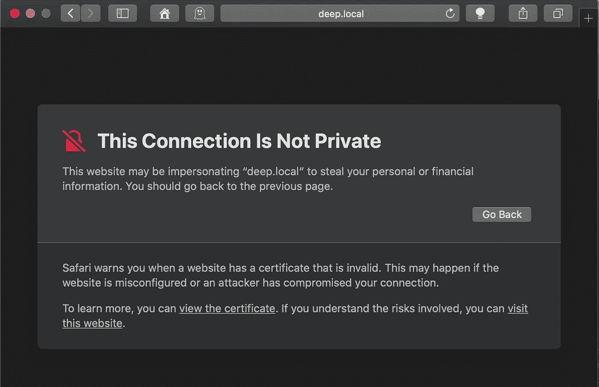
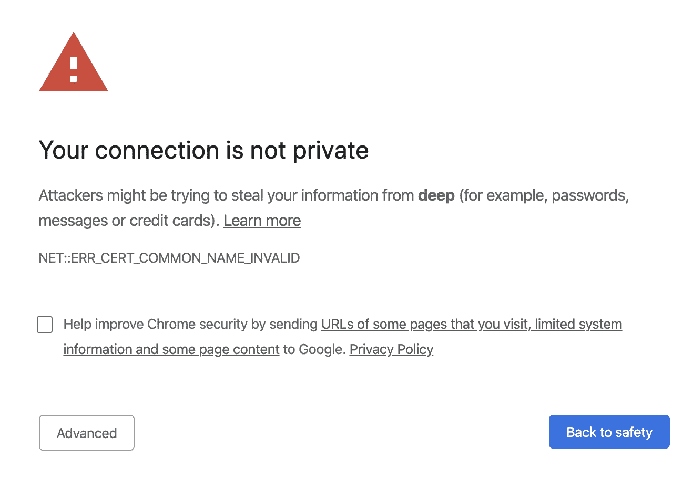
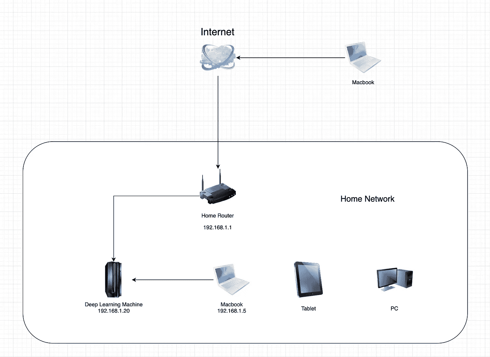
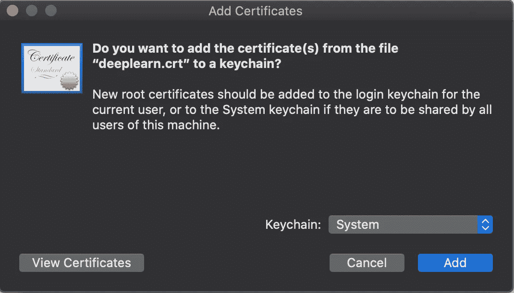
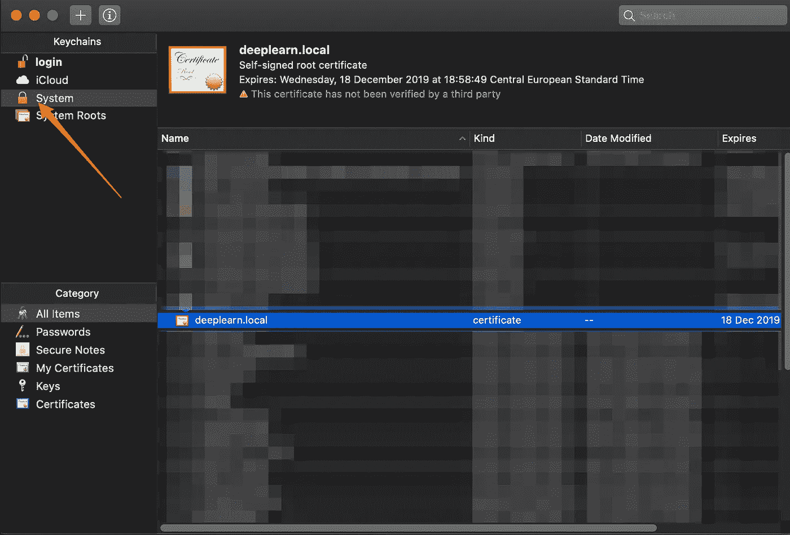
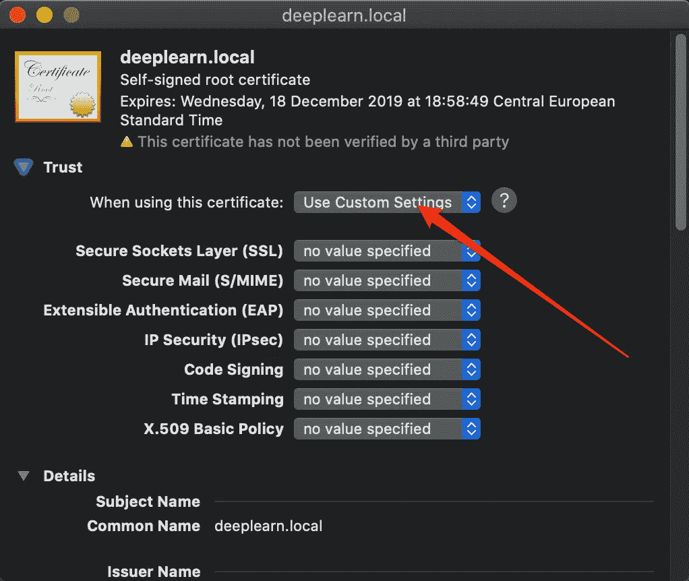

# 使用 Jupyter 笔记本消除 SSL 错误

> 原文：<https://medium.com/analytics-vidhya/get-rid-of-ssl-errors-with-jupyter-notebooks-1a80dd509988?source=collection_archive---------9----------------------->

# 问题

每当我启动一个新的会话，连接到我的 jupyter 笔记本时，看到“您的连接不是私人的”的错误/警告，我觉得很烦。我总是需要额外点击几次才能进入我的笔记本。如果你想解决这个问题，那么这个方法就是给你的。



Safari 中的警告



用铬警告

**免责声明 **

*不要在生产系统中使用这种方法。这种方法更适合需要快速和肮脏的 jupyter 笔记本来测试他们的想法和模型的数据科学家。对于生产系统，使用有效的 CA 或使用 letsencrypt。*

# 形势

我先简述一下我的情况。我有一台定制的深度学习 pc，上面安装了 ubuntu (19.10)。我的 jupyter 笔记本在这台 ubuntu 机器上运行，这台机器托管在我自己的家庭网络中。我还通过动态 dns 跟踪我的家庭公共 IP 地址，这样我就可以从互联网远程连接到我的 jupyter 笔记本电脑。我大部分时间都是通过 macbook pro 连接这个 jupyter 笔记本。有时在我自己的家庭网络中(使用本地 ip ),有时从远程位置使用我的动态 dns (DDNS)主机名。



# 1)如果尚未安装 openssl，请安装它。

在我的 ubuntu 系统上已经安装了。如果没有，您可以使用命令安装它:

```
**sudo apt install openssl** 
```

# 2)修改 macbook 上的主机文件

证书与完全合格的域名(FQDN)一起工作，例如 www.amazon.com[而不是 IP 地址。因为我们想在我们的本地网络上建立这一点，我们需要在我们的 macbook 上编辑我们的主机文件。如果您已经为您的深度学习机器提供了主机名，您可以使用该名称。我的主机名= deeplearn，它的 ip = 192.168.1.20](http://www.amazon.com.)

使用 vi 或 nano 从您的终端调整 macbook 上的主机文件，如下所示:

```
sudo vi /etc/hosts
```

并将这一行添加到该文件中:

```
192.168.1.20 deeplearn.local
```

现在，您可以通过 ping 来测试该主机名:

```
ping deeplearn.local
```

# 3)生成私钥和自签名证书

现在我们将在我们的深度学习机器上生成我们的私钥和我们的证书。创建一个目录。ssl，这样我们可以将文件保存在这个新创建的目录中:

```
mkdir ~/.ssl 
cd ~/.ssl
```

由于我们希望匹配来自互联网(ddns 主机名+域= deeplearn.chickenkiller.com)和本地网络(deeplearn.local)的主机，我们需要将这两个名称添加到 distinguished_name 字段中:

subject altname = DNS:**deep learn . local**，DNS:**deeplearn.chickenkiller.com**

我们创建它的命令是:

```
openssl req -x509 -out deeplearn.crt -days 365 \
-keyout deeplearn.key -newkey rsa:2048 -nodes -sha256 \
 -subj ‘/CN=**deeplearn.local**’ -extensions EXT -config <( \
 printf “[dn]\nCN=**deeplearn.local**\n[req]\ndistinguished_name = dn\n[EXT]\nsubjectAltName=DNS:**deeplearn.local**,DNS:**deeplearn.chickenkiller.com**\nkeyUsage=digitalSignature\nextendedKeyUsage=serverAuth”)
```

对于 jupyter 笔记本电脑，我们还需要不同格式的证书(PEM 而不是 CRT)。执行此操作的方法是使用以下命令:

```
openssl x509 -in **deeplearn.crt** -out **deeplearn.pem** -outform PEM
```

现在你将有 3 个文件在你的。 **ssl** 目录:

```
deeplearn.crt
deeplearn.key
deeplearn.pem
```

# 4)在您的 macbook 上安装证书

将证书 deeplearn.crt 下载到您的 macbook 上。用 Finder 打开文件并双击它。您将看到以下窗口:



确定在钥匙串下拉菜单中选择了“系统”,然后点按“添加”。现在你需要给出你的 mac 证书，你的证书将被添加到你的根证书中。

现在，通过 Launchpad 打开“钥匙串访问”应用程序，点击左侧的“系统”钥匙串，找到您的证书:



双击该证书，展开“信任”三角形。它看起来会像这样:



从“使用此证书时”菜单的下拉菜单中选择“**始终信任**”并关闭窗口。它会再次询问您的 mac 凭据。现在，您的 macos 信任您的证书。

# 5)让 Jupyter 笔记本使用此证书

现在，您可以使用这个新创建的证书运行 jupyter 笔记本，轻松测试您的设置:

```
jupyter notebook --certfile=~/.ssl/deeplearn.pem --keyfile=~/.ssl/deeplearn.key
```

现在，通过将浏览器定向到笔记本的 url(如 https://deeplearn.local:8888)，从 macbook 测试证书是否有任何错误。应该能行。如果有效，那么您可以修改 jupyter 配置文件，这样您就不需要在每个新的 jupyter 命令后给出这些参数:

```
vi ~/.jupyter/jupyter_notebook_config.py
```

并确保这两行指向正确的证书文件:

```
c.NotebookApp.certfile = ‘/home/**your_username**/.ssl/deeplearn.pem’
c.NotebookApp.keyfile  = ‘/home/**your_username**/.ssl/deeplearn.key’
```

确保上面的**你的 _ 用户名**是你在深度学习机器上的用户名。现在，您可以通过执行以下命令来打开 jupyter 笔记本:

```
jupyter notebook
```

*如果你找不到上面的配置文件，这意味着它从未被创建过。您可以使用以下命令创建一个:*

```
*jupyter notebook --generate-config*
```

*在该命令之后，您可以按照描述修改配置。*

# 6)享受