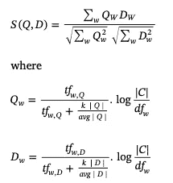

# 用一个简单的技巧摆脱虚假评论！！

> 原文：<https://medium.com/analytics-vidhya/get-rid-off-fake-reviews-with-a-simple-technique-1d939753b13?source=collection_archive---------24----------------------->


[Unsplash](https://unsplash.com?utm_source=medium&utm_medium=referral) 上[视觉](https://unsplash.com/@visuals?utm_source=medium&utm_medium=referral)的照片

随着网购需求的日益增加，评论成了我们生活中的一个关键词。我们大多数人在网上购买产品前都会查看评分和评论。我们可以为一种产品找到至少两种不同的品牌。竞争来了。

某些团体可能会滥用这些评论，旨在利用“虚假评论”来获得知名度或诋毁产品。这些也被称为“垃圾评论”。

有人可能会认为这些评论是假的，如果

a.它们来自同一产品的不同用户

b.它们来自不同产品上的同一用户

c.它们来自不同产品上的不同用户。

## 技术

任何相似性度量，例如余弦相似性，都可以用来找到相似的评论。然后我们会验证每个评论的用户 id 和产品 id。

要遵循的程序是:

1.  删除停用词。
2.  删除网上购物中的常用词，如坏、好、价格、产品等..
3.  使用任何词干化或词汇化技术获得词根。
4.  使用余弦相似度计算相似度得分



5.如果分数大于阈值，那么我们将检查这些评论是否来自相同的用户或相同的产品。如果满足任何一个条件，那么我们可以认为审查是假的。

## 履行

我们将在 amazon reviews 数据集上实现上述简单步骤。

执行词干提取和停用词删除。

```
from nltk.stem import PorterStemmer ps=PorterStemmer()data['Review'] =  data['Review'].apply(lambda x: [ps.stem(y) if y not in stopwors for y in x] ) 
```

计算余弦相似度。

```
from sklearn.feature_extraction.text import CountVectorizercv = CountVectorizer(stop_words='english')tfd= cv.fit_transform(data.Review)
new_pd  = pd.DataFrame(tfd.toarray(),columns=cv.get_feature_names())from sklearn.metrics.pairwise import cosine_similarity
matrix = cosine_similarity(new_pd)
```

检查阈值和需要满足的条件。

```
remove_rows=[]
for i in range(len(matrix)):
    for j in range(i):
        if(i!=j and matrix[i][j]>0.7 and raw_data.iloc[i,:] 
                 ['PRODUCT_CATEGORY'] == raw_data.iloc[j,:]. 
                                      ['PRODUCT_CATEGORY']):

            remove_rows.append(i)
            remove_rows.append(j)
```

从数据框中移除这些行。

```
data.drop(remove_rows,inplace=True)
```

## 应用程序

去除虚假评论可以提高情感分析。这种技术也可以改善主题建模的结果。

## 完全码

我已经在“亚马逊评论”数据集上应用了上述技术，并进行了情感分析和主题建模。完整的代码可以访问[这里](https://github.com/maheshsai252/amazon_reviews)。

## 参考

[https://www . science direct . com/science/article/ABS/pii/s 0019850118307612？通过%3Dihub](https://www.sciencedirect.com/science/article/abs/pii/S0019850118307612?via%3Dihub)