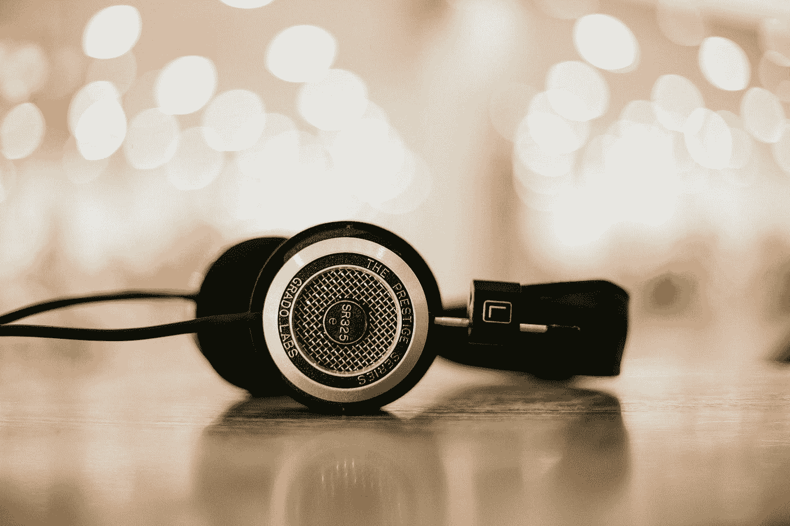
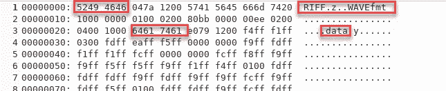
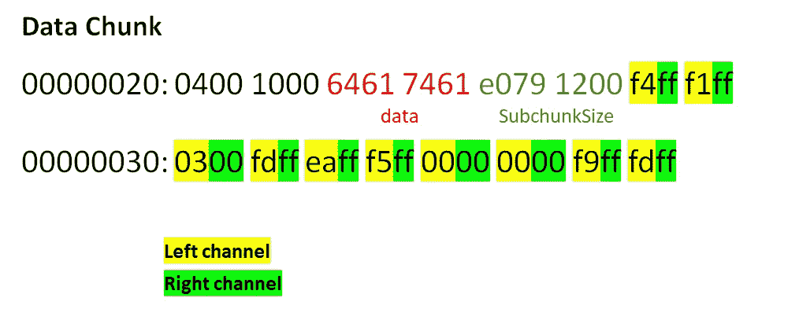
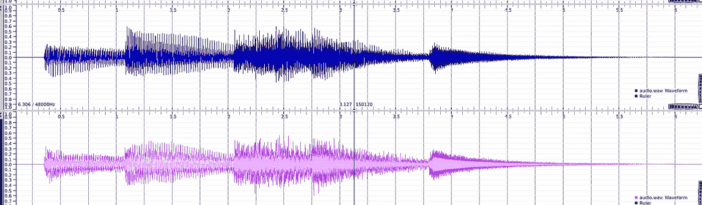
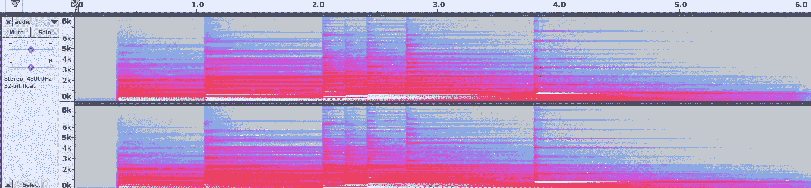
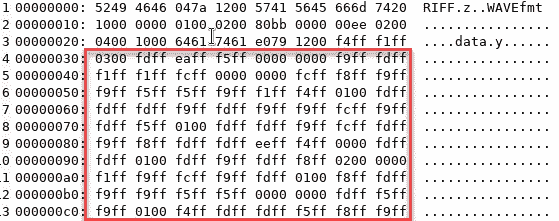
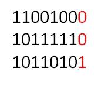

# 从音频文件中获取秘密消息

> 原文：<https://medium.com/analytics-vidhya/get-secret-message-from-audio-file-8769421205c3?source=collection_archive---------0----------------------->

音频挑战在 CTFs 中很常见。我最近解决了一个问题，其中包括一个 wav 文件中的秘密文本，我想在这篇文章中总结我的步骤和学习，也为我自己作为未来挑战的参考。我以前从未在音频方面投入过时间，所以我希望下面的内容也能让其他人感兴趣。



由 [Unsplash](https://unsplash.com?utm_source=medium&utm_medium=referral) 上的 [Alphacolor](https://unsplash.com/@duck58cth?utm_source=medium&utm_medium=referral) 拍摄的照片

当我在谷歌上搜索音频文件中的标志或秘密文本时，我主要找到的建议是: **(1)** 使用 Audacity 或 Sonic Visualiser， **(2)** 检查波形和频谱以寻找提示， **(3)** LSB 可能被用于隐藏文本，或者 **(4)** 也许红外或超声波范围被用于传输秘密文本。是的，听起来很容易，但是第一次做的话，会变得很有趣。

在我深入挑战之前，让我们看看 wav 格式是什么样子的。

## **WAV 文件**

我不会讲太多细节，但出于好奇，我想了解更多关于 wav 文件格式的信息，并找到了一个很棒的[资源](http://wavefilegem.com/how_wave_files_work.html)。

wave 文件包含一个头，该头包含播放音频文件的重要信息(如每秒帧数、每样本位数、通道数等)。).此外，还有一个数据字节序列。要提取元数据，可以使用各种命令，如 exiftool、file、mediainfo 或其他命令

```
**# file audio.wav**
audio.wav: RIFF (little-endian) data, WAVE audio, Microsoft PCM, 16 bit, stereo 48000 Hz**# exiftool audio.wav** ExifTool Version Number : 11.65
File Name : audio.wav
File Size : 1183 kB
File Type : WAV
MIME Type : audio/x-wav
Encoding : Microsoft PCM
Num Channels : 2
Sample Rate : 48000
Avg Bytes Per Sec : 192000
Bits Per Sample : 16
Duration : 6.31 s
```

如果有人想看看 hexdump:

从下面的 hexdump(默认顺序是 little-endian)可以看出，RIFF(资源交换文件格式)充当 wav 格式的包装器。该文件格式可以存储多种数据，如音频和视频等大多数多媒体数据。正如我们将在下面看到的，它是基于组块和子组块的。



`0x52` `0x49` `0x46` `0x46`代表 RIFF
`0x04` `0x7a` `0x12` `0x00`指组块大小(1210884)
`0x57` `0x41` `0x56` `0x45`代表 WAVE
`0x66` `0x6d` `0x74` `0x2`指 fmt 子块
`0x10` `0x00` `0x00` `0x00`子块大小= 16
`0x01 0x00`AudioFormat = 1->PCM(脉冲编码调制
`0xe0` `0x79` `0x12` `0x00`代表子块大小(1210592)

数据标识符指示数据块接下来到来。

所以我们知道一个 wav 文件包含几个数据块。每个块都讲述了文件中数据的一些信息。有元数据所在的格式块，也有包含实际音频数据的数据块。为了获得数据块的清晰视图，请参见下图。数据文件由样本组成，分为右声道和左声道:



左声道和右声道形成样本帧

wave 格式中可能包含可选的块类型。请参考下面的参考资料，以获得更深入的了解。

上面的例子有**两个声道**，代表“立体声”，意思是由两个不同的声波同时播放组成。一个声波传到左扬声器，另一个传到右扬声器。**采样率**给出关于每秒数据存在的样本/帧的信息。该样本每秒有 48000 个样本，这意味着 48000 个样本用于创建 1 秒钟的声音。

# 解决挑战

与图像文件一样，隐写术可以用于在(元)数据中嵌入秘密消息/标志，因此，使用 exifool、strings、 [mediaInfo](https://mediaarea.net/en/MediaInfo) 、file 和 binwalk 等工具是一种快速的方法。其他工具包括 [Audacity](https://www.audacityteam.org/) 或 [Sonic Visualiser](https://www.sonicvisualiser.org/) ，它们可能会在音频波形或频谱图中给出一些关于编码文本的信息。

> 根据上述 hexdump，很明显，文件格式是正确的，并且没有对文件类型进行操作。
> 
> **第一步:基本的速赢命令**

1.  exiftool ->参见上面的打印屏幕
2.  strings-> strings audio . wav | awk ' length $ 0)> 8 '->没什么有趣的
3.  mediaInfo ->与 exiftool 相同(使用其中之一)
4.  binwalk->没有感兴趣的信息

***步骤 2:已知声音可视化工具的使用***

**Sonic Visualiser** 我在 [Sonic Visualiser](https://www.sonicvisualiser.org/) 中运行了音频样本，用普通方法(调整亮度/对比度等)分析了隐藏文本/旗帜的频谱和波形。).由于样本有两个音频通道，我们也看到两个波形。由于我不太熟悉根据波形和事实做出决定，我在这里没有找到任何线索，研究还在继续。



音频波形



音频的频谱函数

***第三步:LSB 分析***

好的，在挑战中有人说，一个人应该仔细聆听。也许这是一个暗示，不要使用经典的技术，如频谱分析等。因为这种方法不会在信号中引入噪声。我也应该注意到 hexdump 中的奇怪模式:



音频文件的 hexdump

让我们看看，如果最低有效位(LSB)是用来隐藏一个标志或秘密文本。LSB 算法其实是一种经典的隐写方法。



LSB 算法替换每个字节的 LSB

如果替换数据中每个字节的 LSB，就有可能嵌入秘密消息。因此，下一个方法是提取数据并读取数据每个字节的 LSB 位。让我们看看这样是否可以重建一个秘密文本。如果不成功，也许每第二或第三个字节被用来隐藏一点秘密信息。

对于这种方法，我使用了 Python [wave](https://docs.python.org/2/library/wave.html) 库。还有其他的库比如 [PySoundFile](https://pysoundfile.readthedocs.io/en/0.8.1/) 、 [scripy.io.wavfile](https://docs.scipy.org/doc/scipy-0.14.0/reference/generated/scipy.io.wavfile.read.html) 等。下次我可能会去另一个图书馆试试。

让我们先获取元数据:

```
#!/usr/bin/python
import wave
wav= wave.open("audio.wav", mode='rb')
print (wav.getparams())**Output** _wave_params(nchannels=2, sampwidth=2, framerate=48000, nframes=302712, comptype='NONE', compname='not compressed')
```

这里没有什么新东西(通道号=2，采样字节数=2，采样频率=48000，音频帧数=302712，无压缩)。下一步，让我们得到第一帧:

```
# Read Frames into an byte array
frame_bytes = bytearray(list(wav.readframes(wav.getnframes())))
print(frame_bytes[:100])**Output**
bytearray(b'\xf4\xff\xf1\xff\x03\x00\xfd\xff\xea\xff\xf5\xff\x00\x00\x00\x00\xf9\xff\xfd\xff\xf1\xff\xf1\xff\xfc\xff\x00\x00\x00\x00\xfc\xff\xf8\xff\xf9\xff\xf9\xff\xf5\xff\xf5\xff\xf9\xff\xf1\xff\xf4\xff\x01\x00')
```

如果我们比较这些数据，我们可以看到与上面的 hexdump 相同，这是我们要操作的块数据。每个样本具有 16 位宽度。下一步是提取每个字节的 LSB。为了更好的理解，直接看下面我的评论。

```
import wave
import struct# Convert audio to byte array
wav = wave.open("audio.wav", mode='rb')
frame_bytes = bytearray(list(wav.readframes(wav.getnframes())))shorts = struct.unpack('H'*(len(frame_bytes)//2), frame_bytes)

# Get all LSB's
extractedLSB = ""
for i in range(0, len(shorts)):
        extractedLSB += str(shorts[i] & 1 )# divide strings into blocks of eight binary strings
# convert them and join them back to string
string_blocks = (extractedLSB[i:i+8] for i in range(0, len(extractedLSB), 8))
decoded = ''.join(chr(int(char, 2)) for char in string_blocks)print(decoded[:500])
wav.close()
```

不幸的是，这给了我胡言乱语的输出:

```
tð~ÿl~7|÷Nd~çf_o{7>÷nb|2|ý~ö>ÿ?n.&_)Z§6nf~cz÷~s_rlòN>o|ýZ¼=Mx5|M=~{sNlf|g>v|ã{b>ç{o>O~§~º^?nb~S~ö~ÃvlöNfo~W~6l$>V~ÿjF~szç=Wó>¿�r."{T^ux=bÿYJ,fXÇ<ü~m~çxv^<R}W|þvN&}wV.f~öze^J|ÿj~wnF~w=vndzt^û~ô~ÿJ^Sn$>×>G{^Þ>Gn&%:ö|çye7~eNþNf3w?Vl&~7|Ü^ç>³Jb~A6nf>÷~Ç~º~§^Õ&_>~s~¾~å^#~ón¶nf{1~ç{onf|þ~ÿo}Vn?w~R
```

我玩了一点脚本，尝试了每第二，第三帧，下面的工作(左右声道之间的交替)。

```
import wave
import structwav = wave.open("audio.wav", mode='rb')
frame_bytes = bytearray(list(wav.readframes(wav.getnframes())))
shorts = struct.unpack('H'*(len(frame_bytes)//2), frame_bytes)extracted_left = shorts[::2] 
extracted_right = shorts[1::2]extractedLSB = ""
for i in range(0, len(extracted_left)):
    extractedLSB += (str(extracted_left[i] & 1)) if i%2==0 else (str(extracted_right[i] & 1))

string_blocks = (extractedLSB[i:i+8] for i in range(0, len(extractedLSB), 8))
decoded = ''.join(chr(int(char, 2)) for char in string_blocks)print(decoded[0:500])wav.close()
```

我们得到了秘密文本(是的，最后有一些乱码数据，我们必须对代码做一点修改……)

*python 3 audio _ stego . py
Lorem ipsum dolor sit amet，consectetur adipiscing elit，sed do eiusmod temporal incident ut labor and dolore magna aliqua。尽管如此，我们的实习仍然是在商品市场进行的。在自愿的基础上，我们有了比以前更好的选择。除了偶尔的不经意，他必须在法庭上承认这是劳动。ÿÿ、þÿïþ{、÷û^×ûóúÿÿý、ûÿïÿÿÿ*

如果这不起作用，下一步就是进行频率调制，因为这种方法既不会在信号中引入噪声

是的，有些东西超出了解决挑战的范围。但是最后我学到了一些新东西，获得了一些关于 wav 文件格式的信息，并使用了一个新的库来解决这个挑战。

非常感谢您的意见、评论或反馈。

参考资料:
[https://web . archive . org/web/2014 02 21054954/http://home . road runner . com/~ jg glatt/tech/wave . htm](https://web.archive.org/web/20140221054954/http://home.roadrunner.com/~jgglatt/tech/wave.htm)

[https://medium.com/r/?URL = https % 3A % 2F % 2fblogs . msdn . Microsoft . com % 2f awate % 2f 2009% 2f 06% 2f 23% 2f 音频节目制作部分 2-解密 wav 格式%2F](https://blogs.msdn.microsoft.com/dawate/2009/06/23/intro-to-audio-programming-part-2-demystifying-the-wav-format/)

[http://wavefilegem.com/how_wave_files_work.html](http://wavefilegem.com/how_wave_files_work.html)