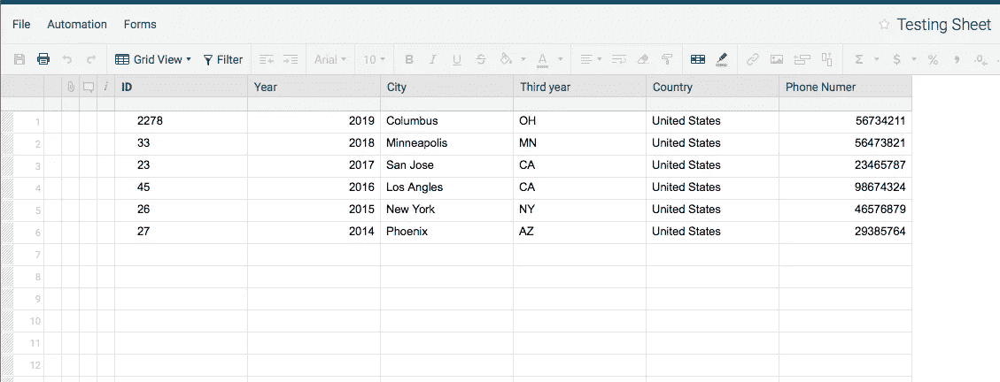

# 使用 Python 以 Json 形式获取智能表数据

> 原文：<https://medium.com/analytics-vidhya/get-smartsheet-data-as-a-json-using-python-961779998db5?source=collection_archive---------4----------------------->

让我们通过 Smartsheet API 集成以 Json 的形式从这个 smartsheet 中获取数据，



-首先，您需要点击右上角的 smartsheet 个人资料，然后选择“应用和集成”


-弹出一个新窗口！点击左边的 API 访问，生成一个新的令牌！在你生成令牌后，你只会看到它一次，所以复制它并把它藏在某个安全的地方！


-转到 smartsheet 主页，右键单击所需的工作表，然后复制 sheet_id

-现在，我们有了 Token 和 sheet_id，让我们开始编码:)

1.  将您的令牌和 sheet_id 存储到您的环境变量。bash_profile 应该是这样的，这不是一个有效的令牌或 sheet_id:)

> 出口无记名= "无记名 HH8384H8sdkjil09"
> 出口单 _ID = "3437432947347324 "

如果您不知道如何在环境变量中存储凭证，请查看我的另一篇关于将 python 变量存储到。bash_profile 文件。[https://medium . com/@ somer _ 13379/how-to-use-python-environment-variables-and-keep-your-passwords-safe-f167b 15712 f 7](/@somer_13379/how-to-use-python-environment-variables-and-keep-your-passwords-safe-f167b15712f7)

2.导入所有需要的模块

```
import json
import csv
import requests
import os
```

3.创建一个函数，并开始访问存储在环境变量中的令牌和 sheet_id

```
def getSmartsheet():

    Bearer = (os.environ.get('BEARER'))
    sheet_id = (os.environ.get('SHEET_ID'))
```

4.为 API 创建头并调用承载变量，

```
headers = {
    'Authorization': Bearer,
    'Accept': 'text/csv',
}
```

4.发送 API Request + sheet_ID 和包含不记名令牌和我们期望的数据的头，在本例中是 csv。

```
response = requests.get('https://api.smartsheet.com/2.0/sheets/' + str(sheet_id), headers=headers)
    return response.text

csvData = getSmartsheet()
```

5.创建一个新的数据集，并将 csv 作为 Python 字典读取

```
data = []
reader = csv.DictReader(csvData.split('\n'), delimiter=',')
```

6.创建一个新函数，并将字典数据追加到新数据集中

```
def processingJson():
     for rows in reader:
        dictData= rows
        data.append(dictData)
```

7.最后进行 JSON 转储

```
 jsonData = json.dumps(data, indent=4)
        print(jsonData)

processingJson()
```

8.完整代码！

```
import json
import csv
import requests
import os

def getSmartsheet():
    #Accessing the Credentials
    Bearer = (os.environ.get('BEARER'))
    sheet_id = (os.environ.get('SHEET_ID'))

    #Create Headers that contain Bearer Token
    headers = {
        'Authorization': Bearer,
        'Accept': 'text/csv',
    }

    # send the API request + token and Sheet_id
    response = requests.get('https://api.smartsheet.com/2.0/sheets/' + str(sheet_id), headers=headers)
    return response.text

csvData = getSmartsheet()

#Create a new data set
data = []
#Reader te CSV as a python Dcit
reader = csv.DictReader(csvData.split('\n'), delimiter=',')

def processingJson():
    #Append the Dict into the Data set
     for rows in reader:
        dictData= rows
        data.append(dictData)

        #json Dump
        jsonData = json.dumps(data, indent=4)
        print(jsonData)

processingJson()
```

9.返回的 Json

```
[
    {
        "ID": "2278",
        "Year": "2019",
        "City": "Columbus",
        "Third year": "OH",
        "Country": "United States",
        "Phone Number": "56734211"
    }
]
[
    {
        "ID": "2278",
        "Year": "2019",
        "City": "Columbus",
        "Third year": "OH",
        "Country": "United States",
        "Phone Number": "56734211"
    },
    {
        "ID": "33",
        "Year": "2018",
        "City": "Minneapolis",
        "Third year": "MN",
        "Country": "United States",
        "Phone Number": "56473821"
    }
]
[
    {
        "ID": "2278",
        "Year": "2019",
        "City": "Columbus",
        "Third year": "OH",
        "Country": "United States",
        "Phone Number": "56734211"
    },
    {
        "ID": "33",
        "Year": "2018",
        "City": "Minneapolis",
        "Third year": "MN",
        "Country": "United States",
        "Phone Number": "56473821"
    },
    {
        "ID": "23",
        "Year": "2017",
        "City": "San Jose",
        "Third year": "CA",
        "Country": "United States",
        "Phone Number": "23465787"
    }
]
[
    {
        "ID": "2278",
        "Year": "2019",
        "City": "Columbus",
        "Third year": "OH",
        "Country": "United States",
        "Phone Number": "56734211"
    },
    {
        "ID": "33",
        "Year": "2018",
        "City": "Minneapolis",
        "Third year": "MN",
        "Country": "United States",
        "Phone Number": "56473821"
    },
    {
        "ID": "23",
        "Year": "2017",
        "City": "San Jose",
        "Third year": "CA",
        "Country": "United States",
        "Phone Number": "23465787"
    },
    {
        "ID": "45",
        "Year": "2016",
        "City": "Los Angles",
        "Third year": "CA",
        "Country": "United States",
        "Phone Number": "98674324"
    }
]
[
    {
        "ID": "2278",
        "Year": "2019",
        "City": "Columbus",
        "Third year": "OH",
        "Country": "United States",
        "Phone Number": "56734211"
    },
    {
        "ID": "33",
        "Year": "2018",
        "City": "Minneapolis",
        "Third year": "MN",
        "Country": "United States",
        "Phone Number": "56473821"
    },
    {
        "ID": "23",
        "Year": "2017",
        "City": "San Jose",
        "Third year": "CA",
        "Country": "United States",
        "Phone Number": "23465787"
    },
    {
        "ID": "45",
        "Year": "2016",
        "City": "Los Angles",
        "Third year": "CA",
        "Country": "United States",
        "Phone Number": "98674324"
    },
    {
        "ID": "26",
        "Year": "2015",
        "City": "New York",
        "Third year": "NY",
        "Country": "United States",
        "Phone Number": "46576879"
    }
]
[
    {
        "ID": "2278",
        "Year": "2019",
        "City": "Columbus",
        "Third year": "OH",
        "Country": "United States",
        "Phone Number": "56734211"
    },
    {
        "ID": "33",
        "Year": "2018",
        "City": "Minneapolis",
        "Third year": "MN",
        "Country": "United States",
        "Phone Number": "56473821"
    },
    {
        "ID": "23",
        "Year": "2017",
        "City": "San Jose",
        "Third year": "CA",
        "Country": "United States",
        "Phone Number": "23465787"
    },
    {
        "ID": "45",
        "Year": "2016",
        "City": "Los Angles",
        "Third year": "CA",
        "Country": "United States",
        "Phone Number": "98674324"
    },
    {
        "ID": "26",
        "Year": "2015",
        "City": "New York",
        "Third year": "NY",
        "Country": "United States",
        "Phone Number": "46576879"
    },
    {
        "ID": "27",
        "Year": "2014",
        "City": "Phoenix",
        "Third year": "AZ",
        "Country": "United States",
        "Phone Number": "29385764"
    }
] 
```

希望这对某人有所帮助:)