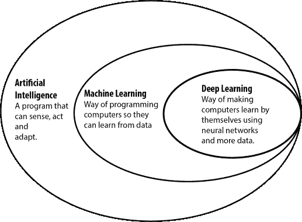
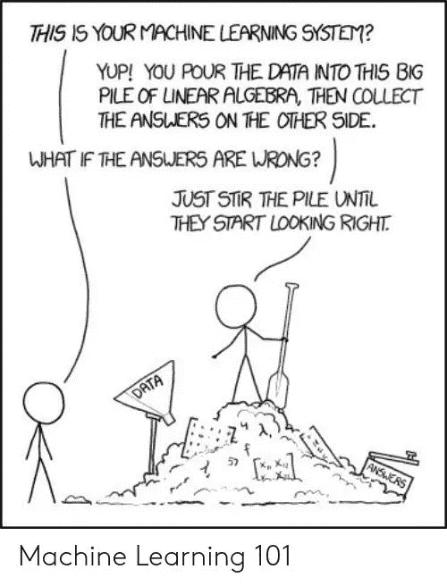
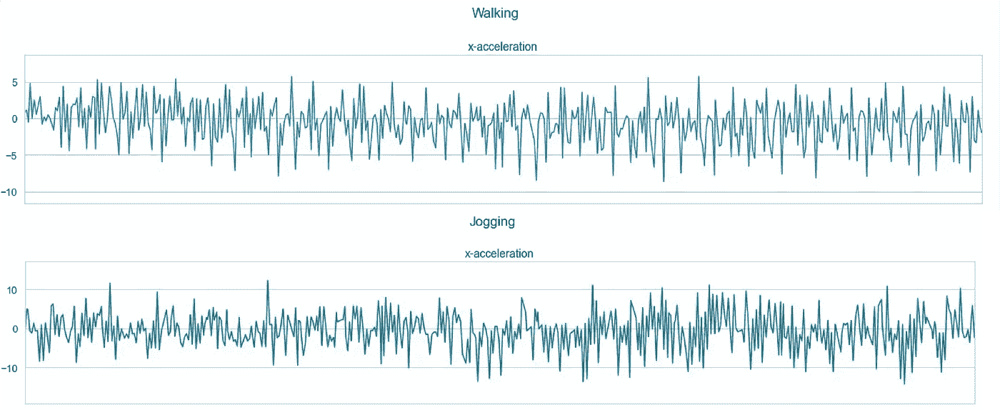
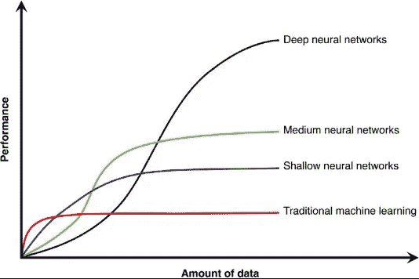
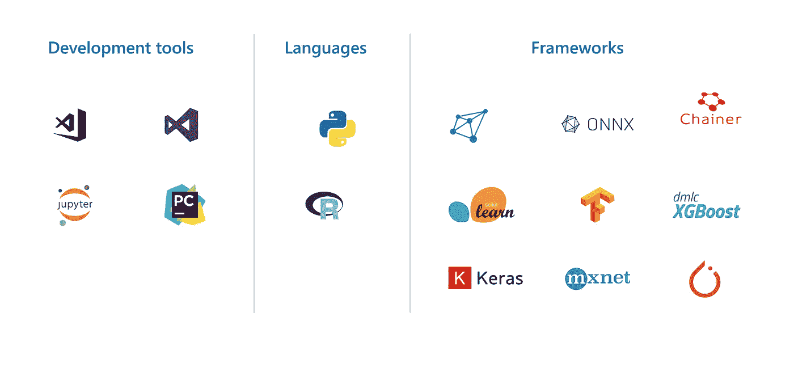
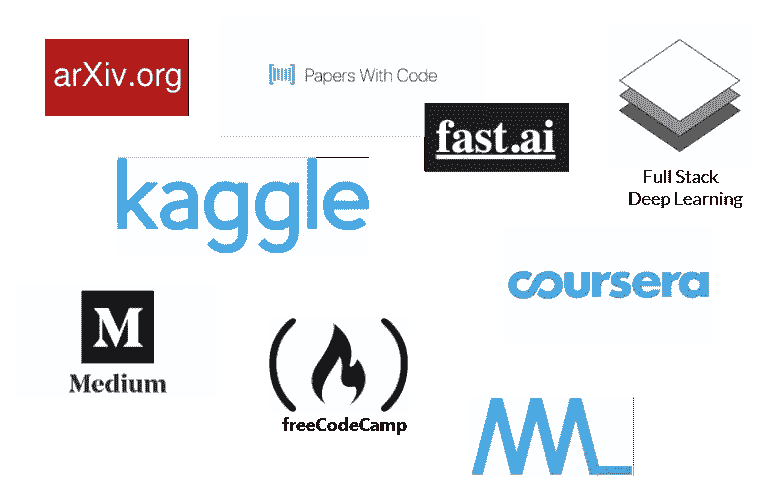

# 从机器学习开始

> 原文：<https://medium.com/analytics-vidhya/get-started-in-machine-learning-b8528c0cb26d?source=collection_archive---------19----------------------->

奥创作为高级人工智能。图片来自 Syfywire

## 对于人工智能领域的新手来说。什么是机器学习，什么是深度学习，什么是数据科学，开始前你需要知道什么，信息来源，代码和解决方案。

# 介绍

嗨，如果你是机器学习领域的新手或者你正在考虑开始，这篇文章是为你准备的。我一年多前开始的，你能做的事情太多了。在这本出版物中，我将向您介绍一些最基本的概念、可能的应用、开始学习前您需要了解的内容，以及我认为是您开始学习的最佳来源。让我们从一些基本概念开始，这样你就能知道我们在谈论什么。

你会发现人工智能、深度学习和机器学习这些术语被模糊地使用，但还是有区别的。机器学习是人工智能的一个子集，深度学习是机器学习的一个子集，这两个工具使人工智能的当前进步成为可能。

人工智能的子集。

# 什么是人工智能？

人工智能是计算机科学的一个分支，它允许计算机执行通常需要人类智能才能完成的任务。我们可以把人工智能的概念分为三种，人工广义智能，人工狭义智能，人工超级智能。

*   人工通用智能(AGI)指的是能做人类能做的一切的机器。一台可以像人一样自我学习、思考和行为的机器。这是大多数人在说 AI 这个词的时候想象出来的一个，但是我们离它还很远。
*   人工狭义智能(ANI)是指旨在完成特定任务的 AI。它是面向目标的，所以这种类型只能在特定的定义参数下工作。这也是我们取得进展的一年。一些例子是语音识别系统、图像识别系统、自动驾驶汽车、市场预测、在线广告等。
*   人工超级智能(ASI)是从 AGI 进化而来的人工智能，它比人类更高级。这就是那种在电影中奴役人类或者把人类当成瘟疫的人工智能，例如，来自 I-Robot 或者《进化中的奥创》。

# 什么是机器学习？

> "在没有明确编程的情况下赋予计算机学习能力的研究领域."阿瑟·塞缪尔(1959)

用更科学的方式

> *“如果一个计算机程序在 T 上的性能(由 P 测量)随着经验 E 而提高，则称该程序从关于某个任务 T 和某个性能测量 P 的经验 E 中学习。”——Tom Mitchell(1997)*

想象一下，你想根据来自智能手机的加速度数据来预测一个人是在慢跑、散步、坐着还是在跑步。使用常规编程，您必须定义许多规则来确定一个人是否正在进行这些活动中的一项，即使如此，您也可以跑得更快或更慢，这个人可以更小或更高，或者在行走时移动不同。有许多因素需要考虑，所以很可能你最终会有一长串规则和一个复杂的程序，这是因为在传统的编程中，你获取输入数据并定义规则来获得答案(如果，那么，否则)，但在机器学习中，你获取数据并为输入数据定义所需的答案来获得规则。

传统的编程方法。

所以，为了解决前面的情况，我们可以从你的手机中获得大量的加速度数据，并根据相应的活动(跑步、慢跑、步行等)标记这些数据，然后机器学习算法计算出数据中的特定模式，这些模式决定了一种活动与另一种活动的不同之处。不同之处在于，算法通过持续接触数据来学习如何识别活动。这就是我们所说的监督学习。

机器学习方法

这个新的范例创造了使用传统编程不可行的情况。一个例子是图像的分类，使用常规编程很难创建一个程序，能够识别图像中是否有猫或狗，但使用机器学习这变得非常容易。

机器学习堆。摘自 Deeplearning.ai

## 机器学习系统的类型

机器学习系统可以根据它们在训练过程中得到的监督进行分类。

## 监督学习

在监督学习中，你向算法提供数据和数据的正确答案。之前的情况是一个监督学习问题的例子，你告诉你的算法，嘿，这是行走和慢跑加速度数据的样子。

行走和慢跑对应的加速度波形。

## 无监督学习

在无监督学习中，我们没有或不知道标签，因此算法将尝试自己学习数据中的模式。我们可以使用这种类型的算法在一个组中分离类(聚类)并更好地理解我们的数据。在下图中，我们可以看到一个聚类示例。我们从无标签数据开始，然后使用无监督的 ML 算法将数据聚类到我们怀疑的类别数量中。

(左)未标记的数据。(右)使用 K-Means 将数据分为三类。

无监督学习的另一个重要用途是异常检测。有时我们需要在将数据传递给另一个算法之前清理我们的数据，正如我们前面看到的，ML 算法特别擅长检测数据中的模式，因此当有异常行为时，它们也可以用于检测。在下图中，我们可以看到路由器记录的四天的温度数据。在这种情况下，我们的算法将温度的突然下降和高峰检测为异常。

四天的温度数据和检测到的异常。

## 半监督学习

这些算法可以处理部分标记的训练数据。半监督问题包括一些有标签的数据和大部分带有未知标签的数据，目标是利用有标签的信息对一些无标签的数据进行分类。

## 强化学习

在这种类型中，学习系统，现在称为代理，与环境相互作用并接受奖励或惩罚。系统会自己学习最佳策略，以获得尽可能多的奖励。这些是机器人用来学习在环境中移动、站立和行走的常见学习算法，所以当你看到一个机器人正在学习行走时，它很可能正在使用这些类型的算法。

# 什么是深度学习？

深度学习(DL)是使用基于算法的人工神经网络(NN)的机器学习的子集。在深度学习中，我们堆叠许多层人工神经网络来获得我们的规则。如果你不明白，不要担心，稍后我会给你一些资源，你可以从中学习什么是人工神经网络和背后的数学。

最大似然算法的不同之处在于，我们可以建立长而深的神经网络，添加越来越多的数据，性能将会提高。对于传统的 ML 算法，性能将达到饱和点，在该点之后，数据量或算法的复杂性是否增加都无关紧要。

数据量与性能图。图片来自 https://mc.ai/。

# DL 的动机

对我来说，最酷的人工神经网络之一是[生成对抗网络](https://en.wikipedia.org/wiki/Generative_adversarial_network) (GANs)。这些网络是你所看到的深层假货的罪魁祸首。如果你查看这个网站【Exist.com】这个人不是，你会看到每次刷新时由一个 GAN 创建的人的图像，虽然图像看起来非常真实，但那里显示的人并不存在。但是神经网络还能做更多的事情，看看这个视频 中的[来看看一个算法是如何使用 GANs 创造艺术的。](https://www.youtube.com/watch?v=p5U4NgVGAwg&ab_channel=NVIDIA)

甘生成的一个不存在的人的形象。

今天另一个很酷的应用是自动驾驶汽车。在这一领域有许多研究，这无疑是有待开发的最令人兴奋的技术之一，这都要归功于 ML 的当前进展。

如果你想知道利润，一个例子是网飞推荐引擎，据网飞的首席产品官称，它每年为公司节省大约 10 亿美元。

# 什么是数据科学？

数据科学是从数据中提取知识的科学。数据科学是用于从不同来源提取信息、处理这些信息并得出有意义的结论的技术。

例如，如果我们有一家公司的能源消耗、生产估计、工作时间和许多其他功能，一个良好的数据科学状况将是根据这些信息提取如何降低能源消耗的见解，以及这将如何使公司受益。相比之下，ML 问题将是下个月我们将花费多少能源，或者公司将生产多少。数据科学已经变得非常流行，因为现在我们可以提取几乎所有东西的信息。

# 之前要知道什么，怎么开始？

我的建议是**代码优先的方法。**因此，如果你对微积分和代数有基本的了解，你可以跳过这一部分，当你需要更新一些概念时，使用链接**。如果你没有这样的背景，那么你可能想看看下面的建议中的至少一个。**

## **数学**

你需要知道基本的代数，什么是向量，矩阵运算，梯度和一些基本的微积分概念，比如微分。另外，ML 是关于概率的，所以你至少需要一些基础知识。这里有一些链接供你查看。

[**来自 Coursera 的吴恩达机器学习课程(第一周)**](https://www.coursera.org/learn/machine-learning) 。第一周是对一些 ML 概念和你需要的代数的很好的介绍。整个课程将对你有用，这是我的建议之一，学习算法背后的数学以及它们是如何工作的。

****(书)**。这是一本免费的书，包括线性代数，解析几何，矩阵分解，向量微积分，最优化，概率和统计。有很多内容，但只需要基本的开始。**

**[**来自可汗学院的线性代数**](https://www.khanacademy.org/math/linear-algebra) **(课程):**免费在线课程代数和矩阵运算，他们还有一门微积分。**

**[**看理论(学习统计学的互动网站)**](https://seeing-theory.brown.edu/index.html#firstPage) **:** 概率与统计的可视化介绍。**

**这个领域有很多内容，你要花很长时间才能学会所有的东西，所以我的建议是，如果你是零起点，就从基础开始，需要的时候再学。**

## ****编程****

**编程语言显然是 Python。Python 是机器学习中使用最多的语言，因为像 [Numpy](https://github.com/numpy/numpy) 、 [Scikit-Learn](https://github.com/scikit-learn/scikit-learn) 、 [Pandas](https://pandas.pydata.org/docs/getting_started/index.html) 、 [Seaborn](https://seaborn.pydata.org/) 、 [Keras](https://keras.io/) 和其他许多库会使你的生活比任何其他语言都容易，而且你会找到的大多数文档都是 Python 的。在我看来，试图用另一种语言做 ML 是在浪费时间。**

**两个很好的免费课程是来自免费代码营的 [Kaggle Python 课程](https://www.kaggle.com/learn/python)和 [Python。](https://www.freecodecamp.org/learn/scientific-computing-with-python/python-for-everybody/)**

**另一个真正有用的工具是 [Jupyter](https://jupyter.org/) 笔记本，因为它提供了工作流程。Jupyter Notebook 是一个开源的 web 应用程序，允许您创建和共享包含实时代码、公式和可视化的文档。在 ML 中，你必须处理数据，笔记本在这方面做得很好，但在开发方面不如其他 IDE(如 [**Visual Studio Code**](https://code.visualstudio.com/) )好，所以我的建议是你使用 Jupyter 开始，当你学习时，考虑在 IDE 中进行开发。**

****

**一些工具和框架。**

**还有更高级的框架，如 [TensorFlow](https://www.tensorflow.org/) 用于深度学习和部署模型，但当你深入这个世界时，你会看到这些。**

# ****去哪里学机器学习:****

**现在，给你一份参考资料清单。这里是一些地方开始，寻找信息和代码示例。除非你想获得认证，否则你不必上完整的课程，但是它们包含了重要的解释和代码示例，如果你需要的话，你可以查看一下。**

*****边做边学！！我开了自己的博客来分享和创作，这是学习机器学习的最好方法，通过创作。所以吸收基本概念，选修一两门课程或读一本书，检查一些项目，开始你自己的一个项目。*****

## **🎓课程**

**[**【机器学习】斯坦福**](https://www.coursera.org/learn/machine-learning) **(免费)。这门课是由吴恩达教授的，他是一位了不起的老师，也是这个领域中比较重要的研究者之一。****

**[**Kaggle 免费课程:**](https://www.kaggle.com/learn/overview) Kaggle 有 ML 初学者的课程和中级课程，可视化、数据清洗、深度学习的课程。这些课程是免费的，但你甚至可以获得结业证书。**

**[**freeCodeCamp**](https://www.freecodecamp.org/learn) **(免费):**也是一个关于 ML 的免费课程，在这里你可以获得认证。非常实用，因此您将看到一个屏幕，上面有您可以理解的 Python 代码。课程很好，非常注重张量流。**

**[**全栈深度学习(免费):**](https://fullstackdeeplearning.com/) 你会看到的很多课程和教程只涵盖了机器学习的部分，比如建立模型，训练它，但远不止这些。这个免费的课程教你这个过程的其余部分，如何从一开始就处理一个 ML 问题，部署你的模型和你必须学会的最重要的工具来完成这个循环。这是一个更高级的课程，但它肯定是一个要检查的。**

## **📚书**

**[**用 Scikit 动手机器学习——Learn 和 TensorFlow:**](https://www.amazon.com/Hands-Machine-Learning-Scikit-Learn-TensorFlow/dp/1492032646/ref=sr_1_1?crid=19JK81G40NSL2&dchild=1&keywords=hands+on+with+machine+learning&qid=1601220870&sprefix=Hands+on+with+machine+%2Caps%2C292&sr=8-1) 这是机器学习最好的实用书籍之一(重点在实用)。这本书指导你一步一步地完成一个 ML 项目，教你如何获取数据，清理你的数据，可视化它，建模数据，包含练习和你必须学习的最重要的算法。包括代码示例和 GitHub 存储库。**

**伊恩·古德菲勒的《深度学习》 **:** 你可以购买这本书，也可以获得它的免费 HTML 版本。我认为下一个评论恢复了这本书有多棒。但是注意这本书只讲深度学习。**

> **由该领域的三位专家撰写的《深度学习》是关于该主题的唯一一本综合性书籍—埃隆·马斯克。**

## **🌐网站和博客**

**[**Medium**](/)**:**Medium 中有很多人分享他们关于 ML 的工作和想法，你会发现有趣的解释、代码示例、更易理解的科学论文版本、教程。这是获取某个主题的信息或排除疑问的快捷方式，而且你不必付费订阅，因为许多最好的内容都是免费的。**

**[**机器学习词汇**](https://developers.google.com/machine-learning/glossary#a) **:** 这是一部谷歌制作的字典，里面大概有你会在 ML 中看到的所有术语。**

**[**机器学习掌握:**](https://machinelearningmastery.com/blog/) 这是 Jason Brownlee 献给 ML 的一篇博客。博客中有很多内容，许多有趣的出版物、代码示例、良好的实践和解释清楚的概念。在很多情况下，当我寻找一个快速的例子或一个具体主题的实践时，它帮助了我。**

**[**ka ggle**](https://www.kaggle.com/)**:**ka ggle 是一个学习 ML 的好地方，在那里你可以找到课程、数据集和许多笔记本，上面有问题解决方案、可视化和不同问题的有趣方法。在 Kaggle 中，你可以参加**比赛**，这将帮助你测试你的能力和知识，还可以与该领域的其他人分享和交流思想。来自 Kaggle 的数据集通常是干净的，易于下载和使用，这使你的开始不那么痛苦。我推荐你从这里开始参加[泰坦尼克号比赛](https://www.kaggle.com/c/titanic) 这是 Kaggle 的入门，你可以 [**查看我关于比赛的博文**](/analytics-vidhya/random-forest-on-titanic-dataset-88327a014b4d) 。**

**[**提炼:**](https://distill.pub/) 呈现研究的不同方式。web 在一个交互中呈现了一些算法和原理，比如你可以通过设置不同的起点和参数来检查[动量是如何工作的](https://distill.pub/2017/momentum/)。**

## **💡技术**

**[**论文代码:**](https://paperswithcode.com/) 名字蛮多简历是什么。《带代码的论文》是一个关于机器学习的开源论文集，带有代码和评估表。您可以查看该领域的最新进展，并查看代码。**

**[**用 ML 制作:**](https://madewithml.com/about/) 是另一个搜索 ML 最新趋势的网站，100%免费。在这里，你不仅可以看到科学论文，还可以看到博客帖子、教程和业余爱好者的作品。该平台可以包括关于项目的文档、视频和 GitHub 页面的链接，或者有代码的笔记本供您查看。这是一个分享实际项目的地方。**

****

**要检查的地方**

# **参考**

**用 Scikit-Learn、Keras 和 TensorFlow 进行机器学习:构建智能系统的概念、工具和技术。奥莱利媒体；2019 年 9 月 5 日。**

**[https://scikit-learn.org/stable/getting_started.html](https://scikit-learn.org/stable/getting_started.html)**

**[https://code bots . com/artificial-intelligence/the-3-types-of-ai 是第三种可能性](https://codebots.com/artificial-intelligence/the-3-types-of-ai-is-the-third-even-possible)**

**[https://medium . com/@ jrod thoughts/understand-semi-supervised-learning-a 6437 c 070 c 87 #:~:text = Let ' s % 20 explore % 20a % 20 first % 20 of % 20 human % 20 resources](/@jrodthoughts/understanding-semi-supervised-learning-a6437c070c87#:~:text=Let%27s%20explore%20a%20few%20of,a%20lot%20of%20human%20resources)。**