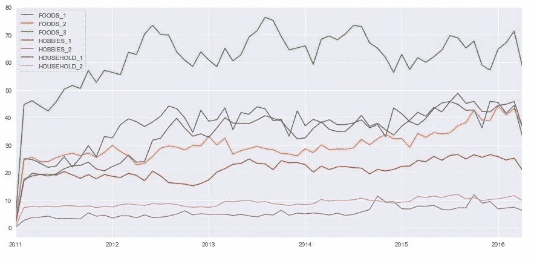

# Kaggle 竞赛入门:M5 预测

> 原文：<https://medium.com/analytics-vidhya/get-started-with-kaggle-competition-m5-forecasting-2aacd6822b36?source=collection_archive---------22----------------------->


照片由[Á·阿尔瓦罗·塞拉诺](https://unsplash.com/@alvaroserrano?utm_source=medium&utm_medium=referral)在 [Unsplash](https://unsplash.com?utm_source=medium&utm_medium=referral) 上拍摄

## 比赛描述:

在第五次迭代的竞赛中，您将使用全球收入最大的公司沃尔玛的分层销售数据来预测未来 28 天的日销售额。该数据涵盖了美国三个州
(加利福尼亚州、得克萨斯州和威斯康星州)的商店，包括商品级别、部门、产品类别和商店详细信息。

此外，它还有解释变量，如价格、促销、星期几和特殊事件。总之，这一强大的数据集可用于提高预测的准确性。

## 数据:

我们已经提供了 4 个 CSV 文件

1.  *日历。csv:* 包含关于产品销售日期的信息。
2.  *sales _ train _ validation . CSV:*包含每个产品和商店的历史每日单位销售数据。
3.  *sell_prices.csv:* 包含每个商店和日期销售的产品的价格信息。
4.  *sample_submission.csv:* 提交的正确格式。

## 探索性数据分析:

> 在本文中，我们将只研究挑战**的 **EDA** ，而不是建模**。

**读取数据**

```
cal_data = pd.read_csv('calendar.csv')
prices = pd.read_csv('sell_prices.csv')
sales = pd.read_csv('sales_train_validation.csv')#Printing the shape
print(cal_data.shape)
print(prices.shape)
print(sales.shape)
```

日历数据有 1969 行 14 列，价格有 68，41，121 行 4 列，销售有 30490 行 1919 列。

> 开始销售数据的 EDA

**查看销售表的前五行**


sales.head()

销售数据中的每一个条目都对应于一个商店中每一种商品全天的销售量。
例如:第一行对应于 store_1 中加利福尼亚州“爱好 _1”部门的项目 1。
销售数据有 1919 列，其中 6 列是不同类型的 id，其他 1913 列是从 d_1 到 d_1913 的天数。
销售日期从 2011 年 1 月 29 日开始，到 2016 年 4 月 24 日结束。

**寻找独特的商店、商品、部门和类别**

```
print('There are **{0}** items '.format(len(sales['item_id'].unique())))
print('There are **{0}** depts'.format(len(sales['dept_id'].unique())))
print('There are **{0}** categories'.format(len(sales['cat_id'].unique())))
print('There are **{0}** stores'.format(len(sales['store_id'].unique())))
print('There are **{0}** states'.format(len(sales['state_id'].unique())))
```

共有 3049 件商品，7 个部门，3 个类别，10 个商店，横跨 3 个州。

**将天数转换为日期，以便更好地分析数据**

```
date_list = [d.strftime('%Y-%m-**%d**') for d **in** pd.date_range(start = '2011-01-29', end = '2016-04-24')]*#Renaming days to dates*
sales_df.rename(columns=dict(zip(sales_df.columns[6:], date_list)),inplace=True)
sales_df.head()
```

根据不同的 id 汇总数据，以便更好地了解这些销售额的变化。

```
*#Aggregating by mean the sales by department*
dept_mean = sales_df.groupby(['dept_id']).mean().T
dept_mean.index = pd.to_datetime(dept_mean.index)*#Aggregating by mean the sales by categories*
cat_mean = sales_df.groupby(['cat_id']).mean().T
cat_mean.index = pd.to_datetime(cat_mean.index)*#Aggregating by mean the sales by stores*
store_mean = sales_df.groupby(['store_id']).mean().T
store_mean.index = pd.to_datetime(store_mean.index)*#Aggregating by mean the sales by states*
state_mean = sales_df.groupby(['state_id']).mean().T
state_mean.index = pd.to_datetime(state_mean.index)
```

**绘制数据**

```
'''The parameter 'm' is frequency (by month), this can be set by day, week or year and many more'''create_plots(dept_mean,'m')
create_plots(cat_mean,'m')
create_plots(store_mean,'m')
create_plots(state_mean,'m')
```



各部门月平均销售额


每个商店的月平均销售额


每个类别的月平均销售额


每个州的月平均销售额

**调查结果** :
1。在百货公司:FOODS_3 卖得最高。
2。分类:食品销量最大。
3。在个体商店中:CA_3 卖得最多。
WI_2 开始较低，但在 2012 年第一季度末水平突然上升。
2013 年初 WI_3 走下坡路。
Ca2 在 2014 年呈下降趋势，2015 年呈上升趋势。
4。在州:CA 卖的最多。

> 2012 年的 WI_2 和 2015 年的 CA_2 出现了一个有趣的模式，让我们来看看这些


2012 年的 WI_2


2015 年二氧化碳

我们可以看到，在这两种情况下，6 月初的水平都有所上升，水平上升的部门也是相同的，即 FOODS_3 和 FOODS_2。这可能是因为增加了新产品。

**我们还可以绘制特定日期范围的数据**


2012 年 3 月至 2014 年 3 月按类别销售

我们可以看到，就在 1 月前，**销售额下降到零**，这是因为沃尔玛在圣诞节不营业。

> 启动日历数据的 EDA

**查看日历的前五行**


cal_data.head()

该数据包含有关每天活动的详细信息，还显示了哪一天允许抢购。在该数据中，SNAP 在其中 3 个状态中遵循一定的模式。在 CA 中，前十天允许快照，TX 遵循模式 101–011，WI 遵循模式 011。

> *什么是 SNAP:* 美国联邦政府提供一项名为补充营养援助计划(SNAP)的营养援助福利。SNAP 为低收入家庭和个人提供电子福利转移借记卡来购买食品。在许多州，货币福利在一个月的 10 天内发放给人们，在这 10 天中的每一天，1/10 的人将从他们的卡上获得福利。

**关于事件的调查结果**

事件通常具有空值，因为不是每天都有一个事件，查看数据我们知道，有 162 行 event_name_1 不为空，只有 5 行 event_name_2 不为空。
总共有 31 个独特的事件，属于 5 个独特的类型，正如我们在 162 行之前看到的，给出的数据是 5 年的，所以这些事件每年都会发生

> 开始价格数据的 EDA

**查看前五行价格**


prices.head()

该表为我们提供了特定一周内每个商店中每个商品的 sell_price。

**绘制直方图**

```
prices['sell_price'].hist(bins=50)
plt.xlim(0,25)
```


所有项目的价格范围

我们可以看到销售价格在 0 到 25 之间变化，有些商品超出了这个范围。价格最高的商品是**家用 _2_516** ，售价为 107.32 英镑

EDA 结束

## 后续步骤

1.  开始建模
2.  做更多的 EDA 来创造更多的功能

## 链接

比赛链接: [M5 预测准确率](https://www.kaggle.com/c/m5-forecasting-accuracy)
内核链接:[查看完整代码](https://www.kaggle.com/njain920/preliminary-eda)

## 最终注释

这是我第一次参加比赛，也是我第一次处理时间序列数据。
我希望您能就时间序列和零售领域发表意见。
谢谢！