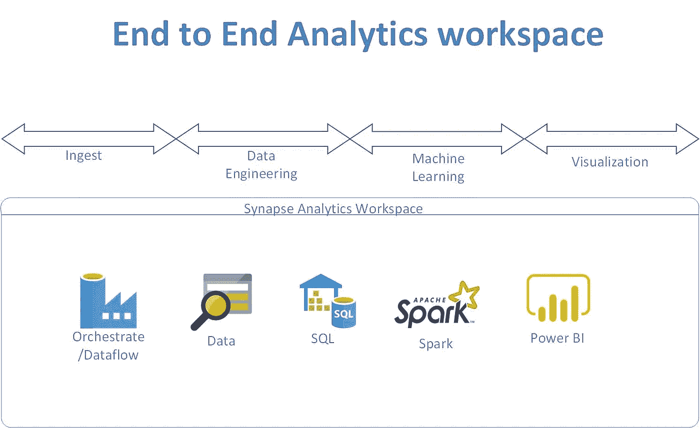

# 开始使用 Azure Synapse Analytics 中基于 spark 的机器学习—回归建模。

> 原文：<https://medium.com/analytics-vidhya/get-started-with-spark-based-machine-learning-in-synapse-analytics-regression-modelling-90e7dda1748e?source=collection_archive---------18----------------------->

统一的分析工具，可摄取、计算或处理数据、存储数据、高级分析或机器学习，并在一个工具中显示所有内容。端到端数据分析平台专为扩展和易用性而构建。



# Synapse 高级分析

Synapse 能够运行基于 spark 的代码，从而实现数据工程或特征工程以及机器学习。本文描述了如何在 synapse 中使用 spark 训练机器学习模型。

# 先决条件

将上述培训文件上传到 blob 存储或 ADLS Gen2。或者您可以使用 synapse orchestrate 特性将数据移动到 Blob 中。

下载样本数据集。[https://dewsa.blob.core.windows.net/taxidata/train.csv](https://dewsa.blob.core.windows.net/taxidata/train.csv)

```
For my testing i was able to move the blob storage train.csv into ADLS gen2 filesystem. I did that for just to show how to move data inside synapse analytics.
```

首先，让我们连接到数据存储以获取数据

这是为了让 spark 版本运行起来。

```
%%pyspark 
import pyspark 
print(print(pyspark.__version__))
```

现在让我们配置 blob 存储以获取数据:

```
spark.conf.set( "fs.azure.account.key.waginput.blob.core.windows.net", "xxxxxxxxxxxxxxxxxxxxxxxxxxxxxxxxxxxxxxxxxxxxxxxxxxxxxxxxxxxxxxxxxxxxxxxxx")
```

将 csv 文件读入数据帧

```
val df = spark.read.option("header","true").option("inferSchema","true").csv("wasbs://incoming@waginput.blob.core.windows.net/train.csv")
```

打印模式:

```
df.printSchema
```

为机器学习建模设置功能列表:

```
import org.apache.spark.ml.feature.VectorAssembler 
import org.apache.spark.ml.linalg.Vectors val featureCols=Array("fare_amount","pickup_longitude","pickup_latitude","dropoff_longitude","dropoff_latitude","passenger_count") val assembler: org.apache.spark.ml.feature.VectorAssembler= new VectorAssembler().setInputCols(featureCols).setOutputCol("features") val assembledDF = assembler.setHandleInvalid("skip").transform(df) val assembledFinalDF = assembledDF.select("fare_amount","features")
```

标准化数据帧:

```
import org.apache.spark.ml.feature.Normalizer 
val normalizedDF = new Normalizer().setInputCol("features").setOutputCol("normalizedFeatures").transform(assembledFinalDF)
```

删除数据框中缺失的数据点:

```
val normalizedDF1 = normalizedDF.na.drop()
```

现在分割数据集用于训练和测试。70%用于培训，30%用于测试

```
val Array(trainingDS, testDS) = normalizedDF1.randomSplit(Array(0.7, 0.3))
```

构建线性回归模型并执行它:

```
import org.apache.spark.ml.regression.LinearRegression// Create a LinearRegression instance. This instance is an Estimator. 
val lr = new LinearRegression().setLabelCol("fare_amount").setMaxIter(100)// Print out the parameters, documentation, and any default values. println(s"Linear Regression parameters:\n ${lr.explainParams()}\n") // Learn a Linear Regression model. This uses the parameters stored in lr.
val lrModel = lr.fit(trainingDS)// Make predictions on test data using the Transformer.transform() method.
// LinearRegression.transform will only use the 'features' column. val lrPredictions = lrModel.transform(testDS)
```

用测试数据测试模型:

```
import org.apache.spark.sql.functions._ 
import org.apache.spark.sql.types._ 
println("\nPredictions : " ) lrPredictions.select($"fare_amount".cast(IntegerType),$"prediction".cast(IntegerType)).orderBy(abs($"prediction"-$"fare_amount")).distinct.show(15)
```

现在是评估模型的时候了:

```
import org.apache.spark.ml.evaluation.RegressionEvaluator val evaluator_r2 = new RegressionEvaluator().setPredictionCol("prediction").setLabelCol("fare_amount").setMetricName("r2") //As the name implies, isLargerBetter returns if a larger value is better or smaller for evaluation. 
val isLargerBetter : Boolean = evaluator_r2.isLargerBetter println("Coefficient of determination = " + evaluator_r2.evaluate(lrPredictions))
```

评估上述模型输出:

```
//Evaluate the results. Calculate Root Mean Square Error val evaluator_rmse = new RegressionEvaluator().setPredictionCol("prediction").setLabelCol("fare_amount").setMetricName("rmse") //As the name implies, isLargerBetter returns if a larger value is better for evaluation. 
val isLargerBetter1 : Boolean = evaluator_rmse.isLargerBetter println("Root Mean Square Error = " + evaluator_rmse.evaluate(lrPredictions))
```

模型已成功构建并执行。接下来是创建推理代码，并为生产构建推理过程

*最初发表于*[T5【https://github.com】](https://github.com/balakreshnan/synapseAnalytics/blob/master/SparkMLLinearReg.md)*。*